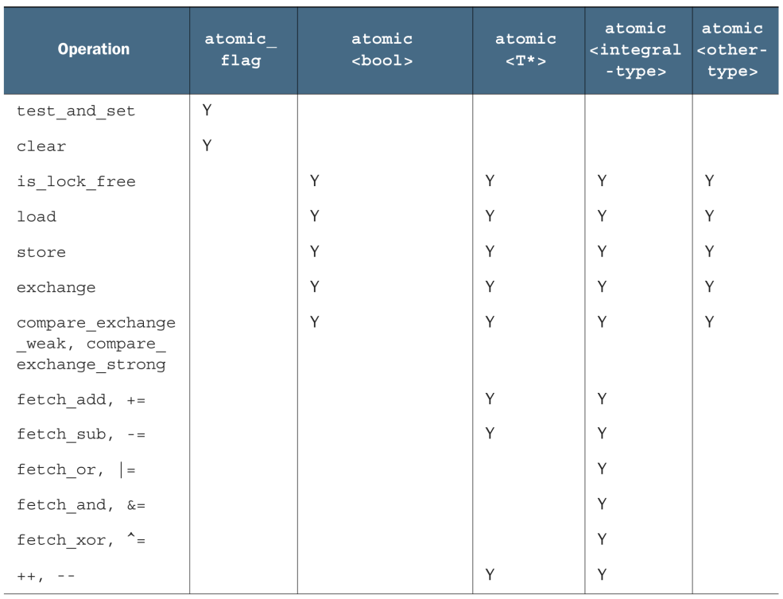

# 原子操作

# 基本概念

**对象储存：** 真正描述一个对象的信息是属性，这些属性都是各式各样的变量，均储存在内存中。对共享内存进行读写，就会导致多线程竞争。

**修改顺序**: 程序设计过程中，C++程序中的对象都有(程序中的所有线程对象)，并且在初始化开始阶段确定好，所有线程都需要遵守这个顺序。如果不遵守修改顺序，程序就会乱套。

**原子操作**: 一个代码段中的所有操作，要么都成功，要么都失败。


# 标准原子类型

## 定义原子类型

**作用：** `std::atomic` 可以用来定义一个原子类型。**支持`bool、int、char`等数据数据类型，但是不支持浮点数类型**。

> [tip]
> 所有原子类型不支持拷贝、赋值。

```cpp
#include <atomic>

// 未初始化
std::atomic<int64_t> value;

// 函数初始化
std::atomic_init(&value,10);

// 初始化构造
std::atomic<int64_t> value(10);
```

<p style="text-align:center;"></p>

## 原子操作

```cpp
#include <atomic>

std::atomic<int64_t> value;

// 查看原子类型对应的操作是否靠锁实现的
// true: 真正的原子操作
// false: 内部靠锁实现的
value.is_lock_free();

// 自加
value++;

// 读取值：读取value的值，而不是将value直接赋值给 x
int64_t x = value.load(std::memory_order_relaxed);

// 更新值
value.store(x,std::memory_order_relaxed);
```
在`atomic`头文件下的所有函数，都能实现原子操作（是不是真的，不一定）。
- `int`：针对整型的操作
- `ptr`：针对指针类型的操作
- `triv`：针对其他类型的操作

<p style="text-align:center;"></p>

<p style="text-align:center;"></p>

## atomic_flag

`std::atomic_flag` 最简单的原子类型，表示两种状态（特殊的`bool`）：设置和清除，其操作函数绝对是原子的。

```cpp
// 初始化: 初始化状态为清除
std::atomic_flag f = ATOMIC_FLAG_INIT;

// 清除：false
f.clear(std::memory_order_release);

// 1. 返回当前值
// 2. 将值设置为 true
bool x = f.test_and_set();
```

可以用来实现自旋锁

```cpp
class spinlock_mutex
{
public:
    spinlock_mutex():
    flag(ATOMIC_FLAG_INIT){}

    void lock()
    {
        while(flag.test_and_set(std::memory_order_acquire));
    }

    void unlock()
    {
        flag.clear(std::memory_order_release);
    }
private:
    std::atomic_flag flag;
};
```

## CAS

**CAS:** `Compare And Swap` 对比之后交换数据

- **三个数据**：内存位置(V)、原值(A)和新值(B)
- **运行逻辑**：如果内存位置V的值与原值A一样时，就将内存位置V修改为新值B，否则什么都不做。
- **竞争处理**：通过CAS校验完成新值提交的线程竞争成功，否则竞争失败；对于失败的线程并不会被挂起，而是被告知这次竞争中失败，并可以再次发起尝试。

```cpp
bool cas(V,A,B){
    // 如果内存 V 的值没有被修改
    if(*V == A){
        // 提交 B
        *V = B;
        return true;
    }else{
        return false;
    }
}
```

原子操作中的实现：
```cpp
bool expected=false;
extern atomic<bool> b; // 设置些什么
while(!b.compare_exchange_weak(expected,true) && !expected);
```

> [note]
> 对于`compare_exchange_weak()`而言，原始值与预期值一致时，存储也可能会不成功。可能有机器缺少对 CAS 操作原语的支持，不能保证函数的原子性，在这种情况下，由于多线程切换造成的提交失败称之为伪失败。为了防止伪失败，所以写成了`while`循环。

