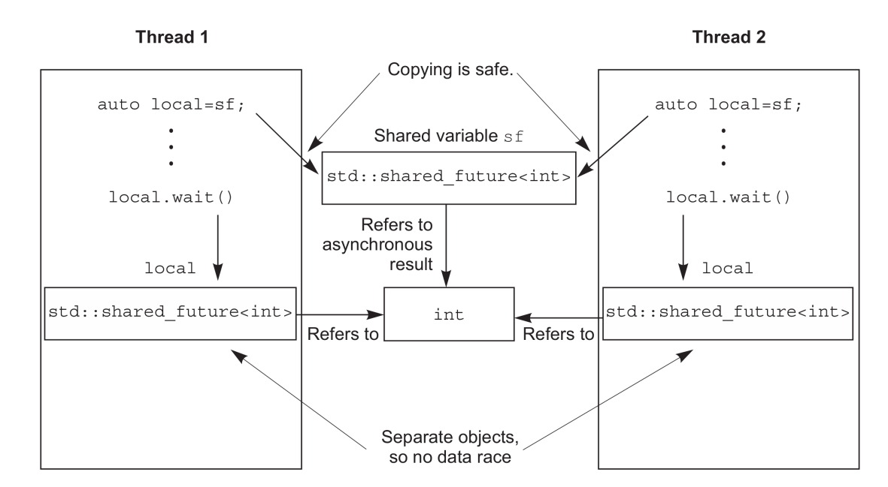

# 同步操作

# 等待

## 睡眠等待

睡眠等待防止了线程在CPU上长时间忙等（死循环检测条件达成情况），通过睡眠一段时间来让线程安静一会儿。

```cpp
void WaitCondition()
{
    bool flag = false; 
    std::unique_lock<std::mutex> lk(m);
    while(!flag)
    {
        lk.unlock(); // 解锁互斥量

        // 睡 100 ms 在起来看看
        std::this_thread::sleep_for(std::chrono::milliseconds(100)); 

        lk.lock(); // 再锁互斥量

        // 条件达成状态
        flag = GetConditionState();
    }
}
```

## 条件量

当条件满足后，才会唤醒等待线程，线程不用一直死循环等待条件完成。

```cpp
#include <condition_variable>

std::mutex m;
std::condition_variable cond;

void ProcessCondition()
{
    // 满足条件后，唤醒等待线程
    cond.notify_one();
    cond.notify_all();
}

void WaitCondition()
{
    bool flag = false;

    // 管理锁不能用 std::lock_guard，因为条件量内部也需要进行加锁、解锁
    std::unique_lock<std::mutex> lk(m);

    // 等待条件满足 
    cond.wait(lk,
        []{return GetConditionState() == true;});
}
```

# future

## 线程返回值

```cpp
#include <future>
int main()
{   
    // 会启动一个线程执行函数实体
    std::future<int> res = std::async(Run,args);

    // 阻塞等待子线程运行完毕
    res.wait(); 

    // get 会阻塞等待返回值
    res.get();
}
```

> [note]
> `std::future`的`wait()`，`get()`只能调用一次，想要调用多次，得使用 `std::share_future`

回调函数执行控制：

```cpp
// 直接启动回调函数
auto f6 = std::async(std::launch::async,Run,args); 

// 延迟执行，在wait()或get()调用时执行
auto f7 = std::async(std::launch::deferred,Run,args); 

// 实现选择执行方式
auto f8 = std::async(
          std::launch::deferred | std::launch::async,
          Run,args); 
```


## promise
将`std::promise`对象放入一个线程1，关联的`std::future`对象放入线程2，就能实现线程1通过`std::promise`发送数据，线程2通过`std::future`获取数据。

```cpp
// 创建
std::promise<T> pr;

// 获取 future
std::future<T> ft = pr.get_future();

// promise 放数据
pr.set_value(T);
```

## packaged_task

`std::packaged_task` 只是将调用实体进行封装，然后将返回值放入 `std::future` 。**本质上就是std::promise`函数实体传递的简化版。**

```cpp
void Run(args){}

// 封装任务，变成一个可调用实例，就能用来开多线程
std::packaged_task<void(args)> task(Run);

// 获取 future
std::future<void> res = task.get_future();

// 执行任务 
task(args);
```

## 返回异常

- `std::async` 与 `std::packaged_task` 中的回调实体在子线程发生异常时，可以通过 `std::future`返回异常。
- `std::promise` 需要返回异常时，则需要用 `set_exception()`传递异常
   ```cpp
    extern std::promise<double> some_promise;
    try
    {
        some_promise.set_value(calculate_value());
    }
    catch(...)
    {
        // 当 get 时，会抛出异常
        some_promise.set_exception(std::current_exception());

        // 拷贝异常，不会抛出
        some_promise.set_exception(std::copy_exception(std::logic_error("foo ")));
    }
   ```

## shared_future

<p style="text-align:center;"></p>

**作用**：`std::future` 是转移类型，且只能获取一次返回值，如果在多个线程中调用`get()`就会导致异常。`std::shared_future` 就是为了解决该问题，`shared_future`的实现是拷贝类型，允许子线程能拥有自己的`shared_future`对象，那就不存在抢占问题了。

类型转换：

```cpp
std::promise<int> p;

// 期望值 f 是合法的，临时变量类型转移
std::future<int> f(p.get_future());
assert(f.valid());

// 移交所有权
std::shared_future<int> sf(std::move(f));
assert(!f.valid()); // 期望值 f 现在是不合法的
assert(sf.valid()); // sf 现在是合法的

// 调用 share() 直接创建一个 shared_future
std::promise<int> p1;
std::shared_future<int> sf1(p1.get_future().share())
```

# 超时等待

## 时钟

- **当前时间**：可以通过时钟对象的`_clock::now()`方法获取，例如 `std::chrono::system_clock::now()` 获取当前系统时间
- **时钟节拍**：一秒钟有多少下。例如 1 秒钟 25 下，就是 1 个节拍 `1 / 25` 秒，即`std::ratio<1,25>`；时钟节拍为 2.5 秒一次，就是 1 个节拍 2.5 秒，写分数得 1 个节拍 `5 / 2` 秒，即`std::ratio<5,2>`。这个有系统决定
- **稳定时钟**：时钟节拍均匀分布(无论是否与周期匹配)，并且不可修改。通过 `is_steady` 可以查看

```cpp
#include <chrono> 

// 系统时钟，是不稳定的，可以调节时钟节拍，这就导致 now() 的延迟或者超前
std::chrono::system_clock

// 稳定时钟
std::chrono::steady_clock

// 精度最高的时钟，具有最小的时钟节拍
std::chrono::high_resolution_clock
```

## 时间段

```cpp
std::chrono::duration<rep,period>
```
- **rep** : 表示时间段的数值类型，例如`int,double,long`等。
- **period** : 一个时间段的单位时间，即`std::ratio<60,1>`表示的两个节拍之间的间隔时间。

**作用：** 表示一段时间，那么就能定义时间单位。

```cpp
// 毫秒：1秒钟1000个节拍，就是0.001秒1个节拍
typedef duration<long long, std::ratio<1,1000>> milliseconds;

// 秒：1秒钟1个节拍
typedef duration<long long,std::ratio<1,1> > seconds;

// 分：60秒钟1个节拍
typedef duration<int, std::ratio<60,1> > minutes;

// 系统库自带
std::chrono::milliseconds
std::chrono::seconds
std::chrono::minutes

// 单位转换
td::chrono::milliseconds ms(54802);
std::chrono::seconds s = std::chrono::duration_cast<std::chrono::seconds>(ms);
```
 
## 等待超时

- `wait_for`：等待一个时间段
    ```cpp
    std::future<int> f=std::async(some_task);
    // 等待 35 ms
    // 等待成功返回：std::future_status::ready
    // 等待超时返回：std::future_status::timeout 
    f.wait_for(std::chrono::milliseconds(35));
    ```
- `wait_unit`：等待一个绝对时间
