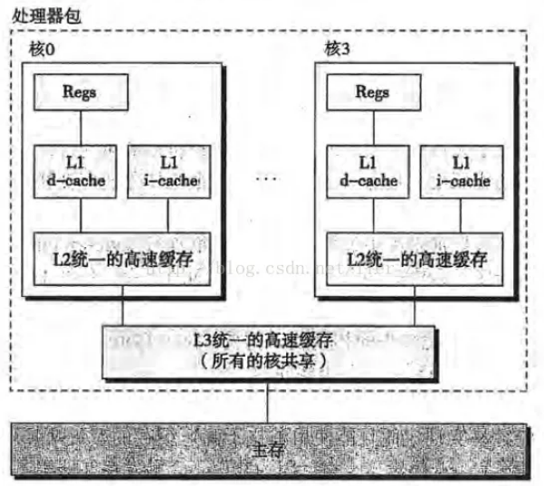

# 并发设计

# 影响并发性能的因素

## 处理器数量

- 尽量将CPU的所有核占满，根据 `std::thread::hardware_concurrency()` 可以知道CPU是多少核的。但是过多的线程数又会导频繁切换线程，造成性能浪费，即 `oversubscription`
- 可以利用 `std::asyn` 或者线程池来优化 `oversubscription` 问题

## 乒乓缓存

> [tip]
> 引起乒乓缓存（cache ping-pong）的原因就是多核CPU同时访问修改同一数据，即CPU间底层的"多线程同步"。



对于多核处理器，每个核都有自己独立的 cache（高速缓存）用来储存临时数据。若两个核同时读取内存上的同一数据，就需要将数据从内存拷贝到 cache 中，然后再拷贝到 register（寄存器）中进行运算操作。但是其中一个核修改了数据，那么就需要同步其他核的 cache ，将该数据更新到最新值（这样才能在大局上，保证这是同一个数据）。然而更新 cache 是要消耗时间的，若另一个核刚好需要访问这个数据，那么就不得不等待 cache 中数据更新到最新值。

```cpp
std::atomic<std::size_t> n(0);

void f() {  
    /*
    每次n自增，处理器都要确保 cache 中的拷贝是最新的
    修改值后再告知其他处理器
    fetch_add 是读改写操作，每次都要检索最新值
    如果另一线程在另一处理器运行此代码
    n 的数据就要在两个处理器之间来回传递
    这样 n 增加时两个处理器的 cache 才能有最新值
    */
    while (n.fetch_add(1, std::memory_order_relaxed) < 100000000) 
    {
        task();  
    }
}
```

- **high contention**：处理器之间需要频繁相互等待。如果很快完成或者有很多处理器运行此代码，处理器就要互相等待一个处理器在更新值，另一个更新值的处理器就要等待直到第一个更新完成并把改变传过来
- **low contention**：处理器之间很少要互相等待
- **cache ping-pong**：需要始终维持一致的数据（例如原子变量）在多核的 cache 之间来回传递的情况。<span style="color:blue;font-weight:bold">除了上述多处理器访问原子变量会引起乒乓缓存外，mutex 也会引起这个问题，因为锁需要在不同的线程中传递，并且保持始终一致 </span>

> [note]
> 要避免乒乓缓存，就要尽量减少多个线程对同一内存位置的竞争。

## 伪共享

cache 除了会引起多个处理器之间的乒乓缓存，还会导致同一处理器内部的「伪共享」。cache 数据管理与内存不同，内存的最小单位为字节，而cache的最小单位是 cache line，其大小通常是 32 或 64 字节，**在同一时间只有一条线程能持有一个 cache line 的访问权**。


**伪共享(false sharing)：** 数据可能不共享，但存放数据的 cache line 是在线程中同步共享的。引起伪共享的原因就是同一处理器上的两个线程访问的数据过于接近，因此让能被同一线程访问的数据项位于内存中的临近位置，让能被不同线程访问的数据在内存中相距很远。C++17 提供了 `std::hardware_destructive_interference_size` 来指定当前编译目标伪共享的最大连续字节数，只要数据间隔大于此字节数就可以避免伪共享。


- **互斥锁产生的伪共享**：mutex 与被保护的数据挨得太近，线程 A 持有了mutex，此时线程 B 进行抢锁，对内存位置的 mutex 执行了读写改操作，这就导致线程 A 持有的 cache line 失效，但是由于被保护的数据和锁是混搭临时存放在 cache line 中，这就使得线程 A 必须得更新 cache line 为了维持被保护数据的一致性。**测试手段为在 mutex 与被保护数据之间填充一个无用的 padding，将 mutex 与数据在 cache line 上分离**
    ```cpp
    // 测试锁和临近数据是否产生了伪共享
    class ProtectedData {
        std::mutex m;
        // 使用超过一个 cache line 字节数的填充即可
        char padding[std::hardware_destructive_interference_size];
        // 不支持 C++17 则可以 padding[65536];
        Data data_to_protect;
    };
    ```
- **数组访问产生的伪共享**：同一处理器中，一组线程访问一个整型数组（没有锁保护），并且这个数组刚好放到了一个 cahe line 中。当线程 A 正在访问 0 号元素，线程 B 想要访问 1 号元素时，A 就持有了这个 cache line 的访问权，而 B 就只能等 A 结束后才能获取到 cahce line 的访问权限，进而访问 1 元素，这就导致 A 与 B 线程在这情况下也是同步运行的。**测试手段为在每个元素中添加一个大的 padding，实现每个元素在 cache line 的分离**

    ```cpp
    struct Data {
        data_item1 d1;
        data_item2 d2;
        // 填充数据
        char padding[std::hardware_destructive_interference_size];
    };

    Data some_array[256];
    ```
