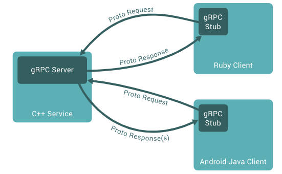

# gRPC

- [gRPC](https://grpc.io/docs/what-is-grpc/introduction/)

# RPC

RPC（Remote Procedure Call Protocol）远程过程调用协议。一个通俗的描述是：客户端在不知道调用细节的情况下，调用存在于远程计算机上的某个对象，就像调用本地应用程序中的对象一样。

- **Server**：在RPC规范中，这个Server并不是提供RPC服务器IP、端口监听的模块。而是远程服务方法的具体实现
- **Client**：RPC协议的调用方
- **Proto**: 服务端与客户端相互交流所使用的通信数据，采用字节流形式
- **Protocol Buffers**：谷歌开源的一套数据结构序列化工具，用来编码、解码字节流

# 安装

1. [protobuf 下载](https://github.com/protocolbuffers/protobuf/releases/tag/v21.12)，配置环境变量
2. [gRPC 核心库下载](https://grpc.io/docs/languages/)
3. protocol 编译器
