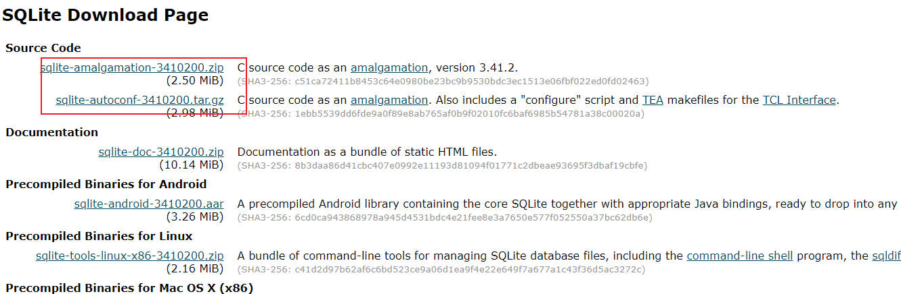

# SQLite

# 安装


1. 从 [SQLite 官网](https://www.sqlite.org/download.html) 下载源码



2. 对于 MSVC 编译器，还需要穿修改 `sqlite3.h` 与 `sqlite3.c` ，添加动态库导出宏

    ```cpp

    /* ==================== 动态库导出宏 =================== */
    #ifdef _WINDLL
    #define SQLITE_API __declspec(dllexport)
    #else
    #define SQLITE_API __declspec(dllimport) 
    #endif
    /* ==================================================== */

    #ifndef SQLITE_EXTERN
    # define SQLITE_EXTERN extern
    #endif
    #ifndef SQLITE_API
    # define SQLITE_API // 默认是什么都没定义，gcc 编译器生成动态库没问题，但是 MSVC 不行
    #endif
    #ifndef SQLITE_CDECL
    # define SQLITE_CDECL
    #endif
    ```

3. 将源码编译编译成库

    ```lua
    -- 项目
    set_project("sqlite3")

    -- 运行时库采用动态库
    add_cxflags("/MD")

    target("sqlite")
        -- 动态库导出选项
        add_defines("_WINDLL")

        -- 动态库
        set_kind("shared")

        -- 文件
        add_headerfiles("src/sqlite3/*.h")
        add_files("src/sqlite3/*.c")

        -- 输出目标
        set_targetdir("bin/sqlite")

    ```

4. SQLite 的实现是 c 语言风格，为了代码书写方便，可以再套一层 [c++ 接口封装](https://github.com/neosmart/CppSQLite)

# 使用

- C 接口

```cpp

void GetMsg(sqlite3 *db, int nCode)
{
    if (nCode != SQLITE_OK)
    {
        cout << "错误信息：" << sqlite3_errmsg(db) << endl;
    }
}

void OpenDatabase()
{
    int nRes = SQLITE_OK;
    sqlite3 *db = nullptr;

    // 打开数据库
    nRet = sqlite3_open("test.db", &db);
    GetMsg(db, nRes);

    // 关闭数据库
    nRet = sqlite3_close(db);
    GetMsg(db, nRes);
}

void Operate(sqlite3 *db)
{
    int nRes = SQLITE_OK;

    // 执行 sql 语句
    nRes = sqlite3_exec(db, "create table fuck(id integer primary key autoincrement,name varchar(100))", nullptr, nullptr, nullptr);
    GetMsg(db, nRes);
}

void Insert(sqlite3 *db)
{
    int nRes = SQLITE_OK;

    // 显示的指定事务，提高插入效率
    string strSql;
    strSql += "begin;\n";
    for (int i = 0; i < 100; i++)
    {
        strSql += "insert into fuck values(null,'heh');\n";
    }
    strSql += "commit;";

    nRes = sqlite3_exec(db, strSql.c_str(), nullptr, nullptr, nullptr);
    GetMsg(db, nRes);
}
```

- C++ 接口

```cpp
// 打开关闭数据库
void CppSQLite3DB::open(const char* szFile);
void CppSQLite3DB::close();

// 执行 SQL 语句
int CppSQLite3DB::execDML(const char* szSQL);

// 查询
CppSQLite3Query CppSQLite3DB::execQuery(const char* szSQL);

// 查询数字结果，其实是对 CppSQLite3DB::execQuery 的封装
int CppSQLite3DB::execScalar(const char* szSQL);

// 获取表格
bool CppSQLite3DB::tableExists(const char* szTable);
CppSQLite3Table CppSQLite3DB::getTable(const char* szSQL);
```