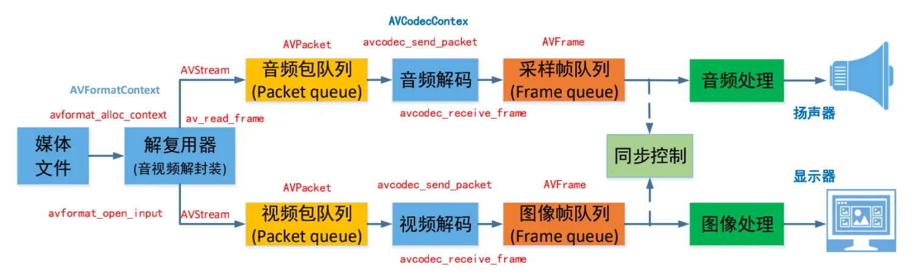
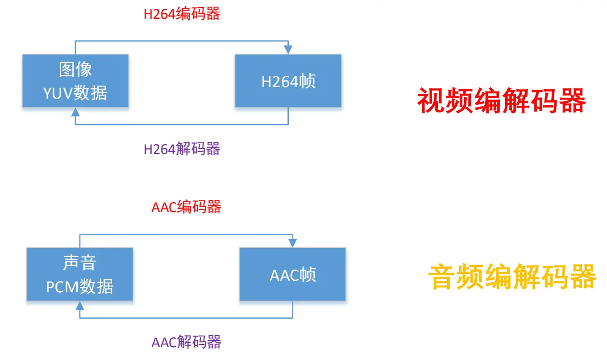
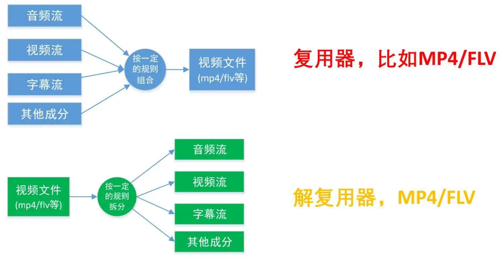
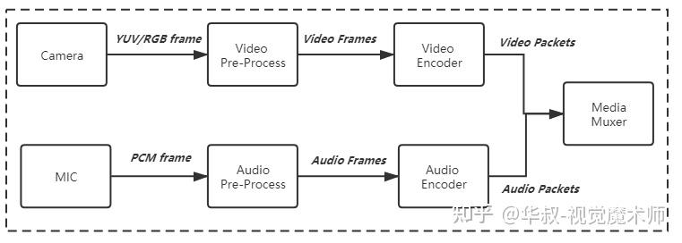

# 播放器



- **容器／文件（Conainer/File）**：特定格式的多媒体文件，例如 `mp4、flv、mkv` 等。

    ```txt
    头信息 + { 交错存放的音视频数据包 } + 尾信息
    ```

- **媒体流（Stream）** ：时间轴上的一段连续数据，如一段声音数据、一段视频数据或一段字幕数据。
  - 解码时间戳 DTS（Decoding Time Stamp）：播放器该在什么时候解码这一帧的数据
  - 显示时间戳 PTS（Presentation Time Stamp）：播放器该在什么时候显示这一帧的数据
- **数据帧／数据包（Frame/Packet）**：由数据帧组成媒体流，分属于不同媒体流的数据帧交错存储于容器之中。
- **编/解码器 （Encoder/Decoder）**：用于对媒体流的压缩/解压缩，以数据帧为操作单位。





- **复用器/解复用器（Muxer/Demuxer）**：解包或打包媒体文件




# 录像



分别对摄像头捕获的视频与麦克风捕捉的音频进行编码，然后通过复用器打包得到媒体文件。


