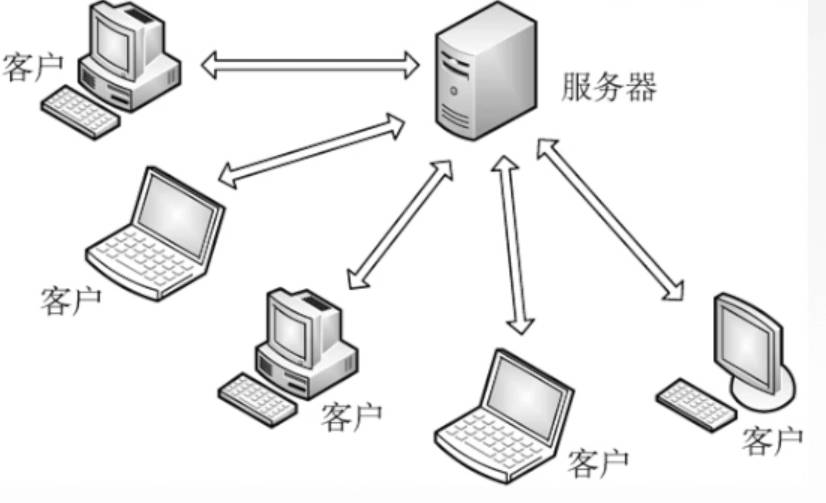
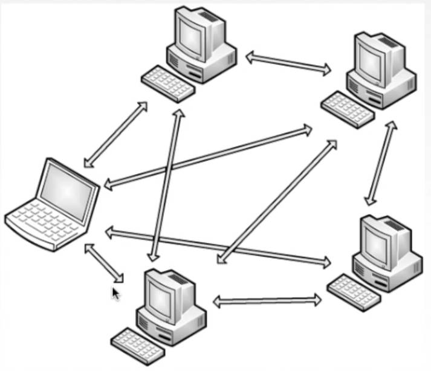
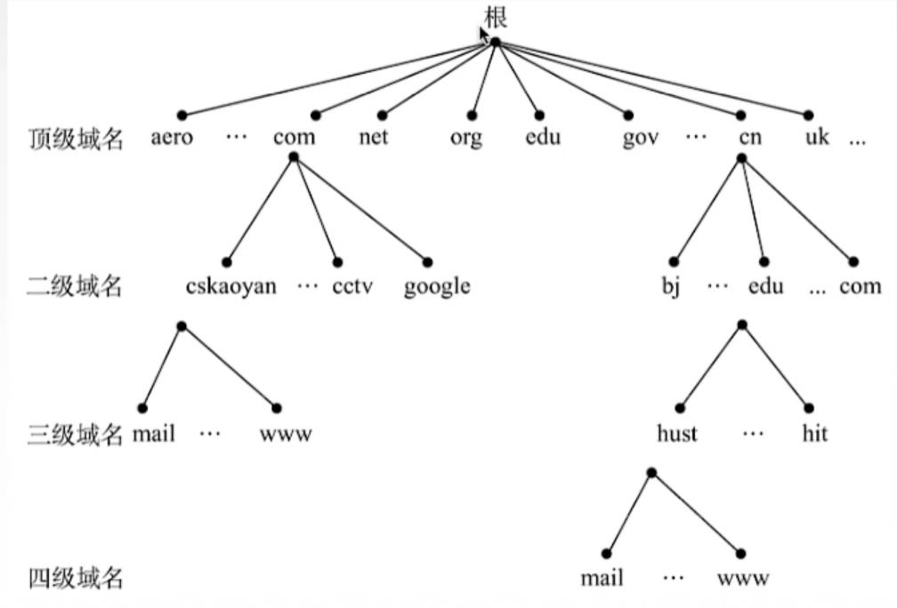
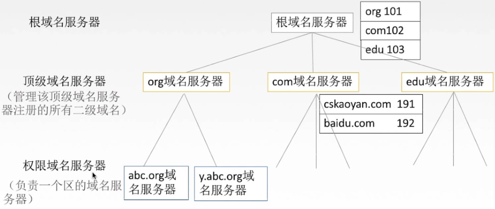
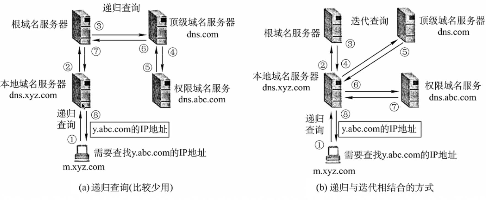
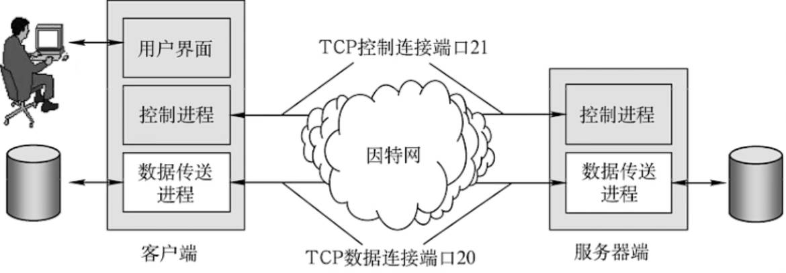
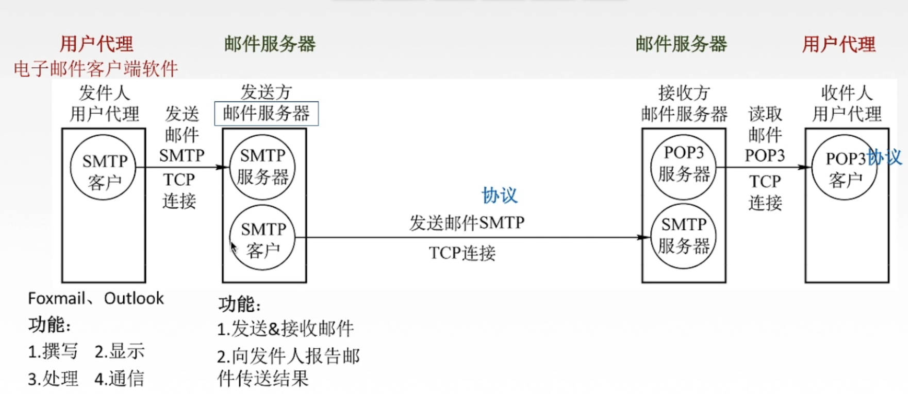
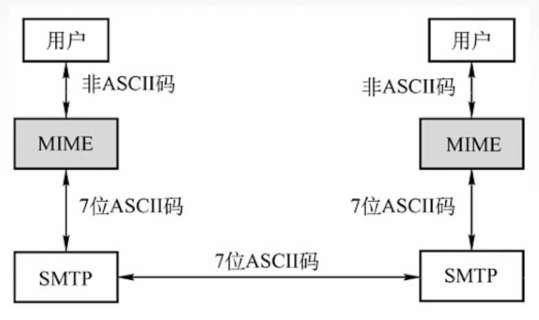
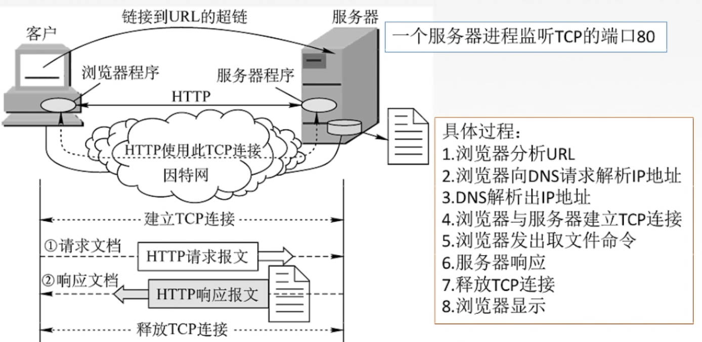
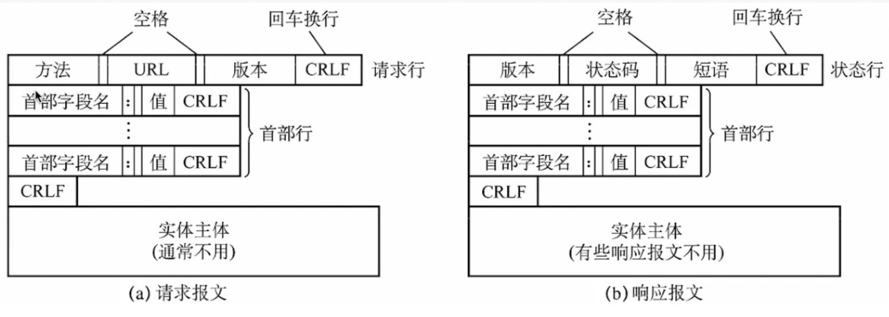

# 网络应用模型

- **客户端-服务器模型：** 服务器的IP地址需要固定，客户端IP地址可用随意变动；客户端只能和服务器通信，客户端之间没有交流。
    
- **p2p模型：** 每一个主机都可以提供服务与请求服务。每两个结点都能直接进行通信。
    

# DNS域名服务器

- **DNS系统：** 主机首先将「域名」发送给「DNS服务器」获取域名对应的IP地址，然后根据解析得到的IP地址防止目的主机。
- **域名：** IP地址为一长串的数字，不好记忆，所以就利用符号来代替IP地址，例如 `wwww.bing.com.cn`
- **域名结构：** 「根」出发， 从右往左  解析。
    
    

    - **根：** 最右边的一个的「.」，省略不写
    - **顶级域名：**
      - 国家顶级域名：cn、us、uk
      - 类别域名：com、org、net
    - **二级域名：**
      - 类别域名
      - 网站名称：自定义，全球唯一
      - 行政区域名：省、直辖市
    - **三级域名：**
      - 网络类型：wwww、mail、ftp

- **DNS服务器：** 根据域名从右往左的顺序划分，先大范围，然后缩小。
  - 根域名服务器：IP固定，全球主机都能知道，能直接范围
  - **本地域名服务器**：主机所在网络存在的域名服务器，起域名与IP地址备份的作用，主机首先查找本地域名服务器，没有才会去根域名服务器。
    

- **DNS查询方式：**
  

# 文件传输

- **FTP协议：** 通过TCP协议，实现服务器与客户端之间的文件传输。

# 电子邮件

- **SMTP协议：** 负责邮件的发送，客户端发送给邮件服务器，邮件服务器之间的转发
- **POP3协议：** 负责邮件的接收，邮件服务器将邮件递交给客户端

- **MIME邮件扩充：** 由于电子邮件本质上的传送单位为「7位ASCII码」，为了对传输内容格式（视频、音频、图像）进行扩展，引入了`MIME`。
  

# 万维网

- **万维网（World Wide Web,www）：** 一个大规模的、联机的信息储存所/资料空间。无数个网络站点和网页的集合。

- **HTTP协议：** 规定了客户端怎么向万维网服务器请求万维网文档，以及服务器如何返回响应。
    

    - **keep alive：** TCP连接建立后，就一直通信，知道通信完毕后才断开。
    - **close：** 客户端发送一次请求，服务器响应请求后，就关闭TCP连接。

- **HTTP报文：** 
    

- **URL链接：** 万维网中「资源（视频、图片、文字等）」的唯一标识符号。 发送HTTP请求报文，告知服务器想要获取什么资源。 
    $$
    <协议>://<主机>:<端口>/<服务器路径>
    $$

- **HTML文档：** 一个网页的脚本代码，万维网的信息表示语言，使用HTML描述的文件需要通过web浏览器显示出效果。 当HTTP协议请求访问的是一个网页时，响应的报文的实体就是一个HTML文档。 
