# 计算机网络

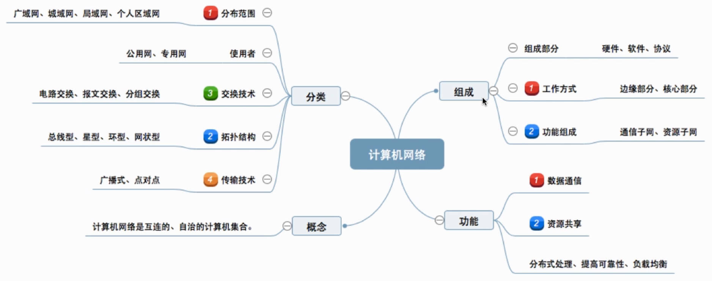

## 概念

**计算机网络**：是一个将分散的、具有独立功能的「计算机系统」，通过「通信设备」与「线路」连接起来，由功能完善的「软件」实现「资源共享」和「信息传递」的系统。

- **计算机系统**：网络上的终端设备，例如手机，电脑
- **通信设备**：交换机，路由器等
- **线路**：光纤等
- **软件**：进行信息收发的软件，例如QQ，微信

## 功能

1. **资源共享：** 共享数据，硬件，软件。例如不同用户可以通过网络使用同一个打印机；不同用户可以获取服务器上的电影等
2. **分布式处理：** 多台计算机承担同一工作任务的不同部分，计算机分工合作处理任务。
3. **提高可靠性：** 不同链路上的计算机可以相互顶替，以防不测，保障任务继续运行。
4. **负载均衡：** 多台计算机分工的工作量平衡

## 描述

<span style="font-size:24px;font-weight:bold" class="section2">1. 组成部分</span>

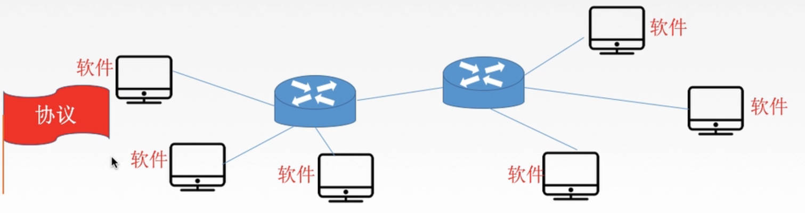

5. 硬件
6. 软件
7. 协议

<span style="font-size:24px;font-weight:bold" class="section2">2. 工作方式</span>

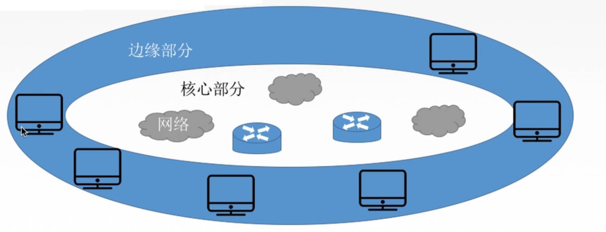

- **边缘部分：** 供用户使用，例如C/S，P2P
- **核心部分：** 网络内部组成

<span style="font-size:24px;font-weight:bold" class="section2">3. 功能组成</span>


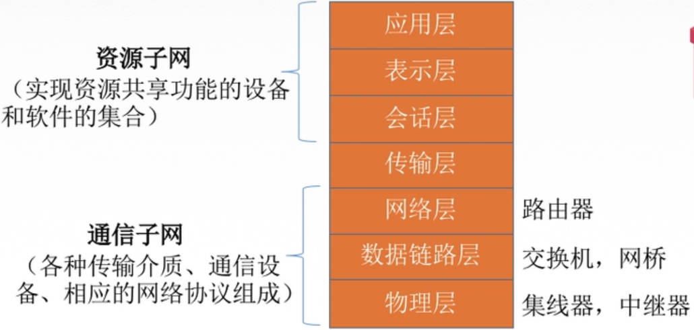

- **资源子网：** 实现数据共享，数据处理
- **通讯子网：** 实现数据通讯

## 分类

<span style="font-size:24px;font-weight:bold" class="section2">1. 范围</span>

| 名称       | 缩写 | 范围      |
| ---------- | ---- | --------- |
| 广域网     | WAN  | 通常跨国  |
| 城域网     | MAN  | 城市      |
| 局域网     | WLAN | 1 km 左右 |
| 个人区域网 | PAN  | 个人使用  |

> [!tip]
> - 广域网：交换技术
> - 局域网：广播技术

<span style="font-size:24px;font-weight:bold" class="section2">2. 使用者</span>

- **公用网：** 中国电信，中国移动搭建的网络
- **专用网：** 军队自己搭建的网络

<span style="font-size:24px;font-weight:bold" class="section2">3. 交换方式</span>

电路交换、报文交换、分组交换

<span style="font-size:24px;font-weight:bold" class="section2">4. 拓扑结构</span>

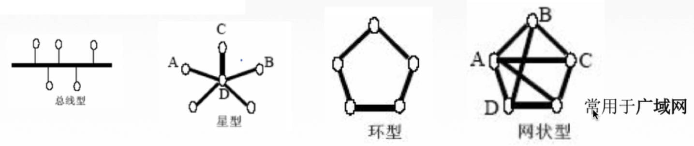

<span style="font-size:24px;font-weight:bold" class="section2">5. 传输技术</span>

- **广播式网络：** 消息群发
- **点对点网络：** 私聊

# 标准化

## 标准分类

- **法定标准：** 权威机构制定的标准，例如 OSI
- **事实标准：** 由于好用，大家都在用，都遵守，例如 TCP/IP

## 标准建立（RFC）

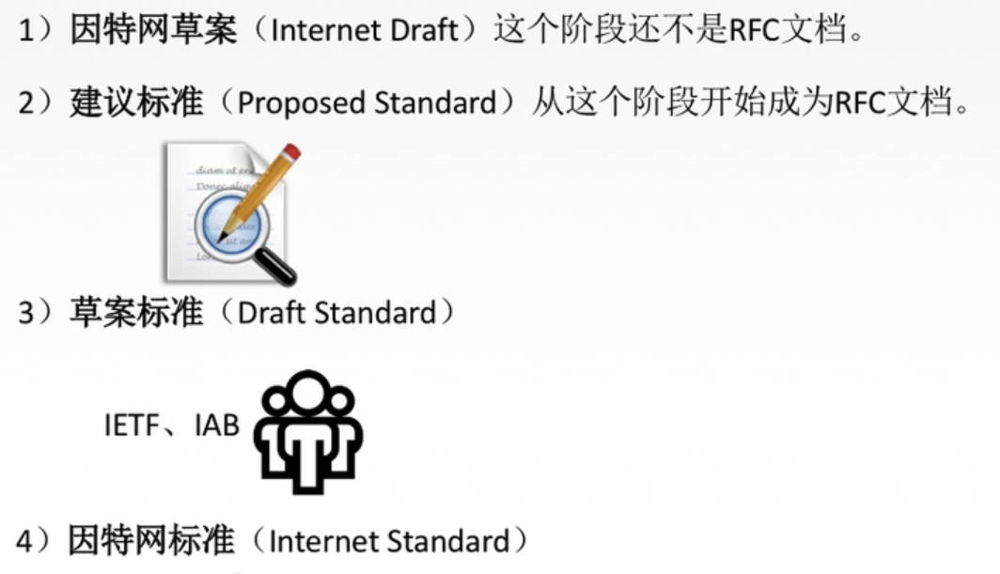

## 标准组织

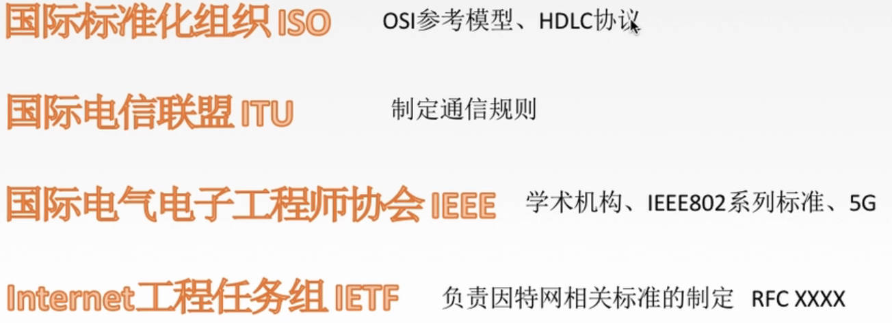


# 计算机网络指标

## 速率相关

<span style="font-size:24px;font-weight:bold" class="section2">1. 速率</span>

- **定义：** 单位时间内传输多少个`bit`
- **单位：** b/s, kb/s, Mb/s

```math
1 \ kb/s = 1000 \ b/s
```
> [!note|style:flat]
> - 网络速率是「十进制」的，基本单位为`bit`
> - 储存容量相关的速率是「二进制」的，基本单位为`Byte`

<span style="font-size:24px;font-weight:bold" class="section2">2. 带宽</span>

- **原定义：** 某个信号具有的频带宽度，即高频与低频之差，单位 `Hz`
- **通信定义：** 单位时间内从网络的一点到另一点所能通过的最大比特数，单位`b/s`


**「带宽」描述的是网络设备所支持的最高数据传输速率；「线路」的「信号传输速度」由线路材料所确定，是一个定值。**

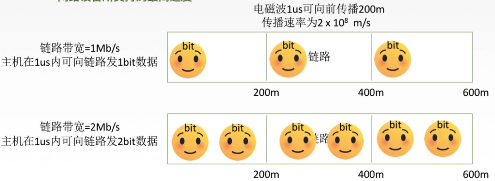

<span style="font-size:24px;font-weight:bold" class="section2">3. 吞吐量</span>

**定义：** 单位时间内通过某个网络（信道，接口）的数据量，单位`b/s`，即一段时间内，通过某个网络的速率的总和。

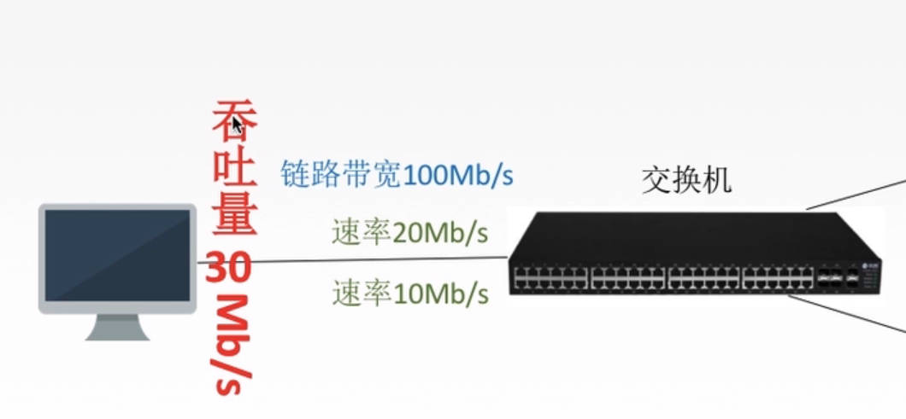

## 时间相关

<span style="font-size:24px;font-weight:bold" class="section2">1. 时延</span>

**定义：** 从一端传输到另一端所需要的时间，单位`s`

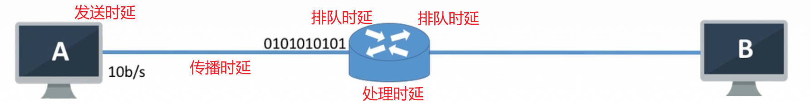

- **发送时延：** 数据从第一个比特到最后一个比特，发送所使用的时间。
- **传播时延：** 数据在信道（链路）上，所消耗的时间
- **排队时延：** 在信道的入口和出口，等待信道可用的时间。
- **处理时延：** 进入交换机、路由器后，找下一条信道所消耗的时间

<span style="font-size:24px;font-weight:bold" class="section2">2. 时延带宽积</span>

**定义：** 「传播时延」与「带宽」的乘积，单位`bit`。描述的是链路能存储的最大比特数，容量的大小。「带宽」则可以看作是设备发出数据的最大速率。

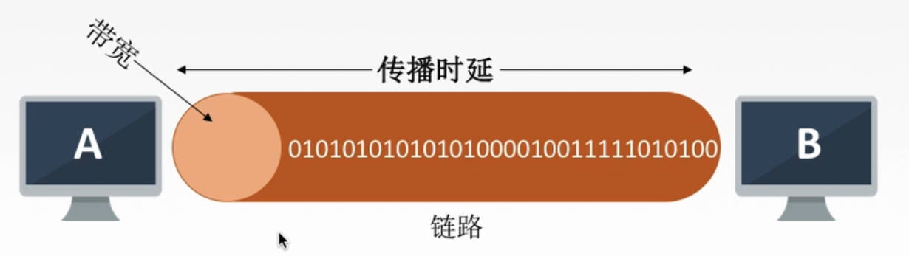

<span style="font-size:24px;font-weight:bold" class="section2">3. 往返时延RTT</span>

**定义：** 发送方发送第一个比特开始，到发送方接收到第一个比特结束。主要由传播时延、末端处理时延（服务器的处理时间）、传播时延组成。

<span style="font-size:24px;font-weight:bold" class="section2">4. 利用率</span>

- **信道利用率：** $\frac{有数据通过时间}{总时间}$
- **网络利用率：** 信道利用率的加权平均

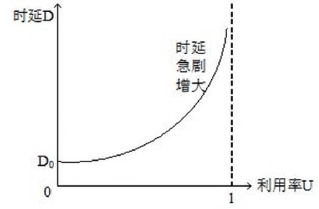

> [!tip]
> 同一个路由器下，一台主机满信道利用率运行，另外一台主机就得等着利用信道，所以另外一台主机网络卡了（时延高了）。


# 分层模型

## 基本概念

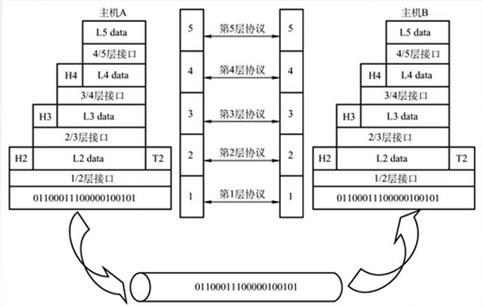

- **分层的基本原则：** 按照功能进行结构划分的
   1. 每层之间界面自然清晰，易于理解，相互交流尽可能少。
   2. 结构上可分割开。每层都采用最合适的技术来实现。
   3. 保持下层对上层的独立性，下层为上层提供服务。
- **实体：** 每一层中的「活动元素」就是每一层的实体。
- **对等实体：** 接收端与发送端在同一层级上的实体共同组成对等实体
- **协议：** 接收端与发送端在同一层级上，为对等实体数据交换建立的规则、标准或约定。**实现发送端打包数据，接收端拆解包还原数据。**
    1. **语义：** 数据表达含义
    2. **同步：** 数据的发送\接收顺序
- **服务：** 由每层协议提供的功能，包括供上层使用的服务、当前层的服务
- **接口（访问服务点SAP）：** 上层使用下层服务的入口，只能是相邻层级，不能跨层


## OSI模型

### 通信过程

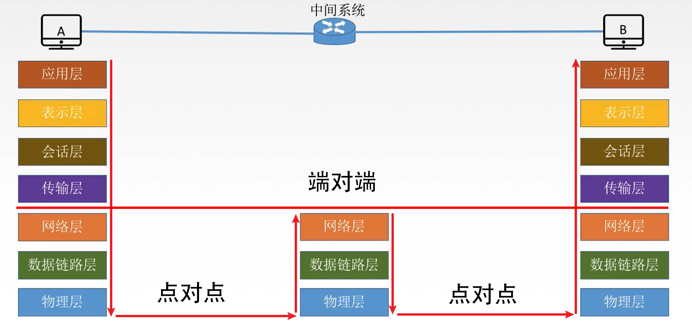

1. 上四层只有终端有，属于「端对端」通信
2. 下三层终端、交换机都有，属于「点对点」通信

> [!tip]
> OSI模型在理论上能帮助学习，实际使用很拉跨

### 数据传输

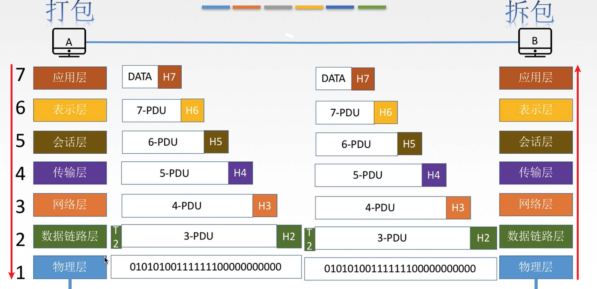

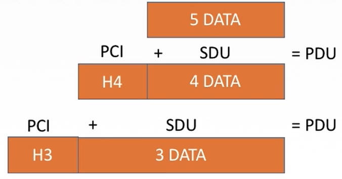

- **数据结构：**
    1. **SDU：** 服务数据单元，完成用户操作所要传输信息
    2. **PDU：** 协议数据单元，对应层级向下层输出或者接收下层的数据单位

### 层级介绍


<center>

| 层级   | 描述                                                            | 功能                                                                                                                                                               | 协议               |
| ------ | --------------------------------------------------------------- | ------------------------------------------------------------------------------------------------------------------------------------------------------------------ | ------------------ |
| 应用层 | 所有需要「联网」的程序                                          |                                                                                                                                                                    | FTP、HTTP、SMTP    |
| 表示层 | 处理交换信息的表达方式                                          | 1. 数据格式转换 </br> 2. 数据加密/解密 </br> 3. 数据压缩/恢复                                                                                                      |                    |
| 会话层 | 建立连接，能有序传输数据（建立同步）                            | 1. 管理会话 </br> 2. 校验点管理，实现数据同步                                                                                                                      | ADSP、ASP          |
| 传输层 | 负责「端对端」的通信，传输数据为报文段，数据报                  | 1. 可靠传输（TCP）/不可靠传输（UDP） </br> 2. 差错控制 </br> 3. 流量控制（控制发送速度） </br> 4. 复用分用（多程序共用一个发送系统；区分数据是属于哪个进程的）     | TCP、UDP           |
| 网络层 | 服务「分组」的传输 （分组：数据报的分割），传输单位为「数据报」 | 1. 路由选择（走哪条网络传输） </br> 2. 差错控制 </br> 3. 流量控制（控制发送速度） </br> 4. 缓解拥堵 （拥堵：网络中所有结点都来不及接收「分组」，需要丢弃「分组」） | IP、IPX、ICMP、ARP |
| 链路层 | 将网络层的「数据包」组装成「帧」                                | 1. 定义帧 </br> 2. 差错控制 </br> 3. 流量控制 </br> 4. 信道的连接、断开控制                                                                                        | STP、PPP、SDLC     |
| 物理层 | 传输比特流                                                      | 1. 定义接口特性 </br> 2. 传输模式（单工，双工，半双工）        </br> 3.  定义发送速率 </br> 4. 保证比特同步 </br> 5. 比特编码                                      |                    |


</center>


## TCP/IP模型

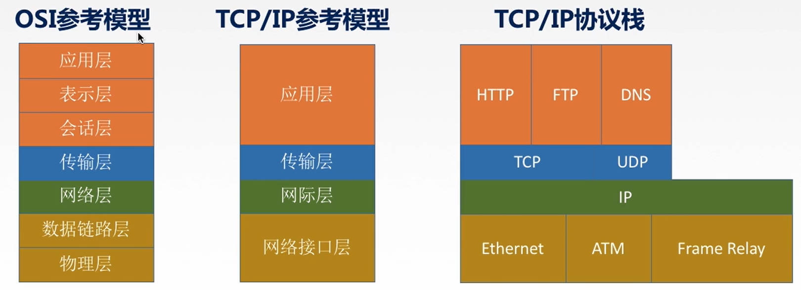

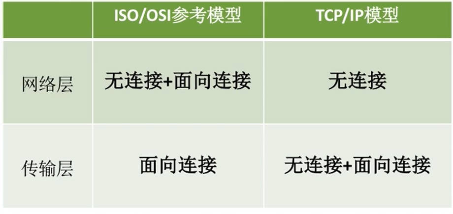

- **面向连续：** 请求连接；连接通信；断开连接。例如 `TCP`
- **无连接：** 直接数据通信。例如 `UDP`

## 五层模型

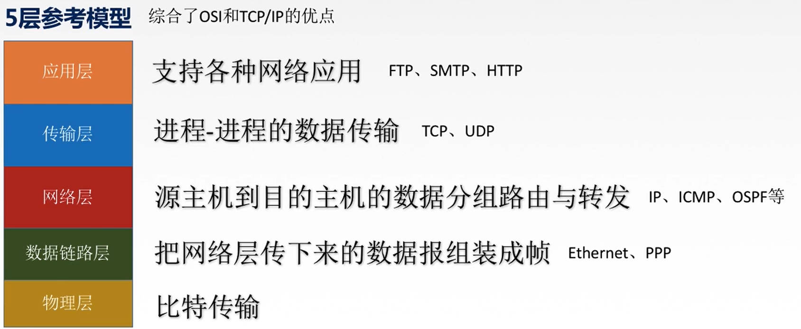

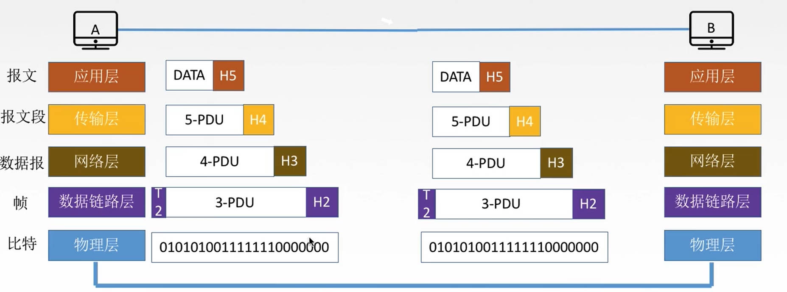


