# 基础概念


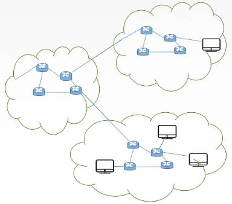

> [!note|style:flat]
> 数据链路层的作用：实现链路两端结点的数据报安全、可靠的传输（发送内容与接收内容一致）。

- **结点：** 构成网络的主机、路由器
- **链路：** 两个「结点」之间的**物理通路**，即「传输媒介」
- **数据链路：** 两个「结点」之间的**逻辑通路**。
- **帧：** 链路层传输的数据单元，是对网络层数据报的封装。
- **功能：**
        - 无确认无连接：只管发送，不管对方收没收到
        - 有确认无连接：发送之后，要等待对方的确实信号
        - 面向连接：最安全的收发方式
    1. 链路管理：连接的建立、释放、维持
    2. 组帧
    3. 流量控制
    4. 差错控制 

# 组帧

## 概念

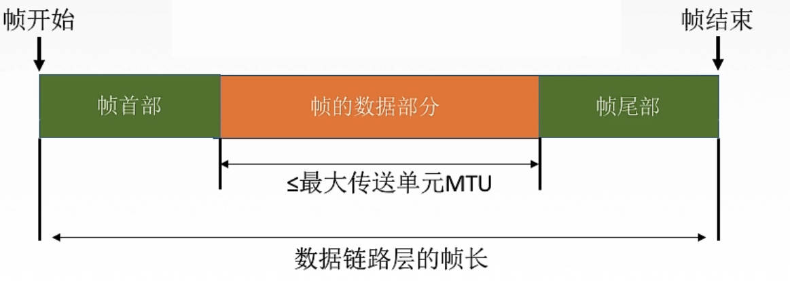

- **封装成帧：** 在一段数据的前后添加「首部」与「尾部」标记，构成一个帧。
- **帧定界：** 真正用于划分帧界限的标志符号。**帧的首部与尾部还存放的有其他控制信息。**
- **帧同步：** 接收方能从二进制流中识别出「帧定界」，进而取出「帧」
- **透明传输：** 不管什么样的比特流，都能在链路上传输，**即对传输功能进行了封装，所有输入的内容都能传输。**

## 组帧方法

### 字符计数法

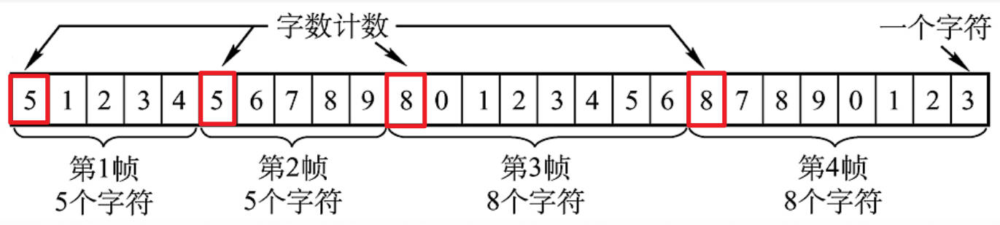

- **思路：** 每个「帧」的第一个「字段」用来计数当前帧的「字符数」
- **缺点：** 「计数字段」出错，会导致「帧同步」失败

### 字符填充法

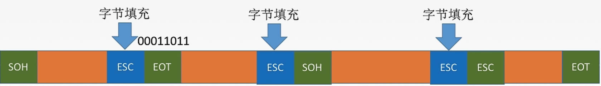

- **思路：** 用一段特定的比特组合来表示「帧定界」；对于帧内部的出现的「帧定界」则使用「转义字符」来标记。
- **缺点：** 实现太复杂

### 零比特填充法


- **思路：** 使用`01111110`来表示「帧定界」；帧内部则遇到`5`个连续的`1`就插入一个`0`，例如 `0011111101` 转换为 `00111110101`

### 违规编码法

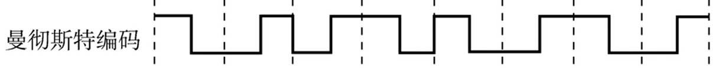

- **思路：** 对于「曼彻斯特」编码方式，是利用「高-低」与「低-高」来表示二进制的，这样就能采用「高-高」与「低-低」来表示「帧定界」


# 差错控制

## 差错概念

- **产生原因：**
  - **全局性：** 由线路本身热噪声产生，固定且随机。解决方法：提高信噪比
  - **局部性：** 外界短暂的冲击噪声产生。解决方法：通过编码技术解决

- **差错的种类：**
  - **位错：** 比特位出错，例如 `1` 变 `0`，`0` 变 `1`
  - **帧错：** 帧顺序 [#1] - [#2] - [#3] 
        1. 重复：[#1] - [#2] - [#2] - [#3] 
        2. 失序：[#3] - [#1] - [#2] 

- **冗余编码：** 在原始传输数据上，再添加一定的规则的冗余比特位（传输中的附加信息）。


> [!note|style:flat]
> - **物理层编码：** 针对一个比特，如何用高低电平表示比特
> - **链路层编码：** 针对一组比特，通过冗余码技术组织一组二进制比特串，以实现差错检测

## 差错控制方法

### 奇偶校验编码

- **奇校验码：** `x-------`，在原始比特串中添加一个`x`位，使得`1`位个数为奇数
- **偶校验码：** `x-------`，在原始比特串中添加一个`x`位，使得`1`位个数为偶数

> [!note|style:flat]
> 奇（偶）校验码的检错，只能查出 `50%` 的错误，即 奇（偶）数位错误。

### CRC冗余码


**冗余编码流程：**

1. 计算冗余个数：$多项式长度 - 1$ ，即多项式最高位转十进制时，`2`的幂次。例如 `10011`的阶数为 `4`
2. 加冗余`0`：`1101 0110 11 0000`
3. 模`2`除法：最后的冗余码为 `1110`
    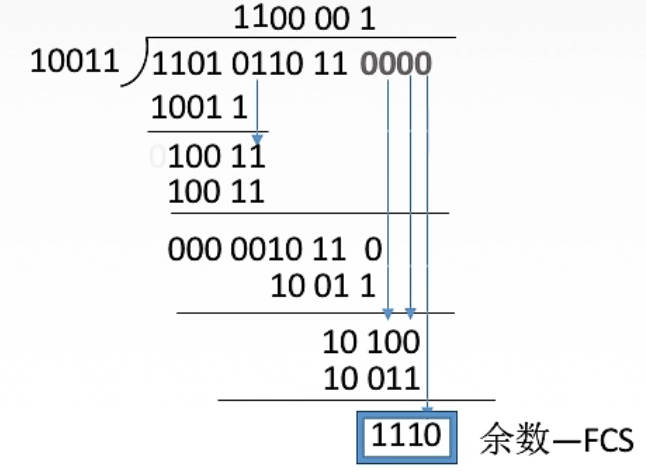
4. 替换掉之前的`0`，冗余编码：`1101 0110 11 1110`

> [!note|style:flat]
> CRC只能保证「接收端」接收的「帧」是没有「位错」的，不能确保所有「帧」都被接收到，所以并不能实现「可靠传输」。

### 海明码

>[!note|style:flat]
> 发现「双比特」错误，纠正「单比特」错误。


**发送数据为：** `101101`

<span style="font-size:24px;font-weight:bold" class="section2">1. 确定校验码位数</span>

海明不等式：

```math
2^r \ge k + r + 1
```
式子中 $r$ 为冗余码个数；$k$ 为要发送数据的位数。关于`101101`，$k = 6,r = 4$

<span style="font-size:24px;font-weight:bold" class="section2">2. 确定校验码与数据的位置</span>


- 数据位： 对比特串从`1`开始编号，到 $r + k$ 终止
- $P_i$ 校验码：数据位的二进制的形式为`1`、`10`、`100`、`1000`等形式
- $D_i$ 数据：除校验码剩余的数据位，数据按照顺序填入

<span style="font-size:24px;font-weight:bold" class="section2">3. 计算校验码</span>
 

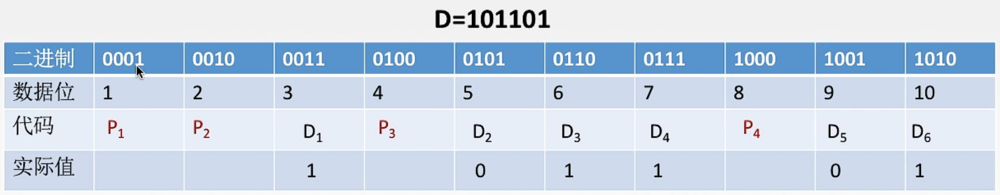

将所有 $D_i$ 数据位 与 $P_i$ 的数据位进行与运算，满足 $index(D_i) \ \& \ index(P_i) == index(P_i)$ 的「实际值」同 $P_i$ 进行「异或」运算结果为`0`。

**$P_i$计算流程：**


1. 解方程：

```math
P_1 \oplus D_1 \oplus D_2 \oplus D_4 \oplus D_5 = 0
```
2. 得解：$P_1 = 0$


计算所有的 $P_i$ 就为

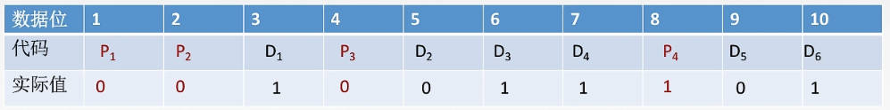


<span style="font-size:24px;font-weight:bold" class="section2">4. 纠错</span>

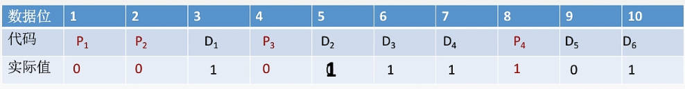

假设 $D_2$ 传输错误：

```math
\begin{aligned}
    P_1 \oplus D_1 \oplus D_2 \oplus D_4 \oplus D_5 &= 1 \\
    P_2 \oplus D_1 \oplus D_3 \oplus D_4 \oplus D_6 &= 0 \\
    P_3 \oplus D_2 \oplus D_3 \oplus D_4  &= 1 \\ 
    P_4 \oplus D_5 \oplus D_6 &= 0
\end{aligned}
```
将结果反向排序：`0101`，就是 $D_2$ 的「数据位」。

# 流量控制

## 基本概念

- **流量控制：** 控制「发送方」的发送速度，发太快了，接收方跟不上，容易出错。

- **可靠传输：** 发送端发送啥，接收端就接收到啥，即内容完全一样。

- **滑动窗口：** 蓝色窗口内的「帧」才能参与收发操作；当收发成功时，蓝色窗口会向右移动。**滑动窗口能解决「流量控制」与「可靠传输」两个问题**


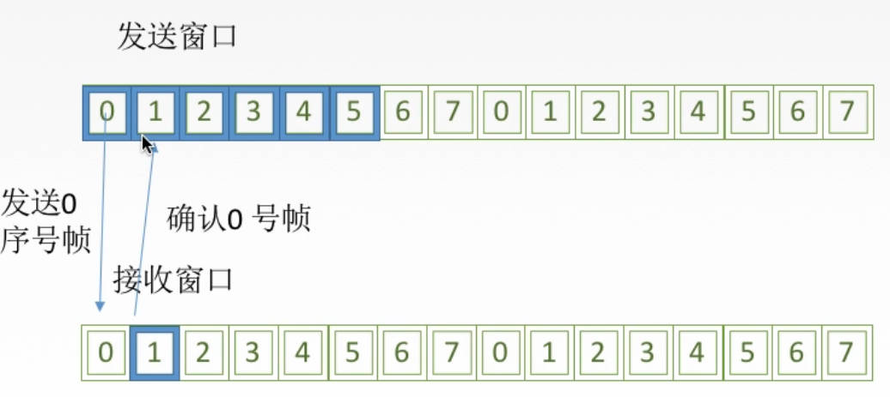

- **信道利用率：** 一个发送周期内，发送数据所用时间占发送周期的比率。

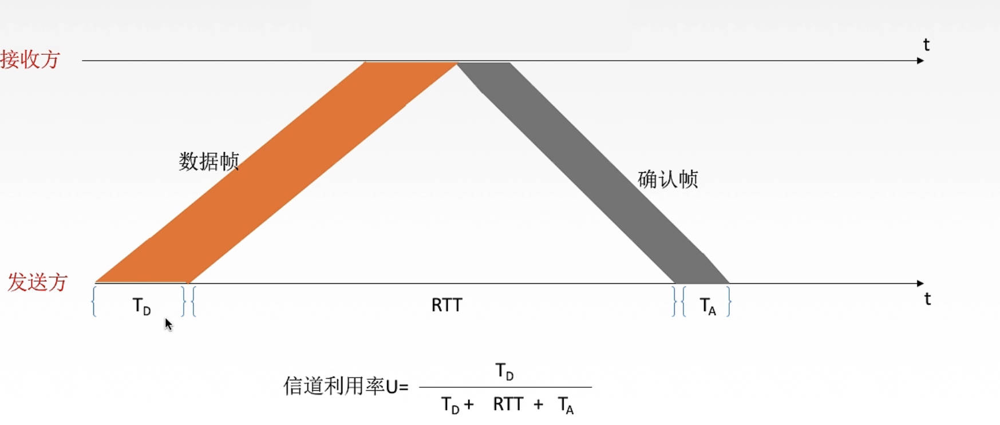

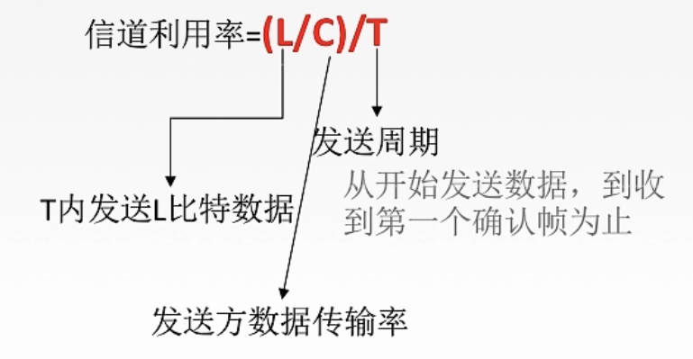

> [!tip|style:flat]
> - **链路层流量控制：** 点对点；接收不了不回复确认。
> - **传输层流量控制：** 端对端；接收不了返回「窗口公告」

## 滑动窗口算法


<center>

| 算法      | 发送窗口 | 接收窗口 |
| --------- | -------- | -------- |
| 停止-等待 | 1个      | 1个      |
| 后退N帧   | >1个     | 1 个     |
| 选择重传  | >1个     | >1个     |


</center>


### 停止-等待协议

<span style="font-size:24px;font-weight:bold" class="section2">1. 无差错</span>


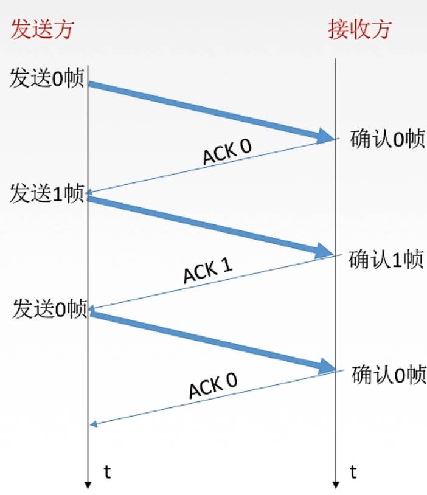


- **发送方：** 发送一「帧」，然后一直等待「接收方」的确认信号
- **接收方：** 接收到的「帧」没问题，就返回一个确认信号`ACK 帧号`

<span style="font-size:24px;font-weight:bold" class="section2">2. 帧丢失</span>


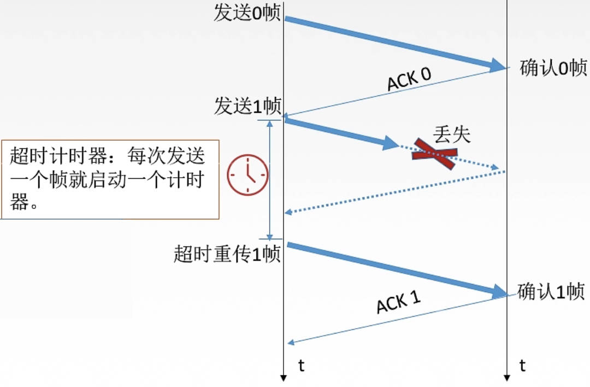

- **发送方：** 对发送的「帧」超时重传。
  - **计时：** 对每一个发送的「帧」计时，判断发送时间是否超过了一个`RTT`。
  - **备份：** 对每一个发送的「帧」都会备份，当「超时」发生，就将「备份帧」重新发送。
- **接收方：** 啥也不干 
- **帧编号：** 用来同步两端「帧」的顺序。可以用来判断「帧丢失」与「帧重传」
  - **帧丢失：** 「接收端」接收的「帧编号」不是一个预测值。比如接收了`0`，下一帧的编号应该是`1`
  - **帧重复：** 「发送端」连续收到多次同样的`ACK num`；「接收端」连续收到同样的「帧编号」

<span style="font-size:24px;font-weight:bold" class="section2">3. ACK丢失</span>


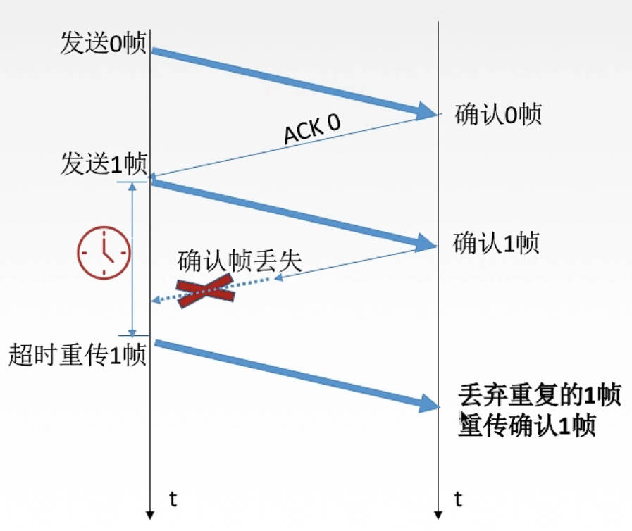

- **发送方：** 等不到`ACK`就「超时重传」
- **接收方：** 发送方超时重传后，导致「帧重复」，丢到原来的帧，重新发送`ACK`

<span style="font-size:24px;font-weight:bold" class="section2">4. ACK迟到</span>

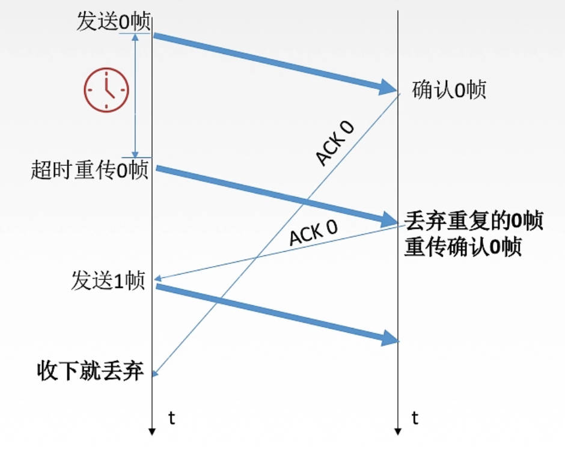

- **发送方：** 等不到`ACK`就超时重传；等待到了延迟的`ACK`，与当前的帧编号对比，不一样就丢弃。
- **发送方：** 「帧重复」，丢到原来的帧，重新发送`ACK`

### 后退N帧

<span style="font-size:24px;font-weight:bold" class="section2">1. 无差错</span>

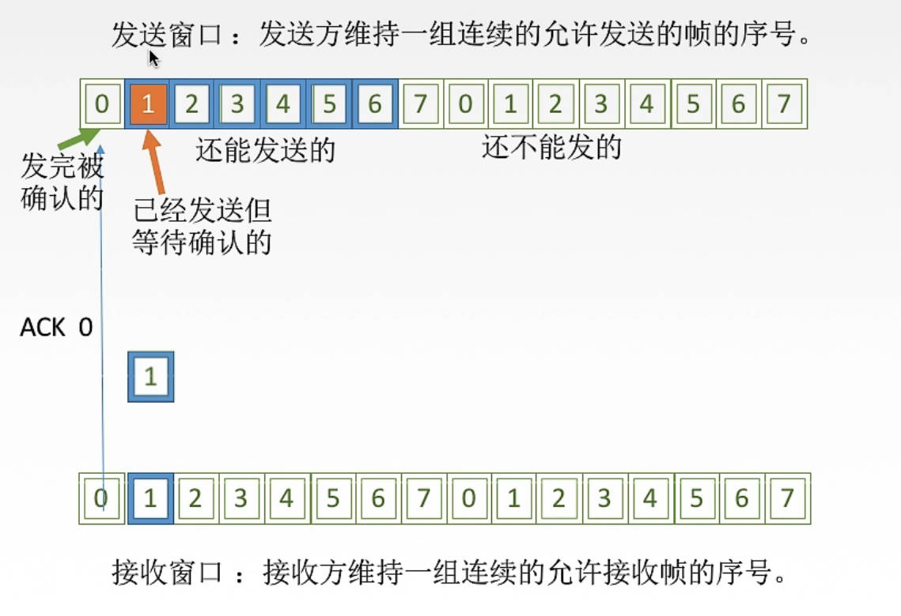


1. 发送出去的「帧」会被备份，例如黄色框
2. 发送方发送完一个「帧」后，可以接着发送「滑动窗口」中下一个「帧」
3. 接收方，接收成功一个「帧」后，滑动窗口右移，并返回确认信号`ACK`
4. 发送方的「滑动窗口」最左侧「帧」接收到了对应的`ACK`，「滑动窗口」向右移动

> [!note|style:flat]
> - 「网络层」让「链路层」发送数据报时，会检查「滑动窗口」是否装满，若装满则等待或者将数据报放入对应的等待缓冲区
> - **累计确认：** `ACK num` 确认的是 `num` 之前的所有「帧」接收方都正常接收了，例如 `ACK 2`，表示 `0,1,2` 帧都已经正常接收了


<span style="font-size:24px;font-weight:bold" class="section2">2. 出错</span>

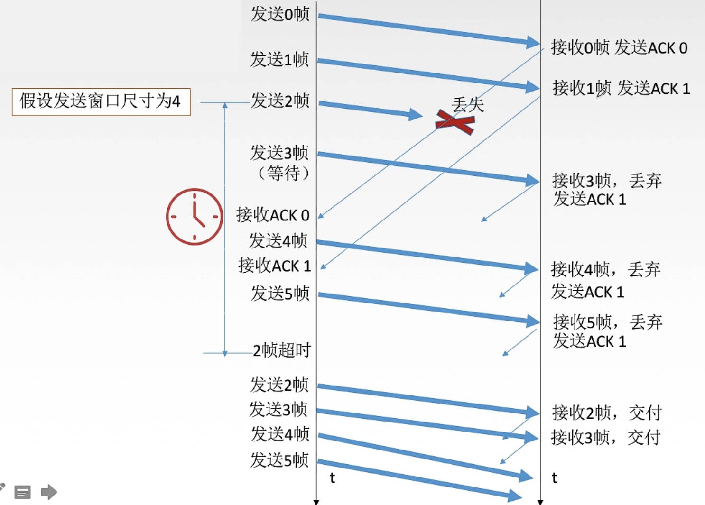


- **超时重传：** 当发生超时事件时，发送方会重新发送所有已发送但是却未被确认的帧
- **expectedseqnum：** 「接收方」标记当前「滑动窗口」要接收的「帧」的编号。<span style="color:red;font-weight:bold"> 当前接收的「帧」编号与`expectedseqnum` 不一样时，将该「帧」丢弃，并发送`ACK expectedseqnum - 1`</span>

- 重复`ACK`：是已经发送过的「帧」的`ACK`，直接忽略


<span style="font-size:24px;font-weight:bold" class="section2">3. 滑动窗口长度</span>


若用`n`位来表示「帧」的编号，发送方滑动窗口的大小 $w_s$ 就为： 

```math
1 \le w_s \le 2^n - 1 
```
### 选择重传

<span style="font-size:24px;font-weight:bold" class="section2">1. 无差错</span>

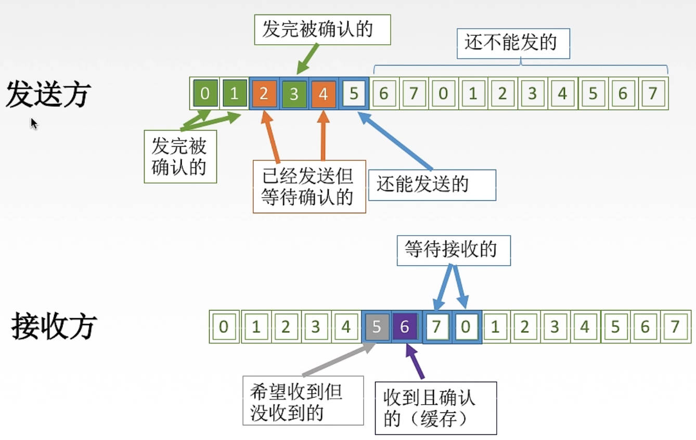

- **接收方：** 接收端的「滑动窗口」个数增加，当最左边「帧」接收成功后，才向右方滑动
- **`ACK`确认：** 确认信号只确认对应「帧」接收成功，不在是累计确认


 <span style="font-size:24px;font-weight:bold" class="section2">2. 出错</span>


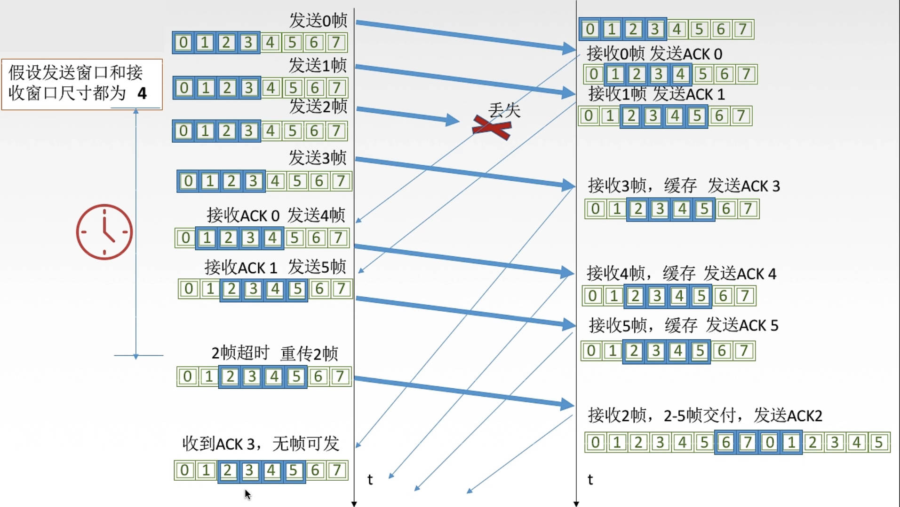


- **接收方：** 接收到已经接收到的「帧」时，返回该帧的`ACK`，其他情况则丢弃帧

- **超时重传：** 每一个「帧」超时后，只重传当前「帧」


<span style="font-size:24px;font-weight:bold" class="section2">3. 滑动窗口长度</span>


若用`n`位来表示「帧」的编号，发送方滑动窗口的大小 $w_s$ 和 接收方滑动窗口大小 $w_a$ 就为： 

```math
w_s = w_a = \frac{2^n}{2}
```
# 介质访问控制

## 基本概念

**介质访问控制：** 采取一定措施，使得两个结点之间的「物理通信」不会相互干扰。 

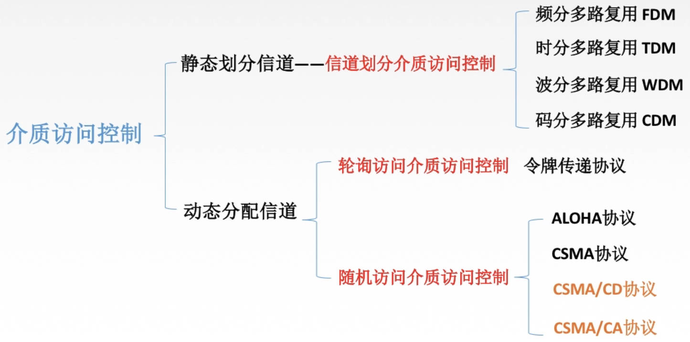


## 信道划分访问控制

### 多路复用


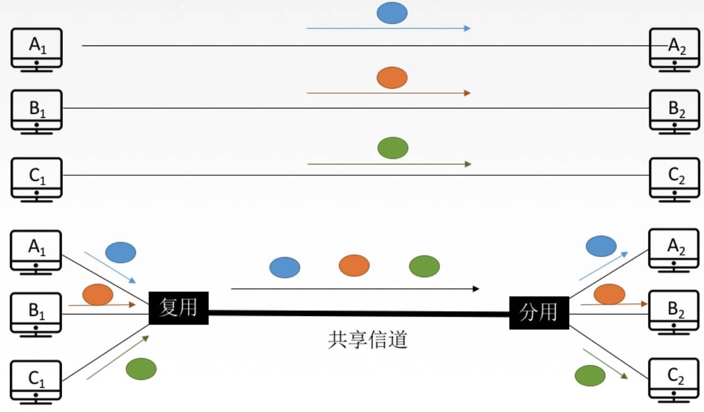

- **多路复用：** 把多组信号进行组合，在同一条「链路」上进行信号传输，即共享信道。结果上就是将「广播信道」在逻辑上修改为「点对点信道」。

- **站点：** 信道两端的设备，包括终端、路由器等。

### 频分多路复用FDM

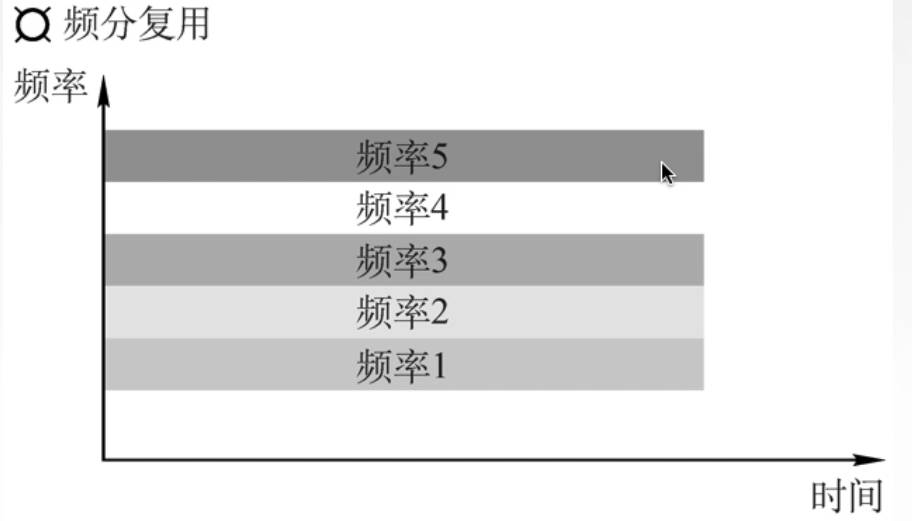

- **思路：** 信道上的每个用户占用不同的频率带宽。 
- **特点：** 充分利用介质带宽，系统效率高，实现容易


### 时分多路复用TDM

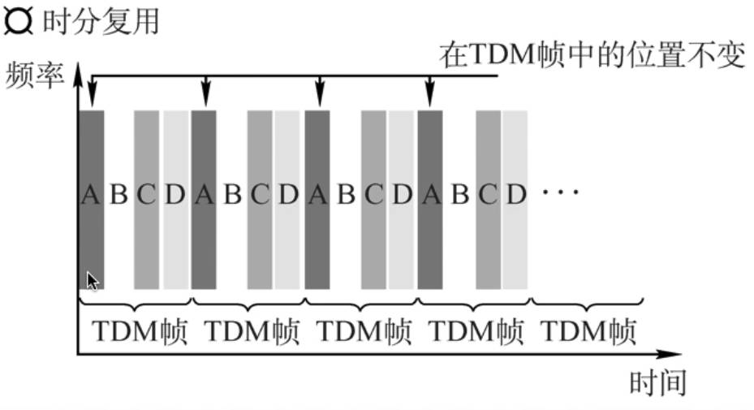


- **思路：** 每一个用户在一个「TDM帧」中占有一个「固定时间间隙」，用户只能在自己的时隙里使用信道。
- **TDM帧：** 物理层传输中的一个周期内的比特流
- **特点：** 每个用户的时间间隙是固定的；当用户没有使用时，其他用户也不能使用。


### 统计时分复用STDM

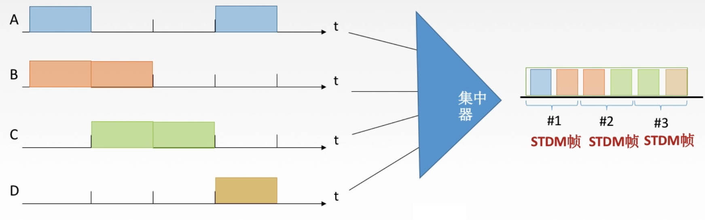


- **思路：** 为了克服TDM中，信道利用空闲的问题，利用「集中器」将用户的「传输时隙」整合起来，然后通过「STDM帧」进行发送。<span style="color:red;font-weight:bold"> 按需动态分配时隙 </span>
- **STDM帧：** 物理层传输中的一个周期内的比特流，且「时隙数」小于「用户数」 

### 波分多路复用WDM

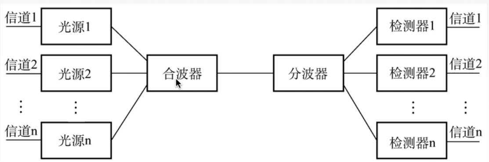

- **思路：** 类似「频分复用」，即光纤传输时，对光波范围的划分。

### 码分复用CDM


  $$
    \begin{aligned}
      A:& \\
      &1: +1 -1 -1 +1 +1 +1 +1 -1 \\
      &0: -1 +1 +1 -1 -1 -1 -1 +1 \\
      B:& \\
      &1: -1 +1 -1 +1 -1 +1 +1 +1 \\
      &0: +1 -1 +1 -1 +1 -1 -1 -1 
    \end{aligned} 
  $$

1. 多站点发送数据时，要求各个站点的芯片序列互相正交：两个比特的芯片序列每一位相乘，然后再累加，最后结果为`0`。例如A站点的`1`与B站点的`0`:

  $$
    \begin{aligned}
      A:& \\
      & +1 -1 -1 +1 +1 +1 +1 -1 \\
      B:& \\
      & +1 -1 +1 -1 +1 -1 -1 -1  \\
      multi :&\\
      & +1 +1 -1 -1 +1 -1 -1 +1 = 0
    \end{aligned}
  $$

2. 合并数据，将数据进行线性相加，例如合并发送A站点的`1`与B站点的`0`

  $$
    \begin{aligned}
      A:& \\
      & +1 -1 -1 +1 +1 +1 +1 -1 \\
      B:& \\
      & +1 -1 +1 -1 +1 -1 -1 -1  \\
      organize :&\\
      & +2,-2,0,0,+2,0,0,-2
    \end{aligned}
  $$

3. 分离数据，合并数据与原芯片序列进行规格化内积：每一对应位相乘，然后再累加，最后除以位数`m`，例如从上述的合并数据中，拆分出`A`站点发送的数据。

  $$
    \begin{aligned}
      organize :&\\
      & +2,-2,0,0,+2,0,0,-2 \\
      A:& \\
      & +1 -1 -1 +1 +1 +1 +1 -1 \\
      dot:& \\
      &2+2+2+2 = 8 \\
      divide \ m:& \\
      & \frac{8}{8} = 1
    \end{aligned}
  $$

## 随机访问

> [!tip]
> 每一个「站点」想发就发，没有限制。但是会导致信号的冲突。

### ALOHA协议

<span style="font-size:24px;font-weight:bold" class="section2">1. 纯ALOHA</span>

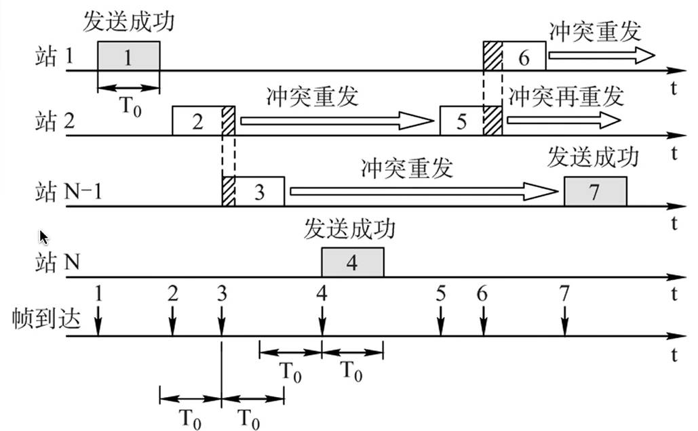

- **思想：** 不监听信道，不按照时间槽（时隙）发送，随机重发，想法就发。
- $T_0$：从「发送站点」发送第一个比特开始，到「接收站点」接收到最后一个比特结束，所使用的时间。**ALOHA假定 $T_0$ 为定值。**

- **冲突：** 「接收站点」检测到「帧差错」，就不理会或者返回`NCK`，触发「发送端」的「超时重传」，直到发送成功为止。


<span style="font-size:24px;font-weight:bold" class="section2">2. 时隙ALOHA</span>

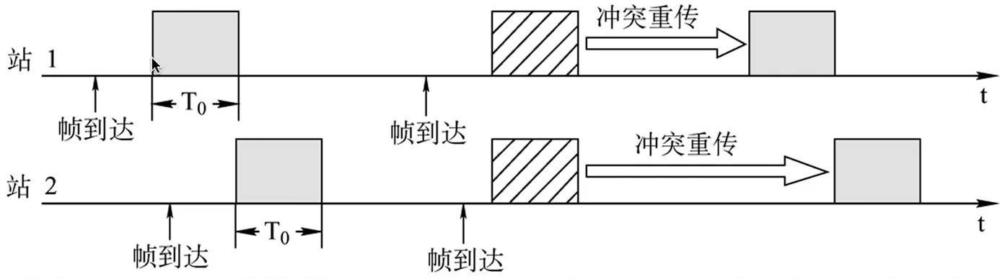

**思想：** 把时间拆分为若干的「时间片」，每次数据发送只能在「时间片」的开始；当发生冲突时，「发送站点」只能在下一个「时间片」的开始进行「重发」。


### CSMA协议

<span style="font-size:24px;font-weight:bold" class="section2">1. 基础概念</span>

- **CS：** 载波监听，发送数据之前，检测总线上是否有其他站点在发送数据：检测总线上的信号的「电压摆动值」，当「电压摆动值」超过一定阈值，表示总线上发生了碰撞。
- **MA：** 多点接入，许多计算机连接在一根总线上。
- **CSMA协议：** 发送数据前，查看信道状况
  - **空闲：** 发送数据帧
  - **忙碌：** 延迟发送

> [!note|style:flat]
> 载波监听只能监听信号进入站点的「电压摆动」，还在信道上传播的信号检测不到。

<span style="font-size:24px;font-weight:bold" class="section2">2. 1-检查CSMA</span>

- **思路：** 信道忙碌，则一直监听，直到信道空闲；信道空闲，马上发送数据。
- **冲突：** 一段时间内没有接收到`ACK`，则等待随机长的时间再监听信道，重复上述步骤。
- **特点：** 信道空闲就发送数据；当两个及以上的站点发送数据，冲突就不可避免。 


<span style="font-size:24px;font-weight:bold" class="section2">2. 非坚持CSMA</span>

- **思路：** 信道忙碌，随机等待一个时间后再监听，直到信道空闲；信道空闲，马上发送数据。

- **特点：** 冲突产生的可能性减少；大家可能都在等待。

<span style="font-size:24px;font-weight:bold" class="section2">3. P-坚持CSMA</span>


- **思路：** 将时间划分时间槽；信道忙碌，等待到下一个时间片再监听，直到信道空闲；信道空闲，根据概率P发送数据，若不能发送就等待一个时间槽。

- **特点：** 冲突产生的可能性减少；减少信道空闲时间；冲突发生，会坚持将数据帧发送完毕。

<span style="font-size:24px;font-weight:bold" class="section2">4. 总结</span>

<center>

| 信道状态 | 1-坚持CSMA | 非坚持CSMA             | P-坚持CSMA            |
| -------- | ---------- | ---------------------- | --------------------- |
| 空闲     | 马上发送   | 马上发送               | 根据概率P判断是否发送 |
| 忙碌     | 继续监听   | 随机等待一个时间再监听 | 下一个时间片再监听    |


</center>


### CSMA/CD协议

<span style="font-size:24px;font-weight:bold" class="section2">1. 基础概念</span>

- **CS：** 载波监听，站点在**发送数据之前**与**在发送数据时**，会对信道状态进行监听。
- **CD：** `collision detection`，<span style="color:red;font-weight:bold"> 边发送数据边检测冲突 </span>，当在发送数据时，产生冲突，就马上叫停数据发送。<span style="color:red;font-weight:bold"> 适用于半双工网络，不允许同时存在两个信源</span>
- **MA：** 多点接入，总线型网络

<span style="font-size:24px;font-weight:bold" class="section2">2. 信号碰撞</span>


- **原因：** 信号在信道上传播是存在传播时延的，这会导致「载波监听」的误判：**载波监听只能监听信号进入站点的「电压摆动」，还在信道上传播的信号检测不到。**

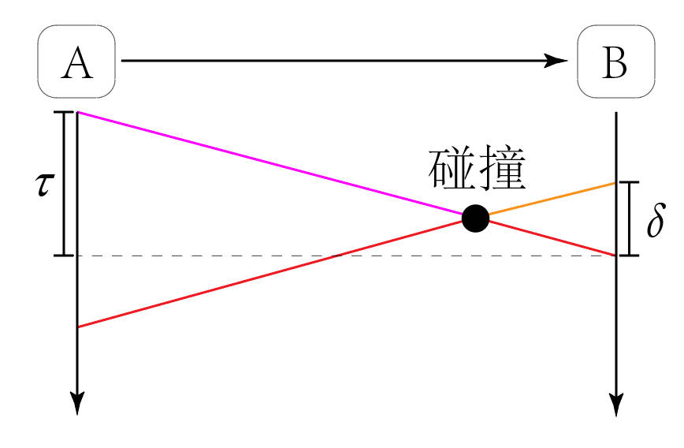

- **碰撞：** 两个信号波形叠加，导致信号出错。
  - $\tau$ ：单程的传播时延
  - $\delta$ : B端检测到碰撞的时间
  - $2\tau - \delta$: A端检测到碰撞的时间

- **最迟多久知道自己发送的数据没有发生「碰撞」：** $2\tau$，只要经过 $2\tau$ 没有检测到「碰撞」，就认为本次发送的数据没有发生碰撞。


<span style="font-size:24px;font-weight:bold" class="section2">3. 截断二进制指数规避算法</span>


1. 定义重传次数为`k`：$k = \min(10,重传次数)$
2. 基本延迟时间的倍数`r`：$r=\{x|0,1,\dotsm,2^k-1 \}$
3. 延迟时间：$r * 2\tau$
4. 当重传次数达到`16`次，就说明这个数据发送不出去，网络拥堵。


<span style="font-size:24px;font-weight:bold" class="section2">4. 最小帧长</span>

> [!note|style:flat]
> 当发送的「帧」太短时，发送端很快就发送完了，而信号在传输的过程中发生「碰撞」，这就导致发送端的「载波监听」失效，无法马上检测出「碰撞」，导致CSMA/CD失效。因此需要对「帧」长度进行限制。

**最小帧长：** 帧的「传输时延」要大于两倍的总线「传输时延」。确保在发送数据的过程中，「发送端」都能对数据是否发生碰撞进行检测。

```math
 \frac{帧长}{数据传输速率} \ge 2 \tau
```
### CSMA/CA协议

- **CA：** `collision avoidance`，避免碰撞。
- **原因：** CSMA/CD协议是适用于「有线网络」的，对于「无线局域网」不再适用。
  - 无线网络，信号接收范围广，并非只用监听一条网线
  - **隐蔽站**：当`A`与`C`都检测不到信号，都认为信道空闲，均给`B`发送信号，这就导致信号冲突，`C`站点对于`A`站点而言，就是隐蔽站。

- **工作原理：**
      - 空闲：发送`RTS (request to send)`信号，包括发射端地址、接收端地址、数据将持续发多久
      - 繁忙：等待
  1. 接收端收到`RTS`，将返回响应信息`CTS (clear to send)`，同意站点发送数据
  2. 发送端接收到`CTS`后，开始发送「数据帧」，同时通知其他站点，自己要发多久的数据
  3. 接收端接收「数据帧」后，会返回`ACK`进行确认
  4. 发送端没有收到`ACK`则，采用「二进制指数退避算法」进行数据帧重传。


## 轮询访问


### 轮询协议

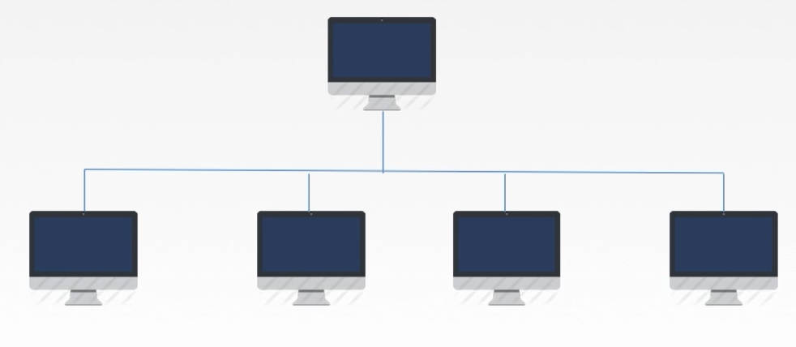

- **思路：** 「主节点」负责数据的发送，并由「主结点」循环邀请「从属结点」进行数据发送
- **特点：** 一次只有一台主机发送数据，无冲突，信道带宽沾满；轮询有开销；存在延迟；单点故障，主机完蛋，从属无法发送。

### 令牌传递协议

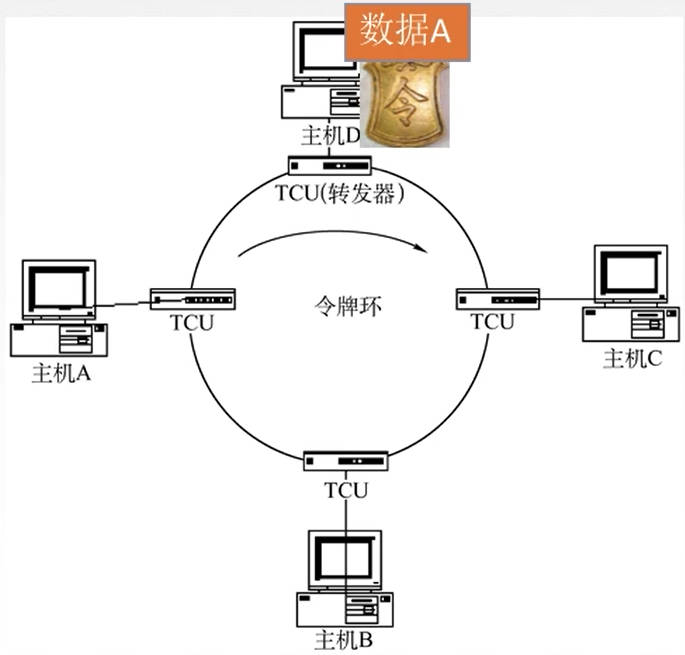


- **令牌：** 一个特殊格式的`MAC`控制帧。用于控制信号，确保同一时刻只有一个站点独占信道。 
- **原理：** 令牌绑定数据，然后在「端点」上循环转发；接收站点，复制数据；非接收站点，无视；令牌转回「发送站点」时，发送站会对数据与原始数据进行对比，检测数据在传输过程中是否出错；最后，将空闲令牌丢个下一个站点。

- **特点：** 令牌开销；等待延迟；单点故障。


# 局域网

## 局域网概念

- **局域网（Local Area Network）：** 在某一区域内由多台计算机互联成的计算机组，使用 「广播信道」。
- **特点：**
  1. 传输速率： 10 Mb/s ~ 10 Gb/s
  2. 误码率低，延迟短
  3. 共享传输信道
- **网络拓扑**
  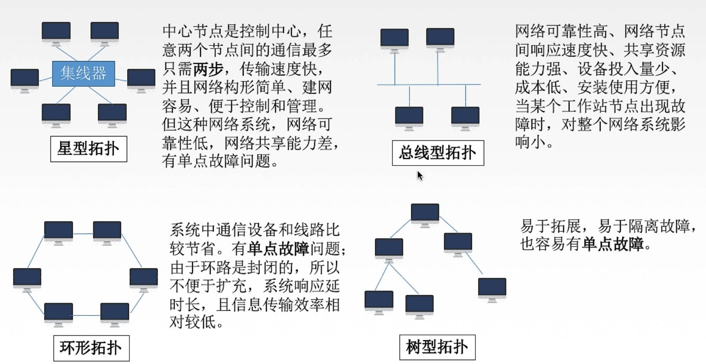

- **分类**
  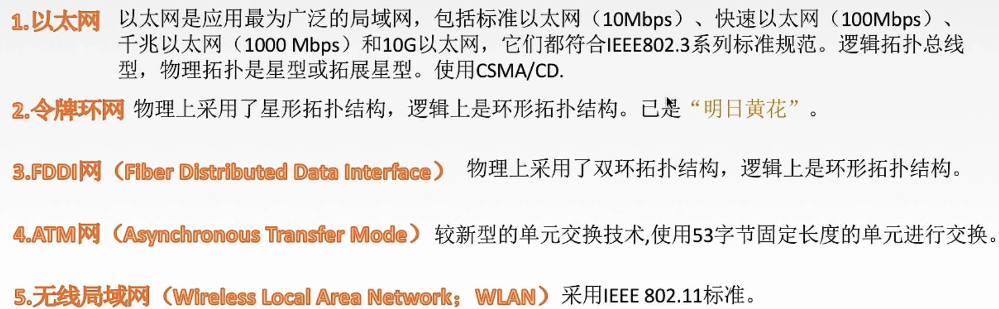

- **IEEE 802 协议** ：局域网、城域网的技术标准，规定了令牌环网、以太网、wifi等网络的协议标准。该协议描述的「局域网」模型对应OSI参考模型的「数据链路层」与「物理层」，并将「数据链路层」划分为「逻辑链路层LLC」与「介质访问控制MAC」

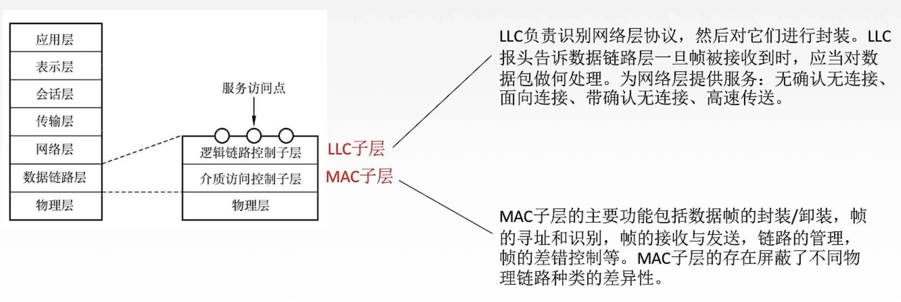

## 以太网

- **以太网（Ethernet）：** 基带总线局域网规范，介质控制采用 `CSMA/CD`，造价便宜。
- **以太网标准：** DIX Ethernet V2，IEEE 802.3

- **特点：**
  1. 不可靠：不管帧编号；差错帧直接丢弃；只保证接收到的帧没有位错。

- **拓扑结构：** 逻辑上「总线型」，物理上「星型」

- **10BASE-T以太网**：`BASE`，传输基带信号；`T`，双绞线；`10`，传输速率为 10Mb/s；编码方式为「曼彻斯特编码」；介质访问控制为 CSMA/CD

- **适配器：** 计算机与外界局域网连接的通信适配器。即网卡。
- **MAC地址：** 在局域网中，「适配器」的唯一物理地址，即「适配器」的身份证号。由`48`位二进制构成，前`24`位为厂家编号，后`24`位由厂商自己规定。
- **以太网MAC帧：**
  - **前导码：** 不属于「MAC帧」，只是用于「物理层」比特流的「时钟同步」。
  - **源地址：** 发送端的「MAC地址」
  - **目的地址：** 接收端的「MAC地址」
  - **数据最短长度 46B ：** 由于以太网的规定的「最小帧长度」（CSMA/CD 需要限制最小长度）为 `64B`，即 `64 - 6 - 6 - 2 - 4 = 46`
  - **FCS：** CRC循环的冗余码
  - **帧定界：** 编码为「曼彻斯特编码」，所以采用「违规编码法」
  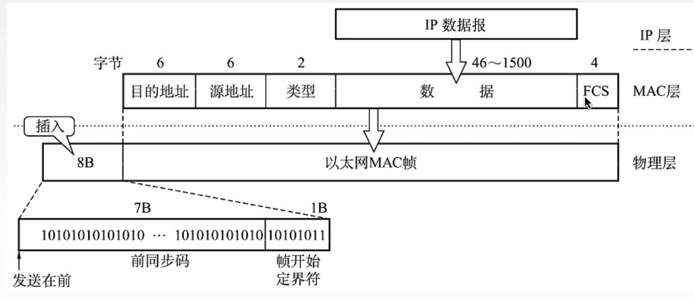


## 无线局域网

- **IEEE 802 无线局域网：** 通用标准为 `IEEE 802.11`，其中`IEEE 802.11b`与`IEEE 802.11g`为`WIFI`。
- **无线接入点（AP）：** 接收与发送无线信号的基站。「终端」收发数据，均通过「基站」进行转发。
- **MAC帧头：**
  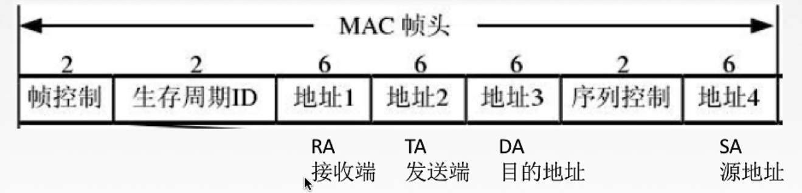
  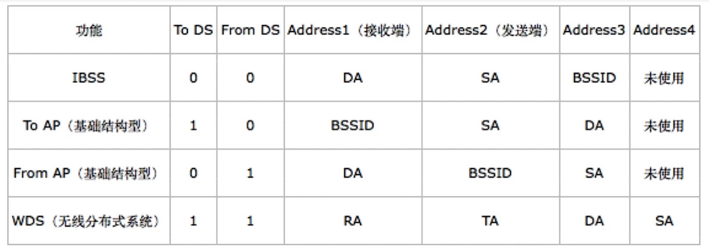

- **固定基础设施无线局域网：**

  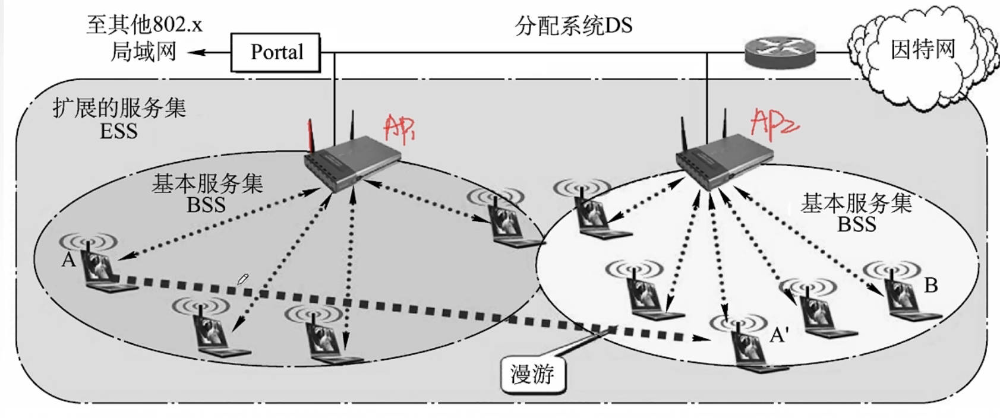

- **无固定基础设施无线局域网：** 没有基站、路由器、集线器等；各个站点自主收发信号。
  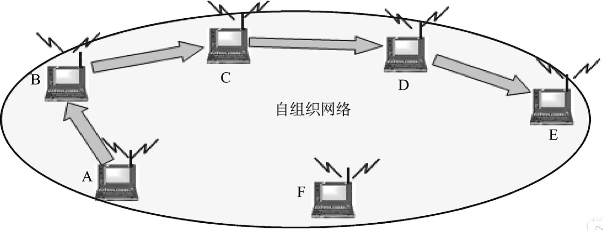

# 广域网

## 基本概念

<center>


| 网络类型 | 层级                   | 关注点     | 传播方式 |
| -------- | ---------------------- | ---------- | -------- |
| 广域网   | 物理层、链路层、网络层 | 资源的共享 | 点-点    |
| 局域网   | 物理层、链路层         | 传输速度   | 广播     |

</center>

- **广域网：** 跨度很大的物理范围，主要采用「分组交换」的技术，将不同地区的「局域网」连接起来，实现「资源共享」，例如因特网（Internet）。
  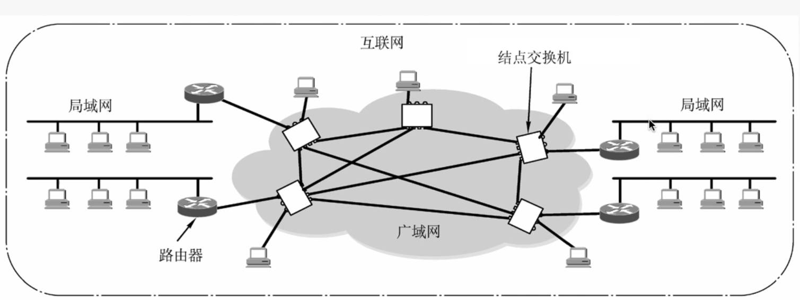

## PPP协议

- **定义：** 点对点协议，用于「广域网」的「链路层」协议。

- **要点：** **无流量控制、无帧序号、不支持多点线路（只能一端到另一端）**
  

- **PPP协议工作原理：**
  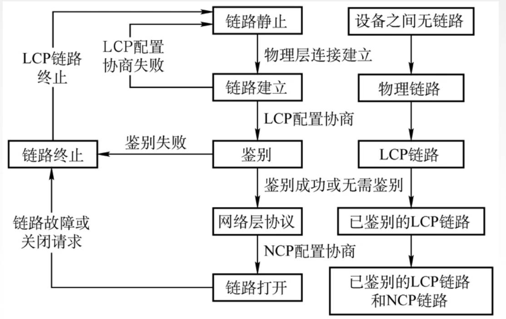

- **PPP协议帧：**

  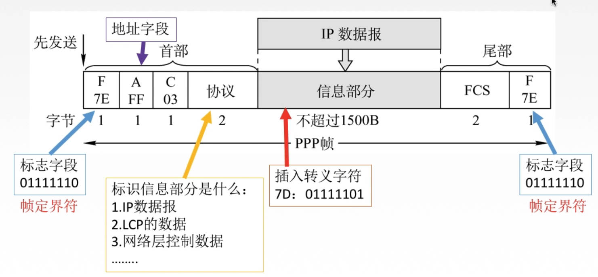


# 链路层设备

## 扩展以太网

- **光纤：** 扩大以太网传输距离
  

- **叠加集线器：**
  - **冲突域：** 在这个区域中，同时只能有一台主机发送数据
  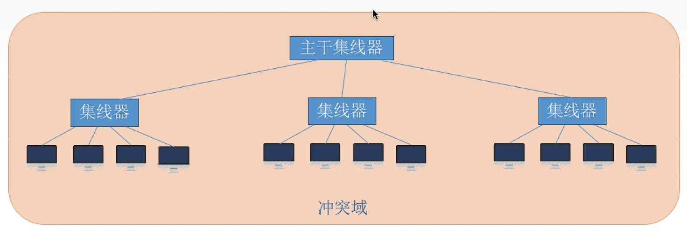

- **网桥：** 通过「网桥」将多个「冲突域」连接起来。<span style="color:red;font-weight:bold"> 「集线器」会扩大冲突域，「网桥」则可以限制冲突域 </span>
  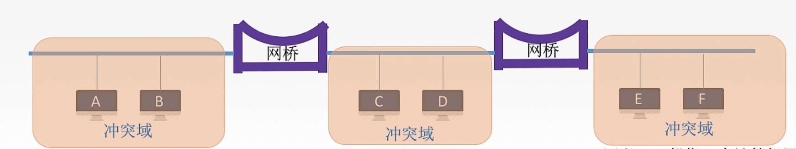


## 网桥/交换机

### 基本概念

- **网段：** 能够直接通过「物理层设备」I（例如集线器、传输介质、中继器等）进行数据通信的计算机网络，例如「网桥」隔离出来的各个「冲突域」
- **网桥：** 根据`MAC`帧的「目的地址」对「帧」的转发进行过滤。当「帧」传播到「网桥」时，「网桥」会决定要不要把这个「帧」转发到其他的「冲突域」。

- **交换机：** 多接口的「网桥」。

- **冲突域：** 在这个区域中，同时只能有一台主机发送数据。每一个站点都是收到同一「冲突域」中的其他站点的「广播帧」。
- **广播域：** 「广播帧」能够发送的最大范围。

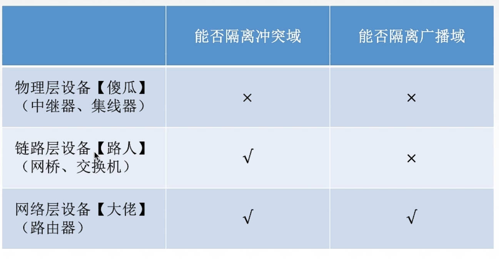

### 透明网桥

- **定义：** 以太网上的站点，并不知到所发的帧会通过哪些网桥，「网桥」对于「站点」不可见。

  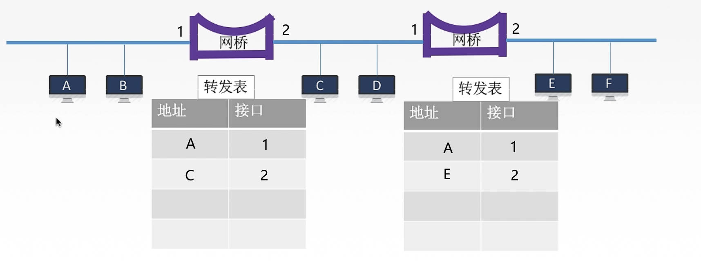

- **工作原理：**
       - 地址：站点的「MAC地址」
       - 接口：「网桥」接线口的编号
  1. 更新「转发表」：网桥会在转发表中记录站点是连接在网桥的哪个接口上。例如当`A`给`E`发送帧时，首先`A`将MAC帧进行广播，第一个网桥接收到帧；接着，网桥查询转发表没有记录`A`与`E`的地址，记录下`A`的地址与接口`1`，并将帧继续转发出去；第二个网桥同理更新转发表；最后，帧传递给`E`。
  2. 停止「帧」转发：当网桥从转发表中查询到MAC帧中信宿具体位置时，就会选择转性的转发帧。例如`F`给`E`发送帧，首先`F`广播MAC帧；然后网桥在转发表中找到`E`就在网桥右边的冲突域内，所以停止将帧发送到下一个冲突域中。
  3. 「转发表」刷新：在一段时间后，「网桥」会将自己的「转发表」清空，然后重新学习「站点」的位置。

### 源路由网桥

- **思路：** 「源站」会发送一个「发现帧」，进行探路。当「目的站」接收到「发现帧」时，就会将路由信息进行返回，重新发送给「源站」，这样「源站」就能从所有的路径中选择出一条适合自己发送要求的路线。
