# 基本概念

- **传输层：** 为进程提供通信服务，实现应用层数据的复用与网络层数据的分用
  - **复用：** 所有应用层的进程共用同一套传输层结构
  - **分用：** 将网络层上交的报文段，分发给各个进程

- **端口号：** 标记主机中的进程，长度为`16 bit`
    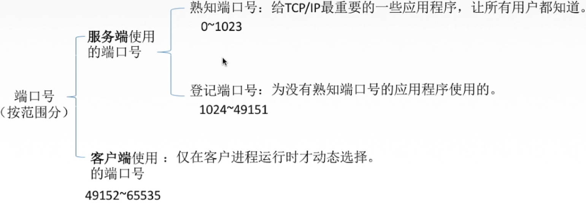
    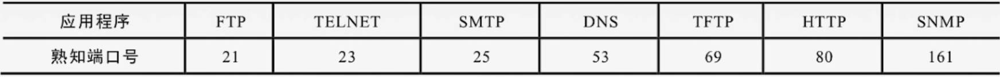

- **套接字：** 由「IP地址」与「端口号」组成，唯一标识一台主机中的一个进程。

# UDP协议

- **特点：** 
  1. 强调数据传输，不保证数据可靠
  2. 面向报文传输： 报文不拆分  ，直接封装成一个IP数据报，因此用于报文长度小的通信
  3. 无拥塞控制，适用于实时应用，强调延迟低

- **报文段：**
  - **UDP长度：** 首部字段与数据字段的长度
  - **UPD校验和：** 检验UPD报文段是否出错
  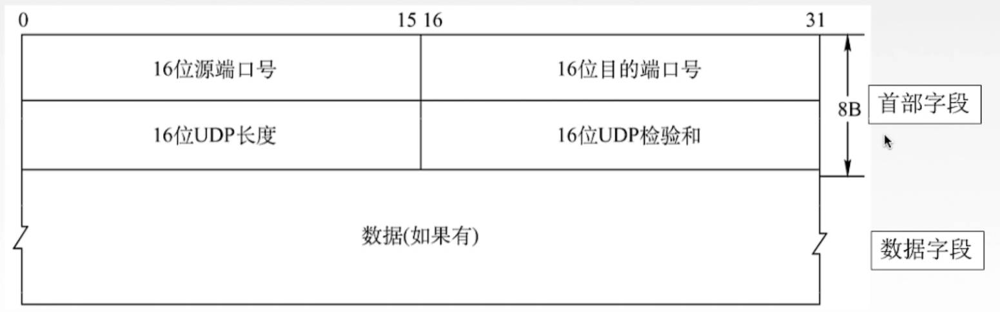

- **UDP检验和：** 

        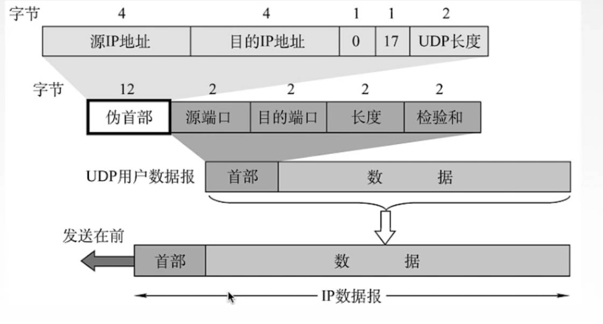

    1. 伪首部、首部、数据三个部分调整为`4B`的倍数，然后进行`16 Bit`的二进制反码求和运算

        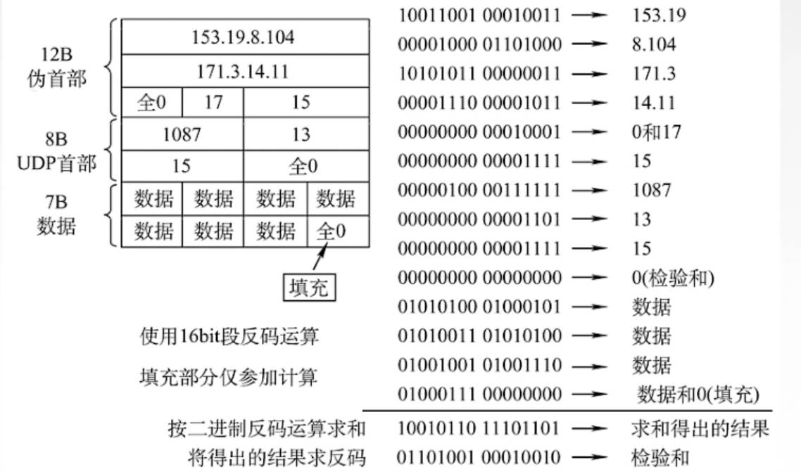

    2. 将计算结果取反，填入`16 bit`的UPD检验和
    3. 在接收端再加入伪首部，然后进行`16 Bit`的二进制反码求和运算。若结果为`FF FF`，则认为报文段无差错

# TCP协议

## TCP格式

- **特点：**
    1. 只能用于「点对点」传输
    2. 可靠有序
    3. 全双工通信
    4. 基本单位为「字节」

- **TCP报文段：** 首部长度为`4B`的整数倍

    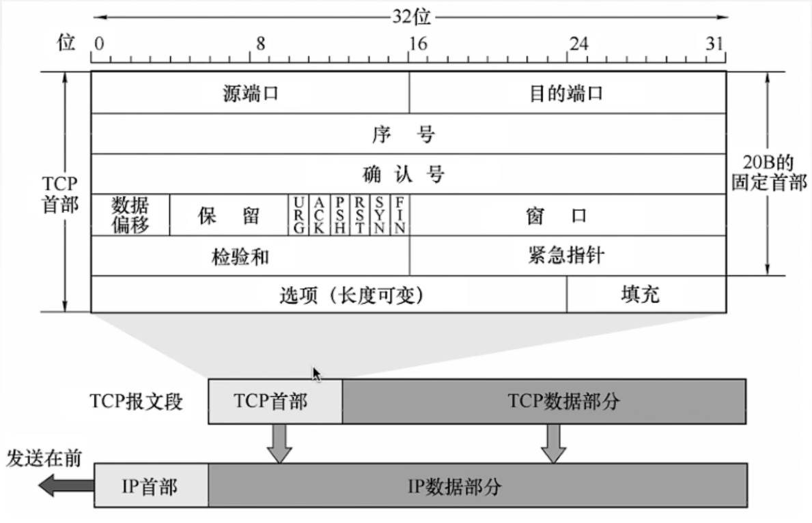

  - **序号（seq）**：该报文段第一个字节在报文中的位置
  - **确认号（ack）**：紧挨着该报文段的字节在报文中的位置，即该报文段的最后一个字节的编号为，确认号 - 1。
    - **累计确认**，确认号之前的所有字节均已收到；
    - **期望字节**，下一次期望接收的报文段起始字节号为 确认号
  - **偏移数据**：TCP首部的长度，单位为`4B`
  - **控制位**：数据传输的标记位
    - **URG**：紧急位，该报文段优先发送出去
    - **PSH**：推送位，该报文段优先提交给应用层
    - **ACK**：确认位，确认报文段有效，连接建立后ACK均为`1`
    - **SYN**：同步位，该报文为连接请求报文
    - **FIN**：终止位，此报文发送方要终止连接
    - **RST**：复位，连接出问题，需要重新连接
  - **窗口（rwnd）**：允许的接收窗口大小，单位字节，用于流量控制
  - **校验和**：校验首部+数据
  - **紧急指针**：需要紧急发送的数据部分的长度，从第一个数据字节开始

## TCP连接

### 创建连接

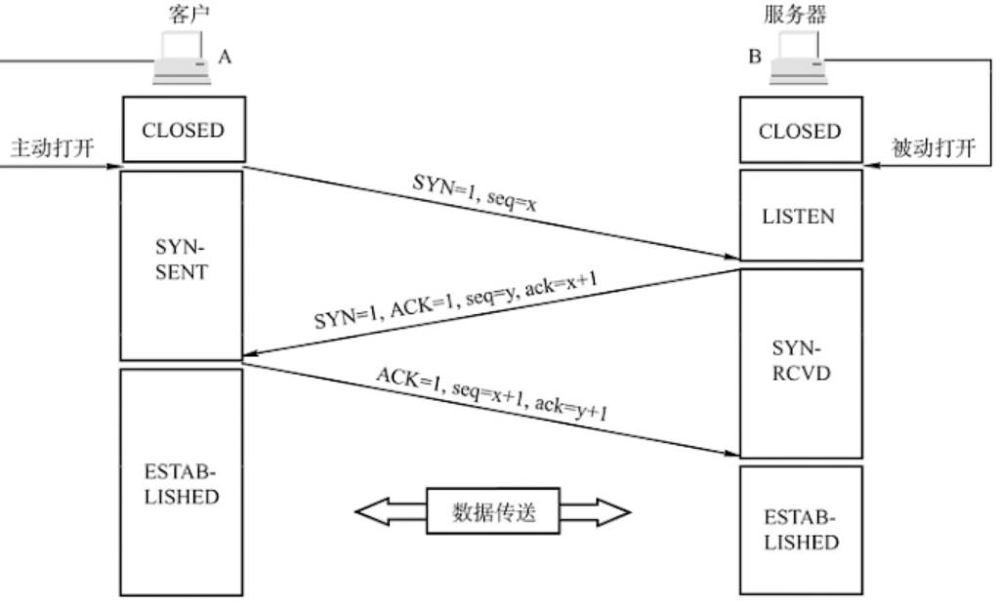

1. 服务器分配TCP缓存，并返回确认报文段并请求连接：SYN = 1，ACK = 1，seq = y，ack = x + 1。y随机给定。x+1，确认收到的内容，并给出期望再接收的内容
2. 确认服务器的请求连接，并可以携带数据：SYN = 0，ACK = 1，seq = x + 1，ack = y + 1

> [!tip]
> **SYN洪泛攻击**：由于服务器在接收到客户端的连接请求后，会分配TCP缓存，这样只要使劲给服务器发送连接请求，就会导致服务器内存紧张，进而瘫痪

### 释放连接

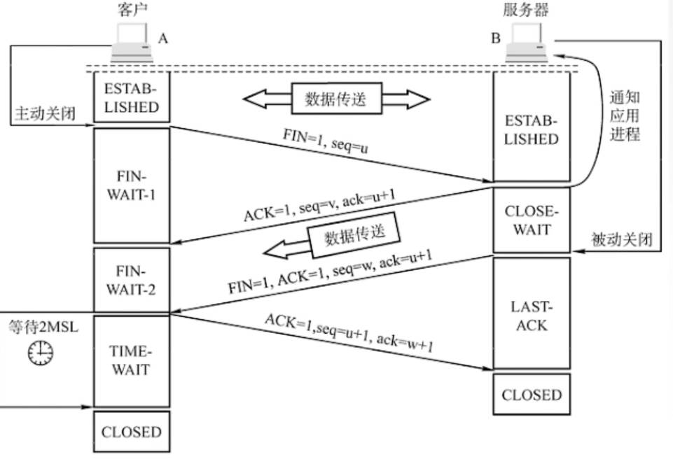

3. 客户端发送释放连接报文段，停止发送数据：FIN = 1，seq = u
4. 服务器确认释放请求：ACK = 1，seq = v，ack = u + 1
5. 服务器器发送完剩余的数据后，请求释放连接：FIN = 1，ACK = 1，seq = w，ack = u + 1
6. 客户端确认服务器的释放连接请求：ACK = 1，seq = u + 1，ack = w + 1
7. 服务器收到确认后，关闭TCP连接；客户端等待`2MSL`的时间，等待服务器关闭后，关闭TCP连接。

## TCP可靠传输

- **可靠传输：** 保证接收端接收的字节流与发送方发送的字节流一致
- **步骤：**
  1. 序号：根据「序号字段（seq）」来同步数据的顺序
  2. 确认：接收方通过「确认号（ack）」进行报文段的累计确认
  3. 重传：发送方在规定时间内没有接收到对应报文段的ACK信号，就重新发送该报文段
     - **重传时间：** 保存已经传输过的报文段的RTT，然后对这些RTT进行加权平均，得到的结果 RTTs，就是当前的重传时间

- **冗余ACK**：每当比期望序号大的失序报文段到达时，接收端就发送一个冗余ACK，指明缺失的报文段。
  - 例如，发送方已发送1，2，3，4，5报文段。
  
    接收方收到1号报文段，返回给1的确认（确认号为2的第一个字节）
    
    接收方收到3，仍返回给1的确认（确认号为2的第（一个字节）
    
    接收方收到4，仍返回给1的确认（确认号为2的第第一个字节）
    
    接收方收到5，仍返回给1的确认（确认号为2的第一个字节）

    **发送方，就会接收到三次1号报文段的ACK，这样发送方就会认为发送的2、3、4、5均已丢失，并将所有的报文段进行重新发送。**  该方式有效避免了，接收方没有接收到3、4、5时，还需等待 发送方发送的情况。

## TCP流量控制

- **流量控制：** 接收方来不及处理数据，希望「发送方」慢点发，是一对一的
- **思路：** TCP协议是利用「滑动窗口」机制，管理报文段的收发，这样只要控制住「发送方」的滑动窗口大小，就能对发送速率进行限制。 当接收端需要进行流量控制时，会通过「窗口字段（rwnd）」告诉发送方自己能提供多大的接收窗口，然后发送方就根据`rwnd`调整自己的发送窗口，一般发送窗口的大小与接收窗口的大小保持同步。 
    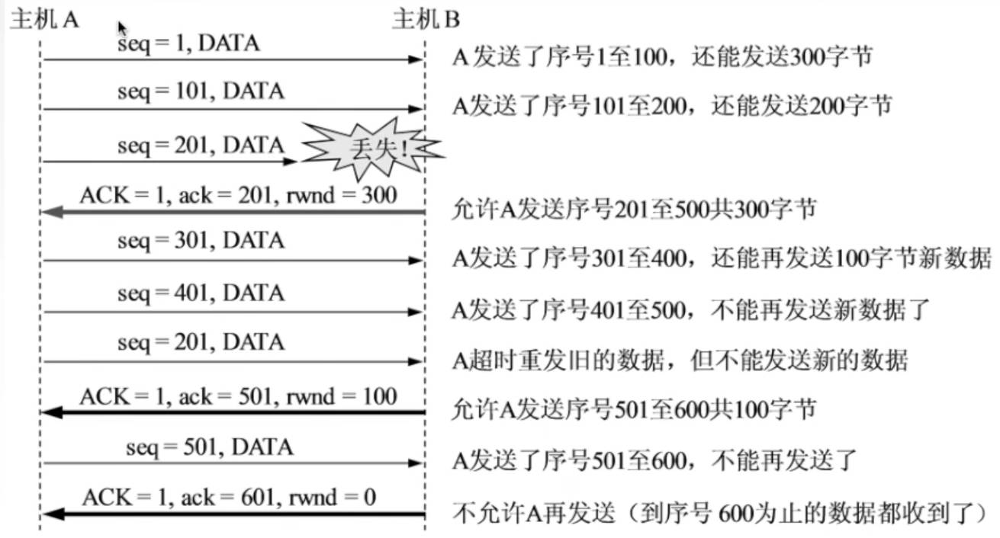

- **探测报文段：** 当发送方接收到一个`rwnd = 0`的报文段，就会停止发送，并启动一个计时器，当超时时，还未收到发送信号，即`rwnd > 0`，就会给接收端发送一个「探测报文段」，让发送端给出发送信号。

## TCP拥塞控制

- **拥塞：** 资源需求 > 可用资源，最终导致网络性能变差。
- **拥塞控制：** 防止过多的数据注入到网络中，是对所有结点而言的。
- **拥塞窗口（cwnd）：** 「发送方」估计网络的拥堵情况设置的「发送窗口值」
- **发送窗口：** 
  $$
  发送窗口值 = \min (rwnd,cwnd)
  $$

- **拥堵窗口的计算：**
  - **传输轮次：** 发送一次报文段，到接收ACK确认信号为一次 
  - **ssthresh值：** 门限值，cwnd 指数增长与线性增长的临界值。为造成网络拥堵的 cwnd 的一半

  - **慢开始与拥塞避免：**
      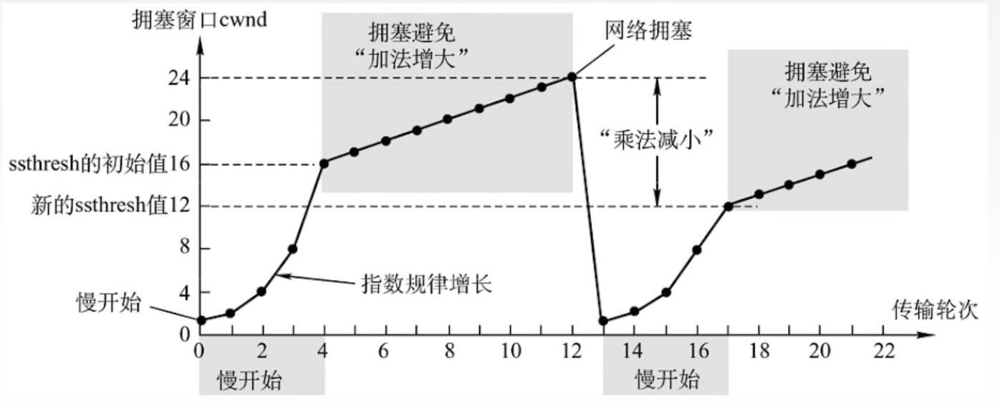

  - **快重传与快恢复：**
      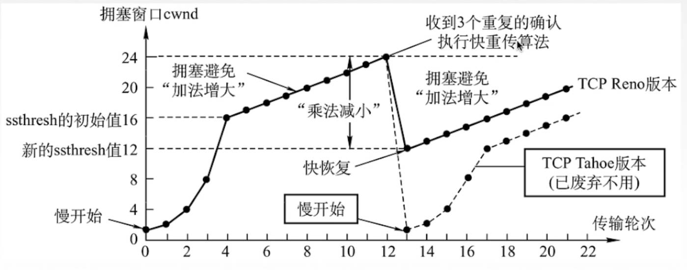
