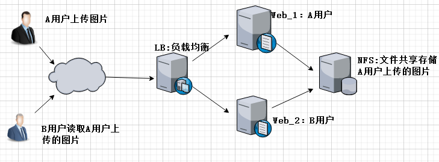
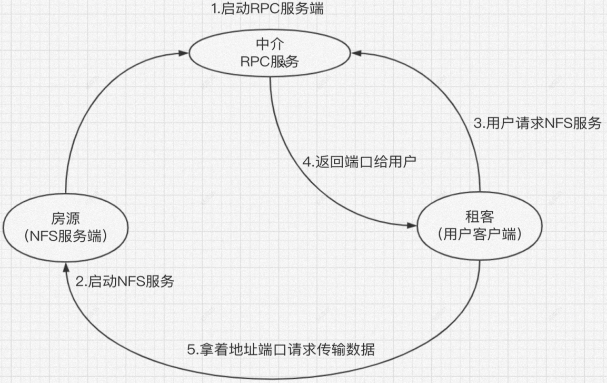

# 基本概念

NFS (Network File System)，网络文件系统，可以通过网络，让不同的机器、不同的操作系统可以共享彼此的文件，以文件夹挂载的方式实现。



在实际应用中，会存在多台服务器响应用户的请求。在每台服务器上存储数据是不合理的，因为当多个用户想访问同一数据时，就需要在每台服务器上都存储一份同样的数据。为了节约资源，就可以将数据全部集中到一台服务器上，服务器与数据服务器就可以采用 NFS 技术实现数据文件共享。



又由于 NFS 功能实现会涉及很多服务且端口号随机分配，这样对用户使用就是十分不方便。为了简化流程就在NFS服务与用户之间添加了一个 RPC 服务。RPC 服务的每个接口会记录好 NFS 对应功能的端口信息，用户想使用某个功能，就先去 RPC 服务查找对应的 NFS 服务信息，然后使用这些信息去访问 NFS 服务。这样 NFS 服务的操作流程相对于客户端而言就透明化，用户使用更方便。


# 配置

由于 NFS 采用的是 CS 模式，有服务端提供共享资源，因此需要在服务器上创建一个共享文件夹

```term
$ mkdir -p /ShareFolder
$ chmod 777 -R /ShareFolder 
```

修改配置文件
```term
$ vim /etc/exports
# 参数类型
# rw: 读写
# ro: 只读
# root_squssh: 客户端用 root 进行挂载时，会对 root 权限进行限制，映射为一个匿名用户
# no_root_squssh: 客户端用 root 进行挂载时，就会获得 root 权限
# all_squsshh: 客户端都映射为匿名用户
# sync: 同步将数据写入内存和磁盘
# async: 先保证写入内存，然后再写入磁盘
# NFS共享目录    NFS客户端地址（参数，参数，参数。。。）
# 地址
/ShareFolder   196.128.6.01(rw)
# 网关
/ShareFolder   196.128.6.0/24(rw)
$ systemctl restart nfs
```

# 挂载

```term
$ showmount -e ip # 查看服务器有哪些共享文件夹
$ cat /var/lib/nfs/etab # 查看配置参数设置情况 
```

客户端查看挂载情况

```term
$ mount -l # 查看系统挂载情况
$ mount -t nfs  ip:/ShareFolder  /mnt # 将服务器共享目录挂载到客户端的 /mnt 上
$ umount  /mnt # 清除挂载
```
