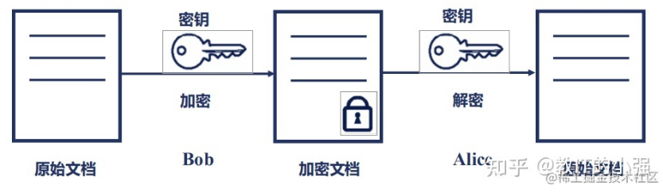
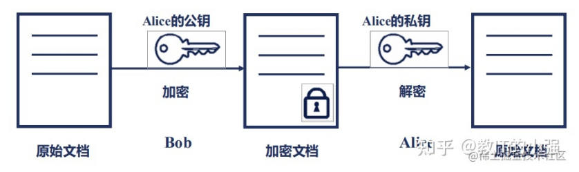
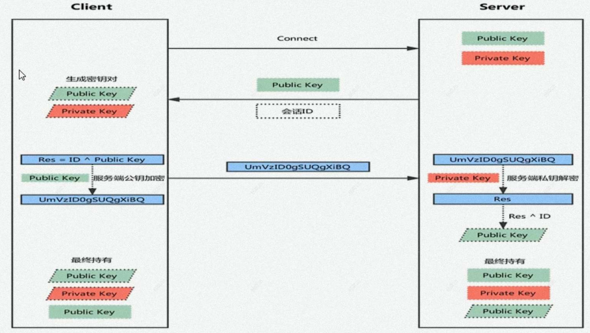
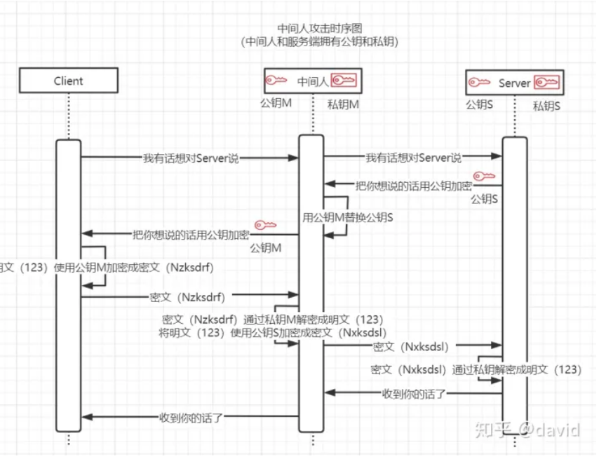
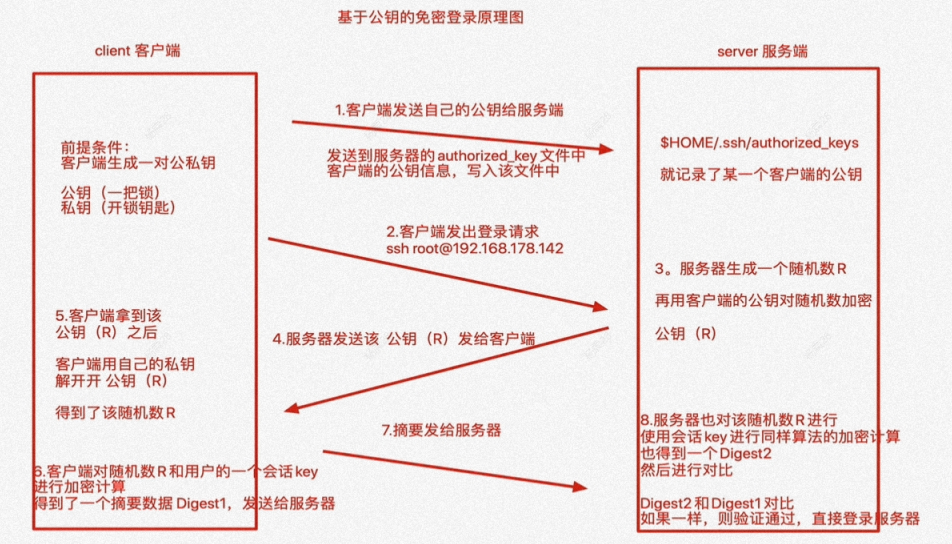

# 基本概念

## SSH 协议

**SSH** (Secure Shell) 是由 IETF (The Internet Engineering Task Force) 制定的建立在应用层基础上的安全网络协议，采用非对称加密方式，专为远程登录会话和其他网络服务提供安全性保障。SSH 会对传输的数据进行加密，并能防止DNS欺骗和IP欺骗。该协议的主流实现是 openssl 项目，并以 sshd 服务运行在 linux 系统上。


## 加密方式

- **对称加密**：数据的加密与解密，使用同一把钥匙进行



- **非对称加密**: 利用公钥与私钥实现数据的加密与解密



**简单的非对称加密会话：**



1. 服务器将收到请求，将服务器公钥发送给客户端
2. 客户端利用服务器公钥加密客户端公钥，并将消息发送给服务器
3. 服务器利用服务器器私钥解密服务器公钥，获得客户端公钥
4. 最终服务器与客户端都持有了各自的公钥，之后的通讯消息就使用对方的公钥进行加密

## 中间人攻击

非对称加密在第一次与服务器连接时，存在安全隐患，可能遭受「中间人攻击」。黑客充当中介，提供了一套第三方公钥与密钥，在服务器与客户端之间截取数据。



# SSH 使用

## 密钥文件

```term
$ cd ~ && ls .ssh/
Known-hosts authorized_keys id_rsa id_rsa.pub
```
- Known-hosts: 连接过的服务器公钥。在该文件中记录后，客户端就不再验证服务器
- authorized_keys: 服务器记录客户端的公钥信息。可用于免密登录
- id_rsa: 私钥文件
- id_rsa.pub: 公钥文件

## 登录

- 基于口令的服务器验证

```term
$ ssh psuser@196.124.1.250 -p2333 # 命令行登录
The authenticity of host '[196.124.1.250]:2333 ([196.124.1.250]:2333)' can't be established.
ECDSA key fingerprint is SHA256:dWXAdcs233TVTest1nFUCKxC0DvSSi04cguxT29KMark1c3.
Are you sure you want to continue connecting (yes/no/[fingerprint])?
```

使用命令行进行远程登陆，会返回 `ECDSA` 指纹信息，用户就需要去和服务器的指纹信息进行对比，确保通讯过程中没有中间人存在。

```term
$ ssh-keyscan -t ecdsa 196.124.1.250 # 查询服务器的指纹
# 196.124.1.250:2333 SSH-2.0-OpenSSH_7.4
196.124.1.250 ecdsa-sha2-nistp256 dWXAdcs233TVTest1nFUCKxC0DvSSi04cguxT29KMark1c3
```

- 基于公钥的验证



客户端生成密钥对，并将客户端公钥写入服务器的 `authorized_keys` 文件中。

```term
$ ssh-keygen -t rsa # -t 指定算法类型
Generating public/private rsa key pair.
Enter file in which to save the key (/home/triangle/.ssh/id_rsa):
Enter passphrase (empty for no passphrase):
Enter same passphrase again:
Your identification has been saved in /home/triangle/.ssh/id_rsa
Your public key has been saved in /home/triangle/.ssh/id_rsa.pub
The key fingerprint is:
SHA256:wPcwSgzl8CYAaadDmucmdT7GY2fcUCKAh913vNCCcU triangle@LEARN
The key's randomart image is:
+---[RSA 3072]----+
|++o=. o.= G      |
|.=.o.+ O o       |
|o.+++.O o        |
|..+o+ooB         |
|.  oO=+ S        |
|o . =.*+         |
| . o+=..         |
|                 |
|                 |
+----[SHA256]-----+
$ ssh-copy-id 196.124.1.250 -p2333 # 将公钥发给服务器，之后登录就不用密码了
```
## 配置文件

```term
$ cat /etc/ssh/sshd_config
# 监听本机的所有 IP 地址
ListenAddress 0.0.0.0
# 端口号
Port 22 
# 是否允许 root 账号登录 
PermitRootLogin no
# 是否允许密码登录
PasswordAuthentication no
$ systemctl restart sshd # 重启服务，让配置文件生效
```

# 文件拷贝

## scp

```term
$ scp user@host: src/  dest/ # 远程下载
$ scp src/  user@host: dest/ # 本地上传
```

常用选项

```bash
-r 拷贝文件夹
-p 保留文件权限信息
-P 指定端口号
```

>[!tip]
> scp 是直接全部拷贝，不会校验文件有没有修改，因此不会对没改变的文件进行过滤。

## rsync

```term
$ rsync user@host: src/  dest/ # 远程下载
$ rsync src/  user@host: dest/ # 本地上传，上传 src 文件夹下的内容
$ rsync src  user@host: dest/ # 本地上传，上传 src 与 src 文件夹下的内容
$ rsync src/  user@host:: dest/ # “:” 采用 ssh 协议，“::” 采用 rsync 的协议
```

常用选项

```bash
-v 显示过程
-r 递归拷贝
-p 保留文件权限信息
-L 软链接指向的文件也拷贝
-l 软链接文件拷贝
-u 目标路径的文件比源路径的文件新，就忽略同步
--delete 源路径删除的文件，目标路径也同步删除
```
