# I/O设备

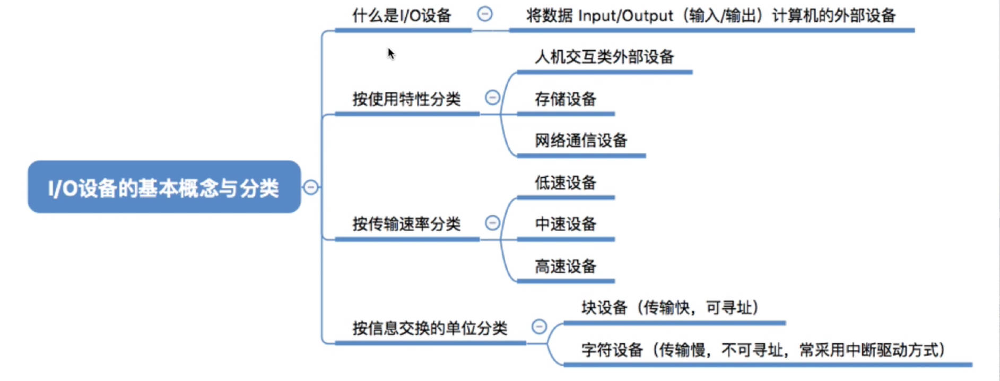

# I/O控制器

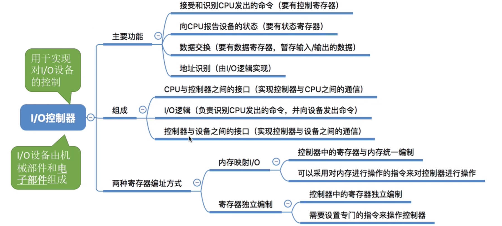

## 概念

- **概念：** I/O设备在物理结构分为：机械部件与电子部件。I/O控制器就属于电子部件，即电路板，其本质就是连接计算机与设备的中介。

## 功能

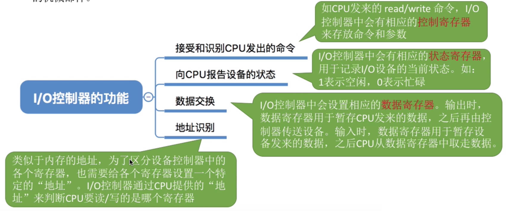

## 结构

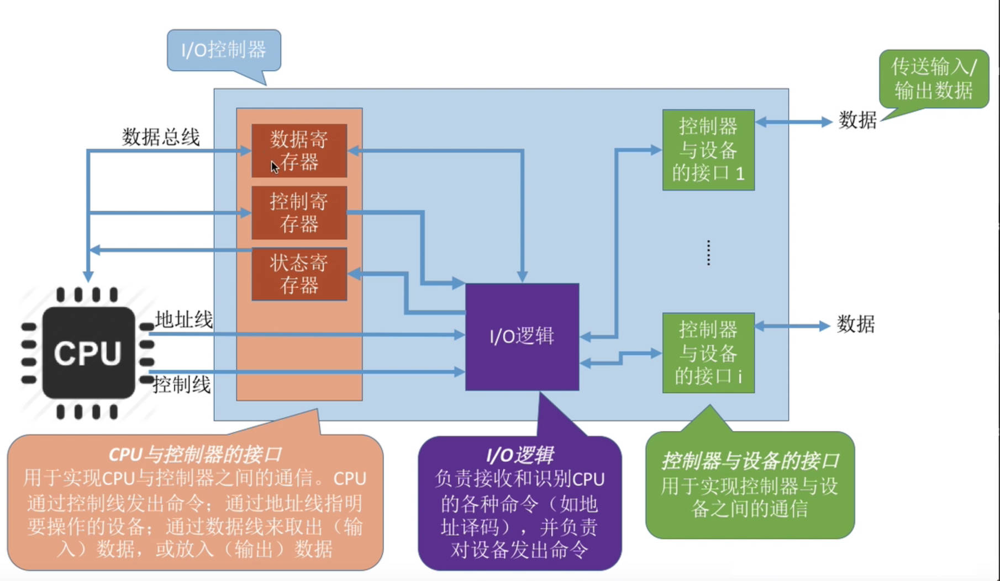

**注意：**
- 一个IO控制器对应多个设备
- 寄存器也存在多个

## 寄存器编址

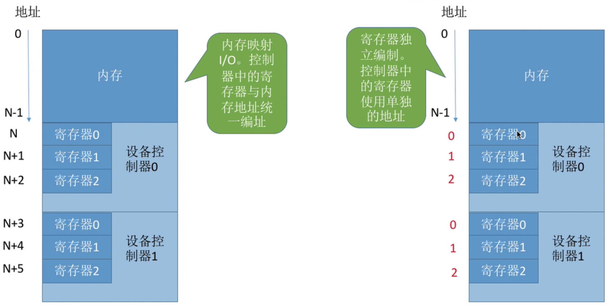

- **内存映像：** 将IO控制的寄存器地址映射到内存编址中，访问方式就和内存一样。
- **独立编址：** IO控制器寄存器编址将独立于内存，另外采用一套编址方案，这就需要提高特殊的指令，实现对IO寄存器的访问。

# I/O控制方式

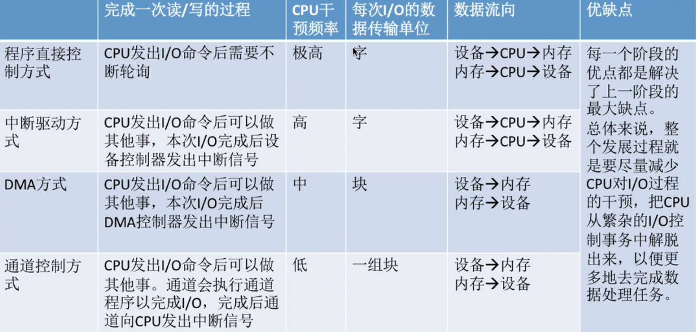

## 程序控制方式

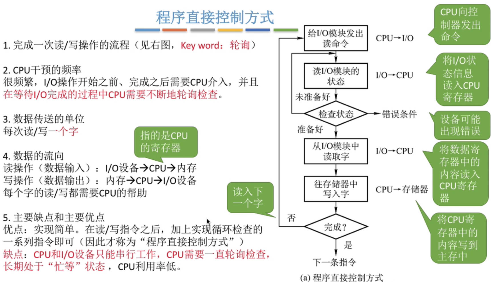

## 中断驱动方式

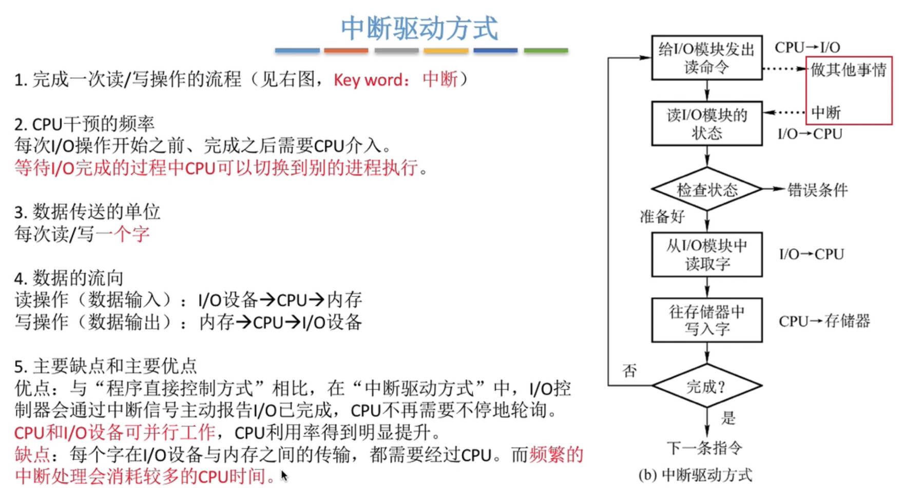

## DMA方式

1. 物理结构

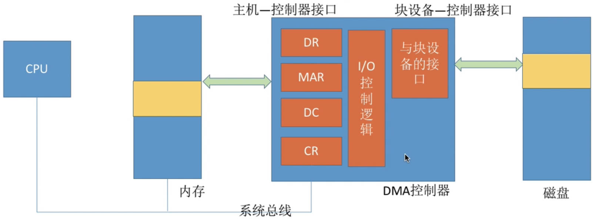

- **数据寄存器（DR）：** 存储内存与设备之间的交换数据。
- **内存地址寄存器（MAR）：** 设备到内存，输入数据放在内存的哪个位置；内存到设备，输出的数据放在内存的哪个位置。
- **数据计数器（DC）：** 还剩余多少字节的数据还没有读/写
- **命令/状态寄存器（CR）：** `CPU`发送的I/O命令，或者I/O设备的状态。

2. DMA控制

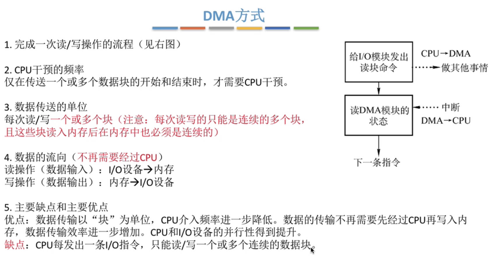

## 通道控制

1. 通道概念

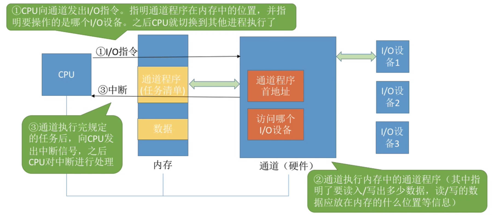

**概念：** 「通道」就是一种简化的`CPU`，能够执行一系列简单的控制命令。

2. 通道控制

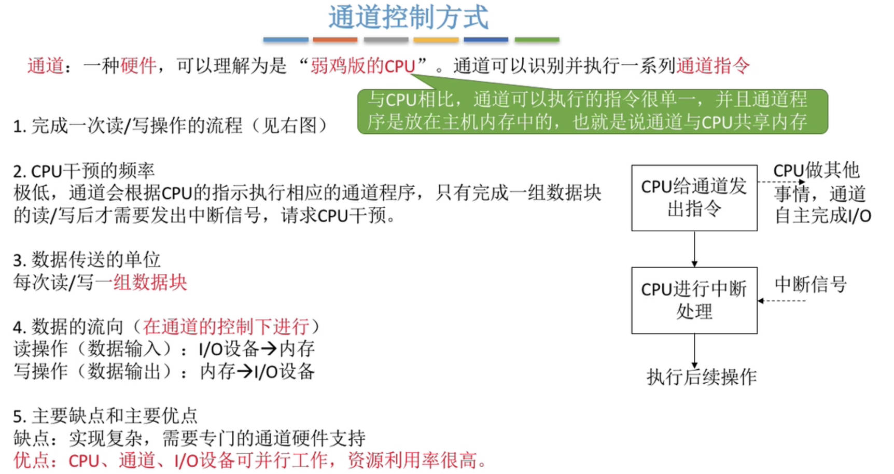

# I/O软件层级

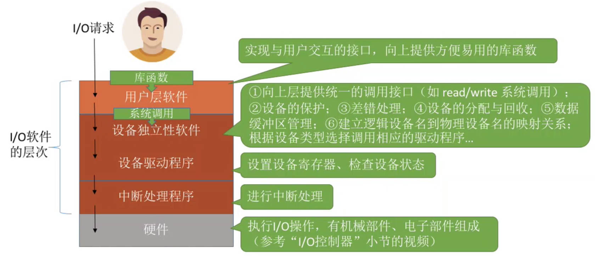

# I/O子系统

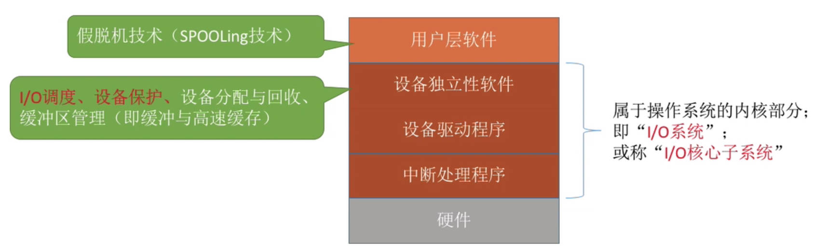

## I/O调度、设备保护

- **I/O调度：** 通过调度算法来给进程分配空闲的设备。调度算法可以是FCFS，SJF等。
- **设备保护：** 在`Linux`中一切皆是文件，因此「设备保护」可以与「文件保护」一样。

## 假脱机技术

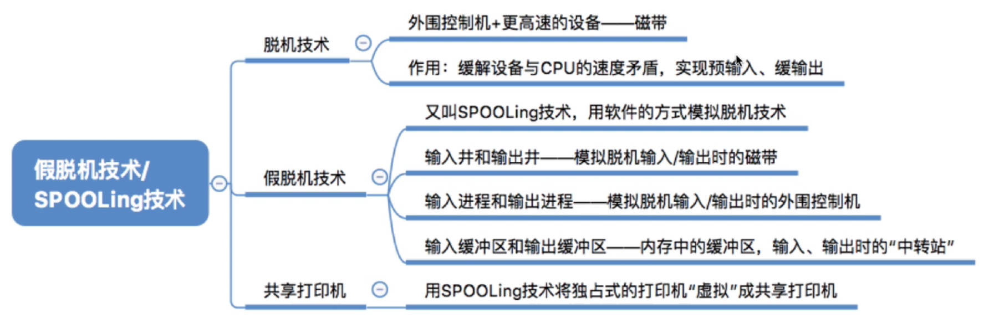

1. 脱机技术

**概念：** 脱离`CPU`控制，进行相应的输入/输出操作，例如多道批处理系统。

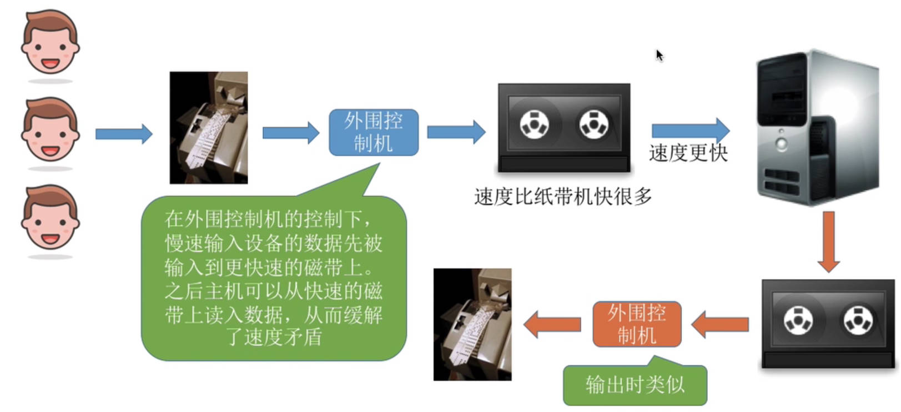

> [!tip]
> 将程序通过纸带机输入磁带与将磁带输出到纸带机的过程就是脱机技术的应用，主机没有参与。

2. 假脱机技术

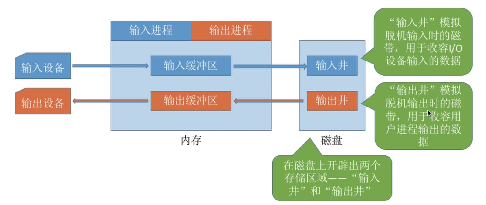

**概念：** 通过软件的形式来实现「脱机技术」
- 输入井+输入进程：模拟脱机输入
- 输出井+输出进程：模拟脱机输出

## 设备分配与回收

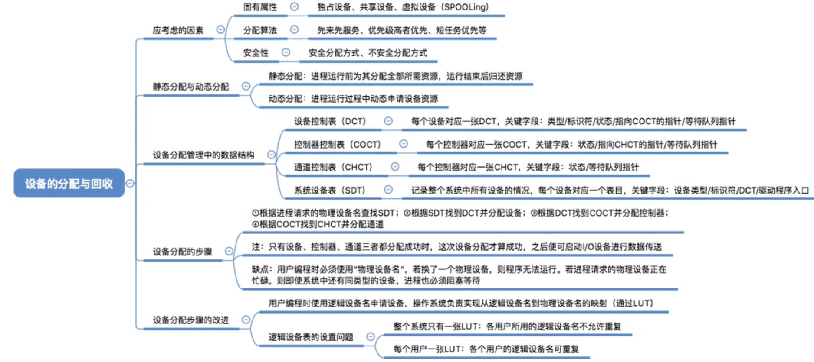

### 分配策略

通道、控制器、设备之间的关系：

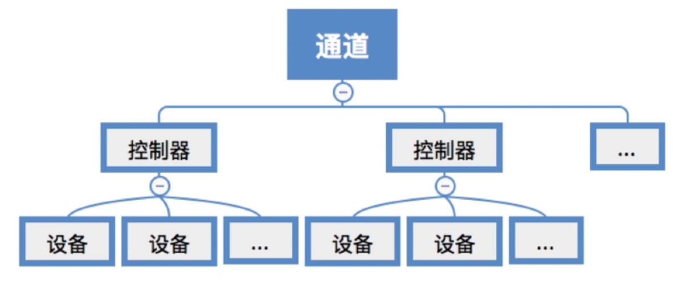

    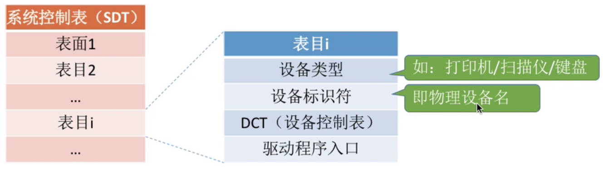
1. 从SDT中查找到指定设备后，查询该设备的「设备控制表（DCT）」。若设备忙碌，则将`PCB`放入「设备等待队列」，否则分配设备
    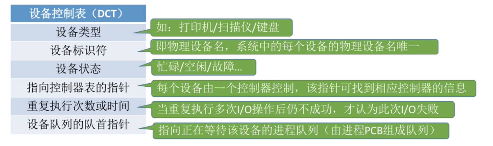
2. 分配设备后，查询设备对应的「控制器控制表（COCT）」。若控制器忙碌，则将`PCB`放入「控制器等待队列」，否则分配控制器
    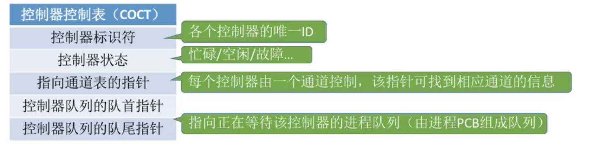
3. 分配控制器后，查询控制器对应的「通道控制表（CHCT）」。若通道忙碌，则将`PCB`放入「通道等待队列」，否则分配控制器
    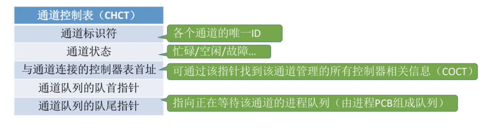

> [!note|style:flat]
> 只有设备、控制器、通道三者均分配到位后，I/O设备才会真正投入运行。

### 分配策略优化

> [!tip]
> 「物理设备名」是由「操作系统」进行分配，而且还会变化，因此根据「物理设备名」来对设备进行查询，对程序开发不利。

**思路：** 利用「逻辑设备名」来替换「物理设备名」，让操作系统来实现「逻辑设备名」到「物理设备名」的转化。
- **设备类型：** 对应「逻辑设备名」
- **设备标识符：** 对应「物理设备名」

    
1. 查找到设备后，操作系统会在「逻辑设备表（LUT）」中对该设备进行记录。 第二次查询该「逻辑设备名」时，就直接从LUT中查找设备 
    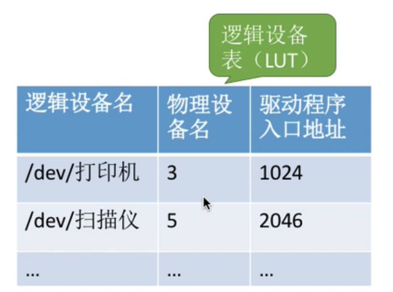
2. 从SDT中查找到指定设备后，查询该设备的「设备控制表（DCT）」。若设备忙碌，则将`PCB`放入「设备等待队列」，否则分配设备
    
3. 分配设备后，查询设备对应的「控制器控制表（COCT）」。若控制器忙碌，则将`PCB`放入「控制器等待队列」，否则分配控制器
    
4. 分配控制器后，查询控制器对应的「通道控制表（CHCT）」。若通道忙碌，则将`PCB`放入「通道等待队列」，否则分配控制器
    

# 缓冲区管理

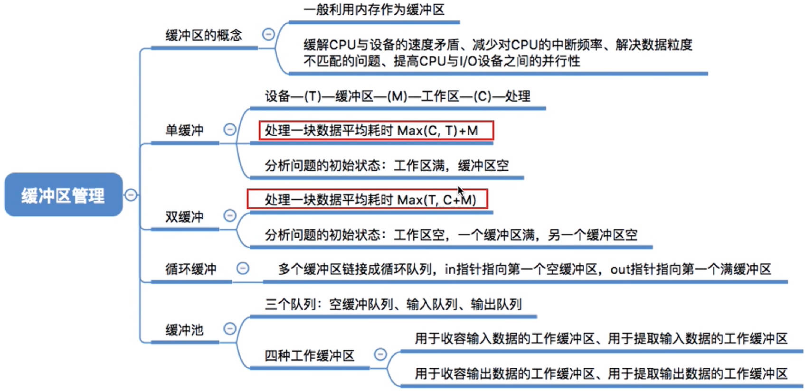

## 缓冲区

- **概念：** 一个存储区域，可以通过「专门硬件」实现，也可以利用「内存」来模拟。

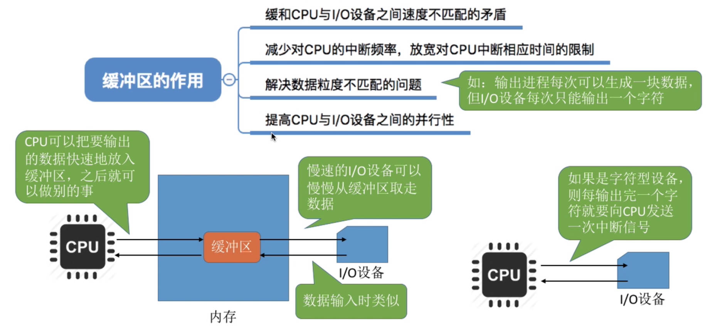

## 单/双缓冲

1. 单缓冲

- **概念：** 主存中分配一个缓冲区，大小为主存中的一「块」。
- **特点：** 缓冲区非空时，不能写入；缓冲区为空时，只能先写满，才能读取。类似管道通信。

2. 双缓冲

- **概念：** 主存中分配两个缓冲区。
- **特点：** 缓冲区非空时，不能写入；缓冲区为空时，只能先写满，才能读取。类似管道通信。

## 循环缓冲区

- **概念：** 将多个缓冲区构成一个「循环队列」

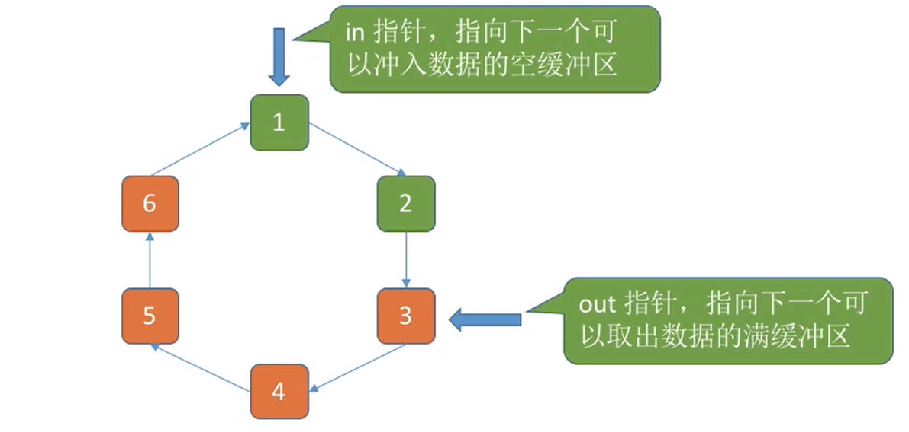

## 缓冲池

- **概念：** 将缓冲区划分为三个队列：空缓冲队列、输入缓冲队列、输出缓冲队列。然后在利用四个方法进行管理：收容输入缓冲，提取输入缓冲，收容输出缓冲，提取输出缓冲。

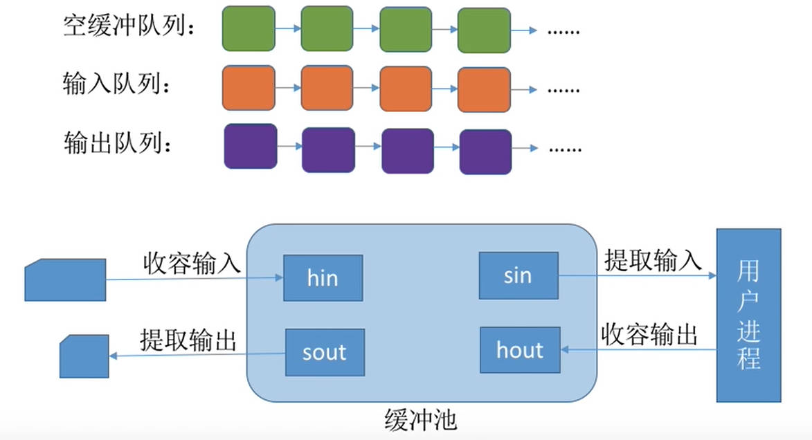
