# 概念与功能

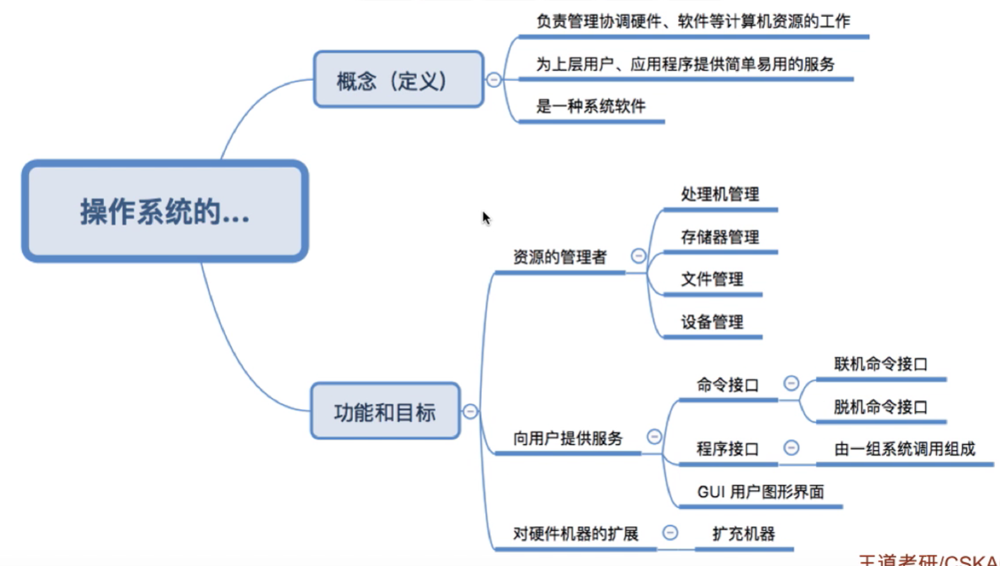

## 概念

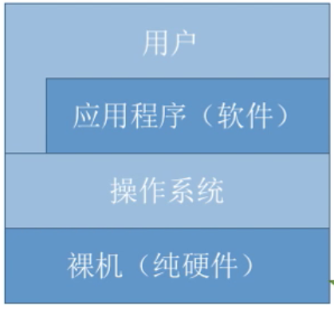

- **中间**：管理协调计算机硬件、软件的资源分配工作
- **对上**：为用户、应用程序提供简单操作的服务
- **对下**：操作系统是最靠近硬件的软件

> [!note]
> **操作系统（OS，operatiing system）：** 控制管理整个计算机系统的硬件与软件资源，合理组织调度计算机的工作和资源的分配；给用户和软件提供方便的接口和环境；计算机最基本的系统软件。

## 功能

### 系统资源管理者

对硬件、软件的管理
- 处理器管理：进程管理，负责进程的运行
- 储存器管理：内存管理
- 文件管理：文件系统
- 设备管理：对于外部硬件资源的管理分配

### 用户与计算硬件的接口

用户对计算机的使用
- **命令接口**：终端中执行命令（也是程序）
  - 联机命令接口：交互式，给一个命令，计算机执行一个操作。（直接在终端中执行命令，例如`cd ./`)
  - 脱机命令接口：批处理，写一个脚本文件，批量执行命令。（例如`shell`脚本）
- **程序接口**：编程人员在程序中通过程序接口来请求操作系统提供服务，程序接口的调用是「**系统调用**」
- **GUI图像界面**：鼠标点击，拖拽

### 最接近硬件的软件

对硬件的功能进行强化。

案例说明

 摄像头只能拍照，录音器只能记录声音，屏幕就显示画面，网卡只能收发数据，通过操作系统对这些硬件进行整合，上层软件就能通过操作系统实现视频聊天。

- **裸机**：没有任何软件的硬件
- **扩充机器**：覆盖了软件的硬件

# 操作系统的特征

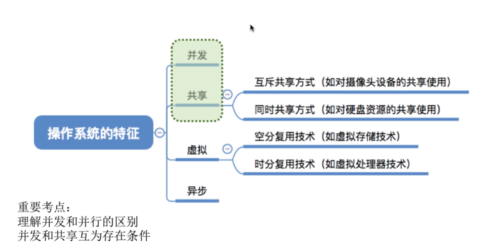

## 并发

**概念**：两个或者「多个事件」在同一「时间」内发生，**这些事件在宏观上是同时的，在微观上是交替执行的**。

| 概念  |   宏观   |   微观   |
| :---: | :------: | :------: |
| 并行  | 同时执行 | 同时执行 |
| 并发  | 同时执行 | 交错执行 |

## 共享

**概念**：系统中的资源可以供多个并发执行的进程所共享

- **互斥共享**：同一个宏观时间段内，一个资源只能一个进程进行访问。例如，写操作
- **同时共享**：同一个宏观时间段内，一个资源可以供多个进程进行访问。例如，读操作

> [!note|style:flat]
> - **同时**：都是针对「宏观时间段」而言，微观时间段（`CPU`中的真正运行情况）不一定。
> - **共享与并发**：操作系统最基本的特征，两个概念互相依存：缺少其中一个，另一个就没意义。

## 虚拟

**概念**：若干个逻辑上的虚拟物（用户感受到的）对应物理上的一个实体（真正存在的）。**「并发」是前提，没有并发，这个也没意义了。**

- **空分复用技术**：虚拟内存技术
- **时分复用技术**：`cpu`并发执行进程，同时执行多个程序

## 异步

**概念**：多个程序「并发」执行，由于进程（程序）多， `CPU`的执行是交错的，进程就会不能一次性运行完，程序的运行结果是乱序的。例如，多线程打印，输出结果是乱的。**「并发」是前提，没有并发，这个也没意义了。**

# 操作系统的发展

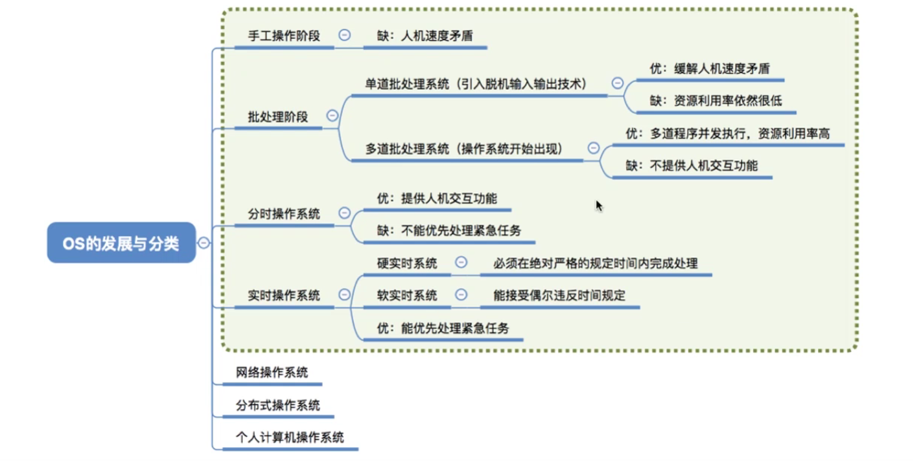

## 手工操作

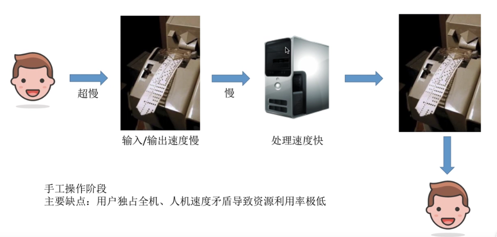

**运行流程**：
1. 计算机读取纸带机导入的程序
2. 计算机计算
3. 计算机把结果输出到纸带机
4. 纸带机输出结果纸带

> [!tip]
> **发现的问题：** 计算机的运行速度远比纸带机读取/写出的速度快，整个流程是串行的（一个用户用完，下一个用户才能使用），所以计算机长时间闲置，不干事。

## 批处理阶段

### 单道批处理系统

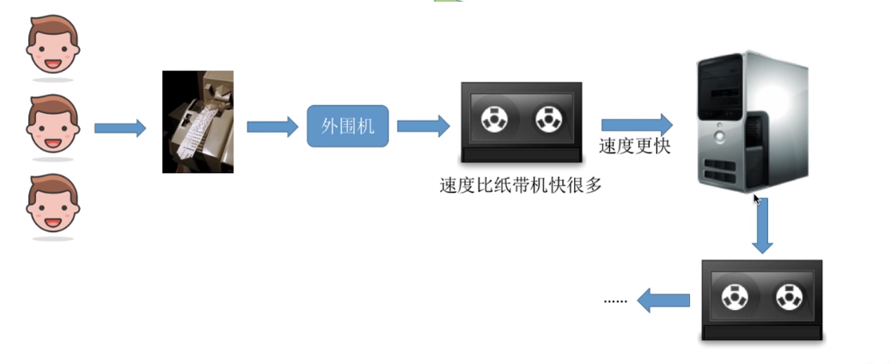

**改进上一代问题：** 

引入脱机输入/脱机输出技术，利用「磁带」等待运行的程序，并利用「监督程序」监控计算机从磁带中导入程序，将结果输出到磁带。

5. 多个用户将程序批量的放到纸带机上
6. 由「外围机」批量读取到「磁带」
7. 计算机运行就从「磁带」上读取程序
8. 「监控程序」负责管理计算机与磁带的读入与写出

> [!tip]
> **发现问题：** 对于一个程序而言，读、执行，写是顺序执行的；当一个程序执行完毕，才会开始下一个程序的执行。这样就导致`I/O`阶段，计算机还是闲着不干活。
>
> **监控程序**：操作系统概念的雏形。

### 多道批处理系统

> [!tip]
> **内存中加载了多道程序，具有多进程处理功能，能实现「并发」**，当正在运行的的那道程序因为某种原因（比如，等待输出或输出数据）而暂时无法继续运行的时候，系统将自动地启动另一道程序运行。

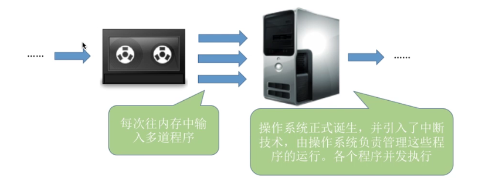

**改进上一代问题：** 

计算机每次从磁带读入多个程序，然后交替执行：并发与共享功能引入。

> [!tip]
> **发现问题：** 计算机光执行程序去了，没有人机交互功能（用户提交程序后，就只能等着计算机运行完毕，输出结果。）

### 对比

**问题**：计算对磁带中的三个任务进行处理，一个程序的主要执行步骤：读、执行、写

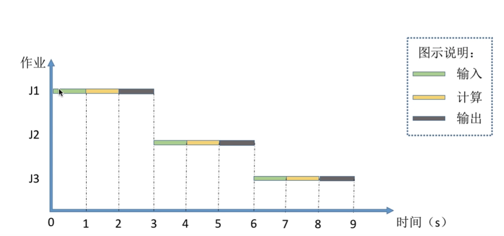

**单道批处理系统：** 串行执行程序，一个程序执行完，才开始下一个。

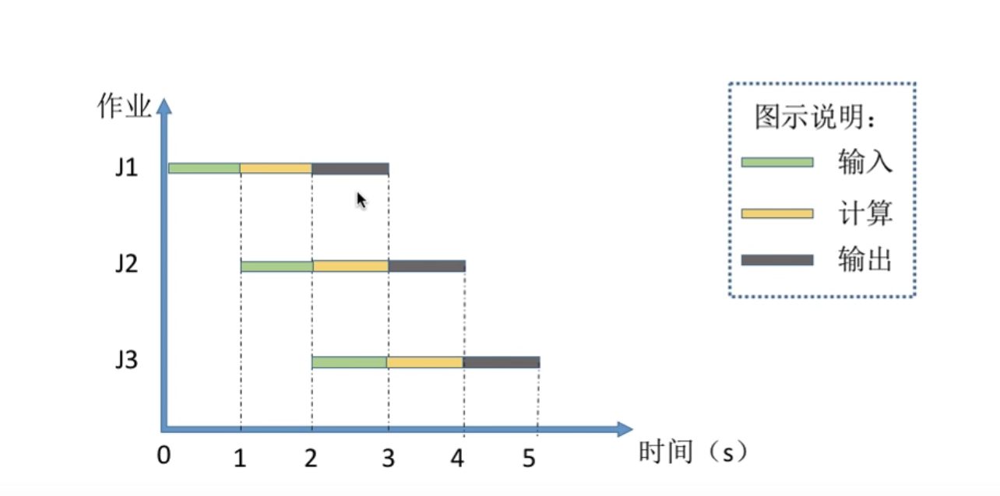

**多道批处理系统：** 一个完整任务进行拆分：读，执行，写，一个芯片专门读，`CPU`专门计算，一个芯片专门写，然后三个芯片进行流水线作业。当进行`I/O`操作时，进程被挂起，`CPU`会处理其他进程；

## 分时操作系统

**概念**：计算机以「时间片」为一个单位轮流执行任务、与用户交互，解决交互问题。

> [!tip|style:flat]
> **发现问题**：不能处理紧张任务，轮流执行对于每个用户，任务都是公平的。

## 实时操作系统

**概念：** 在分时操作系统的基础上，能够优先处理一些紧急任务，不需要进行时间片排队。

- **硬实时系统：** 必须在规定时间内完成任务
- **软实时系统：** 不那么急，可以推迟一下

# 运行机制与体系结构

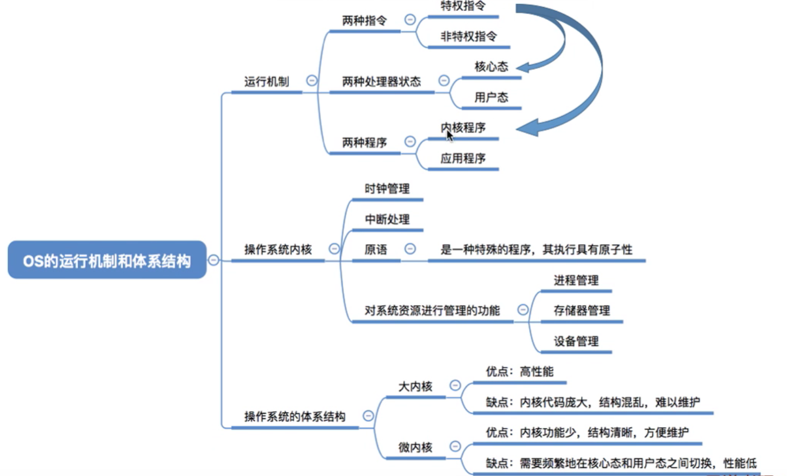

## 指令

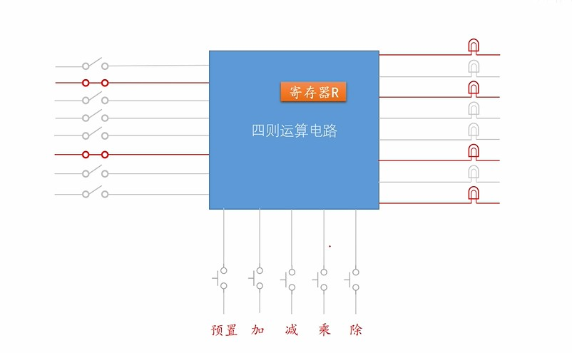

当使用涉及一个寄存器的计算器时，可以通过定义不同操作的开关来完成计算，例如，加一个开关，减一个开关。

**概念**：当涉及多个寄存器进行计算时，每个操作设置一个开关就会很丧心病狂，所以就可以对这些操作进行编号，减少输入量。这些编号就是指令。

> * **指令集**：所有指令的集合
> 
> **分类**：
> * 算数运算指令和逻辑处理指令
> * 数据传输指令
> * 处理器状态令

## 运行机制

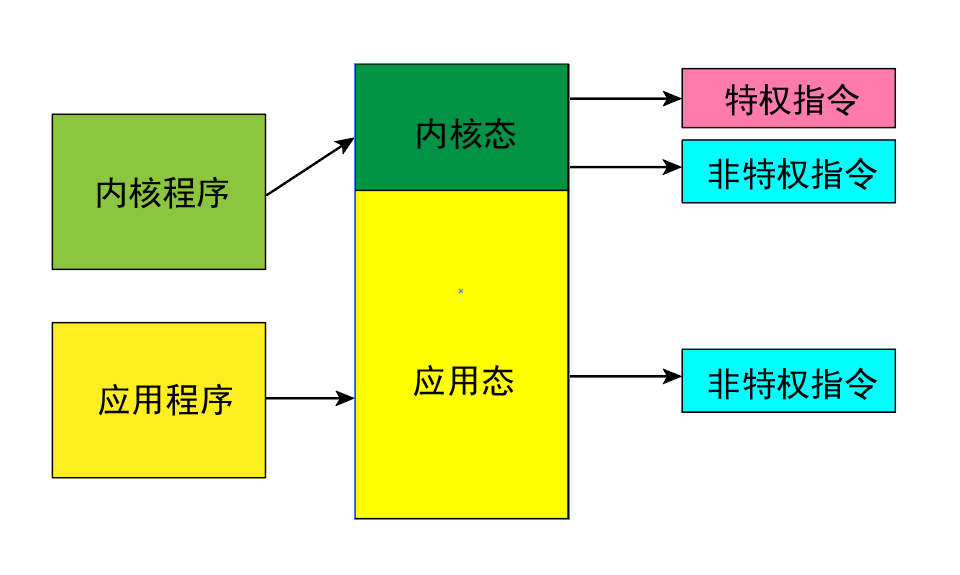

> - `CPU`通过「程序状态字寄存器（PSW）」 中的标志位，来区分当前在那个状态下：是内核态还是核心态
> - **特权指令**：随意使用有危险性的指令。为了安全只能用让「内核程序」在「内核态」中使用
> - **非特权指令**：普通指令。例如，加减计算指令。
> - **在「内核态」中唯一一类不能使用的「非特权指令」是：触发中断，进行「系统调用」。**

## 内核

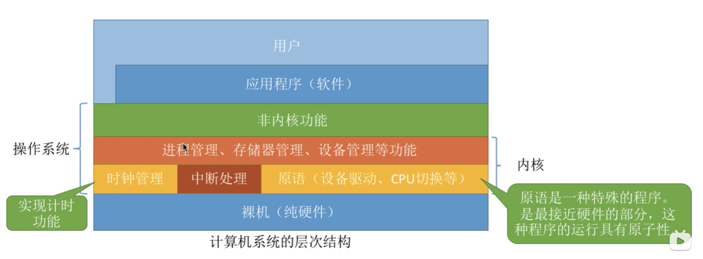

**概念：** 计算机上最底层的「软件」；操作系统最核心的部分。一般包括两大部分：
- **最根本的部分**：时钟管理（分时系统的根基）、中断处理（系统调用的目的，外部硬件响应）、原语（这部分指令原子性，不能被中断）
- **管理部分**：进程管理，内存管理，设备管理等模块

## 内核分类（体系结构）

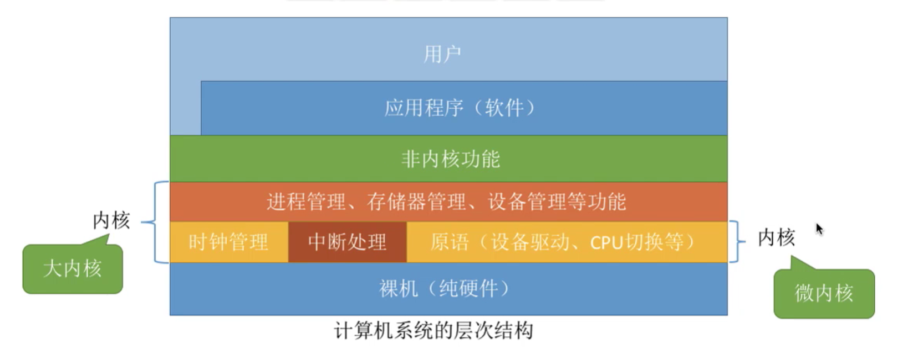

- **操作系统体系结构：** 「内核」设计理念的不同，也决定了操作系统的体系结构的不同。
- **大内核**：操作系统的主要功能，都放到了内核中，都在「内核态」中进行执行。
  - 优点：执行效率好，带在内核，就不用进行频繁的从用户态到内核态的「下陷」操作。
  - 缺点：内核庞大，结构混乱，维护难
- **微内核**：在内核中，只保留了最基础的功能。其他功能统统丢出去。
  - 优点：分工明确，结构清晰
  - 缺点：执行效率底。频繁的从用户态到内核态的「下陷」操作

直观案例  

 

操作系统的体系结构问题与企业的管理问题很相似。
- **内核**: 就是企业的管理层,负责一些重要的工作。只有管理层才能执行特权指令,普通员工只能执行非特权指令。用户态、核心态之间的切换相当于普通员工和管理层之间的工作交接
- **大内核**: 企业初创时体量不大,管理层的人会负责大部分的事情。优点是效率高;缺点是组织结构混乱,难以维护。
- **微内核**: 随着企业体量越来越大,管理层只负责最核心的一些工作。优点是组织结构清晰,方便维护;缺点是效率低

# 中断

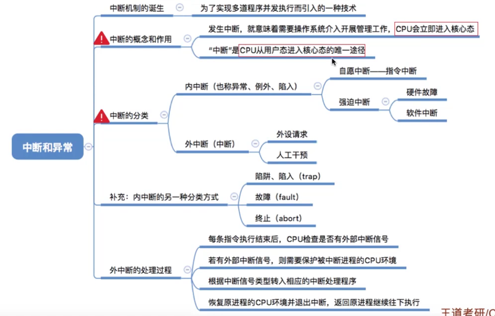

## 中断的概念

> [!note|style:flat]
>  如果让操作系统定期对设备进行轮询，以便处理设备，那会做很多无用功，因为外设的处理速度一般慢于`CPU`，而`CPU`不能一直等待外部事件。相反，更好的处理手段就是：**让设备在需要操作系统时主动通知操作系统（出现紧急情况，就让`CPU`停下手中的活，切换到操作系统，进行事件处理）**，这便是「**中断**」。对于「用户程序」也是一样，想要使用内核的服务时，就给出中断信号，由「用户态」下陷到「内核态」。

- **本质**：一发生「中断」，「操作系统」就会介入（「内核」在操作系统手里，中断程序又属于「内核」），然后进行管理工作。
- **特点**
  1. 中断发生后，暂停当前`CPU`的工作，操作系统取得计算机控制权
  2. 操作系统的内核（中断处理程序属于内核）会对中断进行处理

注：

> [!attention|style:flat]
> - **用户态 -> 内核态** ：只能通过「中断」，「系统调用」的本质也是「中断」
> - **内核态 -> 用户态** ：修改「程序状态字寄存器（PSW）」 中的标志位

## 中断分类

**分类一**：
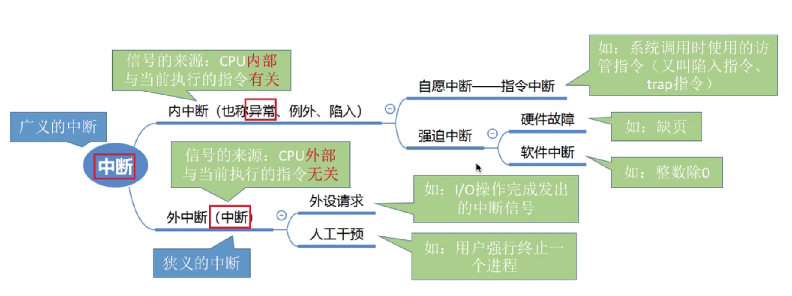

**分类二**：

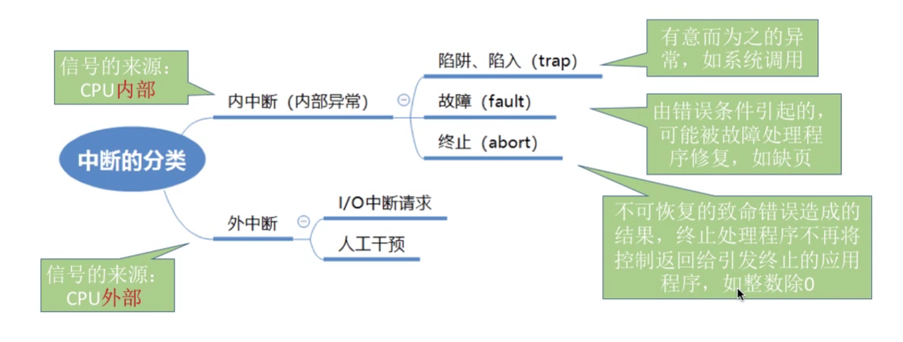

## 中断过程

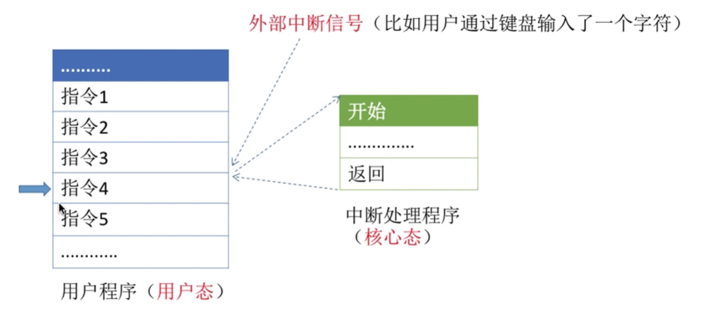

3. `CPU`在执行一条指令后，会检测是否有「外部中断」。「内部中断」不用检测，指令本身发生了中断。
4. 有外部中断，则备份当前进程的环境（寄存器，程序计数器PC（下个指令的位置）等）
5. 进入中断处理指令代码，开始中断处理
6. 中断处理完毕，恢复被挂起的进程，还原寄存器，堆栈等运行环境。

# 系统调用

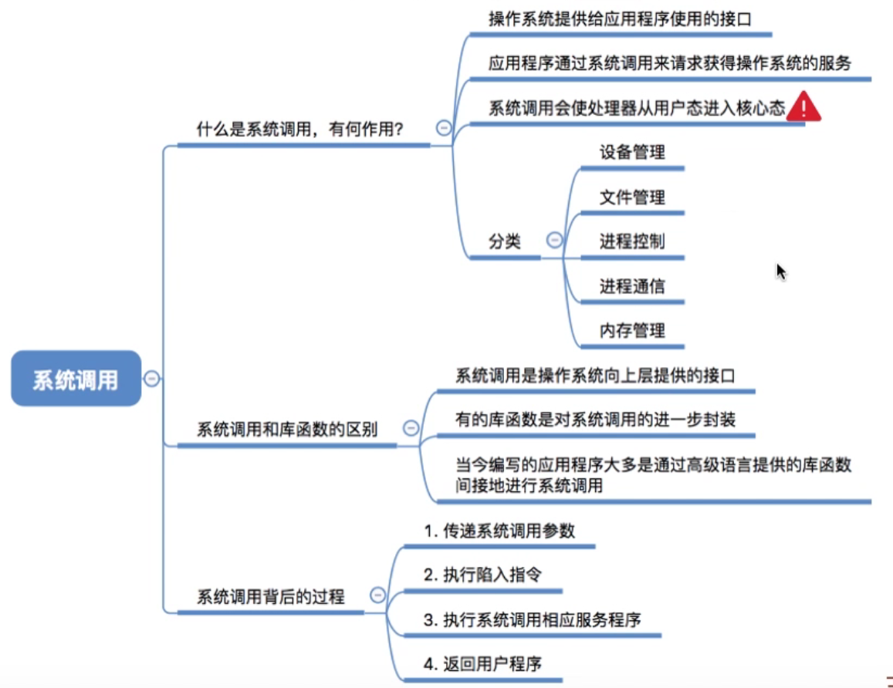

## 介绍

1. 概念

**作用：** 由于操作系统对各种共享资源进行了统一管理，凡是与资源相关的操作（储存，`I/O`操作，文件管理等），都必须通过「系统调用」来向操作系统请求相关服务。这就保证的系统的稳定性与安全性，防止用户的非法操作。

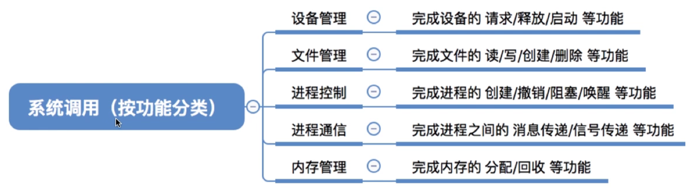

> [!note|style:flat]
> 从分类可以看出，「系统调用」提供的服务都涉及「特权指令」，因此，这些操作的处理程序都必须要要在「内核态」下进行完成。

2. 运行机制

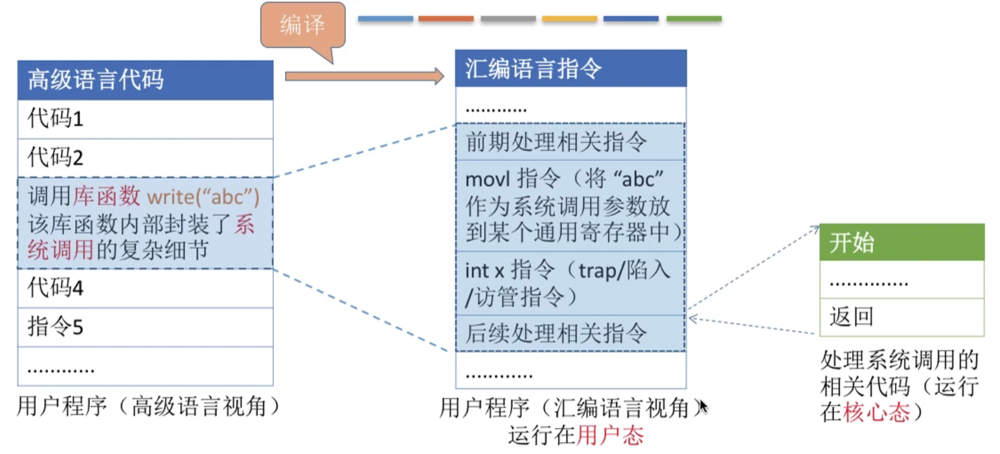

> [!note]
> 「系统调用」的本质就是利用`int 中断函数地址`来触发「中断」，进入「内核态」，靠「内核」中的中断程序进行相关中断处理。
 
**注意：**
- `int`指令在用户态执行；执行后，马上触发「内中断」，进入「内核态」
- 系统调用的请求在「用户态」，系统调用的处理在「内核态」

## 系统调用与函数库

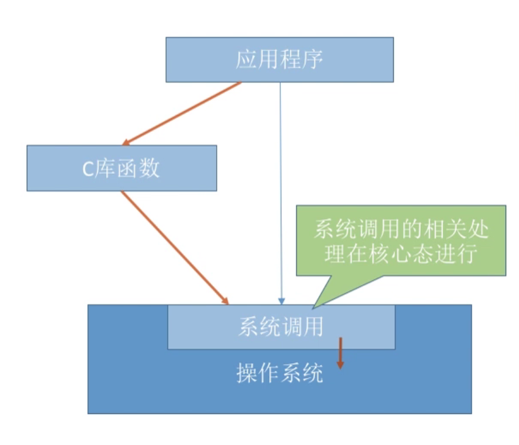

- 函数库会对系统调用进行一层封装，方便编程使用。
- 不是所有的函数库都会使用系统调用，只有涉及到要使用「特权指令」的服务，才会进行「系统调用」
