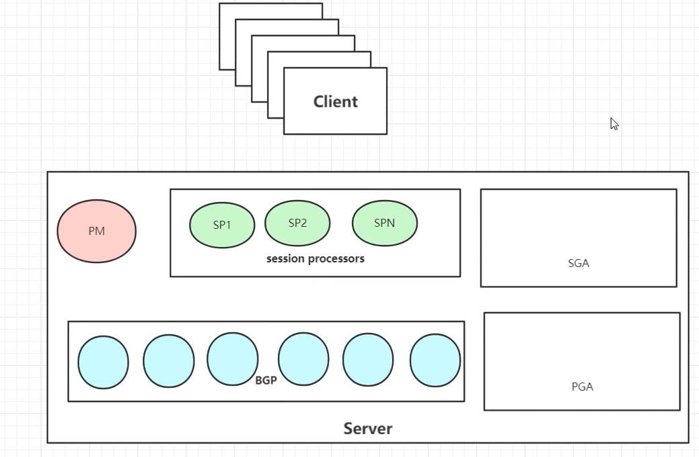

# 系统结构



pgsql 的设计结构为「客户端-服务器」模式。

## 进程划分

- **PM进程：** 该进程为pgsql服务器提供TCP前台监听、pgsql连接认证、与客户端建立连接等功能。
- **SP进程：** session processes，前台PM进程为每一个客户端分配的实际服务进程，真正处理业务逻辑的进程。
- **BGP进程：** 后台进程，主要用于数据库管理的，例如数据从硬盘的读写等操作。
  - **CKPT进程：** 维护「检查点队列」，内存中更新过的数据，都需要先放入检查点队列中。
  - **BGW进程：** 根据「检查点队列」，批量将「内存」中被修改的数据，更新同步到「硬盘」中，并移除检查队列中的记录。
  - **WALW进程：** 负责「redo日志」的记录。pgsql 每进行一步操作，都要记录相应日志。
  - **ARCH进程：** 将WALW进程产生的redo日志进行备份。
  - **Sysloger进程：** 主要负责数据库状态日志的记录。
  - **AV进程：** auto vacuum，整理「堆表」中的数据。

```term
$ ps ax
  PID TTY      STAT   TIME COMMAND
  129 ?        Ss     0:00 postgres: checkpointer # CKPT进程
  130 ?        Ss     0:00 postgres: background writer # BGW进程
  131 ?        Ss     0:00 postgres: walwriter # WALW进程
  132 ?        Ss     0:00 postgres: autovacuum launcher # AV进程
  133 ?        Ss     0:00 postgres: stats collector 
  134 ?        Ss     0:00 postgres: logical replication launcher
  150 ?        Ss     0:00 postgres: triangle postgres [local] idle # SP进程
  215 ?        Ss     0:00 postgres: pgtest postgres [local] idle # SP进程
```

## 内存划分

- **SGA内存：** 进程共享内存区域
  - **data buffer：** 数据库数据在内存的存放区域。**数据的修改和读取，都是先从硬盘中读取数据到内存中，然后程序在内存中修改，等到一定时机，才会更新到硬盘数据中。**
  - **wal buffer：** 存放redo日志
- **PGA内存：** 为SP进程划分的私有内存空间。

> [!tip]
> 内存分配，可以靠`postgresql.conf`进行控制


# 本地文件

## 文件分类

- **日志**
  - `$PGDATA/log：` 运行日志，**需要在postgresql.conf中进行启用**
  - `$PGDATA/pg_wal：` redo日志
  - `$PGDATA/pg_xact：` 事务提交日志
- **配置文件**
  - `postgresql.conf：` 系统配置文件
  - `pg_hba.conf：` pgsql 登录访问控制
- **控制文件**：查看 pgsql 的情况

    ```term
    triangle@LEARN:~$ pg_controldata -D pgsql/data/
    pg_control version number:            1201
    Catalog version number:               201909212
    Database system identifier:           7083851725502038738
    Database cluster state:               in production
    pg_control last modified:             Sat Apr  9 10:40:58 2022
    Latest checkpoint location:           0/164B160
    Latest checkpoint's REDO location:    0/164B128
    Latest checkpoint's REDO WAL file:    000000010000000000000001
    Latest checkpoint's TimeLineID:       1
    Latest checkpoint's PrevTimeLineID:   1
    Latest checkpoint's full_page_writes: on
    Latest checkpoint's NextXID:          0:492 # 事务ID号
    Latest checkpoint's NextOID:          24577
    Latest checkpoint's NextMultiXactId:  1
    Latest checkpoint's NextMultiOffset:  0
    Latest checkpoint's oldestXID:        480
    Latest checkpoint's oldestXID's DB:   1
    Latest checkpoint's oldestActiveXID:  492
    Latest checkpoint's oldestMultiXid:   1
    Latest checkpoint's oldestMulti's DB: 1
    Latest checkpoint's oldestCommitTsXid:0
    Latest checkpoint's newestCommitTsXid:0
    Time of latest checkpoint:            Sat Apr  9 10:40:58 2022
    Fake LSN counter for unlogged rels:   0/3E8
    Minimum recovery ending location:     0/0
    Min recovery ending loc's timeline:   0
    Backup start location:                0/0
    Backup end location:                  0/0
    End-of-backup record required:        no
    wal_level setting:                    replica # wal 的运行级别
    wal_log_hints setting:                off
    max_connections setting:              100
    max_worker_processes setting:         8
    max_wal_senders setting:              10
    max_prepared_xacts setting:           0
    max_locks_per_xact setting:           64
    track_commit_timestamp setting:       off
    Maximum data alignment:               8
    Database block size:                  8192
    Blocks per segment of large relation: 131072
    WAL block size:                       8192
    Bytes per WAL segment:                16777216
    Maximum length of identifiers:        64
    Maximum columns in an index:          32
    Maximum size of a TOAST chunk:        1996
    Size of a large-object chunk:         2048
    Date/time type storage:               64-bit integers
    Float4 argument passing:              by value
    Float8 argument passing:              by value
    Data page checksum version:           0
    Mock authentication nonce:            d6556b283df534397af25c02e80c167a4fa965dfd6da7cb450a38f17b2ac994d
    ```

- **数据文件：** pg中索引和数据都是单独一个文件，称之为为`page`。page具有默认大小，超过默认大小，文件就会进行拆分。
    ```term
    triangle@LEARN:~$  psql -d student
    Password for user pgtest:
    psql (12.9 (Ubuntu 12.9-0ubuntu0.20.04.1))
    Type "help" for help.

    classroom=# show data_directory; # PGDATA的目录
      data_directory
    ---------------------------
    /home/triangle/pgsql/data
    (1 row)

    classroom=# select relfilenode from pg_class where relname='student'; # 查询表的数据存储在哪一个page上。
    relfilenode
    -------------
        16387
    (1 row)

    classroom=# select pg_relation_filepath('student'); # 表在硬盘中所存储的page路径
    pg_relation_filepath
    ----------------------
    base/16386/16387
    (1 row)

    ```

## WAL日志

### online WAL

```term
$ ll pgsql/data/pg_wal/
total 16384
drwx------ 1 triangle triangle      512 Apr  7 21:22 ./
drwx------ 1 triangle triangle      512 Apr  9 10:25 ../
-rw------- 1 triangle triangle 16777216 Apr  9 11:34 000000010000000000000001 # online wal 日志
drwx------ 1 triangle triangle      512 Apr  7 21:22 archive_status/
$ pg_waldump pgsql/data/pg_wal/000000010000000000000001 # 查看日志里的内容
$ psql -d student
Password for user pgtest:
psql (12.9 (Ubuntu 12.9-0ubuntu0.20.04.1))
Type "help" for help.

classroom=# select pg_walfile_name(pg_current_wal_lsn()); # 显示当前正在使用的 wal 日志
     pg_walfile_name
--------------------------
 000000010000000000000001
(1 row)

classroom=# select pg_switch_wal(); # 新建一个 wal 日志
 pg_switch_wal
---------------
 0/16647B8
(1 row)

classroom=# select * from pg_ls_waldir() order by modification asc; # 显示所有的wal日志
           name           |   size   |      modification
--------------------------+----------+------------------------
 000000010000000000000001 | 16777216 | 2022-04-09 12:04:37+08
 000000010000000000000002 | 16777216 | 2022-04-09 12:04:38+08
(2 rows)

```
- **作用：** pgsql 在运行时，实时的将`wal buffer`中的日志写到硬盘中。**wal日志文件会维持一定数量的队列，当队列满时，添加最新的wal日志文件，就会将旧的日志文件删除掉。**

- **命名：** 文件名为24位的`16`进制数，8位一组，分别为：时间线、逻辑id、物理id。

### arch wal

- **作用：** 将 online wal 出队的日志，进行备份。

**启动arch wal：**

```term
$ vim pgsql/data/postgresql.conf
# - Archiving -

archive_mode = on             # enables archiving; off, on, or always
                                # (change requires restart)
archive_command = 'test ! -f 归档路径/%f && cp %p 归档路径/%f'           
                                # command to use to archive a logfile segment
                                # placeholders: %p = path of file to archive
                                #               %f = file name only
                                # e.g. 'test ! -f /mnt/server/archivedir/%f && cp %p /mnt/server/archivedir/%f'
```

# 备份

- **全备份：** 利用指令 `pg_basebackup` 可以将数据库全备份，会将`$PGDATA`和wal日志进行压缩打包。
- **事务回退：** 
  - 方法一：利用pitr恢复，进行事务回退
  - 方法二：危险操作之前，设置pgsql存档点
