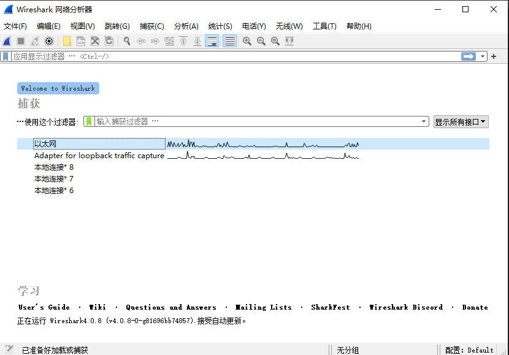
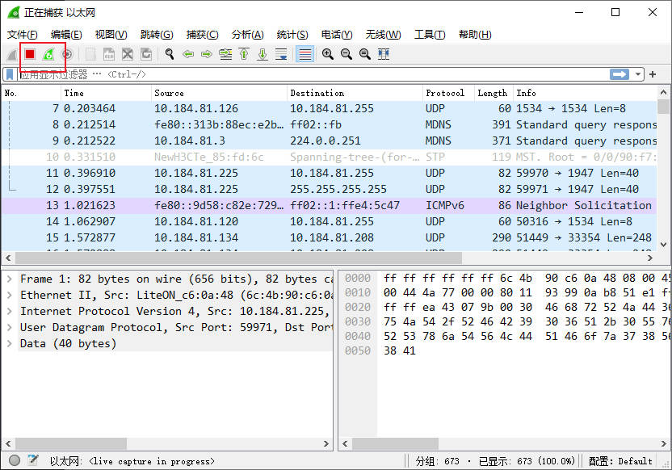
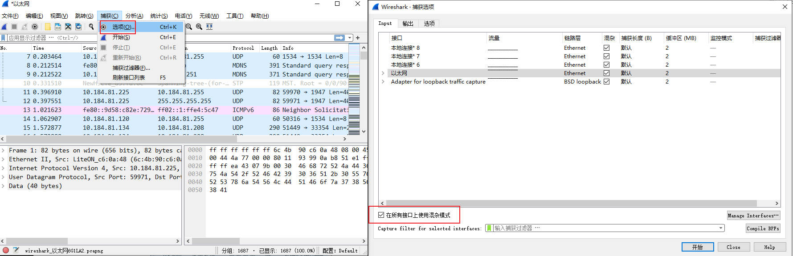
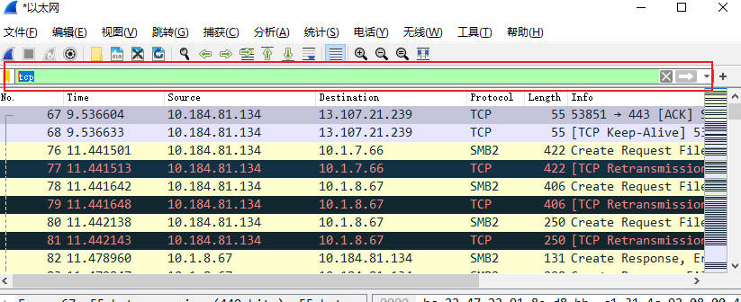

# 启动

1. 选择要抓哪些网络下的包

2. 开始抓包

# 抓包模式

- 混杂模式：经过网卡的所有数据都能抓到
- 普通模式：只接收校验通过的数据，合法的

# 过滤器

- 过滤协议：`tcp`、`dns`、`udp`、`http`
- 过滤 ACK : `tcp.flags.ack == 1`
- TCP 发完数据：`tcp.flags.fin == 1`
- 多语句查询：`tcp.flags.ack == 0 and tcp.flags.syn == 1`
- 查询IP : `ip.src_host == 192.168.0.1 or ip.dst_host = 110.110.12.3`
- 不区分源与目标的IP : `ip.addr == 192.168.1.2`
