

# 安装

1. 安装 `docker` 和 `docker compose`

2. 安装 `Penpot`

```term
$ curl -O https://raw.githubusercontent.com/penpot/penpot/main/docker/images/docker-compose.yaml
$ docker-compose -p penpot  up -d # 启动服务
$ docker-compose down
```

# 界面

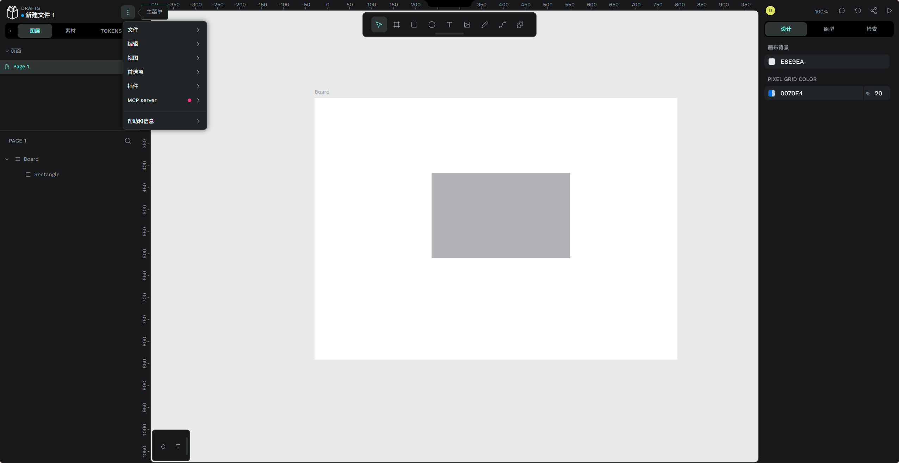

管理面板: 对控件、图标、配置等固定资产的管理

- 图层：管理 UI 元素
- 素材：可复用的界面控件、颜色、排版

    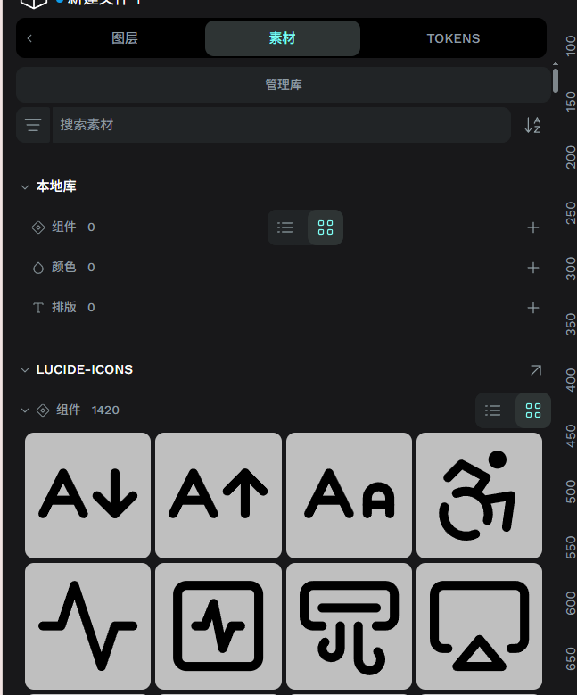

- TOKENS: 「设计」中元素属性的预设

    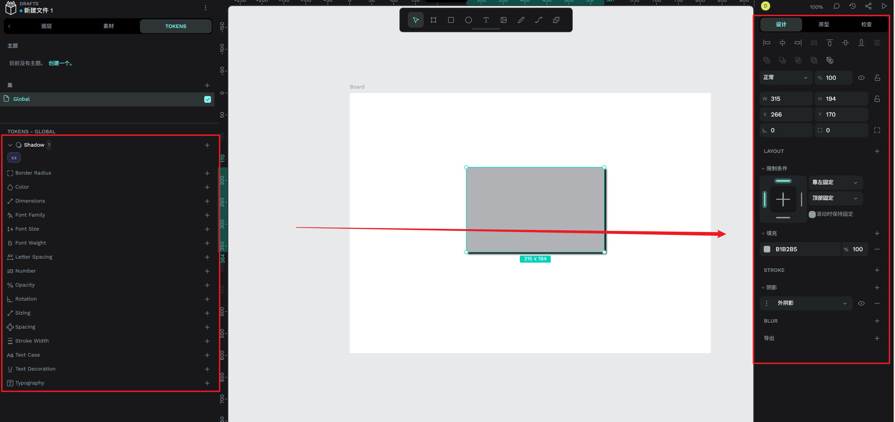

编辑面板：选中不同的面版，便会进入不同的编辑模式

- 设计：编辑 UI 元素属性
- 原型：编辑 UI 元素之间的交互关系

    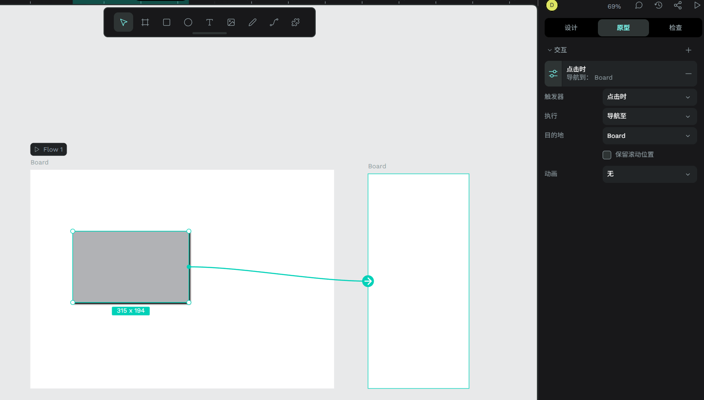

- 检查：只读展示 UI 元素坐标关系

    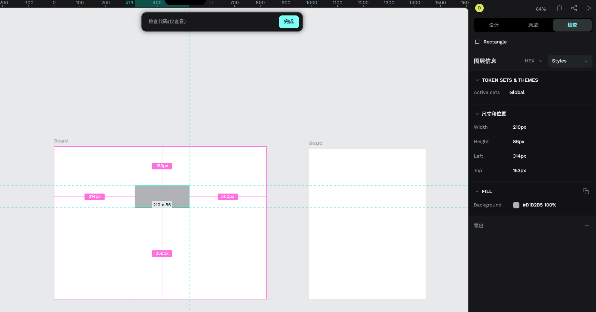

# 功能

## 元素

- **基础元素**:画布、矩形、圆形、文字、图片、路径(铅笔/钢笔)

    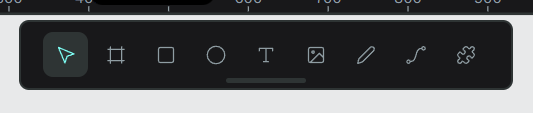

- **符合元素**
  - **组`group`**: 多个元素组合成一个整体
  - **组件`component`**: 所有组件只有一个实例，修改修改一处会同步所有组件
  - **遮罩`mask`**: 用底层元素裁剪上层元素

  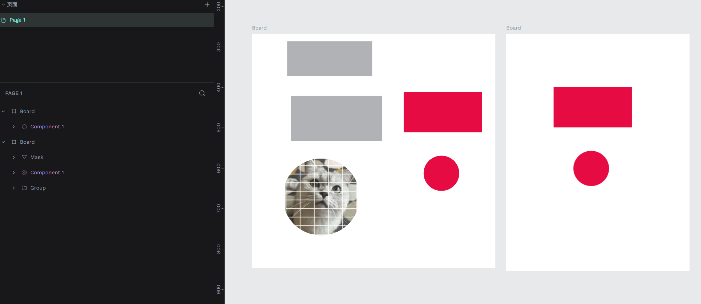


## Constraints

`Constraints` : 控件坐标位置的直接约束，当窗口大小改变时，会跟随父容器一起变化。

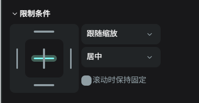

## Flex

`Flex`: 比 `Constraints` 更高级的布局方式，可以自动排列元素。

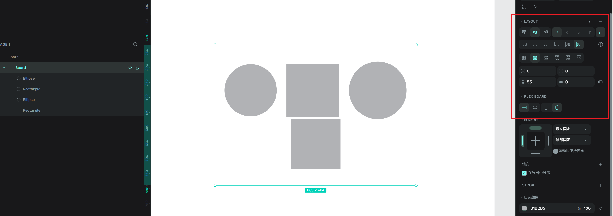

## Grid

`Grid`: 算是 `Flexl` 布局的特例，专门用于网格布局

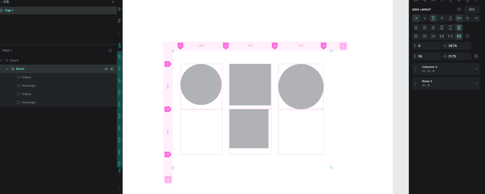


# MCP

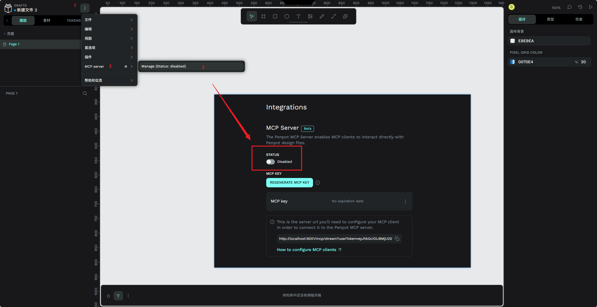