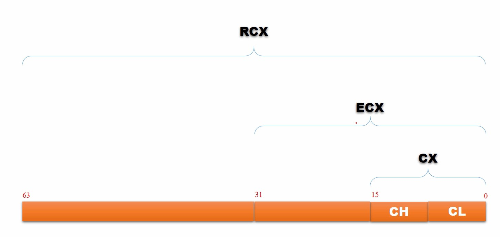
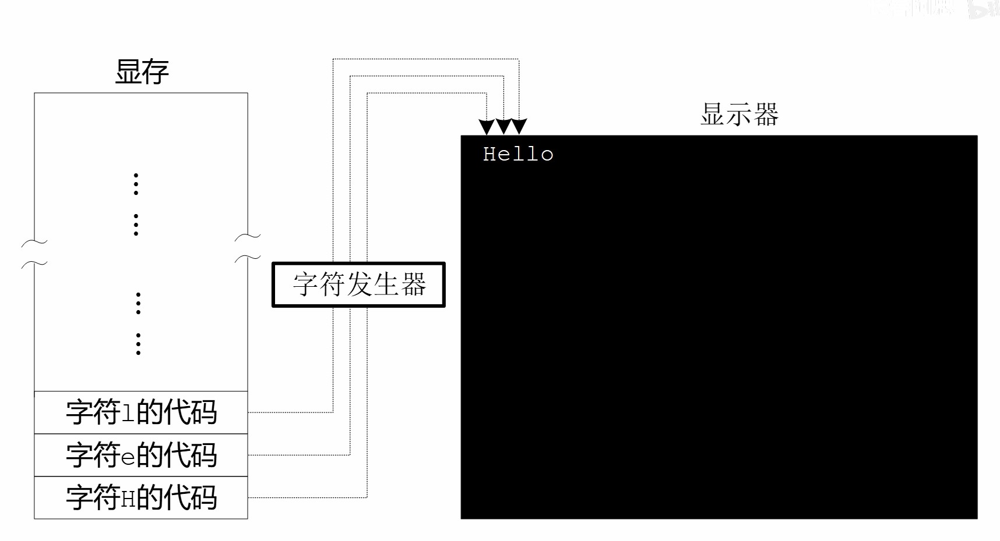
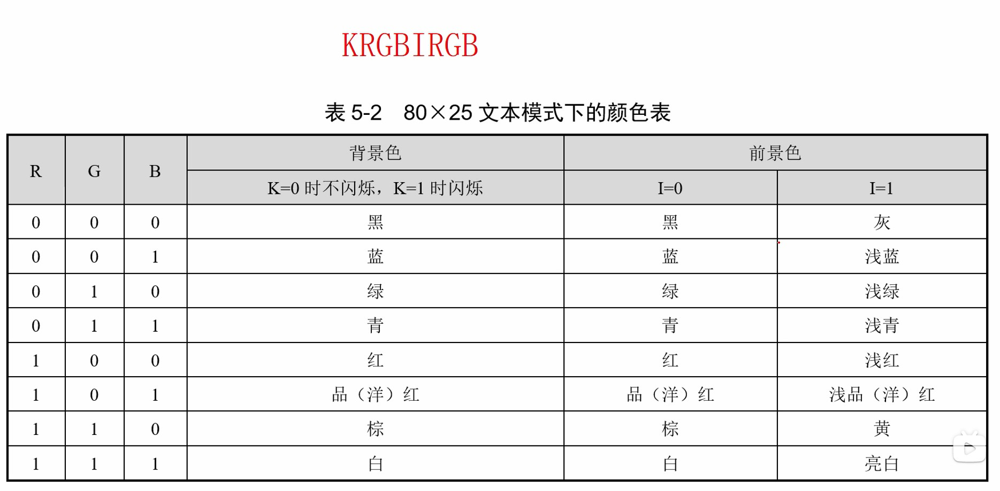
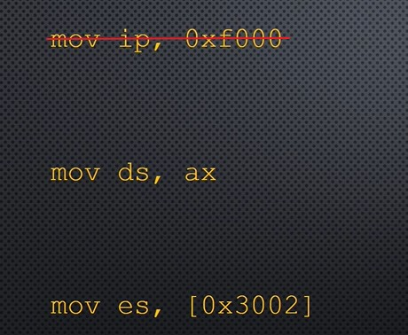
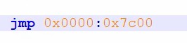
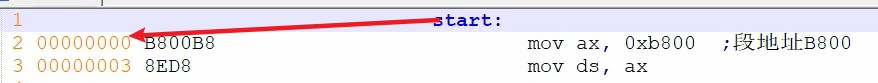
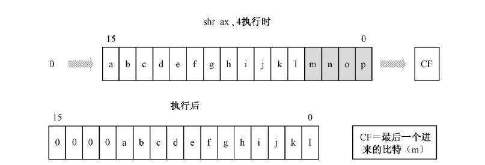
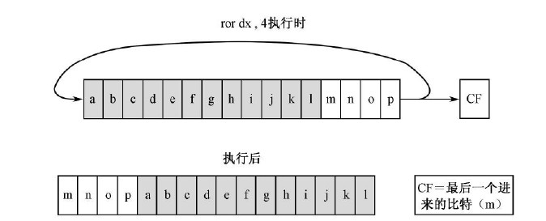

# 虚拟机

**为了运行通过nasm编译好汇编二进制文件，需要将程序加载到硬件的导引区，让cpu运行完bios后运行相关的汇编程序。** 由于该方法会覆盖掉原有的硬盘导引，操作系统就完蛋了，所以需要用虚拟机来模拟运行。

> bochs : 可以对汇编程序进行调试。
> visual box：用于创建虚拟硬盘等操作。

# 编译器NASM

编译：

```linux
    nasm -f bin 汇编文件.asm -o 输出文件.bin
```

列表文件：

```linux
    nasm 汇编文件.asm -l 输出文件.lst
```

# 虚拟硬盘

虚拟机上的硬盘以一个文件的形式进行模拟，采用 **固定分配的vhd格式** 。该格式简单，数据的存放就是按照机械硬件的 **逻辑地址** 顺序进行存放。

# 主引导扇区

对于硬盘的主引导扇区需要满足规范，才能让cpu识别并加载。**加载到内存的地址为 0x7C00**。
> 1. 主引导扇区为逻辑0扇区，即0面，0道，1扇区。
> 2. 导引头扇区的结尾的两个字节为：0x55 0xAA

# bochsdbg 调试指令

> 1. s : step 执行一步指令
> 2. c : continue 继续运行
> 3. b : break 打断点，断点打在内存地址上。
> 4. r : register 查看通用寄存器
> 5. sreg : sector register 段寄存器
> 6. xp /512xb 内存地址：查看 512 个 b 的内存，并且以 x 进行显示
> 7. u /数量: 反编译
> 8. next ： 下一步，可用于显卡调试
> 9. info eflags : 显示标志位，大写为1，小写为0

# 32位与64位寄存器



R : 64 位的扩展
E ：32 位的扩展

# 显卡

## 显卡的工作原理



显卡先读取显存上的指令，然后在屏幕上将内容通过像素点将内容绘制出来。对于图像，在显存上存储的是RGB像素信息；对于字符，显卡自带字符发生器，能够将显存上的代号转换为字符显示在屏幕上。

> 80x25显示的显存在内存上的逻辑地址为：B800:0000 到 B800:7FFF

## 字符编码

> 字符类型：最具代表的是ASCII码
> 字符样式：对于80x25的文本显示用跟随在ascii码后的一个字节（KRGB IRGB）进行设置。



# 汇编指令



## 段寄存器赋值

段地址不能直接通过 **立即数** 进行赋值。

## mov

mov 指令必须字节长度明确才能进行；不同类型的mov操作，其二进制指令集不同(可以通过列表文件查看)。

## JMP




直接使用 **JMP + 逻辑地址** 完成指令的跳转，称之为 **段间直接绝对跳转指令**。

1. 相对转移

```math
jmp \ near \ start
```
 该指令的操作数: **目标位置相对于当前指令的偏移量**。

```math
操作数 = 标号汇编地址 - jmp指令偏移地址 - 3 （Byte）\tag{8.1}
```
其中：3为该指令的长度：1个操作码 + 2个操作数。**因为当执行该指令时，IP已经指向下一条指令了，所以要将JMP指令的长度减掉，然后通过该操作数去修改IP的值：IP = IP + 操作数。**

2. 转移方式对比

    > * 段内短转移：jmp short 标号，只相对修改IP，-128字节～127字节（8位）
    > * 段内近转移：jmp near ptr 标号，只相对修改IP，32768字节～32767字节（16位）
    > * 段内绝对跳转：jmp near 寄存器,[数字]，只绝对修改IP
    > * 直接段间转移：jmp 逻辑地址，修改（CS:IP）
    > * 间接段间转移：jmp far [标号/数字，寄存器]，修改（CS:IP），**偏移地址指向两个16位数**



## 标号

标号代表了最近一行指令的 **汇编地址(汇编地址也是物理地址中的偏移地址)**，并且其数值可以在汇编中使用。

## div

3. 16位除以8位
    > * 被除数：AX
    > * 除数：8位通用寄存器或8位内存
    > * 结果：商存AL，余数存AH
4. 32位除以16位
    > * 被除数：高16位在DX，低16位在AX
    > * 除数：16位通用寄存器或16位内存
    > * 结果：商存AX，余数存DX

## DB,DW,DD,DQ(伪指令)

用于在 **程序段** 声明存变量的空间：**内存地址就是当前的汇编地址**。
> D : declare
> B : byte
> W : word
> D : double word
> Q : quad word

## []

**支持[寄存器]的寄存器有：BX,SI,DI,BP；其余的全部非法**
> [偏移地址]：段内地址取值，DS + 偏移地址
> [段地址：偏移地址]：段间地址取值，段地址 + 偏移地址

## xor

规则：
> 0 xor 0 = 0
> 1 xor 0 = 1
> 0 xor 1 = 1
> 1 xor 1 = 0

## movsb,movsw

进行段间批量搬运数据，movsb：字节，movsw：字。数据搬运还要指定传输方向：正向，SI与DI加1或2；反向，SI与DI减1或2。

> 一次指令，只运行一次
> 原数据的地址：DS:SI
> 目标的地址：ES:DI
> 传输数目：CX
> 正向/反向传输：DF

## rep(repeat)

重复指令：CX为0则停止，不为0则重复。

## loop

 loop 的指令跳转同 jmp near 是相对位移跳转。

> cx--
> cx为0：跳出循环；否则，跳到指定位置

## cbw,cwd

将有符号数的符号位向高位填充。
> cbw：al 转 ax
> cwd：ax 转 ax dx

## jcc指令族

**执不执行转移，与对应的标志位有关。** 例如：与SF有关的jcc：
> jns：SF = 0，则跳转
> js：SF = 1，则跳转

其他指令族：je,jne,jg,jge,jng.....

## cmp

**两个值做减法，然后修改标志位。与sub的区别是：不会保留计算结果。** 之后就通过jcc指令族完成相关指令跳转。

## push,pop

只能操作 **字，双字，四字。**

5. push
    > 1. SP首先运算：SP = SP - 2；**无符号运算**
    > 2. 根据字节序写入数据

6. pop
    > 1. 根据字节序弹出数据
    > 2. SP运算：SP = SP + 2；**无符号运算**

## section,segment

在汇编中声明一个段：数据段，代码段，栈段..都行。

> section [名称] align=16 vstart=0
> section.[段名].start: 段的起始汇编地址
> * align:指定对齐方式，就是段地址二进制下偏移了多少个位
> * vstart:表示该段的汇编地址的起始位置：是以当前段为起始，还是以整个汇编程序的开头为起始。

## in,out

in: 从端口读取数据
> 1. 读取的目标寄存器：AL，AX
> 2. 端口的存放寄存器：DX (**只有一个寄存器，说明端口的总个数有上限**)

out：将数据写入端口
> 1. 写出数据的寄存器：AL,AX
> 2. 端口的设置：8位立即数，DX

## call

调用函数，靠 **ret/retf** 返回。

7. **16位相对近调用**

    > call near 标号 / 数字（由于编译器会直接将标号转为数字，所以数字是一样的）
    > 段内调用
    > 范围：**16位有符号数偏移**，-32768 ~ 32768

    > 偏移的计算：
    >> 1.  指令的操作数 = 跳转的汇编地址 - call当前的汇编地址 - 3 ：**计算的是指令到要跳转的位置之间的间隔，所以要减掉指令的长度。**
    >> 2. IP = IP + 指令的操作数 + 3 ：**当前用于计算的IP是偏移到cal指令的值，下一次IP就要跳转到目标指令，所以还要加上指令的长度。**

8. **16位间接绝对近调用**
    > call 寄存器 / [数字]
    > 段内调用
    > 范围：该段的所有位置都能跳转，**因为 IP = 寄存器/[数字]**

9. **16位直接远调用**
    > call 偏移量:段地址
    > 段间调用

10. **16位间接远调用**
    > call far [标号 / 数字，寄存器]：**偏移地址指向的是一个预先定义好的32位值：偏移量，段地址。**
    > 段间调用

## adc

带进位的加法。

## shr/shl



## ror/rol



# 标志寄存器FLAGS

## ZF(zero flag)

> 第6位
> 当计算结果为 0 时，ZF = 1

## DF(direction flag)

> 第10位
> 控制movsb与movsw的方向: 0 正（指令：cld），1 负（指令：std）

## SF(sign flag)

> 记录计算结果的最高位

## PF

> 计算结果的 **低8位** 1的个数为偶数：1，奇数：0

## CF

> 计算发生 **进位** 或者 **借位** ：1

## OF

> 溢出标记位，发生溢出就为：1

> **溢出：在进行有符号运算时，计算结果超出了寄存器的长度界限，也就是有符号计算结果错误。**
```math
01110000 + 01110000 = 11100000 \tag{9.1}
```
## IF

> 0 : 屏蔽所有的INTR中断
> 1 : 接收所有INTR中断

# 负数

11. 二进制编码

    对于有符号数，由最高位的标志来区分，0：正，1：负。**对于负数在计算机中的表示就为：0 - 正数**

    **用0进行二进制减法，然后无限的向前借位（指令：neg）**
    > 负数编码：00000000 - 00001100 = 11110100
    > 解码负数：00000000 - 11110100 = 00001100

12. 低位向高位扩充(cbw,cwd)

    **将标志位向高位进行复制就行。**
    > 8位：10000010 --> 16位：11111111 10000010
