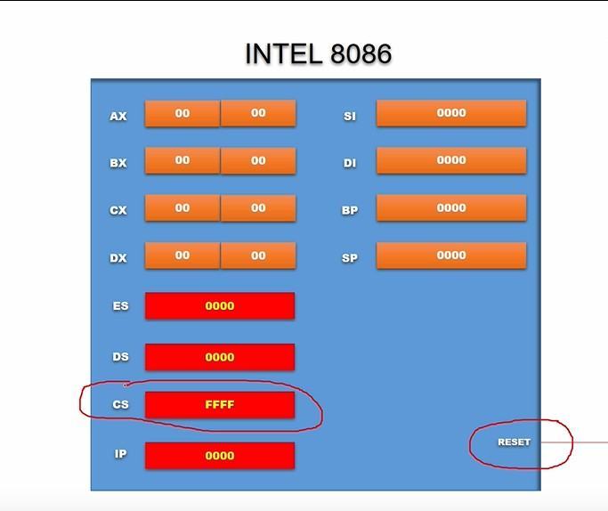
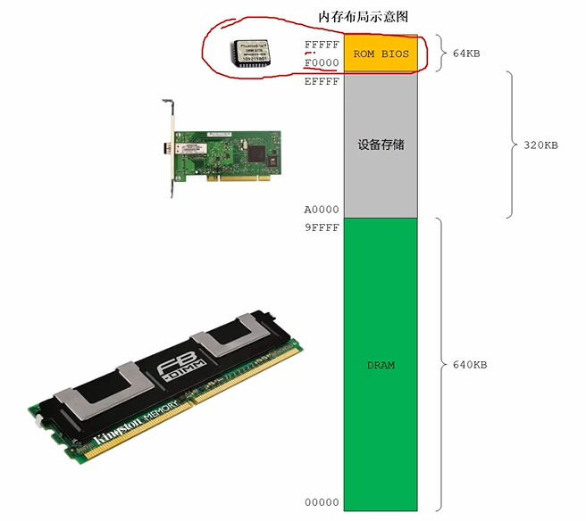
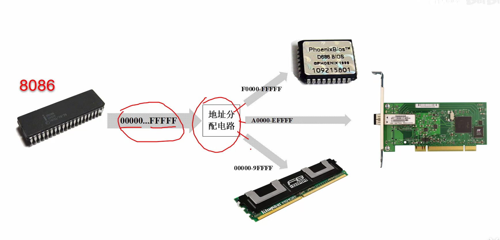
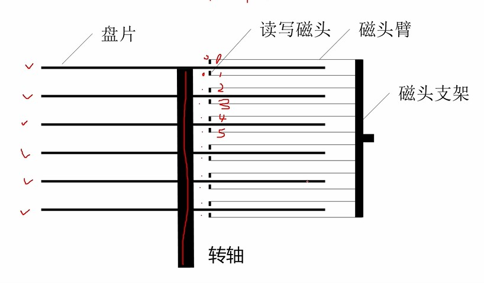
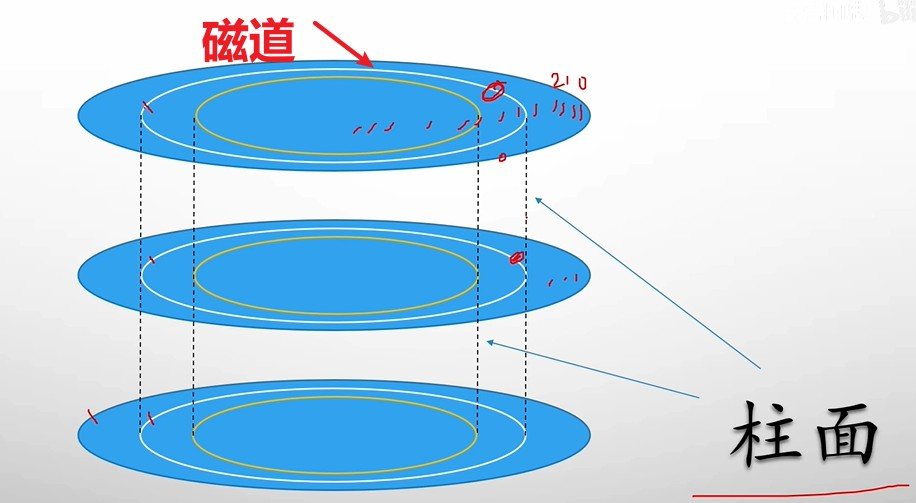
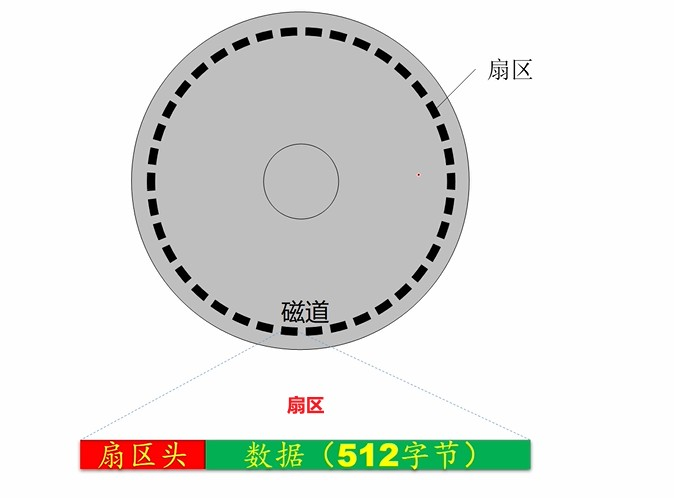
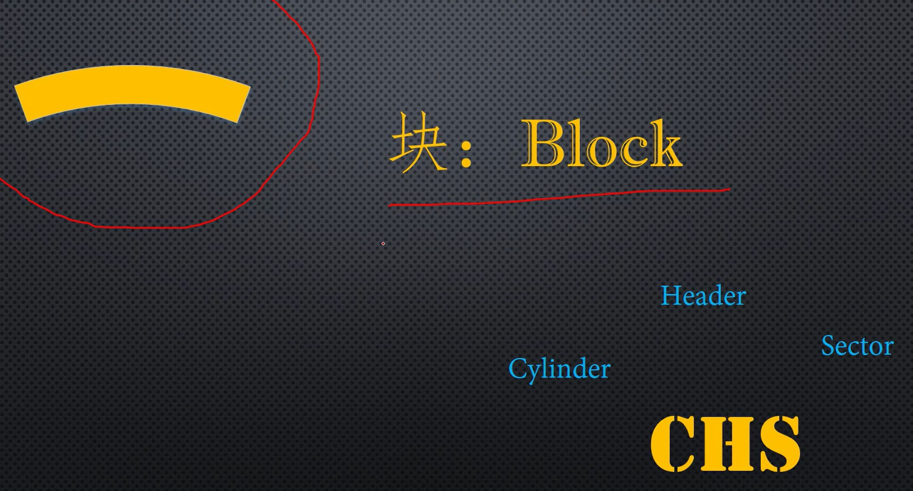
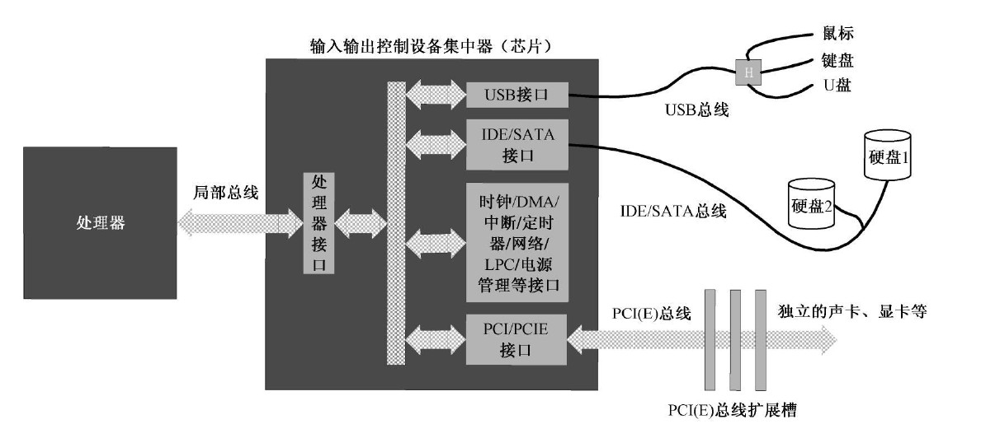

# 8086计算机的加电和复位

通过 **rest** 引脚，可以对cpu进行复位操作。**reset会使得cpu的寄存器恢复默认值，并且cpu一上电就会加载默认指定的内存段中的指令。** 8086一上电就会加载 FFFF:0000 处的指令。

# 地址分配

8086cpu能识别1MB的地址，**但是这些地址不是集中在一个硬件上的，而是在不同的硬件中进行分配，例如内存条，显卡，硬盘，声卡，网卡等等。**

## DRAM

依靠**晶体管+电容**储存0与1，无法断电后保存数据。

## ROM

**断电后还能存储数据。** 根据需求不同，可以进行电擦除等手段重写数据。

# BIOS

8086首先 **调用#FFFF0处的ROM芯片中(FFFF:0000)** 的指令，这些指令就是用于内存，键盘，鼠标等硬件启动，是最基础的指令，因此 **又将其称之为BIOS（基础的输入输出系统）**。

> **当BIOS将硬件设置启动完毕后，最后一条指令就是去加载硬盘的主引导扇区，准备开始加载硬盘中的操作系统。**

对于32位系统而言，为了兼容16位的系统，**加电后CS：#F000，IP：#FFF0**。20位地址线就是#FFFF0，对于32位地址线而言（#000FFFF0）会将其余0位都强制变为F（#FFFFFFF0）。这样就能实现32位与16位的一致性：**最高的16B内存都分配给了ROM，用于初始化启动，保证了之后所有的地址的连续性。**

# 硬盘

## 机械硬盘结构

机械硬盘盘片的两面都能依靠磁道存储数据。1) 盘面，磁头，磁道的编号都是从0开始。2）由于磁头都是靠支架转动而转动，所以将在同一直径下的所有磁道组成的圆柱称之为柱面，数据的存储是以柱面的结构在不同盘面上进行读写的。

每个磁道又分为多个扇区，一般为63个扇区，**并且编号从1开始**。扇区头会记录当前磁道的位置，盘面的位置，扇区的位置，扇区的好坏等信息。

## 扇区的编号

机械硬盘对于数据块（block：扇区）的访问在物理结构上就是靠柱面（cylinder），磁头（header）和扇区（sector）一级一级的查找，但是这样不方便编程。**所以，为了程序查找方便，引入了逻辑块地址（Logic block address）来对所有扇区进行编号，方便查找。**

# I/O设备接口

处理器和外部设备交换信息，不是直接通过线路连接的，而是通过 **总线(bus)** 连接 **输入输出控制设备集中器（I/O controller hub，南桥）** 提供的 **IO接口** 与外部设备进行连接。

# IO端口

 **端口（Port）** 就是放置在外围设备上的寄存器，cpu就是通过接口连接，然后操控这些端口，实现对外围设备的控制。

> * 端口具有统一的编号
> * 一个端口的长度，设备厂商自己设定，无要求。
