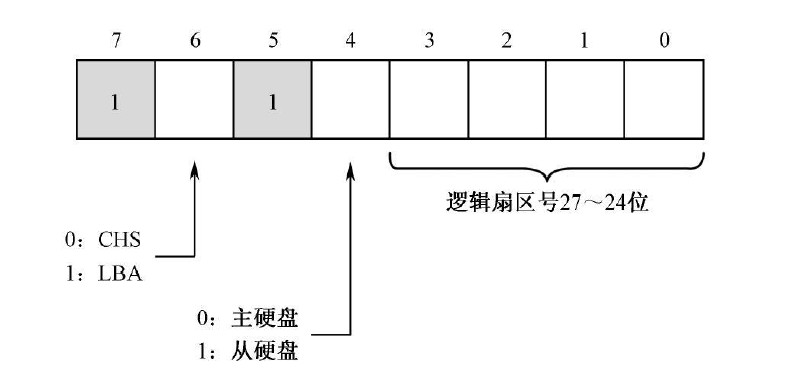
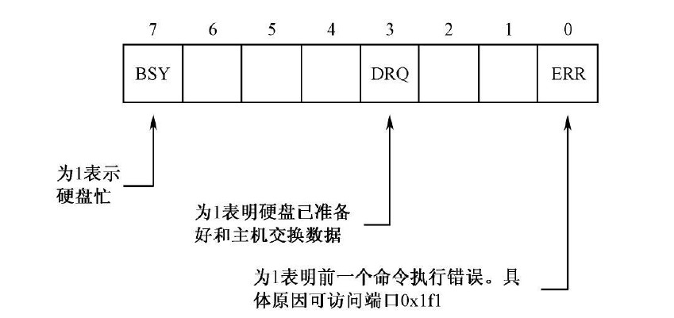
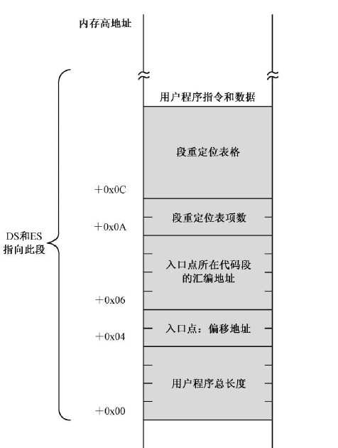

# 分段

在代码中通过 **section** 进行段的声明，声明后的段能够根据 **align** 自动去寻找到相应的 **汇编地址**，中间空余的部分都使用 **#0** 进行填充。

# 段地址计算

方案一
> 1. 8086的地址线为20根，所以需要使用两个字节来储存最原始的段地址：dx:ax
> 2. 使用32位的除法，除以 16；即将原始地址向右移动4位
> 3. 存储在ax中的16位数，就是需要的段地址

方案二
> 1. 将程序的20位汇编地址存入：dx:ax，**然后在加上代码在内存中的首地址(高位dx要用dac加法指令)**（将汇编地址映射到了实际的内存地址上）
> 2. ror移动dx，shr移动axl : 实现32位的左移4位
> 3. and dx,0x8000 : 只保留最高的4位
> 4. or dx,ax : 合并dx与ax

# IO端口的访问

# IO端口的访问

> 方案一：映射内存。将端口这些寄存器映射到内存上，处理器之间进行读写。
> 方案二：独立编址。处理器配置了一个引脚 **M/IO#(#:低电平有效)** 来切换内存和端口的地址。

# 硬盘数据的读取

    > 端口：0x1f2
    > 位数：8位
    > * 对于硬盘数据以 **扇区** 为单位进行读写。

1. **设置LBA（逻辑扇区地址）扇区号**
    > 端口：0x1f3 ~ 0x1f6
    > 位数：8位
    > * 8086处理器使用的LBA编号方案是LBA28：**使用了28位来给扇区编号，所以端口8位的端口要4个。**

    > * 端口0x1f6：前4位用来编号；**第4位切换硬盘（支持两块硬盘）**；最高3位用来切换编号方式。

2. **向硬盘说明读/写**

    > 端口：0x1f7
    > 位数：8位
    > * 读：0x20；写：0x30

3. **等待操作完成**

    > 端口：0x1f7
    > 位数：8位
    > * 该端口还可以作为 **状态端口**

4. **读/写数据**
    > 端口：0x1f0
    > 位数：**16位**
    > * 就靠该端口循环一个一个地读/写数据。**持续至少一个扇区**

# 从硬盘加载程序

## 用户程序的头部

加载器和用户程序是两套分开的程序，会有不同的厂商进行编写，**所以加载器加载用户程序，就需要用户程序满足一定的规范并提供相应的程序信息，这些东西就写在程序的头部段内。**

> 1. 程序的总长度：有多少个字节。
> 2. 应用程序的入口点：第一条程序的 段地址( **首先使用编译的，之后还要根据实际内存位置进行修改** ):偏移地址
> 3. 段重定位表：段的总数+段的汇编地址。提供一个程序编译后的编译段表，用于加载器重新计算，这些段在实际内存中的段地址。

## 用户程序的加载运行

> 1. 计算程序加载位置的 **段地址**
> 2. 设定程序头所在的 **LBA号**
> 3. 加载用户程序的 **储存用户程序最开始的扇区**（ 该扇区包括程序的header段，还有其他的代码段 ）
> 4. 解析用户程序长度信息，根据长度信息计算扇区个数：
>> * 扇区数为1：程序总长度不足 512时，已经读取完毕
>> * 扇区数为整数：剩余扇区数 = 计算扇区数 - 1
>> * 扇区数为小数：剩余扇区数 = int(计算扇区数)
> 5. 读取剩余的程序代码到内存
>> **为了防止偏移地址出界，每读取一个扇区，就将 ds 偏移 0x20（512），并且偏移地址从0开始**
> 6. 重计算代码段的 **入口点段地址**
> 7. 用户程序重定位：**段列表的内容根据实际内存地址进行重新计算。**
> 8. 使用 jmp 跳转到程序的入口

## 执行用户程序

> 1. 根据修改后的 **段列表**，初始化**SS，SP**。
> 2. 根据修改后的 **段列表**，初始化**DS**。
>  初始化的顺序不能变。 
> 3. 最后交给处理器执行用户程序。
