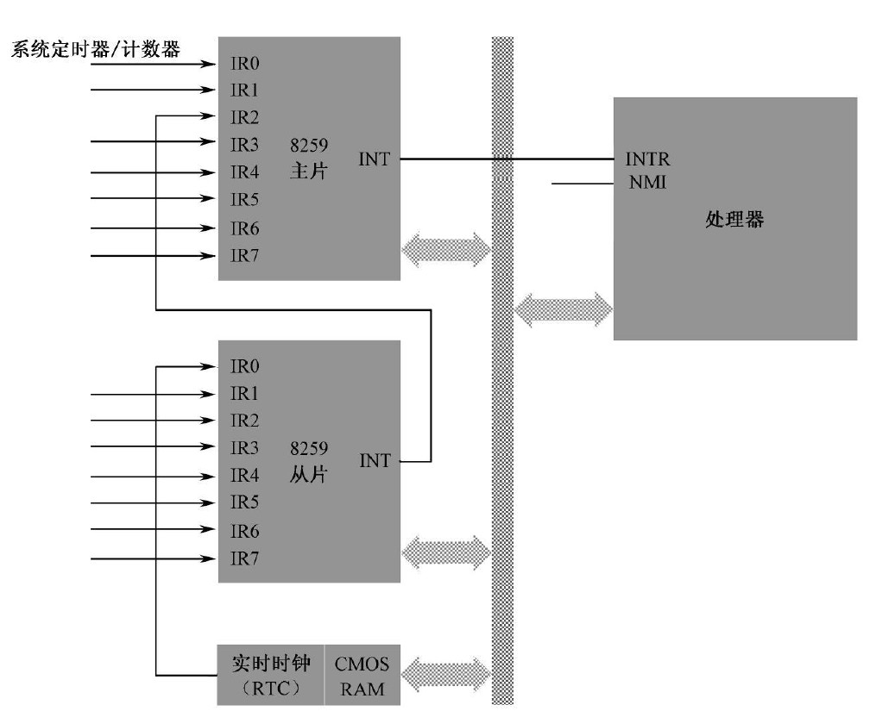
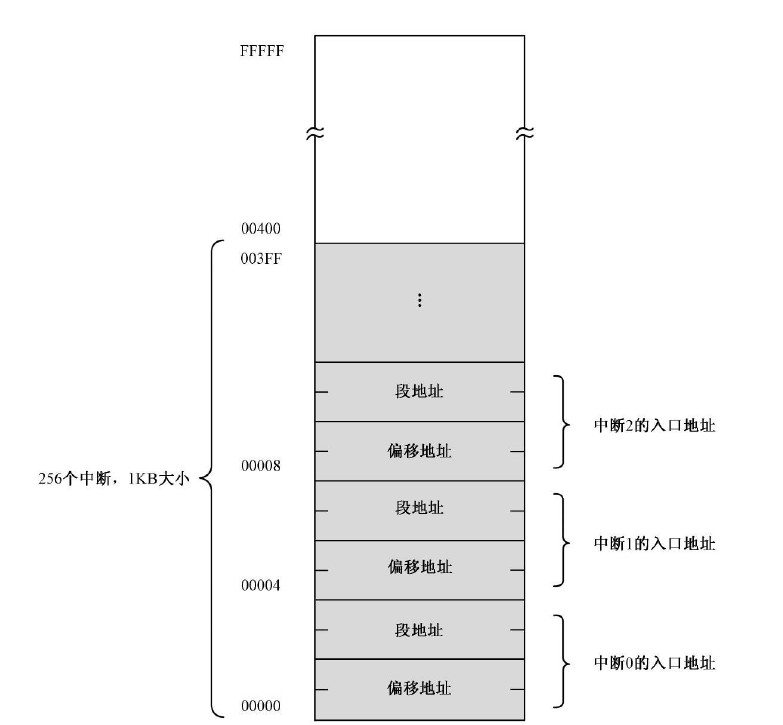

# 外部硬件中断（硬中断）

## 非屏蔽中断（Non Maskable Interrupt: NMI）

NMI中断用来处理计算机遇到的最严重的问题，一般情况下触发这类中断的问题，计算机基本上已经无能为力处理了。
* NMI中断靠一个 **与非门** 触发：**高电平触发，且要维持4个时钟周期以上认为中断信号有效。**
* 各个中断信号靠 **与** 进行连接，且 **低电平有效（设备完蛋，就没电流了）**
* NMI的中断号就一个：**2**

## 可屏蔽中断（INTR）

主要特点：
* 处理的中断类型多
* **可以在中断芯片中，对中断进行屏蔽**。
* 中断号靠程序自定义。
* 中断影响程序次于NMI，计算机内部可调控。

代表性中断芯片8259：
* 两个8259芯片为：主片（master），从片（slave）
* 两个8259芯片处理 **256个中断** 的其中 **15个**。
* 中断屏蔽寄存器（interrupt mask register，IMR）：8位，对应了8个输入的中断信号，0允许，1屏蔽。
* 标志位 **IF** 能对所有INTR的中断进行屏蔽。
* 中断优先级：主 > 从，IR0 > IR1 > .. > IR7

# 中断向量表

## 向量表

**中断函数的首地址，储存了：程序段地址：程序偏移地址。**
* 一个中断的入口为两个字节：程序段地址：偏移地址
* 中断向量表位置：0x0000:0x0000 ~ 0x0000:0x03ff (256 * 2)

## 向量表的初始化

向量表的初始化由BIOS完成，会为每个中断号填入入口地址：**iret** 指令。 就是说，之后中断的设置，需要程序自己定义。 

# 中断运行流程

   准备好中断的程序，并添加中断向量表。

1. **接收中断信号**
   cpu收到中断，执行完当前指令后，识别出中断号。 NMI 不会去识别中断号，处理器直接赋予中断号2 。

2. **保护现场**
   将FLAGS压栈；清空IF和TF（陷阱标志）；将当前的CS:IP压栈。

3. **跳转中断程序，执行程序**
   CS = 0x0000；IP = 2 * 中断号。

4. **返回原来的程序**
   执行iret；从栈中恢复CS:IP，FLAGS。

# 其他中断

内部中断
* 定义： 发生在处理器内部，由执行指令触发。
* 不受IF标志控制。

软中断
* 定义： 由**int**指令触发。
* 通过程序，人为可控的触发相应中断。

BIOS中断
* 定义：在BIOS程序加载时，配置的中断。
* 可用于之后的程序，通过 **int** 进行调用使用。（就可以当成BIOS提供的底层接口函数。）
