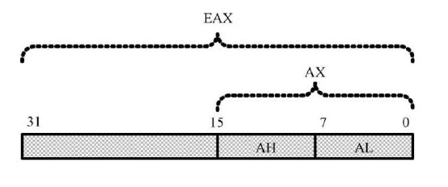
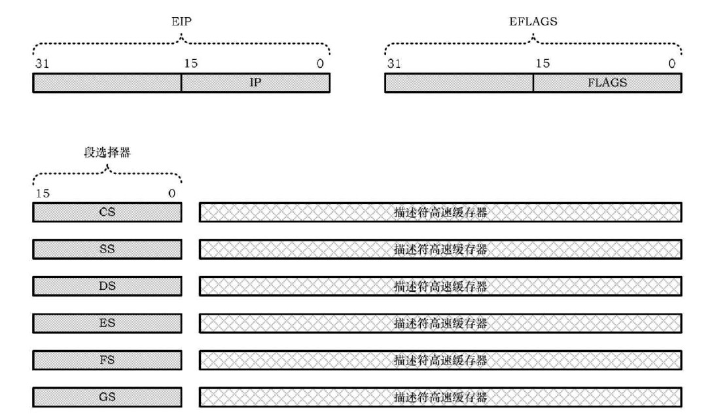
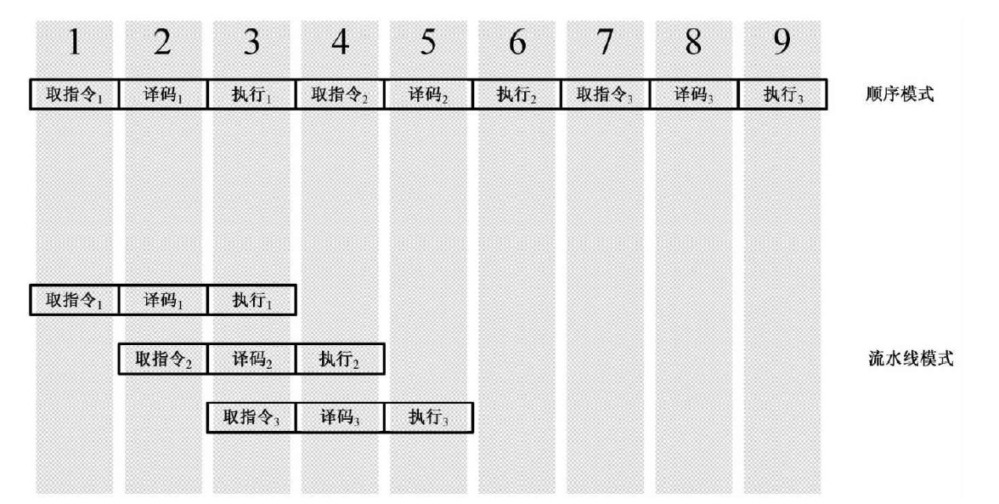
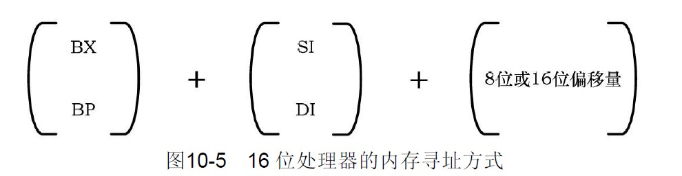
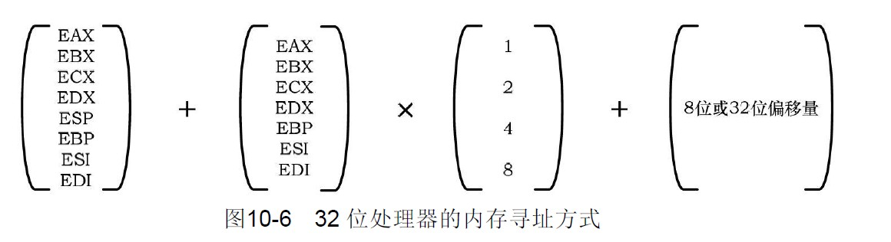

# 实模式

8086架构的操作模式，就是实模式，内存访问没限制，不安全。

# 寄存器

> * 长度由16扩展到 **32**
> * 通用寄存器的**高16位不能拆开用，低16位兼容8086**
> *  地址线 32 根，所以IP扩展到EIP(32位) 
> * 标志寄存器扩展到32位
> *  段寄存器变更为段选择器（EIP已经是32位，不用段也能访问所有地址）。由原来的16位 + 描述符高速缓存器组成。
> * **描述符高速缓存器：用户不可见部分，储存了真正的段地址和各种访问属性。**

# 流水线

**处理器只负责计算，因此可以将一条指令拆分成多个片段，然后各器件就能同时运行，加快指令执行速度。**  由于流水线技术的投入，指令的执行也不是单纯的顺序执行（一条一条的运行），而是乱序执行：指令拆分成的多个微操作不是顺序执行的。 **名义上只有那几个寄存器名字，但实际指令运行时，还有许多未命名的临时寄存器，这些寄存器会被处理临时命名，然后加以利用。**

# 缓存

硬盘的数据读取速度相对于DRAM和寄存器来说 **速度极其缓慢**，完全跟不上处理器的运行速度，为了弥补这一点，引入 **缓存来预先加载硬盘中的数据**。预先取数据又产生了 **分支目标预测技术**。

