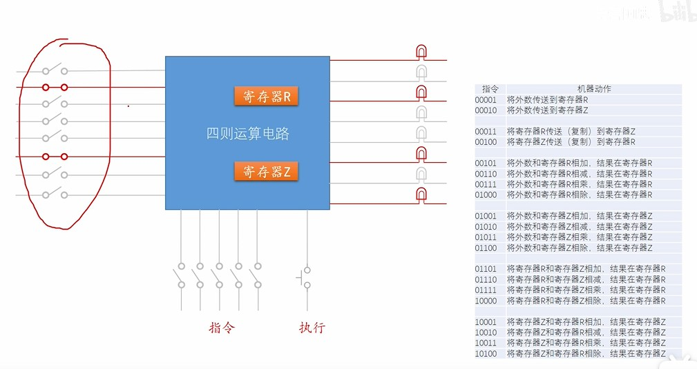
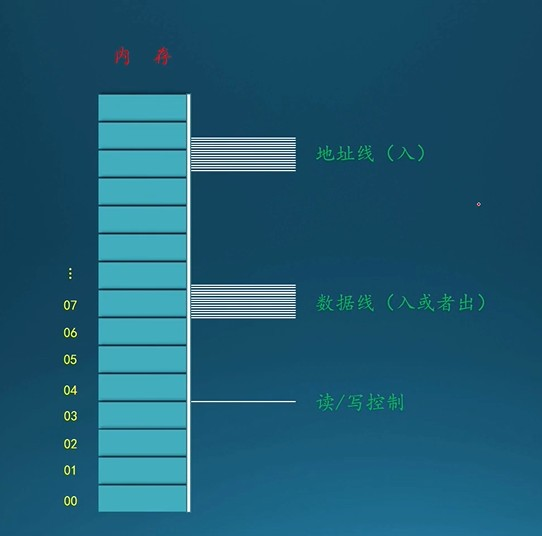
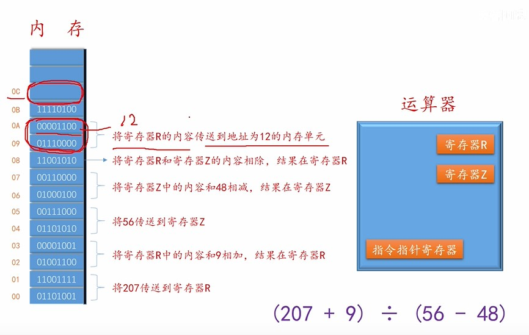
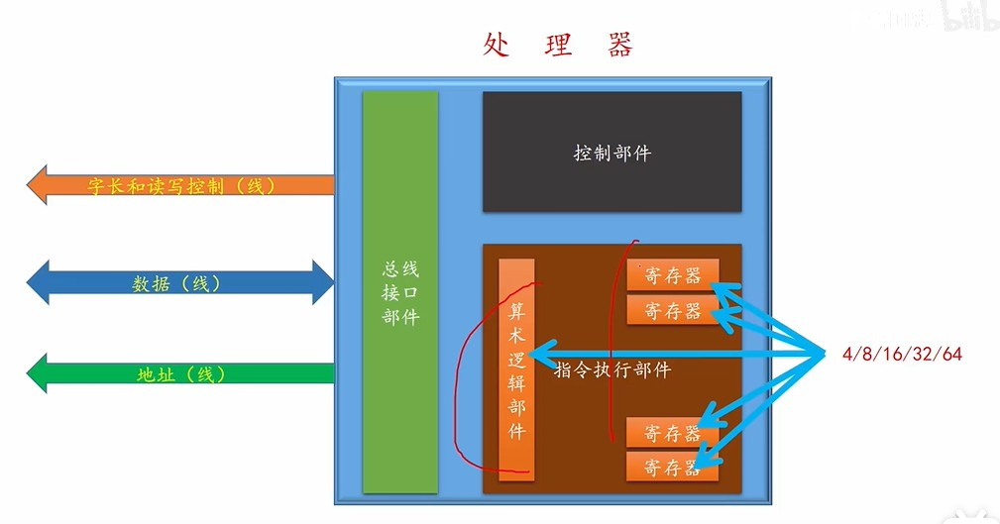
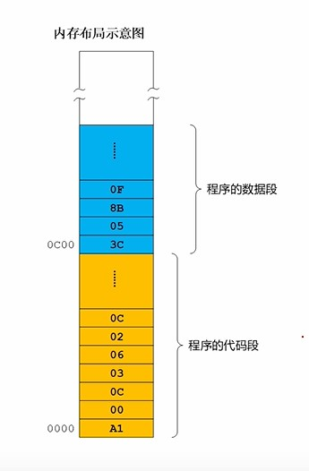
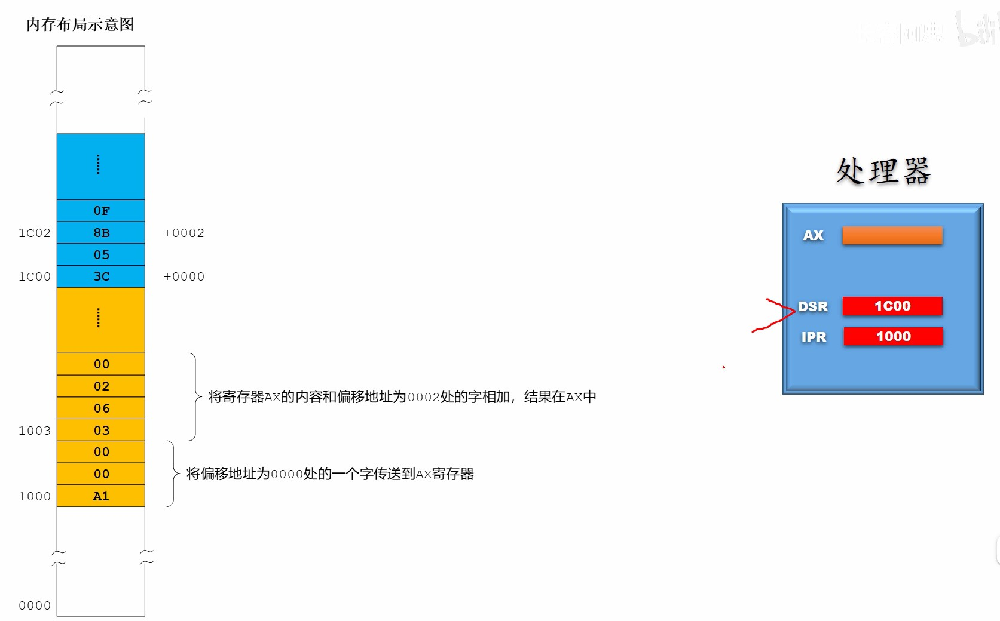
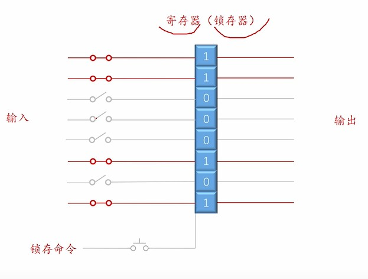
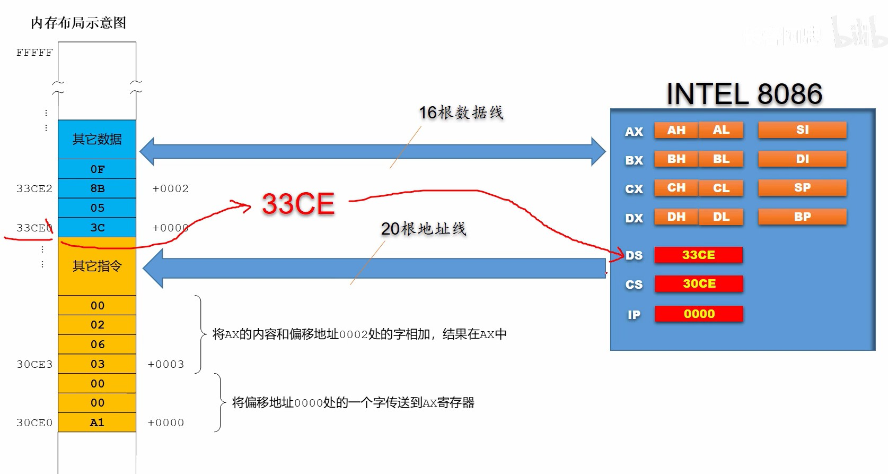
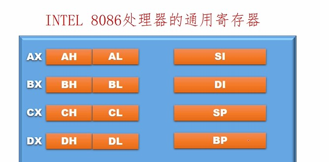
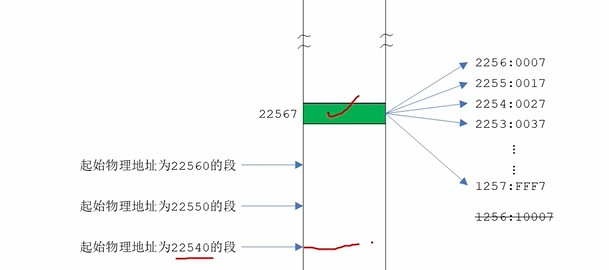

# 指令




当使用涉及一个寄存器的计算器时，可以通过定义不同操作的开关来完成计算；当涉及多个寄存器进行计算时，每个操作设置一个开关就会很丧病狂，所以就可以对这些操作进行编号，减少输入量。这些编号就是指令。

> * 指令集：所有指令的集合
> * 算数运算指令和逻辑指令
> * 数据传输指令
> * 处理器状态指令

# 内存



* 地址线：用于访问地址
* 数据线：读写内存中的数据
* 读写控制：切换读写模式

> 字节序：字节的存储顺序
> * 低端字节序：数据的高位对应高位内存，低位对应低位内存
> * 高端字节序：数据的高位对应低位内存，低位对应高位内存

# 处理器



## 自动执行指令处理器

使用内存来存储一段指令（程序），然后靠运算器自动读取指令，进行数学运算。
```math
指令 = 操作码 + 操作数 \tag{3.1}
```
立即数就是一类操作数；操作码就是操作的指令。



## 处理器

4位，8位，16位，32位，64位：就是指寄存器，算数运算的数据长度。

> 16位：8086CPU
> 32位：80836（i386）

# 8086处理器




## 程序的存储

一个程序在内存的存储大体主要分为**程序段与数据段**。



## 数据段的重定位

在处理器中会分配出两个寄存器：1）一个用于存储下次指令的首地址；2）一个用于存储数据段的起始地址。**对于程序段中存储的数据信息为数据首地址相对于数据段起始地址的偏移量，这个就能实现程序在内存中的浮动加载。**

```math
真实地址 = 段地址 + 偏移量 \tag{4.1}
```


# 寄存器

## 触发器



启动触发器开关后，触发器会锁存当前的输入，并一直记住该输入，直到下一次锁存数据。



改进触发器，用于临时储存一个数据。

## 段寄存器

对于8086而言，有20根地址线，能访问1MB的内存。**由于寄存器为16位，不是所有的地址都能作为段地址。能作为段地址使用的是16进制的低位为0的地址，例如（33CE0）将低位的0抹掉，（33CE）放入段地址寄存器中。**
> DS：存储数据段的段地址。
> CS：存储代码段的段地址。
> ES：储存显卡内存的段地址。
> IP：存储代码指令的偏移量。（数据的偏移量已经存储在代码中）


> SS：stack，栈的段地址

段地址的表示为：**段地址:偏移量**。**一个段地址最大能访问64KB内存。**

## 通用寄存器

AX,BX,CX,DX,SI,DI,SP,BP；均为16位（一个字长）的寄存器。其中AX,BX,CX,DX可以拆开为两个的8位的寄存器使用：高位H，低位L。

> AX：accumulator，累加寄存器
> BX：base，基寄存器
> CX：counter，计数器
> DX：data，数据寄存器
> SI：source，源寄存器


> DI：destination，目标寄存器
> SP：栈的偏移指针
> BP

## 寄存器其他规范

> **1. 能提供偏移地址的寄存器：BX，SI，DI，DP**
> **2. 段地址不能直接通过 立即数 进行赋值**
