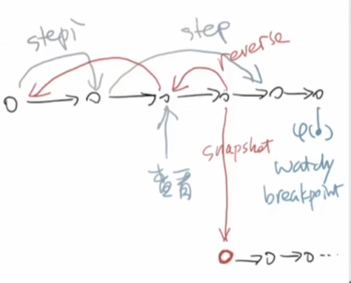

# 操作系统


# 系统加载

## CPU 初始化

**CPU Reset** : CPU 存在一个初始状态，即寄存器存在一个初始值
- PC : 0xfff0，加载第一条指令的入口地址，开始执行的这个程序是 ROM 里面的程序
- EFLAGS : 0x0002，中断关闭 


## Firmware

**固件 (Firmware)** ：ROM 里面的程序，由硬件厂商提供，用于支持启动操作系统
- Legacy BIOS
- UEFI (unified extensible firmware interface)

**Legacy BIOS**：
- 查看存在操作系统的磁盘，主引导区的 512 字节以 `0xaa55` 结束
- 将第一导引位磁盘的主引导扇区里的512个字节搬运到内存的 `0x7c00` 位置，且 PC 设置为 `0x7c00`
- 主引导扇区的程序就开始搬运操作系统到内存

**UEFI**: 几个大厂商达成的协议，都按照这个标准来加载硬件，硬件厂商也可以根据这套协议添加自己的硬件，安全性更高。

>[!tip|style:flat]
> 操作系统启动顺序：
>
> CPU 启动 --> 固件 --> boot loader --> 操作系统

# 操作系统状态机

## 模型

状态机模型：
- 状态：共享内存 $M$ 和每个处理器 $R_t$ 的内部状态

$$
    (M, R_0,R_1,\dotsm)
$$

- 状态迁移：
    1. 一个处理器运行一步
    $$
    (M, R_0,R_1,\dotsm) \rArr (M, R_0',R_1,\dotsm)
    $$
    2. 响应中断


## 中断

进程上下文切换的中断模拟程序

```cpp
// 处理器的运行环境
struct Context
{
    // 寄存器
    unit64_t rax,rbx,rcx,rdx;
};

// 进程描述
typedef union task
{
    struct
    {
        const char *name; // 进程名
        union task *next; // 下一个进程
        void (*entry)(void *); // 进程调用的函数
        Context *context; // 进程当前运行的寄存器状态
    };

    // 堆栈
    uint8_t stack[8192];
} Task;

// 每个cpu正运行的进程
Task *currents[MAX_CPU];
// 获取当前 cpu 运行的进程
#define current currents[cpu_current()]


// 自旋锁
int locked = 0;
void lock()
{
    while (atomic_xchg(&locked, 1))
        ;
}
void unlock() { atomic_xchg(&locked, 0); }

// 进程函数
void func(void *arg)
{
    while (1)
    {
        lock();
        printf("Thread-%s on CPU #%d\n", arg, cpu_current());
        unlock();
        for (int volatile i = 0; i < 100000; i++)
            ;
    }
}

// 进程
Task tasks[] = {
    {.name = "A", .entry = func},
    {.name = "B", .entry = func},
    {.name = "C", .entry = func},
    {.name = "D", .entry = func},
    {.name = "E", .entry = func},
};

// 进程上下文切换中断
Context *on_interrupt(Event ev, Context *ctx)
{
    // 进程全局变量
    extern Task tasks[];

    if (!current)
        // 当前cpu没有执行任务，就把一个进程给它
        current = &tasks[0];
    else
        // 当前cpu有进程，就把当前的 context 状态保存
        current->context = ctx;

    // 根据cpu编号选择下一个要执行的进程
    do
    {
        current = current->next;
    } while ((current - tasks) % cpu_count() != cpu_current());

    // 返回选中进程的运行环境，实现进程切换
    return current->context;
}

void mp_entry()
{
    // 开启中断
    iset(true);
    // 主线程退出，让多处理器模拟程序跑起来
    yield();
}

int main()
{
    // 注册中断
    cte_init(on_interrupt);

    // 初始化 cpu
    for (int i = 0; i < LENGTH(tasks); i++)
    {
        Task *task = &tasks[i];

        // 初始化进程状态机
        Area stack = (Area){&task->context + 1, task + 1};
        task->context = kcontext(stack, task->entry, (void *)task->name);

        // 进程指向下一个进程
        task->next = &tasks[(i + 1) % LENGTH(tasks)];
    }

    // 程序入口
    mpe_init(mp_entry);
}
```

## 状态机的应用

### 处理器优化

程序是不管在源码还是二进制都满足状态机模型，而状态机只用严格保证行为上输入与输出一致。这样cpu就又能搞事情了，可以在同一时钟周期内执行多条指令，而非一个条，进一步加速程序的运行。cpu 频率 4.5G 就是说 cpu 在一秒钟可以执行 4.5G 次，假如cpu运行一次可以执行2条指令，那么一秒钟cpu就能运行 9G 条指令，程序运行速度优化效果十分明显。


### 调试




```term
triangle@LEARN:~$ gdb
(gdb) record full # 开始记录
(gdb) record stop # 停止记录
(gdb) reverse-step
(gdb) reverse-stepi
```

### 性能统计


操作系统利用中断，每个一段时间去统计一下程序状态机的运行状况，就能将程序性能消耗情况统计出来。根据统计结果，就能判断那部分是需要优化的

```term
triangle@LEARN:~$ pref stat ./a.out
triangle@LEARN:~$ pref record ./a.out // 记录统计结果
triangle@LEARN:~$ pref report ./a.out // 查看统计结果
```


