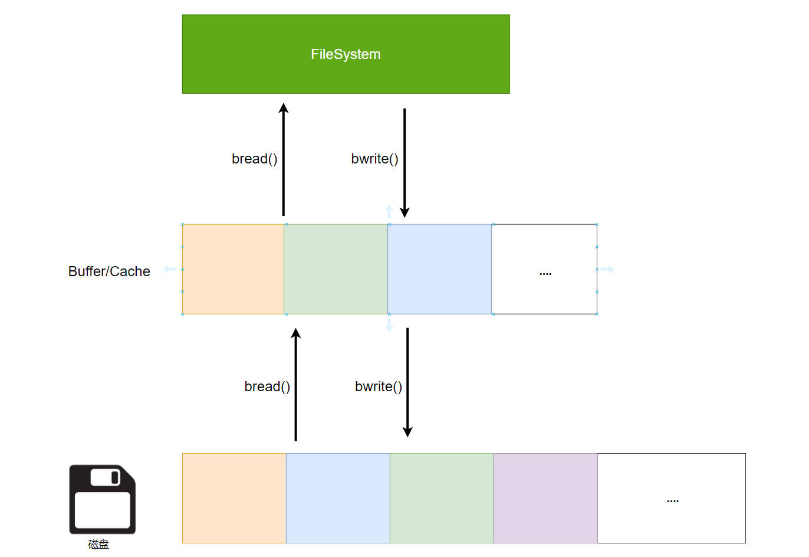

# XV6 文件系统


# 文件系统框架

## 结构

```cpp
// Disk layout:
// [ boot block | sb block | log | inode blocks | free bit map | data blocks ]

int nbitmap = FSSIZE/(BSIZE*8) + 1; 
int ninodeblocks = NINODES / IPB + 1;
int nlog = LOGSIZE;
int nmeta;    // Number of meta blocks (boot, sb, nlog, inode, bitmap)
int nblocks;  // Number of data blocks
```

- `boot block` : 存放操作系统启动加载器的区域

- `log` : 实现崩溃一致性的日志

- `superblock` ：文件系统的元数据

```cpp
#include "kernel/fs.h"

struct superblock {
  uint magic;        // Must be FSMAGIC
  uint size;         // Size of file system image (blocks)
  uint nblocks;      // Number of data blocks
  uint ninodes;      // Number of inodes.
  uint nlog;         // Number of log blocks
  uint logstart;     // Block number of first log block
  uint inodestart;   // Block number of first inode block
  uint bmapstart;    // Block number of first free map block
};
```

- `inode blocks` : 文件元数据存放块

```cpp
// On-disk inode structure
struct dinode {
  short type;           // File type
  short major;          // Major device number (T_DEVICE only)
  short minor;          // Minor device number (T_DEVICE only)
  short nlink;          // Number of links to inode in file system
  uint size;            // Size of file (bytes)
  uint addrs[NDIRECT+1];   // Data block addresses
};
```

- `free bit map` : 按照位来标记 block 的使用情况

- `data blocks` : 数据块

## 接口

- 块读写操作

```cpp
void rsect(uint sec, void *buf);
void wsect(uint sec, void *buf);
```

- inode 操作

```cpp
// 在磁盘创建 inode
// 1. 初始化一个 inode
// 2. 将 inode 通过 winode 写入磁盘
uint ialloc(ushort type); 

// 读取一个 inode
// 1. 计算 inum 所在块索引
// 2. rsect 读取块
// 3. 计算 inum 在块中位置，读取 inode
void rinode(uint inum, struct dinode *ip); // 读

// 写一个 inode
// 1. 计算 inum 所在块索引
// 2. rsect 读取块
// 3. 计算 inum 在块中位置，替换 inode
// 4. wsect 将修改后的块写入磁盘
void winode(uint inum, struct dinode *ip); // 写
```

- 往 inode 中添加数据

```cpp
// 1. 目录 inum 对应 inode
// 2. rsect 读取目录的数据块
// 3. 数据块中添加数据 xp
// 4. wsect 将修改数据块写回磁盘
// 5. winode 更新 inode
void iappend(uint inum, void *xp, int n)
```

## 根目录的初始化

```cpp
// 目录中的一条信息
struct dirent {
  ushort inum; // inode 索引
  char name[DIRSIZ]; // 条目名
} de; 

// 初始化所有的 block
for(i = 0; i < FSSIZE; i++)
wsect(i, zeroes);

// 初始化 superblock
memset(buf, 0, sizeof(buf));
memmove(buf, &sb, sizeof(sb));
wsect(1, buf);

// 创建一个 T_DIR 的 inode，即根目录创建
rootino = ialloc(T_DIR);
assert(rootino == ROOTINO);

// 往根目录中写入一个 . 目录
bzero(&de, sizeof(de));
de.inum = xshort(rootino);
strcpy(de.name, ".");
iappend(rootino, &de, sizeof(de));

// 往根目录中写入一个 .. 目录
bzero(&de, sizeof(de));
de.inum = xshort(rootino);
strcpy(de.name, "..");
iappend(rootino, &de, sizeof(de));
```

# Buffer/Cache

文件系统与磁盘交互的接口会涉及多次 `rsect/wsect`。为了对此进行优化，操作系统在内存中创建了 `Buffer/Cache` 的磁盘数据缓冲区，减少与磁盘的读写次数 


