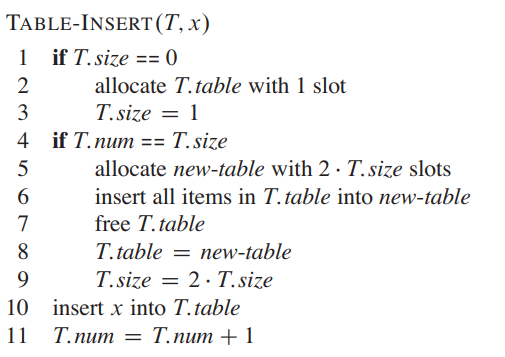

# 平摊分析

> [!note]
> **平摊分析 `Amortized Analysis`** 分析一个操作序列，证明每个操作的平均代价很小，即使其中的一个操作或多个操作很耗时。这里不涉及概率，其结果为操作序列最坏情况下，平均到每一个操作上的耗时
> - 聚集分析 `aggregate analysis`: 首先分析出操作序列的总耗时，然后除以序列长度
> - 记账方法 `accounting method`
> - 势能方法 `potential method`

# 动态表

> **问题一：** 一个哈希表应当创建多大？
- 注重性能，哈希表越大越好
- 注重空间，哈希表要尽可能小

对于固定的 $n$ 个元素存储，哈希表的空间大小取 $\Theta(n)$ 就是最好的方案

> **问题二：** 动态扩充的哈希表，空间大小如何确定？

使用动态表进行处理，当表的元素存储太多时，就扩充该表
1. 重新创建一个容量更大的新哈希表（根据哈希表最优定义，每次扩充两倍大小）
2. 将旧表的元素插入新表
3. 删除旧表

对动态表的性能进行分析
- 一次最坏情况插入（需要先扩充，才能插入），耗时 $\Theta(n)$
-  连续 $n$ 次最坏情况的插入，耗时 $n \cdot \Theta(n) \rightarrow \Theta(n^2)$ 

**显然，上述分析是错误的，连续 $n$ 次插入并不是每次都需要扩充表。**

# 聚集分析

定义 $c_i$ 表示第 $i$ 次插入元素的耗时

$$
    c_i = \begin{cases}
        i \quad \text{if (i - 1) is an exact power of 2 and 1 is cost of insert operation.} \\ 
        1
    \end{cases}
$$

插入 $10$ 次的情况

$$
    \begin{matrix}
    i    & 1 & 2 & 3 & 4 & 5 & 6 & 7 & 8 & 9 & 10\\
    size & 1 & 2 & 4 & 4 & 8 & 8 & 8 & 8 & 16 & 16\\
    c_i  & 1 & 2 & 3 & 1 & 1 & 1 & 1 & 1 & 9 & 1
    \end{matrix}
$$

插入 $n$ 次的总消耗时间便是

$$
\begin{aligned}
   T(n) &= \sum_{i=1}^{n} c_{i}  \\
    & = n+\sum_{j=0}^{\lfloor\lg (n - 1)\rfloor} 2^{j} \\
    & \leq n+\sum_{j=0}^{\lfloor\lg n\rfloor} 2^{j} \\
    & <n+2 n \\
    & =3 n
\end{aligned}
$$

**每一次的平均消耗时间 $\frac{T(n)}{n} = \Theta(1)$**

# 记账方法

> [!note]
> **记账方法**
>- 为第 $i$ 次操作预分配 $\hat{c_i}$ 时长
>   - 若在 $\hat{c_i}$ 的时间内，操作 $i$ 执行完毕，那么可以将剩余时长归还「银行」
>   - 若在 $\hat{c_i}$ 的时间内，操作 $i$ 未执行完毕，那么可以从「银行」索要额外的时长
>- 「银行」中存储的待消耗时长不能为负数，即银行中预先存储的待消耗时长必须大于实际消耗的时长
    $$
        \sum_{i=1}^n c_i \le \sum_{i=1}^n  \hat{c_i}
    $$
> **因此，$\hat{c_i}$ 的总和就是实际总耗时的上界**

分析动态表

1. 每次插入操作预先分配 $\hat{c_i} = 3$ 的时长
   - $1$: 插入操作消耗
   - $2$: 表扩增的预留耗时
2. 需要进表扩充时，消耗之前预留的 $2$ 时长
   - $1$: 当前元素移动到新表
   - $1$: 之前元素移动到新表

    前 $4$ 次操作，银行里预留的耗时存储情况
    $$
    \begin{matrix}
    i     & 1 & 2 & 3 & 4\\
    bank  & 0 & 0 & 2 & 2
    \end{matrix}
    $$

    进行第 $5$ 次插入时，需要进行表扩增，对于第 $3$ 次插入而言，需要消耗 $1$ 时长将第$3$ 次插入元素放入新表，且还需要消耗 $1$ 时长将第 $1$ 次插入元素放入新表

    $$
    \begin{matrix}
    i     & 1 & 2 & 3 & 4 & 5 \\
    bank  & 0 & 0 & 0 & 0 & 2
    \end{matrix}
    $$

3. **预留 $\hat{c_i} = 3$ 能完全保证银行预留时长不会为负数**
   $$
    \sum_{i=1}^n c_i \le \sum_{i=1}^n  \hat{c_i} = 3n
   $$

# 势能方法

> [!note]
> **势能方法**: 
> - 起始状态为 $D_0$, 第 $i$ 次操作实现 $D_{i-1} \rightarrow D_i$，其耗时代价为 $c_i$。
> - 通过势能函数 $\Phi$ 可以实现 $\Phi: \{D_i\} \rightarrow R$，且 $\Phi(D_0) = 0, \Phi(D_i) \ge 0$ 
> - 平摊耗时 $\hat{c_i} = c_i + \Delta \Phi_i,  \Delta \Phi_i = \Phi(D_i) - \Phi(D_{i-1})$
>   - $\Delta \Phi_i > 0$，即 $\hat{c_i} > c_i$，多余的势能会存储
>   - $\Delta \Phi_i < 0$，即 $\hat{c_i} < c_i$，需要额外的势能
$$
    \begin{aligned}
        \sum_{i=1}^n \hat{c_i} &= \sum_{i=1}^n (c_i + \Phi(D_i) - \Phi(D_{i-1})) \\
        &= \sum_{i=1}^n c_i + \Phi(D_n) - \Phi(D_0) \\
        &\ge \sum_{i=1}^n c_i
    \end{aligned}
$$

分析动态表

1. 定义 $\Phi(D_i) = 2 i - 2 ^{\lceil \lg i \rceil}, 2^{\lceil \lg 0 \rceil} = 0$
2. 求解 $\hat{c_i}$

    $$
        \begin{aligned}
            \hat{c_i} &= c_i + \Phi(D_i) - \Phi(D_{i-1}) \\
                        &= c_i + (2 i - 2 ^{\lceil \lg i \rceil}) - (2(i-1) - 2 ^{\lceil \lg (i-1) \rceil}) \\ 
                        &= c_i + 2 - 2 ^{\lceil \lg i \rceil} + 2 ^{\lceil \lg (i-1) \rceil}
        \end{aligned} 
    $$

    根据实际定义可知
    $$
        c_i = \begin{cases}
            i \quad \text{if (i - 1) is an exact power of 2 and 1 is cost of insert operation.} \\ 
            1
        \end{cases}
    $$
    - 在 $(i-1) \% 2 == 0$ 的情况下
      $$
        \begin{aligned}
         \hat{c_i} &= i + 2 - 2 ^{\lceil \lg i \rceil} + 2 ^{\lceil \lg (i-1) \rceil} \\
                   &= i + 2 - 2(i-1) + (i-1) \\
                   &= 3
        \end{aligned}
      $$
    - 其他情况
      $$
        \begin{aligned}
         \hat{c_i} &= 1 + 2 - 2 ^{\lceil \lg i \rceil} + 2 ^{\lceil \lg (i-1) \rceil} \\
                   &= 1 + 2 - i + i \\
                   &= 3
        \end{aligned}
      $$

3. 因此 $ \sum_{i=1}^n c_i \le \sum_{i=1}^n \hat{c_i} = 3n$

