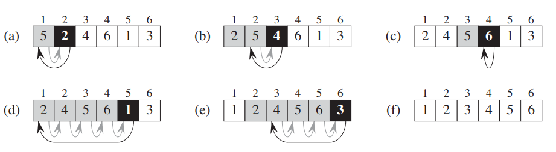

# 算法分析

# 运行时间

**运行时间 (Running Time)** : 衡量一个算法好坏最重要的指标
- 输入的数据类型
- 输入的数据规模，作为输入 $n$

对于运行时间的评估，也有不同的方式
- **wast-case** : 在最坏情况时，算法所需要的时间

    $$
        T(n) = \max \{t_1,t_2,t_3,\dotsm, t_n\}
    $$
 
- **average-case** : 算法在所有情况下运行时间的加权平均

    $$
        T(n) = E(t_1,t_2,\dotsm,t_n)
    $$
- **best-case** : 在最好情况下，算法运行时间。**没啥卵用**

# 渐近分析

## 定义

一个算法的运行时间不仅依赖算法本身，还会受到硬件条件的影响，这样导致「运行时间」就不能非常客观的反映一个算法的好坏。**渐近分析法（Asymptotic analysis）** 则是更好评判标准
- 忽略硬件影响因素
- 关注 $n \rightarrow \infty$ 时，$T(n)$ 的增长情况

## 渐近符号

渐近符号代表一个函数，对原函数进行了简化
- 忽略低阶项
- 忽略常数系数

例如： $3 n^3 + 2 n^2 + n$  公式的 $O$ 符号写法为 $O(n^3)$

### $O$ 符号

- 定义
> [!note]
>  $O(g(n)) = f(n)$ : 函数的上界
> 
> 解释一：  存在 $c > 0, n_0 > 0$，当 $n \gt n_0$ 时， 使得 $0 \le  f(n) \le c g(n)$ 成立
>
> 解释二： $O(g(n))$ 是一个包含 $f(n)$ 函数集合。函数 $f(n)$ 满足，当 $n \gt n_0$ 时，存在 $c$，使得 $0 \le  f(n) \le c g(n)$ 成立

- $O$ 进行计算 $f(n) = A(n) + O(g(n))$ 

存在 $h(n)$ 满足 $ h(n) \le O(g(n))$ 使得 $f(n) = A(n) + h(n)$ 成立

## $\Omega$ 符号

> [!note]
> $\Omega(g(n)) = f(n)$ : 函数的下界
>
> 存在 $c \gt 0, n_0 \gt 0$, 当 $n \ge n_0$, 使得 $0 \le c g(n) \le f(n)$

## $\Theta$ 符号

> [!note]
> $\Theta(g(n)) = h(n) $ : $g(n)$ 与 $h(n)$ 的最高次幂项相同
>
> $\Theta$ 是 $O$ 与 $\Omega$ 的交集，即 $\Theta(g(n)) = \Omega(g(n)) \cap O(g(n))$

案例
- $\Theta(n^2) = 2 n^2 + n$ 成立
- $\Theta(n) = \sqrt{n}$ 不成立

## 符号总结

| 符号     | 运算符 |含义 |
| :--------: | :---: |-|
| $O(g(n)) = f(n)$  |  $\le$    | $f(n)$ 的上界 |
| $o(g(n)) = f(n)$  |  $\lt$    | $f(n)$ 的上界，任意 $c > 0$， 严格成立 |
| $\Omega(g(n)) = f(n)$  |  $\ge$    | $f(n)$ 的下界 |
| $\omega(g(n)) = f(n)$  |  $\gt$    | $f(n)$ 的下界，任意 $c > 0$，严格成立 |
| $\Theta(g(n)) = f(n)$  |  $=$    | 与 $f(n)$ 最高幂次项一样 |

# 递归求解

## 代换法

> [!note] 
> 1. 给出一个猜测的结果
> 2. 将猜测结果代入递推式
> 3. 验证系数取值能否使得猜测结果
> 4. 基于验证结果，调整取值范围，重复 1 - 3 步骤继续猜

> 求解 $T(n) = 4 T(\frac{n}{2}) + n$ 的 $O$

- **猜测结果是 $O(n^3)$**

根据猜测结果，假设 $T(n) \le cn^3$ 成立

$$
\begin{align*}
    T(n) &= 4 T(n/2) + n \\
        &\le 4 c (n/2)^3 + n \\
        &=  c n^3 /2 + n \\
        &=  c n^3 - ( c n^3 /2 - n) \\
\end{align*}
$$

通过推到可得

$$
    T(n) + ( c n^3 /2 - n) \le  c n^3
$$

可知存在 $c$ 可以使得 $( c n^3 /2 - n) > 0$ 成立， 便能推到出

$$
     T(n) \le c n^3
$$

即 $T(n)= O(n^3)$ 成立。

> [!note]
> 目前只是证明了 $O(n^3)$ 是 $T(n)$ 的上界，但是并没有证明 $O(n^3)$ 是最小的上界

- **缩小上界，假设 $O(n^2)$ 成立**

根据猜测结果，假设 $T(n) \le cn^2$ 成立

$$
\begin{align*}
    T(n) &= 4 T(n/2) + n \\
        &\le 4 c (n/2)^2 + n \\
        &=  c n^2 + n \\
\end{align*}
$$

通过推到可得

$$
    T(n) + (- n) \le  c n^2
$$

$-n < 0$ 恒成立，因此无法证明 $O(n^2)$ 成立

> [!tip]
> 遗留项为 $(-n)$ 并没有常数项 $c$，因此，在假设条件中，再添加一个一次的低阶项，即假设 $T(n) \le c_1n^2 - c_2 n$ 成立

$$
\begin{align*}
    T(n) &= 4 T(n/2) + n \\
        &\le 4 (c_1 (n/2)^2 - c_2 n/2) + n \\
        &=  c_1 n^2 - 2c_2n + n \\
        &=  c_1 n^2 - c_2n - (c_2 - 1)n \\
\end{align*}
$$

通过推到可得

$$
    T(n) + (c_2 - 1)n \le  c_1 n^2 - c_2n
$$

当 $c_2 > 1$ 时，可以保证 $(c_2 -1) n > 0 $, 成立

$$
 T(n)  \le  c_1 n^2 - c_2n
$$

最终证明 $T(n) = O(n^2)$ 成立

## 递归树

> 求解 $T(n) = T(n/4) + T(n/2) + n^2$ 的 $O$

对于递推式可以通过树状图的形式展开，$T(n)$ 的结果就是树上所有节点之和

该树生长肯定到 $ \frac{n}{4^k} < 1 \ or \ \frac{n}{2^k} < 1$ 停止， $\frac{n}{2^k} < 1$ 条件得到的层级应当最深，因此树的高度肯定满足 $ h \le \log_2 n $。且树的叶子节点肯定都是常数项，即 $\Theta(1)$，每一个节点能长出2个节点，且最多能长 $\lg n$ 层，因此，最底层叶子最多能有 $2^{\lg n} = n$ 个。 将树每一层级分别加起来可以得到

$$
T(n) \le n^2(1 + \frac{5}{16} + \frac{5^2}{16^2} + \dotsm + \frac{5^h}{16^h})  + O(n)
$$

**树不一定都在都能长到最后一层，因此是 $\le$ 符号**。常数项是一个等比数列，根据等比数列求和公式

$$
S_n = \frac{a_1(1 -  q^n)}{ 1 - q}
$$

可得

$$
\begin{aligned}
    T(n) &\le n^2 (1 + \frac{5}{16} \frac{1 - (\frac{5}{16})^h }{1 - \frac{5}{16}} ) + O(n) \\
         &\le n^2 (1 + \frac{5}{16} \frac{1 - (\frac{5}{16})^{\lg n} }{1 - \frac{5}{16}} ) + O(n) \\
\end{aligned}
$$

当 $n \rightarrow \infty$ 时，可得

$$
    T(n) = O(n^2)
$$

## 主方法

> [!note]
> 该方法适用于 $T(n) = a T(n/b) + f(n), a \ge 1, b \gt 1$ 且存在 $n \gt n_0$ 使得 $f(n) > 0$ 成立
> 
> 根据 $f(n)$ ，有三种解
> 1. $f(n) = O(n^{log_b a - \epsilon}) \rightarrow T(n) = \Theta(n^{log_b a}),  \epsilon > 0$
> 2. $f(n) = O(n^{log_b a }(\lg n)^k) \rightarrow T(n) = \Theta(n^{log_b a} (\lg n)^{k+1}) , k \ge 0$
> 3. $f(n) = \Omega(n^{log_b a + \epsilon}) $ 且 $ af(n/b) \le (1 - \epsilon') f(n) \rightarrow T(n) = \Theta(f(n)) ,  \epsilon > 0, \epsilon' > 0$

> 求解 $T(n) = 4T(n/2) + n$

根据公式 $a = 4, b = 2 \rightarrow \log_2 4 = 2$ 且 $f(n) = n$ ，满足第一种情况，可以得结果 

$$
    T(n) = \Theta(n^2)
$$

# 案例

## 插值排序

上图的黑色框就是代码中的 `key`，针对插值排序
1. 最外层 `for` 是一个 $j$ 从 $2$ 到 $n$ 的循环
2. `for` 循环内部是一个 `while` 循环加上 `a` 次固定操作，且根据 $O$ 定义，`for` 循环内部就只用关注 `while` 循环
3. `while` 循环的执行次数就是 `j` 的一次表达式，因此可以得到 $O(j)$
4. 对于 `for` 循环的运行次数就是  $\sum_{j=2}^{n} O(j)$ 

该算法的 $O$ 符号就为

$$
    T(n) = \sum_{j=2}^{n} O(j) \approx  2 + 3 + \dotsm + n = O(n^2)
$$

## 合并递归排序

合并递归排序数组 $A[1,\dotsm,n]$
1. $n == 1$，结束递归
2. 对排序完成的数组 $A[1,\dotsm, \lceil \frac{n}{2} \rceil]$ 与 $A[\lceil \frac{n}{2} \rceil + 1, \dotsm,n]$ 排序，**递归调研排序函数**
3. 合并两个排序数组的结果

对于合并递归最关键的是「合并」

「合并」的实现，依次比对两个已经排序好的数组 $L$ 与 $R$ 的值，然后按照顺序放入新数组 $A$。除去所有固定操作，需要重复的便是两个数组的比对次数，即新数组 $A$ 的长度，即 $len(A) = len(L) + len(R)$，也就是说一次「合并」操作的时间是 $O(n), n = len(L) + len(b)$。对于 $L$ 与 $R$ 是均分，因此长度可以认为满足 $len(L) == len(R)$，再根据合并递归排序定义，可得

$$
T(n)= 
    \begin{cases}
        O(1), n = 1\\
        2T(n/2) + O(n), n \gt 1
    \end{cases} 
$$

计算 $O$ 肯定是 $n \gt 1$ 的情况，并且忽略常数项，可以近似 $O(n) \approx cn$

$$
    T(n) = 2 T(n/2) + cn
$$

通过树状图展开上述递推式

$T(n)$ 的结果就是树上所有节点之和

$$
    T(n) = (\lg n + 1) cn = cn \lg n + cn = O(n \lg n)
$$
