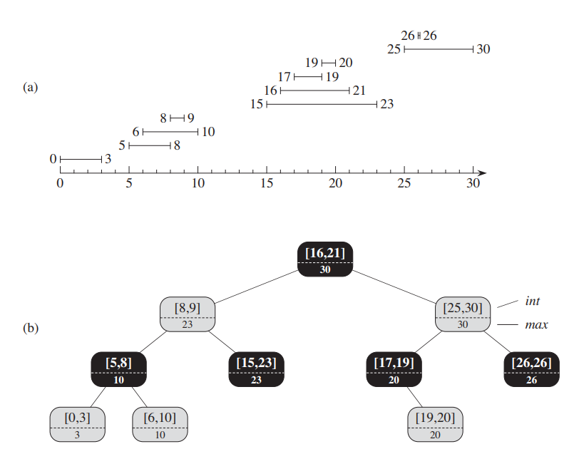
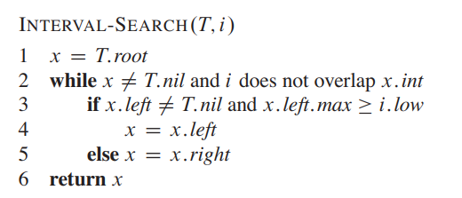

# 拓展数据结构设计

# 动态顺序统计

## 目标

`BST` 可以实现查找、删除、更新目标结点的操作都是 $\lg h$，此外，`BST` 还存在一个重要性质，其中序遍历结果为一个有序的序列。**如果想要对有序序列的指定「索引」进行查找、删除、更新，也能实现 $\lg h$。**
- `search(i)` : 通过索引 i ，从有序序列中查找元素
- `rank(x)` : 返回元素 x 的索引

> [!tip]
> 二叉搜索树能实现的动态顺序统计
> - **顺序统计**: 以中序遍历得到是有序的结点序列为基础，实现顺序统计的目的，例如查找第 `i` 个指定结点，排序位置在首尾的结点等。
> - **动态**: 对结点进行插入、删除操作后，上述的顺序统计操作任能实现

## 算法思路

**算法：** 
1. Divide : 根据当前位置的结点，将其子树划分为左子树、右子树
2. Conquer: 利用 $n_L$ 表示结点左子树的结点个数，$i$ 为查找的目标索引

    

>[!note]
> 现在关键问题便是，如何获取子树的结点数

## 子树增强

**子树增强**：每个结点会存储一些扩展属性信息，且当前结点的属性信息可以根据子结点的属性信息计算获得。根据子树增强的思路，每个结点的子结点个数 $node.size$ 便是一个扩展属性，并且依赖于左右子结点的属性值

$$
    node.size = node.left.size + node.right.size + 1
$$

在树结构改变时，根据上述公式更新对应的结点属性即可。**在二叉树中，删除/插入操作改变的是树的叶子结点，那么需要属性更新的结点数便是 $O(h)$**

>[!tip]
> 子树增强可以添加任意属性，但是不能维护有序序列的「索引」，因为当删除/插入结点后，索引便会动态改变

> [!note|style:flat]
> - 子树增强的设计流程
>   - 确定基础数据结构，并选择键
>   - 设计结点拓展属性，确定更新规则
>   - 验证在进行删除、插入、旋转后，拓展属性能够被维护
>   - 能够通过拓展属性能进行哪些操作

# AVL 树

## 定义

**`AVL` 树** : 基本结构属于 `BST` 树，通过一系列旋转操作，保证一个结点的左子树与右子树的高度差为 $[-1,1]$，即倾斜度 `skew`
$$
    skew(node) = heigth(node.right) - heigth(node.left), skew(node) \in \{-1,0,1\}
$$

## 高度

某结点子树的高度为 $h$，根据 AVL 数定义，考虑最坏情况，所有结点的左子树与右边子树的倾斜度都是 $1$，因此假设左子树高度为 $h-2$，右子树高度为 $h-1$。结点拥有的子结点树为 $n$，左子树内的结点数为 $n_{h-1}$，右子树内的结点数 $n_{h-2}$

$$
    \begin{aligned}
        n &= n_{h-1} + n_{h-2} + 1 \\
          &> 2 n_{h-2} \\
          &= 2 \cdot 2^{\lfloor (h-2)/2 \rfloor } \\
          &=  2^{\lfloor h/2 \rfloor } \\
        h  &<  2 \lg n \\
    \end{aligned}
$$

因此，AVL 树的高度满足 $h = O(\lg n)$

## 维持 AVL 树

算法思路：
- 利用「子树增强」的概念，为所有的结点增加一个高度属性，并定义其计算公式

$$
    node.height = 1 + \max \{node.left.height, node.right.heigth\}
$$

- 只有通过删除/插入才能改变二叉树结构，导致 AVL 树不平衡，即导致倾斜度取值范围为 $[-2,2]$，可通过高度属性进行判别
- 在二叉树中，删除/插入操作都是修改的叶子结点，因此，当执行删除/插入操作后，可从下往上遍历树，找到倾斜度不平衡的最小子树
- 使用旋转操作调整倾斜度不平衡的最小子树
- 在删除/插入操作中，更新高度属性

# 区间树

## 背景

**区间树：** 一颗维护区间段集合的树。
- `low` : 区间的最小值
- `hight` : 区间的最大值

**目标** : 能从区间树中查询与给定区间重叠的目标区间

## 设计

同样使用「子树增强」设计数据结构

1. 数据结构：红黑树为基础结构，以 `low` 作为键
2. 结点扩展属性：当前结点为根的子树中，`hight` 的最大值 `max`，图中的 `int` 表示区间段，即 `[low,hight]`
    $$
        node.max = \max \{ node.hight, node.left.max, node.right.max \} 
    $$

    
    

3. 对树进行插入、旋转、删除操作后，整清楚如何更新拓展属性 （最难的部分）
4. 根据 `max` 实现在区间树中，查询与区间 `i` 重叠的目标区间
    

> [!note]
> **定理：** 当前子树的根结点 $x$ 的左结点集合为 $L$，右结点集合为 $R$
> - 如果区间搜索进入 $R$，那么 $L$ 集合没有目标区间
> - 如果区间搜索进入 $L$，但是没有搜索到目标区间，那么在 $R$ 中肯定也没有目标区间

