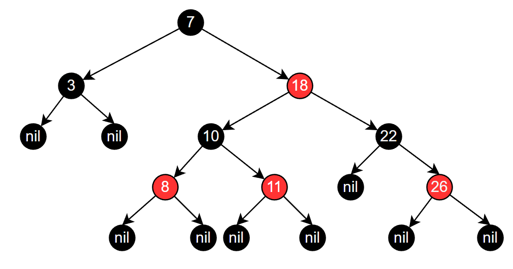
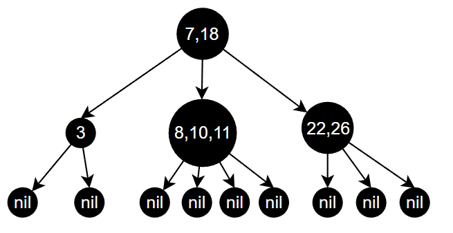
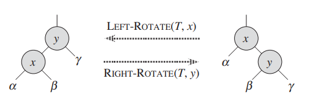
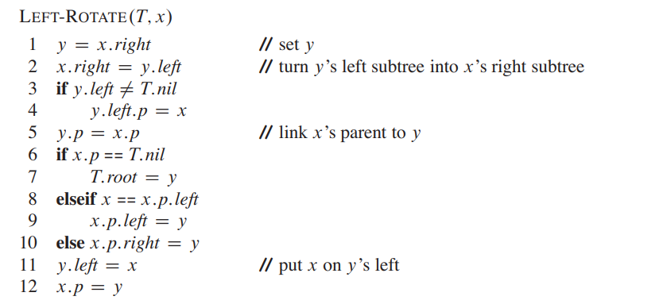
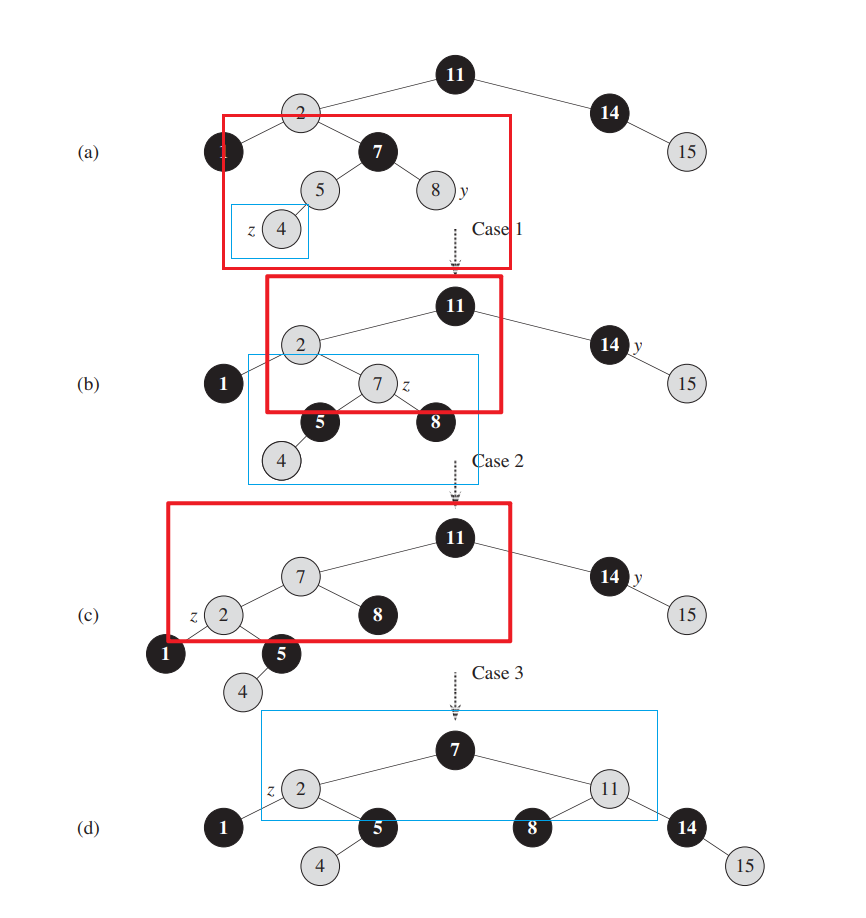
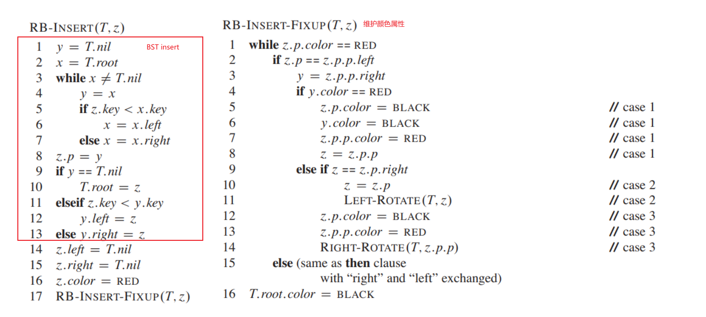

# 平衡搜索树

> [!tip]
> - 对树的删除、插入、查找操作都是 $\Theta(\lg n)$，即树的高度始终维持在 $\Theta(\lg n)$
> - 平衡搜索树的结点可以为多个，不止两个
>   - `AVL trees`
>   - `2-3 trees`，两个或三个结点
>   - `2-3-4 trees`，两个或三个或四个结点
>   - `B trees`，更加通用的版本
>   - `Red-black tress`，两个结点
>   - `skip lists`，跳表
>   - `treaps`，树堆

# 红黑树

## 定义

**红黑树 `Red-black trees`** ：基本结构属于二叉搜索树 `BST`，且每个结点都具有「色域 `color field`」属性。
- 结点要么是红色的，要么是黑色的
- 根结点、叶结点都是黑色的（**叶结点都是空的，可以保证所有内部结点的子结点都有两个，可以统一操作**）
- 每个红色结点的父结点都是黑色的
- 任何一条简单路径 `simple path`（从目标结点到叶子节点的最短路径），黑色结点数相等，即目标结点的黑色高度 $black-heigth(x)$，**黑色高度计算不会统计目标结点本身**

## 高度

> [!note]
> 具有 `n` 个结点的红黑树（不包含叶子结点），其高度为 $h \le 2 \lg (n+1)$

将所有的红色结点与父结点合并，得到的新树便是 `2-3-4 trees`，**根结点的黑色高度与树高度一致**

红黑树高度为 $h$，2-3-4 树高度为 $h'$。红黑树的叶子结点数为

$$
    \text{num}(leaves) = n + 1
$$

对于红黑树内部红色结点合并后得到的 `2-3-4 trees` ，其叶子结点满足

$$
    2^{h'} \le \text{num}(leaves) \le 4^{h'}
$$

因此可以得到

$$
    \begin{aligned}
        2^{h'} &\le n + 1 \\
        h' &\le \lg (n + 1) \\
    \end{aligned}
$$

根据红黑树定义3（每个红色结点的父结点都是黑色的），可知红黑树至少有 $h/2$ 层的结点是黑色的

$$
    h/2 \le h'
$$

便可得到

$$
    h \le 2 \lg (n+1)
$$

## 旋转

调整内部两个父子结点的位置的操作被称之为「旋转」，**进行旋转操作后，二叉搜索树的性质不发生改变**
- 右旋：父结点绕左子结点旋转，左图 y 绕 x 旋转
- 左旋：父结点绕右子结点旋转，右图 x 绕 y 旋转

## 查询

因为红黑树本质上就是二叉搜索树，因此其查询效率便是树的高度，即 $\Theta(\lg(n))$

## 插入

> 红黑树的插入操作需要进行以下步骤
> 1. 根据`BST`定义，插入结点
> 2. 指定新结点的颜色为红色，**这样就能保证性质4**
> 3. 使用[旋转](#旋转)调整树结构或修改树结点颜色，**保证树局部的性质3成立**
> 4. 从树的底层往上，重复步骤3，调整树结点，完成颜色更新，**保证整棵树的性质3成立**
> 5. 根结点设置为黑色（根结点是啥颜色都不影响，只是设置为黑色，编码方便）

往一棵红黑树中，插入新结点 `4`
a. 根据 `BST` 定义，将 `4` 放到 `5` 的左边，并且颜色设置为红色
b. 步骤 a 插入导致 `4` 与 `5` 都是红色，重新 `5,8,7` 刷新颜色。
c. 步骤 b 刷新颜色，又导致 `2` 与 `7` 都是红色，左旋结点 `2` ，使得 `11,7,2` 都在一条线上
d. 右旋结点 `11`，使得 `7` 成为根结点，并刷为黑色

**从上述案例可知，每次操作关注的都是当前冲突结点 `z` ，`z` 的父结点，`z` 的爷结点三层，都是局部操作。且违反规则的问题是从下层向上层传递，直到完全解决问题为止。** 将其转换为通用规则

> [!tip]
> 插入操作最多循环的是 `case 1` ，`case 2` 与 `case 3` 一般最多只运行一次，便能成功

