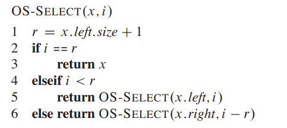

# 平衡搜索树

> [!tip]
> - 对树的删除、插入、查找操作都是 $\Theta(\lg n)$，即树的高度始终维持在 $\Theta(\lg n)$
> - 平衡搜索树的结点可以为多个，不止两个
>   - `AVL trees`
>   - `2-3 trees`，两个或三个结点
>   - `2-3-4 trees`，两个或三个或四个结点
>   - `B trees`，更加通用的版本
>   - `Red-black tress`，两个结点
>   - `skip lists`，跳表
>   - `treaps`，树堆

# 平衡二叉树

**定义：** 如果二叉树的高度满足 $h = O(\lg n)$ 关系，则称之为平衡二叉树 `balanced binary tree`

## 旋转

调整内部两个父子结点的位置的操作被称之为「旋转」，**进行旋转操作后，二叉搜索树的性质不发生改变**
- 右旋：父结点绕左子结点旋转，左图 y 绕 x 旋转
- 左旋：父结点绕右子结点旋转，右图 x 绕 y 旋转

# 红黑树

## 定义

**红黑树 `Red-black trees`** ：基本结构属于二叉搜索树 `BST`，且每个结点都具有「色域 `color field`」属性。
- 结点要么是红色的，要么是黑色的
- 根结点、叶结点都是黑色的（**叶结点都是空的，可以保证所有内部结点的子结点都有两个，可以统一操作**）
- 每个红色结点的父结点都是黑色的
- 任何一条简单路径 `simple path`（从目标结点到叶子节点的最短路径），黑色结点数相等，即目标结点的黑色高度 $black-heigth(x)$，**黑色高度计算不会统计目标结点本身**

## 高度

> [!note]
> 具有 `n` 个结点的红黑树（不包含叶子结点），其高度为 $h \le 2 \lg (n+1)$

将所有的红色结点与父结点合并，得到的新树便是 `2-3-4 trees`，**根结点的黑色高度与树高度一致**

红黑树高度为 $h$，2-3-4 树高度为 $h'$。红黑树的叶子结点数为

$$
    \text{num}(leaves) = n + 1
$$

对于红黑树内部红色结点合并后得到的 `2-3-4 trees` ，其叶子结点满足

$$
    2^{h'} \le \text{num}(leaves) \le 4^{h'}
$$

因此可以得到

$$
    \begin{aligned}
        2^{h'} &\le n + 1 \\
        h' &\le \lg (n + 1) \\
    \end{aligned}
$$

根据红黑树定义3（每个红色结点的父结点都是黑色的），可知红黑树至少有 $h/2$ 层的结点是黑色的

$$
    h/2 \le h'
$$

便可得到

$$
    h \le 2 \lg (n+1)
$$

## 查询

因为红黑树本质上就是二叉搜索树，因此其查询效率便是树的高度，即 $\Theta(\lg(n))$

## 插入

> 红黑树的插入操作需要进行以下步骤
> 1. 根据`BST`定义，插入结点
> 2. 指定新结点的颜色为红色，**这样就能保证性质4**
> 3. 使用[旋转](#旋转)调整树结构或修改树结点颜色，**保证树局部的性质3成立**
> 4. 从树的底层往上，重复步骤3，调整树结点，完成颜色更新，**保证整棵树的性质3成立**
> 5. 根结点设置为黑色（根结点是啥颜色都不影响，只是设置为黑色，编码方便）

往一棵红黑树中，插入新结点 `4`
a. 根据 `BST` 定义，将 `4` 放到 `5` 的左边，并且颜色设置为红色
b. 步骤 a 插入导致 `4` 与 `5` 都是红色，重新 `5,8,7` 刷新颜色。
c. 步骤 b 刷新颜色，又导致 `2` 与 `7` 都是红色，左旋结点 `2` ，使得 `11,7,2` 都在一条线上
d. 右旋结点 `11`，使得 `7` 成为根结点，并刷为黑色

**从上述案例可知，每次操作关注的都是当前冲突结点 `z` ，`z` 的父结点，`z` 的爷结点三层，都是局部操作。且违反规则的问题是从下层向上层传递，直到完全解决问题为止。** 将其转换为通用规则

> [!tip]
> 插入操作最多循环的是 `case 1` ，`case 2` 与 `case 3` 一般最多只运行一次，便能成功

# 动态顺序统计

## 目标

`BST` 可以实现查找、删除、更新目标结点的操作都是 $\lg h$，此外，`BST` 还存在一个重要性质，其中序遍历结果为一个有序的序列。**如果想要对有序序列的指定「索引」进行查找、删除、更新，也能实现 $\lg h$。**
- `search(i)` : 通过索引 i ，从有序序列中查找元素
- `rank(x)` : 返回元素 x 的索引

## 算法思路

**算法：** 
1. Divide : 根据当前位置的结点，将其子树划分为左子树、右子树
2. Conquer: 利用 $n_L$ 表示结点左子树的结点个数，$i$ 为查找的目标索引

    

>[!note]
> 现在关键问题便是，如何获取子树的结点数

## 子树增强

**子树增强**：每个结点会存储一些扩展属性信息，且当前结点的属性信息可以根据子结点的属性信息计算获得。根据子树增强的思路，每个结点的子结点个数 $node.size$ 便是一个扩展属性，并且依赖于左右子结点的属性值

$$
    node.size = node.left.size + node.right.size + 1
$$

在树结构改变时，根据上述公式更新对应的结点属性即可。**在二叉树中，删除/插入操作改变的是树的叶子结点，那么需要属性更新的结点数便是 $O(h)$**

>[!tip]
> 子树增强可以添加任意属性，但是不能维护有序序列的「索引」，因为当删除/插入结点后，索引便会动态改变

> [!note|style:flat]
> - 顺序统计中子树增强的设计流程
>   - 确定基础数据结构，并选择键
>   - 设计结点拓展属性，确定更新规则
>   - 验证在进行删除、插入、旋转后，拓展属性能够被维护
>   - 能够通过拓展属性能进行哪些操作

# AVL 树

## 定义

**`AVL` 树** : 基本结构属于 `BST` 树，通过一系列旋转操作，保证一个结点的左子树与右子树的高度差为 $[-1,1]$，即倾斜度 `skew`
$$
    skew(node) = heigth(node.right) - heigth(node.left), skew(node) \in \{-1,0,1\}
$$

## 高度

某结点子树的高度为 $h$，根据 AVL 数定义，考虑最坏情况，所有结点的左子树与右边子树的倾斜度都是 $1$，因此假设左子树高度为 $h-2$，右子树高度为 $h-1$。结点拥有的子结点树为 $n$，左子树内的结点数为 $n_{h-1}$，右子树内的结点数 $n_{h-2}$

$$
    \begin{aligned}
        n &= n_{h-1} + n_{h-2} + 1 \\
          &> 2 n_{h-2} \\
          &= 2 \cdot 2^{\lfloor (h-2)/2 \rfloor } \\
          &=  2^{\lfloor h/2 \rfloor } \\
        h  &<  2 \lg n \\
    \end{aligned}
$$

因此，AVL 树的高度满足 $h = O(\lg n)$

## 维持 AVL 树

算法思路：
- 利用「子树增强」的概念，为所有的结点增加一个高度属性，并定义其计算公式

$$
    node.height = 1 + \max \{node.left.height, node.right.heigth\}
$$

- 只有通过删除/插入才能改变二叉树结构，导致 AVL 树不平衡，即导致倾斜度取值范围为 $[-2,2]$，可通过高度属性进行判别
- 在二叉树中，删除/插入操作都是修改的叶子结点，因此，当执行删除/插入操作后，可从下往上遍历树，找到倾斜度不平衡的最小子树
- 使用旋转操作调整倾斜度不平衡的最小子树
- 在删除/插入操作中，更新高度属性

# 区间树

## 背景

**区间树：** 一颗维护区间段集合的树。
- `low` : 区间的最小值
- `height` : 区间的最大值

**目标** : 给定区间条件，能从区间树中查询到目标区间

## 设计

采用顺序统计中的子树增强来设计区间树

1. 数据结构：红黑树为基础结构，以 `low` 作为键
2. 结点扩展属性：结点子树的最大值 `m`

