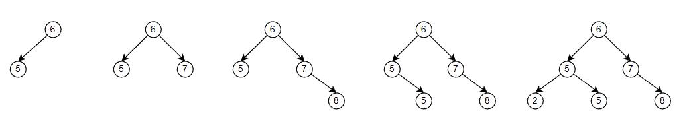
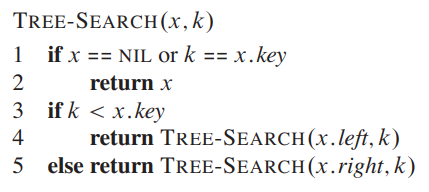
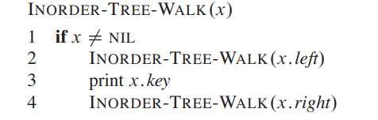
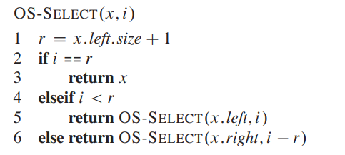

# 二叉搜索树

# 二叉搜索树

## 构建

给一组序列 $[6,5,7,8,5,2]$
- 选择 $6$ 作为树的根结点
- $5 < 6$ ，放 $6$ 的左边
- $7 \ge 6$ ，放 $6$ 的右边
- $8 \ge 6, 8 \ge 7$，放 $6$ 与 $7$ 的右边
- $5 < 6, 5 \ge 5 $，放 $6$ 的左边，放 $5$ 的右边
- $2 < 6, 2 < 5 $，放 $6$ 与 $5$ 的左边

可以看见二叉搜索树的构建流程与排序算法的「比较模型」一致，因此，其耗时下限为 $\Omega(n \lg n)$，当给定序列是已经排序好的，那么其构建耗时便是 $\Theta(n^2)$。

> [!note]
> 经过上述分析可知，搜索二叉树的构建与「快排」算法本质上一致的，因此，快排的结论适用于二叉搜索树

## 搜索

同样根据构建流程，便能实现搜索

## 排序

通过中序遍历二叉搜索树，获取的结果序列便是排序的结果

中序遍历的时间耗时为

$$
    T(n) = T(k) + T(n - k - 1) + \Theta(1)
$$

假设 $T(n) \le (c + d)n + c$

$$
    \begin{aligned}
    T(n) & \leq T(k)+T(n-k-1)+d \\
    & =((c+d) k+c)+((c+d)(n-k-1)+c)+d \\
    & =(c+d) n+c-(c+d)+c+d \\
    & =(c+d) n+c
    \end{aligned}
$$

二叉搜索树在创建好好之后，获取排序结果的耗时为 $T(n) = \Theta(n)$

# 随机二叉搜索树

## 构建

由于二叉搜索树构建本质与快排一样，因此，当排序后的序列作为输入时，耗时都很差 $\Theta(n^2)$。二叉搜索树想要解决该问题，也与快排一样，**不再是从左向右读取输入序列的元素，而是随机从序列中选择元素进行二叉树的构建**。随机二叉搜索树构建与随机快排一致（搜索树是随机选择元素进行树构建；快排是随机选择元素当主键），**因此构建树的期望耗时为 $\Theta(n \lg n)$**。

## 搜索

### 分析

一颗随机二叉搜索树搜索元素的最差耗时，其实就是树的高度 $\Theta(h)$（在每一个层只会比较一次，然后就进入下一层级，最多的比较次数就是树的高度）。因此，只要计算出树的高度，便能计算出搜索耗时。

> [!note]
> **定理：** 随机二叉树搜索的期望耗时为 $\Theta(\lg n)$，即树的期望高度为 $\Theta(\lg n)$

### 证明步骤

1. `Jenson` 不等式: 对于随机变量 $X \ge 0$，当 $f(x)$ 是凸函数时，$f(E[X]) \le E[f(X)]$ 成立
2. 定义随机变量 $X_n$ 表示随机二叉搜索树高度，并定义 $Y_n = 2^{X_n}$
3. 假设 $E[Y_n] = O(n^3)$
4. 计算 $E[X_n]$

$$
    \begin{aligned}
        E[Y_n] &= E[2^{X_n}] \\
        E[Y_n] &= E[2^{X_n}] \\
        E[Y_n] &\ge 2^{E[X_n]} \\
        \lg E[Y_n] &\ge E[X_n] \\
         O(\lg n^3) &= E[X_n] \\
            O(\lg n)  &= E[X_n]\\
    \end{aligned}
$$

**上述证明步骤最关键的就是证明「步骤3」**

### `Jenson` 不等式

> **定义：** 若 $f(x)$ 是一个凸函数，$\forall x,y \in R; \forall \alpha,\beta \ge 0; \alpha + \beta = 1$
$$
    f(\alpha x + \beta y) \le \alpha f(x) + \beta f(y)
$$

> **引理：** 若 $f(x)$ 是一个凸函数，$x_1,x_2,\dotsm,x_n \in R; \alpha_1,\dotsm,\alpha_n \ge  0; \sum \alpha_i = 1$
$$
    f( \sum_{i=1}^n \alpha_i x_i)  \le \sum_{i=1}^n \alpha_i f( x_i)
$$

引理证明

$$
    \begin{aligned}
         f( \sum_{i=1}^n \alpha_i x_i) &= f(\alpha_n x_n + (1 - \alpha_n) \sum_{i=1} ^{n-1} \frac{\alpha_i}{1 - \alpha_n} x_i) \\
         &\le \alpha_n f(x_n) + (1-\alpha_n) f(\sum_{i=1} ^{n-1} \frac{\alpha_i}{1 - \alpha_n} x_i)
    \end{aligned}
$$

假设引理成立

$$
    \begin{aligned}
         f( \sum_{i=1}^n \alpha_i x_i) &\le \alpha_n f(x_n) + (1-\alpha_n) f(\sum_{i=1} ^{n-1} \frac{\alpha_i}{1 - \alpha_n} x_i) \\
         &\le \alpha_n f(x_n) + (1-\alpha_n) \sum_{i=1} ^{n-1} \frac{\alpha_i}{1 - \alpha_n} f(  x_i) \\
         &=  \sum_{i=1}^n \alpha_i f( x_i)
    \end{aligned}
$$

结论成立。

> **`Jenson` 不等式**: 对于随机变量 $ X \ge 0$，当 $f(x)$ 是凸函数时，$f(E[X]) \le E[f(X)]$ 成立

$$
    \begin{aligned}
        f(E[X]) &= f(\sum_{i=1}^{\infty} x_i Pr\{X=x_i\}) \\
                &\le \sum_{i=1}^{\infty} Pr\{X=x_i\} f( x_i ) \\
                &= E[f(X)]
    \end{aligned}
$$

### 步骤3证明

> 随机变量 $X_n$ 是随机二叉搜索树高度, $Y_n = 2^{X_n}$，且满足 $E[Y_n] = O(n^3)$

假设在根结点在输入序列被排序后的第 $k$ 位，采用递归的形式表示随机二叉树高度，每一层加 `1`

$$
    X_n = 1 + \max\{X_{k-1}, X_{n-k}\}
$$

对于 $Y_n$，由于 $Y_n = 2^{X_n}$，因此每一层乘以 `2`

$$
    Y_n = 2 \cdot \max\{Y_{k-1}, Y_{n-k}\}
$$

定义随机变量指示器

$$
    Z_{nk} = \begin{cases}
        1, \text{rand root node in rank k} \\
        0 , other
    \end{cases}
$$

求解期望

$$
    \begin{aligned}
        E[Y_n] &= E[ \sum_{k=1}^{n} Z_{nk} \cdot 2 \cdot \max\{Y_{k-1}, Y_{n-k}\} ]\\
               &= 2 \sum_{k=1}^{n}  E[Z_{nk}] \cdot E[\max\{Y_{k-1}, Y_{n-k}\}]\\
               &= \frac{2}{n} \sum_{k=1}^{n}  E[\max\{Y_{k-1}, Y_{n-k}\}]\\
               &\le \frac{2}{n} \sum_{k=1}^{n}  E[Y_{k-1} + Y_{n-k}]\\
               &= \frac{2}{n} (\sum_{k=1}^{n}  E[Y_{k-1}] +  \sum_{k=1}^{n} E[Y_{n-k}])\\
               &= \frac{4}{n} \sum_{k=0}^{n-1}  E[Y_k]\\
    \end{aligned}
$$

假设 $E[Y_n] \le cn^3$

$$
    \begin{aligned}
        E[Y_n] &\le \frac{4}{n} \sum_{k=0}^{n-1}  E[Y_k]\\
               &\le \frac{4}{n} \sum_{k=0}^{n-1}  cn^3\\
               &\le \frac{4}{n} \int_0^n cx^3 dx\\
               &= \frac{4}{n} \frac{cn^4}{4}\\
               &= cn^3\\
    \end{aligned}
$$

# 索引定位

## 算法思路

**问题：** `BST` 可以实现查找、删除、更新目标结点的操作都是 $\lg h$，此外，`BST` 还存在一个重要性质，其中序遍历结果为一个有序的序列。如果想要对有序序列的指定「索引」进行查找、删除、更新，也能实现 $\lg h$。

**算法：** 
1. Divide : 根据当前位置的结点，将其子树划分为左子树、右子树
2. Conquer: 利用 $n_L$ 表示结点左子树的结点个数，$i$ 为查找的目标索引

    

>[!note]
> 现在关键问题便是，如何获取子树的结点数

## 子树增强

**子树增强**：每个结点会存储一些扩展属性信息，且当前结点的属性信息可以根据子结点的属性信息计算获得。根据子树增强的思路，每个结点的子结点个数 $node.size$ 便是一个扩展属性，并且依赖于左右子结点的属性值

$$
    node.size = node.left.size + node.right.size + 1
$$

在树结构改变时，根据上述公式更新对应的结点属性即可。**在二叉树中，删除/插入操作改变的是树的叶子结点，那么需要属性更新的结点数便是 $O(h)$**

>[!note]
> 子树增强可以添加任意属性，但是不能维护有序序列的「索引」，因为当删除/插入结点后，索引便会动态改变

