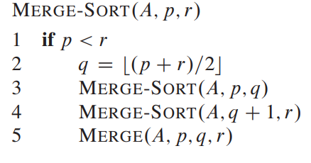
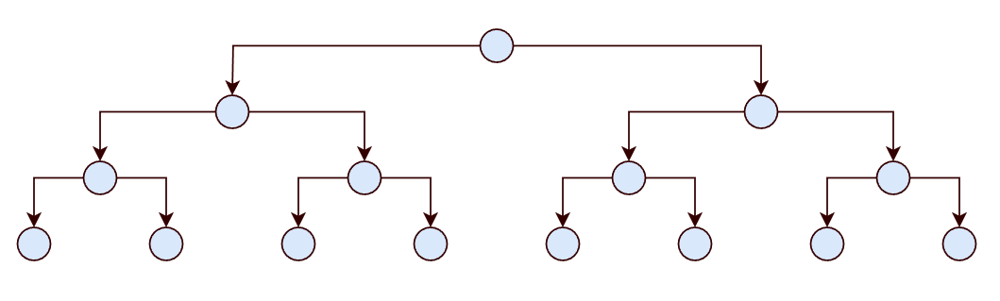
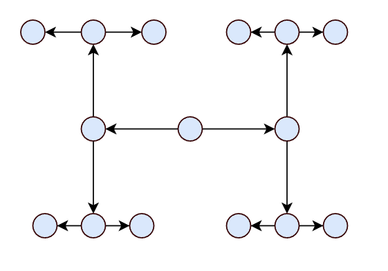

# 算法设计

# 分治法

> [!note]
> **分治法**
> 1. Divide : 将实际问题拆分为子问题
> 2. Conquer : 递归处理每一个子问题
> 3. Combine : 将子问题结果合并，得到问题的解

## 合并递归排序

**问题**： 排序数组 $A[1,\dotsm,n]$
1. Divide : 将数组 $A$ 的排序问题拆分为两个子数组的排序
2. Conquer: 进行子数组排序的函数也是 `MERGE-SORT`，即函数递归
3. Combine: 将两个子数组排序后的结果合并为一个数组

$$
    T(n) = 2 T(n/2) + \Theta(n)
$$

其中，$2 T(n/2)$ 表示 Conquer ；$\Theta(n)$ 表示 Combine

## 二分查找

**问题**： 从已经排好序的数组中，查找 $x$ 值

1. Divide  : 用 $x$ 值与数组中间位置的值进行比较
2. Conquer : $x$ 值比中间值大，用右边数组重复步骤 1 ；$x$ 值比中间值小，用左边数组重复步骤 1 
3. Combine : 找到对应位置

$$
    T(n) = T(n/2) + \Theta(1)
$$

## 幂次计算

**问题**：已知 $x$ 与 $n \ge 0$，计算 $x^n$。**如果直接 `for` 循环连乘，时间为 $\Theta(n)$，但采用分治法则为 $\lg n$**

1. Divide: 将 $n$ 划分为两半，即 $\lfloor n/2 \rfloor, n - \lfloor n/2 \rfloor$
2. Conquer: 分别计算 $x^{ \lfloor n/2 \rfloor }$ 与 $x^{ n - \lfloor n/2 \rfloor }$ 的幂次
3. Combine : 将上述结果相乘

$$
    T(n) = 2 T(n/2) + \Theta(1)
$$

## 斐波那契数

**问题**：计算斐波那契数

$$
\begin{aligned}
    F_0 &= 0 \\
    F_1 &= 1 \\
    F_n &= F_{n-1} + F_{n-2} \  \ (n \ge 2)
\end{aligned}
$$

直接根据递推式采用分治法进行递归计算，其计算耗时为指数级，性能巨差。

> [!tip]
> 斐波那契数的矩阵形式
$$
     \begin{bmatrix}
         F_{n+1} & F_n \\
         F_n & F_{n-1}
     \end{bmatrix}
      = \begin{bmatrix}
         1 & 1 \\
         1 & 0
     \end{bmatrix}^n
$$

## $n \times n$ 矩阵乘法

**问题：** 已知矩阵 $n \times n$ 的 $A=[a_{ij}]$ 与 $B=[b_{ij}]$，计算矩阵 $C=[c_{ij}] = A B, c_{ij} = \sum_{k=1}^n a_{ik} b_{kj}$。

直接按照公式进行矩阵乘法计算，需要执行 3 次 $n$ 规模的循环，其算法耗时为 $\Theta(n^3)$。为了实现分治法，首先对矩阵进行分块处理

$$
    \begin{aligned}
     C &= AB \\ 
    \begin{bmatrix}
        r & s \\
        t & u 
    \end{bmatrix} 
    &= 
    \begin{bmatrix}
        a & b \\
        c & d 
    \end{bmatrix}
    \begin{bmatrix}
        e & f \\
        g & h 
    \end{bmatrix}
    \end{aligned}
$$

将矩阵 $C$ 的计算转换为

$$
    C = \begin{bmatrix}
        ae + bg & af+bh \\
        ce + dg & cf + dh
    \end{bmatrix}
$$

**这样便实现将一个 $n \times n$ 规模的矩阵，转换为拥有 4 个 $\frac{n}{2} \times \frac{n}{2}$ 分块的 $2 \times 2$ 形式的矩阵。** 根据新的求解公式，实现分治算法

1. Divide : 将 2 两个 $n \times n$ 矩阵乘积计算拆分为 8 个 $\frac{n}{2} \times \frac{n}{2}$ 分块矩阵乘积计算
2. Conquer: 分别计算 8 次分块矩阵的乘积计算
3. Combine: 将分块矩阵乘积相加，组合最终的矩阵

$$
    T(n) = 8 T(n/2) + \Theta(n^2) 
$$

**但是，上述方案最终的耗时仍然是 $\Theta(n^3)$** 。[Strassen 算法](https://blog.csdn.net/weixin_52042488/article/details/126345027)则将 Conquer 的矩阵乘积数由 8 次减少为 7 进而实现优化，耗时为 $\Theta(n^{\lg 7})$

$$
    T(n) = 7 T(n/2) + \Theta(n^2) 
$$

## VLSI 布局优化

**问题** ： 优化完美二叉树电路板布局，让面积最小

按照一般二叉树的形式进行布局，对于 $n$ 个节点而言，其宽高为

$$
    \begin{aligned}
        W(n) &=  2W(n/2)  + \Theta(1)\\
             &= \Theta(\lg n) \\
        H(n) &= H(n/2) + \Theta(1) \\
             &= \Theta(n) \\
        S(n) &= W(n) H(n) = \Theta(n \lg n)
    \end{aligned}
$$

显然这样的布局并不是最优的，完美二叉树的最后叶子肯定会有 $n$ 个，因此其面积肯定满足 $ S \ge \Theta(n)$ ，假如能够使得等号成立，那么结果就是最优的，即 $S = \Theta(n)$。要想结果成立，最简单的宽高方案为

$$
   \begin{aligned}
    W(n) &= \Theta(\sqrt{n}) \\
    H(n) &= \Theta(\sqrt{n}) \\
    S(n) &= \Theta(n)
   \end{aligned}
$$

> [!note]
> 该方法适用于 $T(n) = a T(n/b) + f(n), a \ge 1, b \gt 1$ 且存在 $n \gt n_0$ 使得 $f(n) > 0$ 成立
> 
> 根据 $f(n)$ ，有三种解
> 1. $f(n) = O(n^{log_b a - \epsilon}) \rightarrow T(n) = \Theta(n^{log_b a}),  \epsilon > 0$
> 2. $f(n) = O(n^{log_b a }(\lg n)^k) \rightarrow T(n) = \Theta(n^{log_b a} (\lg n)^{k+1}) , k \ge 0$
> 3. $f(n) = \Omega(n^{log_b a + \epsilon}) $ 且 $ af(n/b) \le (1 - \epsilon') f(n) \rightarrow T(n) = \Theta(f(n)) ,  \epsilon > 0, \epsilon' > 0$

根据主方法可知

$$
    \Theta(\sqrt{n}) = \Theta(n^{\log_b a}), a = 2, b = 4
$$

即

$$
    W(n) = H(n) = 2 T(n/4) + \Theta(1)
$$

