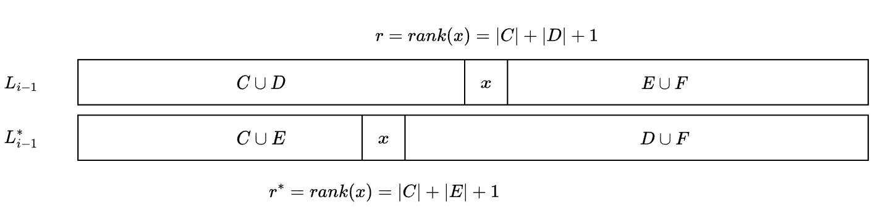

# 竞争分析

# 自组织链表

**操作类型**
- $Access(x)$ 访问链表中的某个元素，其耗时为 $rank(x)$，即顺序遍历链表，然后找到目标值
- 可交换相邻元素，其耗时为 $\Theta(1)$

**算法类型**
- 在线算法 `online algorithm` : 存在操作序列 $S$， 算法按顺序依次处理每一个操作
- 离线算法 `offline algorithm` : 首先收集操作，得到操作序列 $S$，然后再自行组织处理所有的操作

在线算法与离线算法的目的都是使得算法的耗时最小 $\min: C_A(S)$

**访问性能**

- **最坏的访问性能**: 每次操作都访问最后一个元素
$$
    C_A(S) = \Omega(len(S) \cdot n)
$$

- **平均的访问性能**：

假设链表中元素被访问的概率为 $P(x)$

$$
    E[C_A(S)] = \sum_{x \in L} P(x) \cdot rank(x)
$$

若链表 $L$ 中的元素按照 $P(x)$ 从大到小排序，$E[C_A(S)]$ 将最小。**因此，可以按照元素被访问的次数动态调节元素位置，便能完成对访问速度的优化。**

>[!tip]
> 前移算法 `move to front` : 当访问链表中的一个 $x$ ，交换相邻元素，将其前移到表头，其耗时为 $C = 2 \cdot rank(x)$。经过多次运行，高频访问元素便可都移动到链表的首部位置

# 竞争分析

> [!note]
> $\alpha-competive$:  对于在线算法 $A$，$\exists k$，可以使得操作序列 $S$ 满足
> $$ C_A(S) \le \alpha \cdot C_{OPT}(S) + k $$
> $C_{OPT}(S)$ 表示操作序列 $S$ 在离线算法中处理的最小耗时。

> `MTF(move to front)` 方案在自组织链表中，属于 $4-competive$ 算法

在第 $i$ 次访问链表后，$L_i$ 为 `MTF` 链表，$L_i^*$ 为离线算法最优链表。当访问元素 $x$ 时
$$
    \begin{aligned}
        C_i &= 2 \cdot rank_{L_{i-1}}(x)\\
        C_i^* &= rank_{L_{i-1}^*} + t_i 
    \end{aligned}
$$

$t_i$ 表示离线算法中， $L_{i-1}^* \rightarrow L_i^*$ 所进行的元素交换次数。定义势函数 $\Phi$

$$
    \Phi(L_i) = 2 |\{(x,y):  (x  \prec y)_{L_i} \ and \  (y \prec x)_{L_i^*}\}|
$$

$(x  \prec y)_{L_i}$ 表示在链表 $L_i$ 中，元素 $x$ 在元素 $y$ 的前面。当链表发生一次元素交换后，其势的变化为

$$
    \Delta \Phi = 2 \cdot (\pm 1)
$$

定义集合

$$
\begin{aligned}
    C &= \{y \in L_{i-1} : (y \prec x)_{L_{i-1}} \ and \ (y \prec x)_{L_{i-1}^*}\} \\
    D &= \{y \in L_{i-1} : (y \prec x)_{L_{i-1}} \ and \ (y \succ x)_{L_{i-1}^*}\} \\
    E &= \{y \in L_{i-1} : (y \succ x)_{L_{i-1}} \ and \ (y \prec x)_{L_{i-1}^*}\} \\
    F &= \{y \in L_{i-1} : (y \succ x)_{L_{i-1}} \ and \ (y \succ x)_{L_{i-1}^*}\} \\
\end{aligned}
$$

根据上述集合便能表示出链表的位置关系

根据 `MTF` 算法，访问元素 $x$ ，会将其移动到表头位置，即$L_{i-1} \rightarrow L_i$ ，其势变化为

$$
    \begin{aligned}
        \Delta \Phi_1(L_i) &= \Phi_1(L_i) - \Phi_1(L_{i-1}) \\
                         &= 2( |C| - |D|)
    \end{aligned}
$$

此外最优化也会存在相应变化，即 $L_{i-1}^* \rightarrow L_i^*$，$x$ 每移动一步，产生的势差满足 $\Delta \Phi \le 2$，且 $x$ 会移动 $t_i$ 次

$$
    \Delta \Phi_2(L_i) \le 2 \cdot t_i
$$

将上述两次操作加起来，便能得到最终的势差
$$
    \Delta \Phi(L_i) \le 2(|C| - |D| + t_i)
$$

可得访问元素 $x$ 的平价耗时定义，

$$
    \begin{aligned}
        \hat{c_i} &= c_i + \Delta \Phi(L_i) \\
                  &\le 2 r +  2(|C| - |D| + t_i) \\
                  &= 4|C| + 2 + 2 t_i \\
                  &\le 4(r^* + t_i) \\
                  &= 4 c_i^*
    \end{aligned}
$$

因此

$$
\begin{aligned}
    C_{MTF}(S) &= \sum_{i=1}^{|S|} c_i \\
               &= \sum_{i=1}^{|S|} (\hat{c_i} + \Phi(L_{i-1}) - \Phi(L_i)) \\
               &\le \sum_{i=1}^{|S|} 4\hat{c_i} +  \Phi(L_{0}) - \Phi(L_{|S|}) \\
               &\le \sum_{i=1}^{|S|} 4\hat{c_i} \\
               &= 4 \cdot C_{OPT}(S) \\
\end{aligned}
$$  

> [!tip]
> 可以应用到简单哈希表中，将链表元素提前，使得查询性能增加 `30% ~ 40%`

