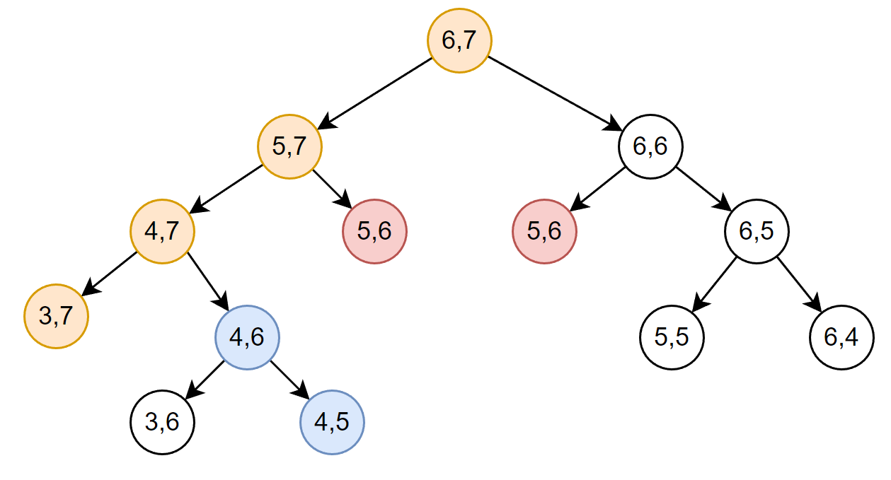
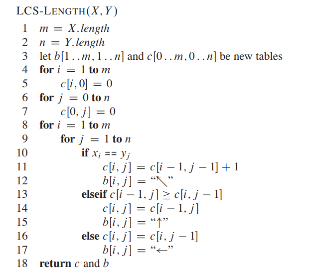
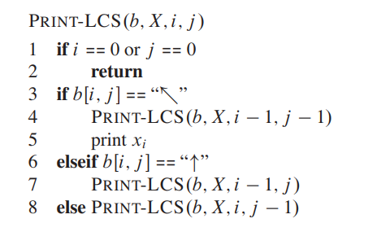
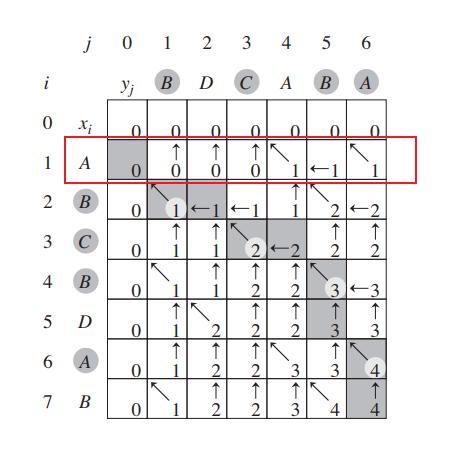

# 动态规划

# 动态规划特征

1. 最优子结构：一个问题的最优解包含了子问题的最优解，即可以通过子问题的最优解一步步推算得到最终根问题的最优解
2. 重叠子问题：直接采用递归法求解，求解过程会包含许多重复的子问题

# 最长公共子序列

## 问题

问题：对比已知序列 $x[1 \dotsm m]$ 与 $y[1 \dotsm n]$，找到最长的公共子序列

$$
\begin{matrix}
  x:& A & B & C & B & D & A & B \\
  y:& B & D & C & A & B & A & \\
\end{matrix}
$$

其最长公共子序列有：$BDAB$、$BCAB$、$BCBA$

## 枚举法

- 从 $x$ 中取子序列，每个元素的状态为有或者没有，因此存在 $2^m - 1$ 个子序列
- 把从 $x$ 获取的一个子序列放入 $y$ 中进行检测，其耗时为 $O(n)$

因此耗时为 $O(n \cdot 2^m)$

## 动态规划

思路：
1. 先得到最长公共子序列 $LCS(x,y)$ 的长度 $|LCS(x,y)|$
2. 拓展算法，找到最长公共子序列 $LCS(x,y)$

### 长度递推式

$x[1 \dotsm m],y[1 \dotsm n]$ 序列的「**前缀**」为 $x[1 \dotsm i], y[1 \dotsm j]$，即描述 $x[1 \dotsm m],y[1 \dotsm n]$ 的子问题 $x[1 \dotsm i], y[1 \dotsm j]$。定义前缀的最长公共子序列的长度
$$
    c[i,j] = |LCS \left(x[1 \dotsm i], y[1 \dotsm j] \right)|
$$

因此， $|LCS(x,y)|$ 的结果便是 $c[m,n]$。得到长度递推式（前人总结）为

$$
c[i, j]=\left\{\begin{array}{ll}
0 & \text { if } i=0 \text { or } j=0 \\
c[i-1, j-1]+1 & \text { if } i, j>0 \text { and } x_{i}=y_{j} \\
\max (c[i, j-1], c[i-1, j]) & \text { if } i, j>0 \text { and } x_{i} \neq y_{j}
\end{array}\right.
$$

定义前缀的最长公共子序列 

$$
    \begin{aligned}
        z[1 \dotsm k] &= LCS(x[1 \dotsm i], y[1 \dotsm j]) \\
        c[i,j] &= k 
    \end{aligned}
$$

**当 $x_i = y_i$ 时**，在 $x[1 \dotsm i - 1 ], y[1 \dotsm j - 1]$ 状态就可以查找到下一个公共子序列的元素 $z[k] = x_i = y_i$。也可以说

$$
    \begin{aligned}
        z[1 \dotsm k-1] &= LCS(x[1 \dotsm i - 1], y[1 \dotsm j - 1]) \\
        c[i - 1,j - 1] &= k - 1
    \end{aligned}
$$

因此，下式成立

$$
    c[i,j] = c[i-1,j-1] + 1, \text { if } i, j>0 \text { and } x_{i}=y_{j}
$$

**当 $x_i \ne y_i$ 时**
- $x_i = y_{i-1}$ : $x_i = y_i$ 证明的变换
    $$c[i,j - 1] = c[i - 1,j-1] + 1$$
- $x_{i-1} = y_i$ : $x_i = y_i$ 证明的变换
    $$c[i - 1,j] = c[i - 1,j-1] + 1$$
- $x_i \ne y_{i-1} \text{ or } x_{i-1} \ne y_i$ 
    $$
        \begin{aligned}
            c[i,j - 1] &= c[i - 1, j - 1] \\
            c[i - 1,j] &= c[i - 1, j - 1] \\
        \end{aligned}
    $$

### 求解

- **递归求解**

如果用递归的方式求解 $c[m,n]$，那么最坏的情况是
$$
    c[i,j] = \max (c[i, j-1], c[i-1, j])
$$

其构成的递归树高度为 $m + n$，且计算耗时为 $O(2^{m+n})$，**会计算许多重复的子问题**

- **备忘法**

还是递归求解，但是使用一个全局数组 $c[1 \dotsm m, 1 \dotsm n]$ 来记录每次递归的结果，如果结果已经求解，那么就不再重复计算。 每个元素 $c[i,j]$ 都只计算一次，因此耗时为 $O(m \cdot n)$，**但是需要 $O(m \cdot n)$ 的空间来存储历史结果**

- **递推计算**

不再使用从上到下的「递归」计算，而是从下到上依次计算递推公式，即从 $c[1,1]$ 开始，计算到 $c[m,n]$ 结束

通过数组 $b[1 \cdots m, 1 \cdots n]$ 可以标记路径，用于回溯打印公共序列

如果只需要「最大长度」，对于 $c[i,j]$ 只要知道前一行的结果，就能根据递推式得到当行的结果，因此之前所有结果其实都不需要，只要存储一行的结算结果就行，即存储空间可以缩小到 $O(min(n,m))$

