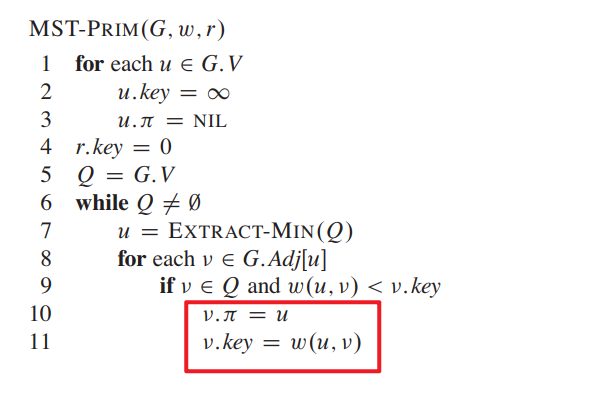
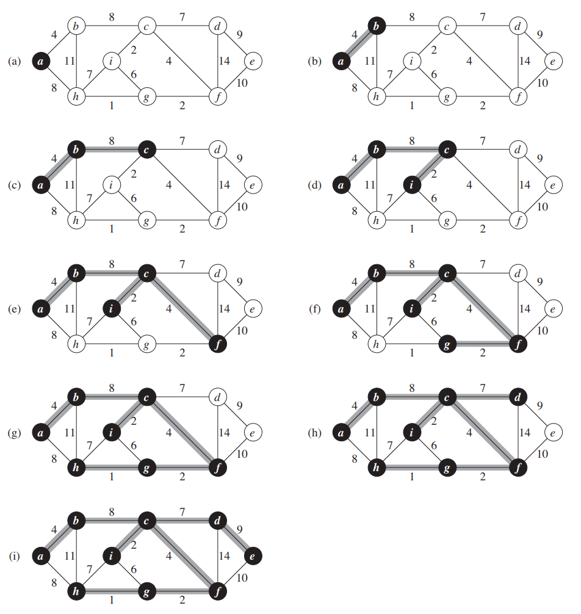

# 图论

# 概念

## 定义

定义图为 $G = (V,E)$，其中 $V$ 为顶点集合，$E$ 为边的集合

- 有向图 `Digraph` ： $E \le V \times V$
  - 出度 `out degree`： 以点 A 为起点的边的数量
    $$
       \sum_{v \in V} out-degree(v) =  \sum_{v \in V} in-degree(v)  = |E| 
    $$
  - 入度 `in degree`： 以点 A 为终点的边的数量
- 无向图 `Undirected Graph` : $|E| = O(V^2)$ (该形式是 $O(C_V^2)$ 的简写)
  - 度 `degree` : 以点 A 为端点的边的数量
  - 握手定理 ： 
    $$\sum_{v \in V} degree(v) = 2 |E|$$
- 连通图 `Connected Graph` : $|E| > |V| - 1$ 因此可以推到出 

    $$
        \lg |E| = \Theta(\lg |V|)
    $$

## 表现形式

- 邻接矩阵 `Adjacency Matrix`

顶点 $V \in \{1,2,3,\dotsm,n\}$ ，其中 $i,j$ 是 $V$ 中点的索引，利用矩阵 $A_{n \times n}$ 来存储点与点的连接关系

$$
    A[i,j] =    \begin{cases}
                    1 , \quad if(i,j) \in E \\
                    0 , \quad if(i,j) \notin  E
                \end{cases}
$$

空间复杂度为 $O(V^2)$，储存密集型的图占优势，可以用 $1 \ bit$ 就能表示一条边

- 邻接表 `Adjacency List`

利用一个 `Adj[V] = map<V, list<V>>` 来存储点与点之间的关联关系，`list<V>` 中存放的是所有和点 `V` 连线的点。在「无向图」中 `|list<V>|` 则称之为点 `V` 的度，而在「有向图」中被称之为点 `V` 的出度。其空间复杂度为 $\Theta(V + E)$，储存洗漱型的图占优势，但存储密集型的图需要存储大量点的索引，且一个点索引至少要 $\lg(|V|) \ bit$

# 最小生成树

## 问题描述

- 输入：一个无向图 $G = (V,E)$，以及一个关于边的权重映射函数 $w:E \rightarrow R$
- 输出：生成一颗连接所有结点的生成树 `Spanning Tree`，且所有边的权重之和最小

**假设**： 权重只与一条边 $(u,v)$ 相关，那么树的权重值便是

$$
    W(T) =  \sum_{(u,v) \in E} w(u,v), \qquad v,u \in V
$$

## 最优子结构

>[!note]
>**定理：** $T$ 是 $G = (V,E)$ 的最小生成树，那么 $T$ 的子树 $T_1$ 也是 $G$ 中某个子图 $G_1 = (V_1,E_1)$ 的最小生成树
>- $V_1 \in T_1$
>- $E_1 = \{(x,y)|(x,y) \in E \ and \ x,y \in V_1 \}$

假设 $T$ 去掉边 $(u,v)$后，被拆分成了两个子树 $T_1,T_2$，根据权重计算公式可得

$$
    W(T)  = W(T_1) + W(u,v) + W(T_2)
$$

若 $T_1$ 对于的子图 $G_1$ 的最小生成树是 $T_1'$，那么图 $G$ 的最小生成树权重应就是

$$
    W(T')  = W(T_1') + W(u,v) + W(T_2)
$$

那么 $T'$ 应该就比 $T$ 更好，与定义矛盾。因此定理成立

## 重叠子问题

最小生成树的子树有多种构成方式，解决该问题并不需要所有的构造方案，因此都属于重叠问题。

## 贪心选择性

> [!note|style:flat]
> `Greedy-choice` : 局部最优解就是全局最优解

> [!note]
> **定理**：$T$ 是 $G = (V,E)$ 的最小生成树， $A$ 是 $V$ 的子集，且 $(u,v) \in E$ 是连接 $A$ 与 $\bar A$ 最小权重的边，那么 $(u,v) \in T$

>[!note]
> 在满足动态规划条件的前提下，再满足「贪心选择性」，就能得到更优的贪心算法。

## Prim 算法

通过 $\bar{A}$ 构建一个**优先队列（可以根据 $key$ 自动排序）$Q$** ，以 $\bar{A}$ 中的每个点连接 $A$ 中点的最小边权值作为键。每个点具有两个属性，$Q$ 队列的中 $key$，以及在最小生成树中，当前点要连接的下一点索引 $\pi$

**注：** 执行 $EXTRACT-MIN(Q)$ 会弹出 $key$ 最小的点。**且红框部分采用不同的数据结构 $Q$ ，对应的更新方式也不一样**

