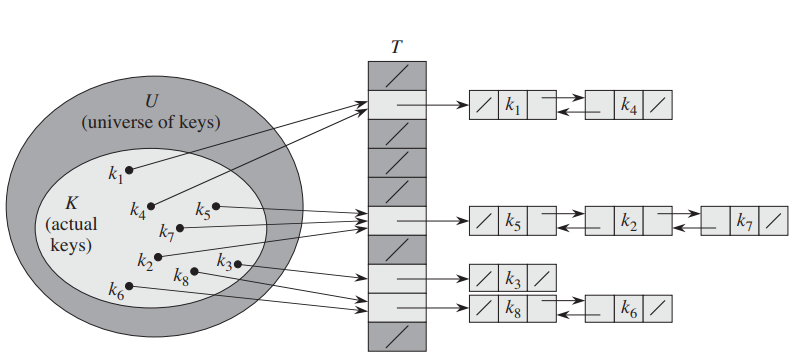
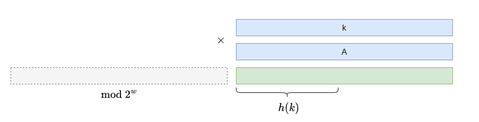
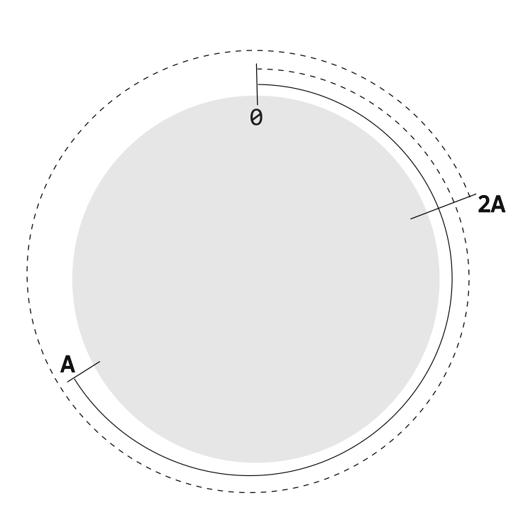
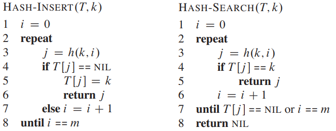
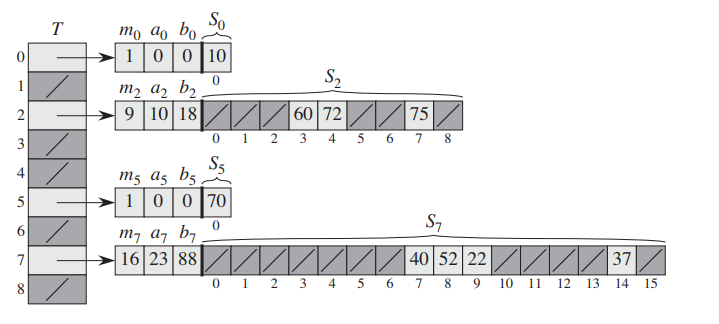

# 哈希表

# 表结构

一张表存放的数据结构为 `key:value` 的形式，通过 `key` 可以进行一系列基本操作
- 根据 `key` 查找 `value`
- 插入 `key : value` 数据
- 删除 `key : value` 数据

# 哈希表

表结构最简单的实现方式是利用指针数组
- 数组索引为 `key`
- 元素为 `value` 的指针

**但是该方式只适用于有限且不重复的 `key`。** 

哈希表则在数组直接映射表上的基础上进行改进
- 哈希表同样基于数组 $T$ 来关联 `key` 与 `value`
- 数组 $T$ 的索引不在是 `key`，而是 key 的 `hash` 值
- `key` 会经过一次 「`hash` 函数」运算，得到 hash 值，然后用于检索 $T$ 的槽 `slot`
- 由于槽的个数有限（$m$ 个），因此不同的 `key` 可能存在相同的 hash 值，即冲突 `collision`，因此，$T$ 存放的不再是元素指针，而是同 hash 值元素构成的链表

# 简单哈希表

## 分析

**简单哈希表 `simple uniform hash table`** : 所有 `key` 被映射到每个槽的概率相等，即 $\frac{1}{m}$，且每个 `key` 的 hash 计算相互独立。

> [!note]
> 一个 hash 表存在 $n$ 个 key 和 $m$ 个 slot，那么其装载因子为 $\alpha = n/m$ ，即一个槽平均要存放 $ \alpha$ 个 元素

- **最坏搜索时间**

所有的 key 都映射到一个槽上，其搜索时间为 $\Theta(n)$

- **平均搜索时间**

当 key 被均匀映射到每一个槽，其搜索时间为 $\Theta(1 + \alpha)$。当 $\alpha = O(1)$ (此时 $n = O(m)$)时，搜索时间为 $\Theta(1)$

## 哈希函数

> [!tip]
> 对于一个通用的哈希函数需要满足
> - key 进行 hash 计算后，能被均匀映射到每一个槽上
> - key 的特有分布规律，不会影响 hash 函数计算结果的分布规律

### 除法哈希函数

$$
   h(k) = k \ \text{mod} \ m
$$

-  $m$ 值不要选择太小的

当选择 $m = 2$ 时，如果 key 都是偶数，就会导致所有的元素都集中在一个槽中

- $m$ 值不要使用 $2^r$ 或者 $10^r$

假设 key 的长度为 `16 bits` 且 $m = 2^4$。采用除法哈希函数，对于一个 key 而言，只有低 4 位才会参与 hash 计算

### 乘法哈希函数

计算机内存地址长度为 $w$ 位，哈希表的槽数为 $m = 2^2$

$$
    h(k) = A k \ \text{mod} \ 2^w >> (w - r)
$$

其中 $A$ 为奇数，且满足 $ 2^(w-r) < A < 2^w$

其计算结果就相当与在 $[0,2^r]$ 范围内绕圈

# 开放寻址

## 设计思路
 
简单哈希表方案采用「链表」解决同哈希值的 `collision`，而开放寻址法 `open addressing` 则保证每一个值都会有一个槽进行存放

1. 槽的个数要大于键的个数，即 $m \ge n$
2. 哈希函数 $h(k,i)$ 不是生成一个 hash 值，而是生成一个关于槽的固定「检索序列 `probe sequence`」，用于装填哈希表
3. 表插入：$h(k,i)$ 会从 $i = 0$ 开始，根据 key 生成 $T$ 的索引 $j$，直到找到空闲的槽，并将 key 放入空闲槽
4. 表检索：$h(k,i)$ 会从 $i = 0$ 开始，根据 key 生成 $T$ 的索引 $j$，直到找到目标 key

>[!note]
> - 采用开放寻址设计哈希表，删除操作对表结构影响较大
> - 只有相同 key 肯定会遍历「索引序列」，不同 key 通常只需一次哈希计算便能找到槽 （若槽被其他相同 key 占用，那还是得遍历 「索引序列」）

## 哈希函数

- **线性哈希**

$$
    h(k,i) = [ h(k,0) + i ] \ \text{mod} \ m
$$

使用线性哈希函数存在「一次集群`primary clustering`」问题，如果哈希表的某段区间的槽都被占满，那么下一次添加元素，就需要把这些槽的都得遍历一边，才能找到空闲槽 (**探索序列是由 $h(k,i)$ 递推调用生成的**)

- **二次哈希**

$$
    h(k,i) = [h_1(k)+ i \cdot h_2(k)] \text{mod} \ m
$$

$h_1(k)$ 与 $h_2(k)$ 是两个不同的辅助哈希函数，比较常用的方式

## 耗时分析

**失败搜索平均时间** : 需要搜索的 key 在哈希表中不存在

> **假设：**
> 1. 所有的 key 都存在 $m!$ 种检测序列
> 2. 所有 key 相互独立

使用 $A_i$ 表示第 $i$ 次的搜索结果，槽存在值的事件；

$$
    Pr\{A_i\} = \begin{cases}
        \frac{n - i + 1}{m - i + 1} , i \le n \le m\\
        0, other
    \end{cases}
$$

$X$ 表示未找到 key，所进行的探测次数。

- 探索 $i$ 次，搜索失败

$$
    \begin{aligned}
        Pr\{X = i\}  &=  Pr\{A_1 \cap A_2 \cap \dotsm \cap A_{i-1}\}  \\
                     &= \frac{n}{m} \cdot \frac{n-1}{m-1} \cdot \frac{n-2}{m-2} \cdots \frac{n-i+2}{m-i+2} \\
                     &\le \frac{n}{m}^{i - 1} \\
                     &= \alpha^{i -1}
    \end{aligned}
$$

- 探索 $> i$ 次，搜索失败，该情况不可能出现（$i$ 次搜索失败，就退出搜索），因此 $Pr\{X > i\} = 0$

综上所述，$Pr\{X \ge i\} \le \alpha^{i-1} $ 成立。计算失败搜索次数的期望

$$
    \begin{aligned}
        E[X] &= \sum_{i=0}^{\infty} i \cdot Pr\{X = i\} \\
             &= \sum_{i=0}^{\infty} i (Pr\{X \ge i\})  - Pr\{ X \ge i + 1\} \\
             &= Pr\{X \ge 1\} - Pr\{X \ge 2\} + 2[Pr\{X \ge 2\} - Pr\{X \ge 3\}]  + 3[Pr\{X \ge 3\} - Pr\{X \ge 4\}] + \dotsm \\
             &= \sum_{i=1}^{\infty} Pr\{X \ge i\} \\
             &\le \sum_{i=1}^{\infty} \alpha^{i-1} \\
             &= \sum_{i=0}^{\infty} \alpha^{i} \\
             &= \frac{1}{1 - \alpha} \\
    \end{aligned}
$$

# 全域哈希

## 定义

> [!note]
> 上文所述方案，均能根据算法直接找出一组 key 序列，使得哈希查询性能最差。而应对该问题最直接的解决方案便是引入「随机量」。

**全域哈希 `universal hashing`** :  $u$ 代表所有 key 的集合，$H$ 表示「哈希函数」的集合。从 $H$ 中随机选择哈希函数，使得将 $u$ 映射到 $\{0,1,\dotsm, m - 1\}$ 序列上。若选择两个互相独立的键 $\forall x,y \in u, x \ne y$，在 $H$ 中，存在 $\frac{|H|}{m}$ 个哈希函数使得 $h(x) = h(y)$ 成立，则 $H$ 称之为全域哈希。

$$
    |\{ h \in H: h(x) = h(y)\}| = \frac{|H|}{m}
$$

即随机从 $H$ 中选取一个哈希函数 $h$，使得事件 $\{h \in H: h(y) = h(y)\}$ 成立的概率为

$$
    \text{Pr} \{ h \in H : h(x) = h(y) \} = \frac{1}{m}
$$

## 分析

> [!note]
> **定理：** $n$ 个键，$m$ 个槽的哈希表 $T$，从全域哈希 $H$ 中随机选择一个哈希函数 $h$，每个键发生碰撞的期望为
> $$ E[\text{collision with x}] < \frac{n}{m} $$

定义随机变量 $c_{xy}$ 表示从全域哈希 $H$ 中随机选择一个哈希函数 $h$，键 $\forall x,y \in u, x \ne y$ 发生了「碰撞」

$$
    c_{xy} = \begin{cases}
        1 , h(x) = h(y) \\
        0, other
    \end{cases}
$$

使用 $C_x$ 表示所有键与 $x$ 键发生碰撞的总数

$$
    C_x = \sum_{y \in T - {x}} c_{xy}
$$

计算期望

$$
    \begin{aligned}
        E[C_x] &= E[\sum_{y \in T - {x}} c_{xy}] \\
               &= \sum_{y \in T - {x}} E[c_{xy}] \\
               &= \sum_{y \in T - {x}} \frac{1}{m}\\
               &= \frac{n-1}{m} \\
               &< \frac{n}{m}
    \end{aligned}
$$  

## 构造

- **全域哈希构造**

将 key 分解为 $r+1$ 位的 $m$ 进制自然数，**且$m$为质数**
$$
    k = <k_0,k_1,\dotsm,k_r>, \quad 0 \le k_i \le m-1
$$
例如 $r = 4, m = 16$ 的整数， $k = \text{0x1FFFA}$。再创建一个 $r + 1$ 位的 $m$ 进制**随机变量 $a = <a_0,a_1,\dotsm,a_r>$**，定义全域哈希函数

$$
    H = \{h_a(k) : h_a(k) = (\sum_{i=0}^r a_i k_i) \bmod m \} 
$$

该全域哈希存在的哈希函数个数为 $|H| = m^{r+1}$。

- **证明**

> [!tip]
> $a \equiv b \pmod{m} $ 是 $a \bmod m = b \bmod m$ 形式的简写

> [!note]
> **定理：** 若 $m$ 为质数，$\forall z \in Z_m \{x: x = k \bmod m, k \in N\}$ 且 $ z \ne  0$，则存在 $\exist z^{-1} \in Z_m$ 使得 $z \cdot z^{-1} \equiv 1 \pmod m$ 成立。例如 $m = 7$，$z = 3$，则存在 $z^{-1} = 5$，满足 $3 \cdot 5 \bmod 7 = 1$

选择两个键 $\forall x,y \in u, x \ne y$

$$
    \begin{aligned}
        x = <x_0,x_1,\dotsm,x_r> \\
        y = <y_0,y_1,\dotsm,y_r> \\
    \end{aligned}
$$

假设 $x_0 \ne  y_0$ (选择哪个部分不相等，结论都一样)，$x$ 与 $y$ 发生碰撞

$$
    \begin{aligned}
        h_a(x) &= h_a(y) \\
        \sum_{i=0}^r a_i x_i &\equiv \sum_{i=0}^r a_i y_i \pmod m \\
        \sum_{i=0}^r a_i (x_i - y_i) &\equiv 0 \pmod m \\
        a_0(x_0 - y_0) &\equiv - \sum_{i=1}^r a_i (x_i - y_i)  \pmod m \\
    \end{aligned}
$$

**选择 $m$ 为质数**

$$
    \begin{aligned}
        a_0(x_0 - y_0) &\equiv - \sum_{i=1}^r a_i (x_i - y_i)  \pmod m \\
        a_0  &\equiv (x_0 - y_0)^{-1} (- \sum_{i=1}^r a_i (x_i - y_i))  \pmod m 
    \end{aligned}
$$

**只要 $a_1,a_2,\dotsm,a_r$ 的值确定，然后根据上述等式计算出 $a_0$ 的值，那么 $x,y$ 必然发生碰撞，且哈希函数的个数为**

$$
    \begin{aligned}
    |{h: h(x) = h(y)}| &= m^r \\
                       &= \frac{m^{r+1}}{m} \\
                       &= \frac{|H|}{m} \\
    \end{aligned}
$$  

# 完美哈希

## 模型

**完美哈希 `perfect hashing`** : 通过`2`次「全域哈希」可以构造一个查询时间为 $O(1)$ 的 **静态（只有查询功能）** 哈希表，且表的规模为 $m = O(n)$。完美哈希将键值映射了`2`次，第一次映射到 $T$ 的槽，为解决碰撞，然后再一次映射到 $S_i$ 的槽，且第二次映射不会出现碰撞。

其中 $n_i$ 为 $S_i$ 需要存储键的个数， $m_i$ 为 $S_i$ 槽的个数，**且满足 $m_i = n_i^2$，这样才能保证 $S_i$ 中不会出现碰撞**；$a_i、b_i$ 为二级哈希的参数（这部分对于不同哈希函数有变动）。

> [!note]
> - 完美哈希只能用于有限的 $n$ 个键查询
> - 完美哈希是「静态」哈希表，是根据确定键值，程序运行前预先构建好的哈希表，而非程序运行时动态创建，类似于一个本地配置文件，程序运行直接加载使用

## 分析

### 碰撞

- **两个键发生碰撞的次数期望**

> **定理：** 哈希表的槽与键个数满足 $m = n^2$，且哈希函数从「全域哈希」中随机选择，`2`个键发生碰撞次数 $X$ 的期望满足
$$
    E[X] < \frac{1}{2}
$$

根据全域哈希定义，选择两个键 $x,y$ ，它们发生碰撞的概率为

$$
    Pr\{X\} = \frac{1}{m} = \frac{1}{n^2}
$$

从 $n$ 个键中选择 `2` 个键，其组合数为 $C_n^2 = n(n-1)/2$，计算期望

$$
    \begin{aligned}
        E[ X] &= \sum_{x \ne y} 1 \cdot \frac{1}{m} \\
                            &= \frac{n(n-1)}{2} \frac{1}{n^2} \\
                            &< \frac{1}{2}
    \end{aligned}
$$

因此，需要 $m = n^2$ 条件成立

- **两个键不发生碰撞的概率**

> **定理：** $m = n^2$, 哈希函数从「全域哈希」中随机选择，`2`个键发生碰撞次数 $X$，不发生碰撞的概率 $P\{ X = 0\} \ge \frac{1}{2}$

至少发生一次碰撞的概率
$$
    Pr\{X \ge 1\} \le \frac{E[X]}{1} < \frac{1}{2}
$$
 

>[!tip]
> **Markov 不等式**： 对于随机变量 $X \ge 0$，不等式成立 $Pr\{X \ge t\} \le \frac{E[X]}{t}$ 
$$
    \begin{aligned}
        E[X] &= \sum_0^{\infin} x \cdot Pr\{X = x\} \\
             &= \sum_0^{t-1} x \cdot Pr\{X = x\} + \sum_t^{\infin} x \cdot Pr\{X = x\} \\
             &\ge  \sum_t^{\infin} x \cdot Pr\{X = x\} \\
             &\ge  t \sum_t^{\infin} Pr\{X = x\} \\
             &=  t \cdot Pr\{X \ge t\} \\
    \end{aligned}
$$

### 空间占用

- $T$ 选择 $m = n$
- $S_i$ 选择 $m_i = n_i^2$

$$
    \begin{aligned}
        E[storage] &= n + E[\sum_{i=0}^{m-1} n_i^2] \\
                   &= n + E[\sum_{i=0}^{m-1} (n_i + n_i(n_i - 1))] \\
                   &= n + E[\sum_{i=0}^{m-1} n_i] +  E[\sum_{i=0}^{m-1} n_i(n_i - 1)] \\
                   &< n + E[n] +  E[\sum_{i=0}^{m-1} n(n - 1)] \\
                   &= n + n +  \frac{n(n-1)}{m} \\
                   &= 3n - 1 \\
    \end{aligned}
$$

因此，$E[storage] = O(n)$

