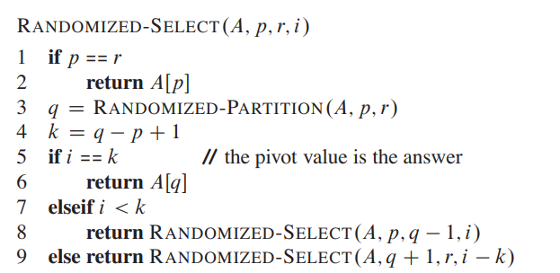
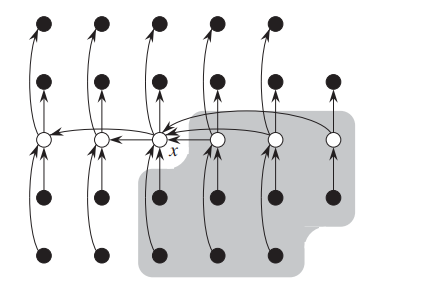

# 顺序统计

# 算法目标

已知一个无序数组，消耗线性时间，从数组中查找到目标值，例如最大值、最小值、中位数

# 随机分治法

## 算法实现

**问题：** 已知一个无序数组，找到数组中第 $k$ 小的元素

> [!note]
> 随机分治法处理存在重复元素的数组，性能会有点差

- Divide : 随机从数组中选择一个主元素，将数组拆分为两个，左数组存放 $\le$ 主元素的值，右数组存放 $>$ 主元素的值
- Conquer: 根据条件从左右数组中，选择一个数组进行处理
    - 主元素索引 $== k$ : 退出
    - 主元素索引 $\le k$ : 选择右侧数组
    - 主元素索引 $> k$ : 选择左侧数组
- Combine : 无

## 算法分析

- **最好的情况**

好的情况是在 Divide 阶段，左右数组的长度均 $\ge 0$，假设长度比为 $9 : 1$，选择最坏的数组

$$
    T(n) = T(\frac{9}{10} n) + \Theta(n)
$$

其消耗时间为 $\Theta(n)$

- **最坏的情况**

最坏的情况是在 Divide 阶段，左边的数组长度为 $0$，右侧数组长度为 $n-1$

$$
    T(n) = T(n-1) + \Theta(n)
$$

其消耗时间为 $\Theta(n^2)$

- **平均耗时**

由于 `RANDOMIZED-PARTITION` 阶段会随机选择主元素，因此定义随机变量 $X_k$ 表示

$$
    X_k = \begin{cases}
        1, \text{k element is chosen as pivot} \\
        0, \text{other}
    \end{cases}
$$

可得到

$$
    \begin{aligned}
        T(n) &\le \begin{cases}
            T(\max\{0,n-1\}) + \Theta(n), \text{the len of two divided array 0 : n-1  }\\
            T(\max\{1,n-2\}) + \Theta(n), \text{the len of two divided array 1 : n-2  }\\
            \qquad \qquad \dotsm \\
            T(\max\{n-1, 0\}) + \Theta(n), \text{the len of two divided array n-1 : 0  }\\
        \end{cases} \\
            &= \sum_{k=0}^{n-1} X_k (T(\max\{k, n-1-k\}) + \Theta(n))
    \end{aligned}
$$

计算期望，$X_k$ 与 $T(\max\{k, n-1-k\})$ 的随机部分是相互独立，两次 `RANDOMIZED-PARTITION` 之间并没有相关性

$$
    \begin{aligned}
        E[T(n)] &\le E\left[ \sum_{k=0}^{n-1} X_k (T(\max\{k, n-1-k\}) + \Theta(n)) \right] \\
                &= \sum_{k=0}^{n-1} E[X_k] E\left[ T(\max\{k, n-1-k\}) + \Theta(n) \right] \\
                &= \frac{1}{n} \sum_{k=0}^{n-1}  E\left[ T(\max\{k, n-1-k\}) + \Theta(n) \right] \\
                &= \frac{1}{n} \sum_{k=0}^{n-1} E[ T(\max\{k, n-1-k\})] + \Theta(n) \\
                &\le \frac{2}{n} \sum_{k=\lfloor n/2 \rfloor}^{n-1} E[ T(k)] + \Theta(n) 
    \end{aligned}
$$

> 假设存在 $c$ 可以使得 $E[T(n)] \le cn$ 成立

$$
    \begin{aligned}
        E[T(n)] &\le \frac{2}{n} \sum_{k=\lfloor n/2 \rfloor}^{n-1} ck + \Theta(n) \\
                &= \frac{2c}{n} \left( \sum_{k=1}^{n-1} k - \sum_{k=1}^{k=\lfloor n/2 \rfloor -1} \right) + \Theta(n) \\
                &= \frac{2c}{n} \left( \frac{(n-1)n}{2} - \frac{(\lfloor n/2 \rfloor - 1)\lfloor n/2 \rfloor}{2}  \right) \Theta(n) \\
                &\le \frac{2c}{n} \left( \frac{(n-1)n}{2} - \frac{(n/2 - 2)(n/2 -1)}{2}  \right) \Theta(n) \\
                &= c (\frac{3n}{4} + \frac{1}{2} - \frac{2}{n}) + \Theta(n) \\
                &\le \frac{3cn}{4} + \frac{c}{2} + \Theta(n) \\
                &= cn - (\frac{cn}{4} - \frac{c}{2} - \Theta(n))
    \end{aligned}
$$

假设成立，因此可得 $T(n) = O(n)$
 
# 选择中值主元

**随机分值法（随机选择法）** 的平均耗时是 $O(n)$，但是还是存在最坏情况 $\Theta(n^2)$。可对「随机选择主元」的算法部分进行优化，使得其耗时肯定是 $O(n)$

- Divide: 输入数组拆分使用了一个准确查找数组中值的算法，获取数组中值，然后将数组分为左右数组
    1. 将输入数组以 $5$ 个元素为一组，划分为 $\lfloor n/5 \rfloor$ 组，最后一组元素个数为 $[1,5]$
    2. 通过插入排序，找到每组元素的中值
    3. 所有中值组成一个长度 $\lceil \frac{n}{5} \rceil$ 数组，**又能进行一次算法递归**，查找全局中值
    4. 拆分数组, 返回全局中值索引
- Conquer: 将返回的中值当做主元素
    - 主元素索引 $== k$ : 退出
    - 主元素索引 $\le k$ : 选择右侧数组
    - 主元素索引 $> k$ : 选择左侧数组
- Combine : 无

由于 $x$ 是中值，因此 $\ge x$ 的元素个数至少有

$$
    \begin{aligned}
        \text{num} &\ge 3 \lfloor \lfloor \frac{n}{5} \rfloor /2 \rfloor \\
                            &= \lfloor \frac{3}{10} n \rfloor
    \end{aligned}
$$

假设 $n \ge 50$ ，则可得 $ \lfloor \frac{3}{10} n \rfloor \ge \frac{1}{4} n$，左右数组最大数组长度就是 $\frac{3}{4}n$，综上，得到最坏情况的递归表达式

$$
    T(n) = T(n/5) +  T(\frac{3}{4} n) + \Theta(n)
$$

> 假设存在 $c$ ，使得 $T(n) \le cn$ 成立

$$
    \begin{aligned}
        T(n) &\le \frac{cn}{5} + \frac{3cn}{4} + \Theta(n) \\
             &= \frac{19}{20} cn + \Theta(n) \\
             &= cn - (\frac{cn}{20} - \Theta(n))
    \end{aligned}
$$

只要 $c$ 足够大，$T(n) = O(n)$ 就成立

> [!note]
> 看看就行，实际工程没啥用，还是使用「随机选择算法」

