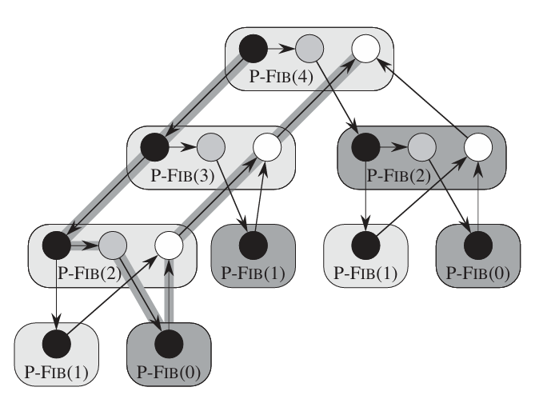
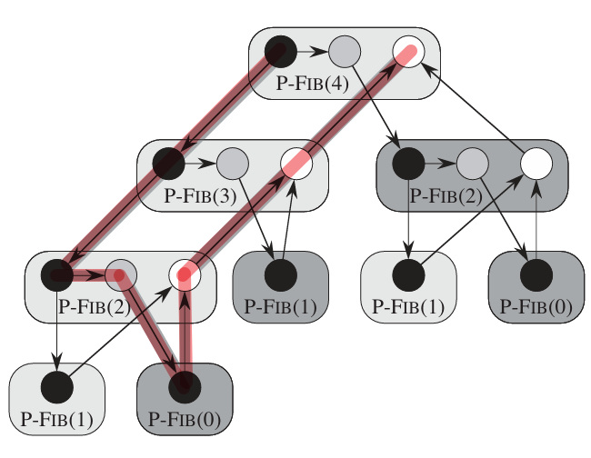
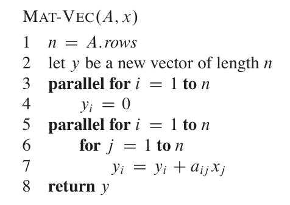
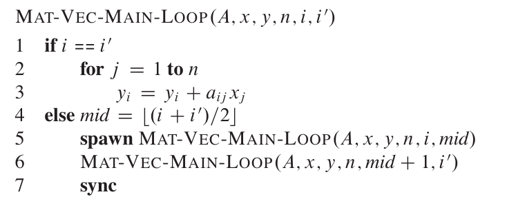
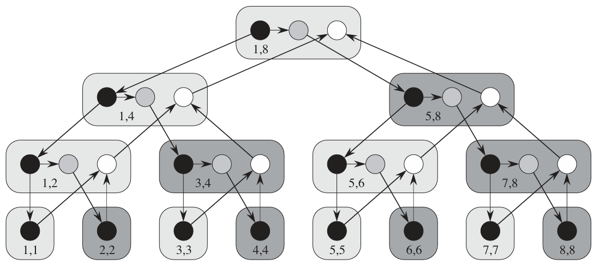
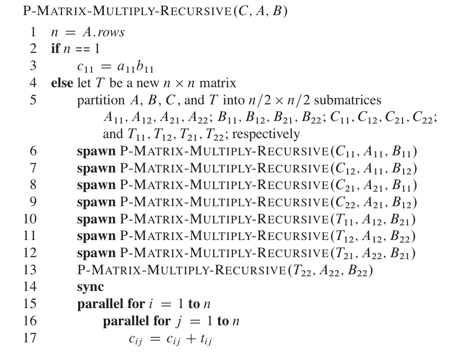

# 并行算法

# 逻辑模型

`Dynamic Multithreading` : 共享内存的基础上，实现线程的异步运行


```python
def Fib(n):
    if n < 2:
        return n
    x = spawn Fib(n-1)
    y = spawn Fib(n-2)
    sync
    return (x + y)
```

并行控制

- `spawn` : 生产一个子线程执行操作，且父线程不阻塞，父子线程同时运行
- `sync` : 同步父线程与子线程

上述操作只是在代码层面描述了并行逻辑，但实际执行情况则由操作系统的调度器确定，即代码只是确定哪些操作指令可以并行处理，是否并行则由操作系统与 CPU 自主控制。**由此可知，可以将代码落座视为一张 `DAG` 有向图，而 CPU 则按照这张 DAG 图执行任务。**
- 节点: 描述最长的串行执行序列，且不包含并行逻辑 (`spawn`、`sync`、`return`)
- 边： 边存在三中类型 `return` 、 `spawn`、`continuation`


```python
def Fib(n):
    # 节点 A 黑色
    if n < 2:
        return n
    # 节点 A 结束 
    x = spawn Fib(n-1)  # 节点 B 灰色
    y = spawn Fib(n-2)  # 节点 C 白色
    sync
    return (x + y)
```




> [!tip]
> 在此视角下，线程并不是 CPU 的执行单位，只是「节点」间串行执行的逻辑概念，真正控制节点并发执行的是调度器。

# 性能评估

- $T_1$ : 工时 (work) ，一个处理器的上的运行时间，即串行运行时间。例如 $Fib(4)$ 的 $T_1 = 17$ （假设一个节点耗时为 $1$）
- $T_{\infty}$ : 关键路径长度 (critical path length)，可使用的处理器无限，结果为在 DAG 图中的最长路径。例如 $Fib(4)$ 的 $T_{\infty} = 8$ （假设一个节点耗时为 $1$）



- $T_p$ : 在 $p$ 个处理器上，DAG 的运行时间
  -  $T_p \ge T_1 / p$
  - $T_p \ge T_{infty}$

- $T_1 / T_p$ : 加速比。
  - $T_1 / T_p = \Theta(p)$： 线性加速比
  - $T_1 / T_p > p$ : 超级线性加速比，永远不成立，因为  $T_p \ge T_1 / p$
  - $\bar{P} = T_1 / T_{\infty}$ : 并行度，能达到的最大加速比

# 贪婪调度器

## 思想

> [!tip]
> 调度器研究的是如何执行 DAG 图中的节点

**贪婪调度算法:** 执行 DAG 图时，尽可能提供最大多的处理器执行节点。假定有 $p$ 个处理器可用，调度的情况可以划分为两类：
- 完全步骤 `complete step` : DAG 图执行一步时，$\ge p$ 个节点可以进行并行处理，即能把所有处理器吃满。贪婪调度会提供所有的处理器 
- 不完全步骤 `incomplete step` : DAG 图执行一步时，$< p$ 个节点可以进行并行处理，即某些个处理器会空闲。贪婪调度会提供等于节点数的处理器

## 上限

> [!note]
> **定理：** 在 $p$ 个处理器的情况下，使用贪婪调度器执行 DAG 图，其运行时间上限为 $T_p \le T_1 /p + T_{\infty}$，也可以视为 $T_p \le 2 \cdot max\{T_1/p, T_{\infty}\}$

分析贪婪调度算法的 $T_p$，就是分析完全步骤与不完全步骤能有多少个，假设每个节点耗时均为 $1$
- 完全步骤 $\le T_1/p$ 
- 不完全步骤 $\le T_{\infty}$ : 在不完全步骤的情况下，每一步执行都会减少一次关键路径长度

**完全步骤执行后，就会产生不完全步骤。** 例如 $p + 3$ 个节点可执行，那么第一次调度就是 $p$ 个处理器消耗 $p$ 个节点，即完全步骤；第二次调度还剩 $3$ 个，那就再需要 $3$ 个处理器进行处理，即不完全步骤。因此可以证明
$$
    T_p \le T_1 /p + T_{\infty}
$$


## 推论

> [!note]
> 使用贪婪算法调度器，若 $p = O(\bar{P})$，则可以得到线性加速比。因此，只要提供 $\le \bar{P}$ 数量的 CPU 给调度器就行，多的都是浪费

$$
    \begin{aligned}
         p &= O(\bar{P}) = O(T_1 / T_{\infty}) \\
         T_{\infty} &= O(T_1 / p) \\
         T_p &\le T_1/p + O(T_1 / p) = O(T_1/p)\\
         T_1/p &= O(p)
    \end{aligned}
$$

# 并行循环

计算一个矩阵与向量相乘
$$
    B = Ax
$$

可以对没个 `for` 循环并行化，使用 `parallel for` 关键字表示



- 

`parallel for` 最简单的方案便是对于每一个循环体都启动一个线程，然后同步结果

```python
# 假设 range 描述区间 [1,n]
for i in range(1,n):
    spawn [y[i] = y[i] a[i][j] * x[j] for j in range(1,n)]
sync
```

但这种实现的 $T_{\infty} = \Theta(n + n)$。采用分治法进行优化，将第一层 `for i = 1 to n` 循环对半拆分成子问题



绘制 $ MAT-VEC-MAIN-LOOP(A,x,y,8,1,8)$ 的 DAG 图



可以看到只有在最后一层节点，才会进行 `for j = 1 to n` 的循环运算，其他节点都是进行关于 $i$ 的递归迭代

$$
    T_{\infty} = \Theta(\lg n + n)
$$

在进行优化，对 `for j = 1 to n` 也通过分治法实现并行化

```python
    parallel for i = 1 to n
        parallel for j = 1 to n
            y[i] = y[i] + a[i][j] * x[j]
```

$$
    T_{\infty} = \Theta(\lg n + \lg n) = \Theta(\lg n)
$$

其并行度为 $\bar{P} = \Theta(n^2 / \lg n)$


# 矩阵乘法

## 问题描述

**问题：** 已知矩阵 $n \times n$ 的 $A=[a_{ij}]$ 与 $B=[b_{ij}]$，计算矩阵 $C=[c_{ij}] = A B, c_{ij} = \sum_{k=1}^n a_{ik} b_{kj}$。


直接按照公式进行矩阵乘法计算，需要执行 3 次 $n$ 规模的循环，其算法耗时为 $\Theta(n^3)$。为了实现分治法，首先对矩阵进行分块处理

$$
    \begin{aligned}
     C &= AB \\ 
    \begin{bmatrix}
        r & s \\
        t & u 
    \end{bmatrix} 
    &= 
    \begin{bmatrix}
        a & b \\
        c & d 
    \end{bmatrix}
    \begin{bmatrix}
        e & f \\
        g & h 
    \end{bmatrix}
    \end{aligned}
$$

将矩阵 $C$ 的计算转换为

$$
    C = \begin{bmatrix}
        ae  & af \\
        ce  & cf 
    \end{bmatrix} +  \begin{bmatrix}
        bg & bh \\
        dg & dh
    \end{bmatrix}
$$

## 并行算法

**思路：** 矩阵进行分块后，可利用「分治法」拆解为 $8$ 个互不关联的子块乘法，然后对子块的求解并行化



定义 $M_p(n)$ 为 $p$ 个处理器时的耗时，则可以求解工时

$$
    \begin{aligned}
        M_1(n) &= 8 M_1(n/2) + \Theta(n^2) \\
               &= \Theta(n^3)
    \end{aligned}
$$

其耗时与实际分治法一样。然后求解关键路径长度

$$
    \begin{aligned}
        M_{\infty}(n) &= M_{\infty}(n/2) + \Theta(\lg n) \\
                      &= \Theta(\lg^2 n)
    \end{aligned}
$$

其并行度为 $\bar{P} = \Theta(n^3 / \lg ^2 n)$
