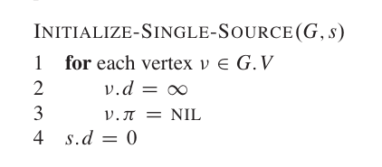
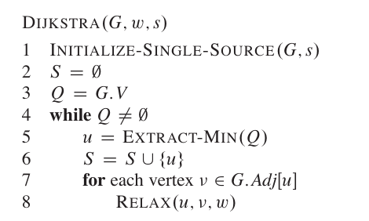
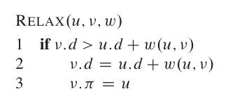
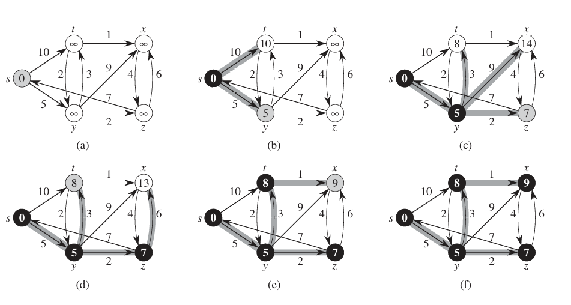
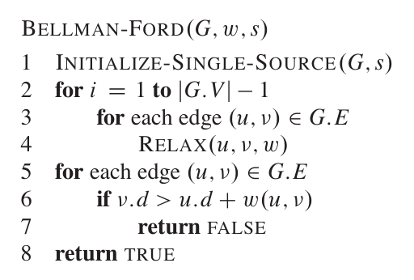

# 最短路径

# 问题

## 定义

有向图 $G(V,E)$，每条边都存在一个权值 $W:E \rightarrow R$。图中从 $v_1 \rightarrow v_k$ 的路径 $p = \{v| v_1 \rightarrow v_k\}$ 其权值为 
$$w(p) = \sum_{i=1}^{k-1} w(v_i, v_{i+1})$$

**最短路径 `Shortest Path`** : 从点 $u$ 到点 $v$ ，权值最小的路径，表示为

$$
\delta(u,v) =\text{min} \{ w(p): u \rightarrow v\}
$$

> [!note]
> - 存在负权值时，最小路径将不存在。若图中存在一个环，那么权值将可以减小到负无穷
> - 两个点未连接，那么权值将是正无穷大

## 最优子结构

> $u \rightarrow v$ 中子路径的最短路径是 $u \rightarrow v$ 最短路径的部分解

## 三角形不等式

> $u,x,v \in V$，那么肯定满足 $\delta(u,v) \le \delta(u,x) + \delta(x,v)$

## 单源最短路径

最短路径问题可以转换为 **单源最短路径 `Single-source Shortest paths`**：从源点 $s $ 出发，找到抵达图中所有点最短路径的最短路径 $\delta(s,v), v \in V$。对于计算机而言，它得遍历完所有结果，才能只知道 $u \rightarrow v$ 的最短路径。

# Dijkstra

> [!note|style:flat]
> 所有边的权值均 $\ge 0$

## 算法
 
`Dijkstra` 算法属于「贪心算法」，其核心思想为：
1. 容器 $S$ 是 $s$ 到目标点最小路径的点集
2. 每前进一步，就从 $\bar{S} = V - S$ 中找到与集合 $S$「估算距离」最小的点，放入集合 $S$ 中
3. 更新「估算距离」

$v.d$ 表示所有点到 $s$ 的距离，即「估算距离」，会通过 $RELAX$ 算法实时更新；$v.\pi$ 表示点指针

$S$ 表示最短路径中点的集合；$Q$ 是一个可以对 $v.d$ 进行排序的容器。通过估算距离 $v.d$，便能从 $Q$ 选择出与当前集合 $S$ 距离最短的点 $u$，并放入集合 $S$ 中，然后遍历所有与点 $u$ 在图中邻接的点 $Adj[u]$ ，通过 $RELAX$ 算法更新其估算距离

$v.\pi$ 存储的是当前点在最短路径中的前一点，用于组织出最短路径链表

算法最终会得到图 $(f)$ 。遍历图 $(f)$ 中任意点的 $v.\pi$ 便能找到抵达 $s$ 的最短路径

> [!note]
> 当前所有边的权重 $w(u,v) = 1$ 时，`Dijkstra` 算法便能退化成广度优先搜索

## 松弛算法

### 定理

> 在进行 $INITIALISE-SINGLE-SOURCE$ 操作之后，所有的 $RELAX$ 操作都能保证不等式成立
$$
    v.d \ge \delta(s,v)
$$

**归纳法进行证明**

- 基础条件

$s.d = 0, v.d = + \infty$ 初始条件下， $ s.d =\delta(s,s) = 0$，$v.d = + \infty \ge \delta(s,v)$ 均成立

- 出现条件不成立

在某一次操作下, 从点 $u \rightarrow v$得到结果 $v.d < \delta(s,v)$，即

$$
    v.d = u.d + \delta(u,v) < \delta(s,v)
$$

对于点 $u$ 而言，$u.d \ge \delta(s,u)$ 是成立的，那么

$$
    \delta(s,u) + \delta(u,v) < \delta(s,v)
$$

与「三角不等式」矛盾，假设不成立

### 引理I

> $s \rightarrow \dotsm \rightarrow u \rightarrow v$ 是最短路径，如果在点 $u$ 满足 $u.d = \delta(s,u)$ ，对边 $(u,v)$ 进行松弛操作，那么可得 $v.d = \delta(s,v)$

$$
\begin{aligned}
    \delta(s,v) &= w(s \rightarrow u) + w(u,v) \\
                &= \delta(s,u) + w(u,v) \\ 
                &= u.d + w(u,v) \\ 
\end{aligned}
$$

根据松弛定理可知 $v.d \ge \delta(s,v)$

- 松弛前 $v.d = \delta(s,v)$ : 进行松弛时 $v.d > u.d + w(u,v)$ 不成立，松弛后结果还是 $v.d = \delta(s,v)$
- 松弛前 $v.d > \delta(s,v)$ : $v.d > u.d + w(u,v)$ 成立，松弛后结果 $v.d = u.d + w(u,v) = \delta(s,v)$

## 引理II

> `Dijkstra` 算法运行结束，得到的结果是正确的，即 $v.d = \delta(s,v), \forall v \in V$

在 `Dijstra` 算法中，点被添加到 $S$ 中，就不会再改变 $v.d$，因此只要证明每个点在被添加到 $S$ 中时，其 $v.d = \delta(s,v)$ 成立，那么引理就成立。

**反证法：** 假设点 $u$ 被加入到 $S$ 中时 $u.d > \delta(s,u)$。

路径 $p$ 是 $s \rightarrow u$ 的一条最短路径，即 $w(p) = \delta(s,u)$。在 $u$ 被加入集合之前，最后一个被加入集合 $S$ 的点是 $x$ ，当前要做的事前就是对 $\{(x,y), y \in Adj[x]\}$ 边集合进行松弛。在点 $x$ 满足条件 $x.d = \delta(s,x)$，根据定理I可知，若 $y \in p$, 那么 $y.d = \delta(s,y)$ 成立，与假设矛盾，引理成立

# Bellman-Ford

> [!note|style:flat]
> 支持存在负权重，但不能存在负环

## 算法

对所有的边进行 $RELAX$ 操作，最后判断松弛结果是否正确结果
- `true`: 得到最短路径图
- `false`: 有向图 $G(V,E)$ 中存在负环，因此 `Bellman-Ford` 也可以用来检测图中是否存在负环

## 正确性

> $G(V,E)$ 不存在负环，那么 `Bellman-Ford` 算法运行结束，便能得到 $v.d = \delta(s,v)$

假设 $s \rightarrow v$ 最短路径为 $p=\{v_0,v_1,\dotsm,v_n\}, v_0 = s, n = |V| - 1$，那么对于源点 $s$，则 $v_0.d = \delta(s,v_0) = 0$。`Bellman-Ford` 算法在 $i=1$ 循环中，对所有的边进行 $RELAX$ 操作，根据「定理I」可知，肯定可以得到 $v_1.d = \delta(v_0,v_1)$，然后重复至少 $|V| - 1$ 轮循环，便能得到所有的 $v_i.d = \delta(v_{i-1},v_i)$

## 约束图

### 定义

对于一组约束不等式

$$
    \begin{aligned}
        x_{v1} - x_{u1} \le w_1 \\
        x_{v2} - x_{u2} \le w_2 \\
        \dotsm \\
        x_{vn} - x_{un} \le w_n \\
    \end{aligned}
$$

根据约束方程组构建有向图
- 用 $x$ 构成点集 $V$ 
- 用 $(x_{ui}, x_{vi})$ 构成边 $E$，方向为 $x_{ui} \rightarrow x_{vi}$
- 每条边的权值为 $w_{i}$

这样得到的图便称之为「约束图」

### 成立性

> [!tip]
> 约束图存在负环，那么约束方程组不成立

假设 $x_0, x_1, x_2, \dotsm,x_0$  构成的一个负环

$$
    \begin{aligned}
        x_1 - x_0 \le w_0 \\ 
        x_2 - x_1 \le w_1 \\ 
        \dotsm \\
        x_0 - x_n \le w_n \\ 
    \end{aligned}
$$

将上面所有不等式加起来

$$
    \begin{aligned}
    x_1 - x_0 + x_2 - x_1 + \dotsm + x_0 - x_n &\le \sum w_i \\
    0 &\le \sum w_i
    \end{aligned}
$$

根据负环定义 $\sum w_i < 0$，那么上式不成立，即不等式组不成立

> [!tip]
> 约束图不存在负环，那么约束方程组成立

添加源点 $s$ ，连通所有的点 $x_i$（即源点与所有的点均存在边 $(s,x_i)$），且权值 $w(s,x_i) = 0$。假设 $x_i = \delta(s, x_i)$ ，那么可得

$$
    \begin{aligned}
        x_{vi} - x_{ui} &\le  w_i \\
        \delta(s,x_{vi}) - \delta(s, x_{ui}) &\le  w(x_{ui}, x_{vi}) \\
        \delta(s,x_{vi}) &\le \delta(s, x_{ui}) +  w(x_{ui}, x_{vi}) \\
    \end{aligned}
$$

根据三角不等式，只要 $x_i = \delta(s, x_i)$， 在约束图中 $x_{vi} - x_{ui} \le w_i$ 绝对成立，即 $x_i = \delta(s, x_i)$ 是约束不等式的一组解。

