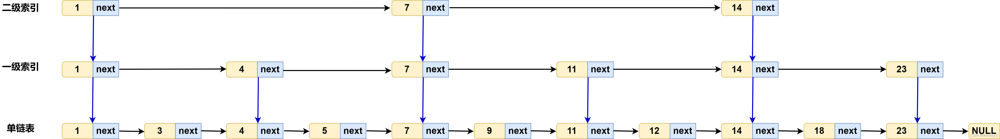
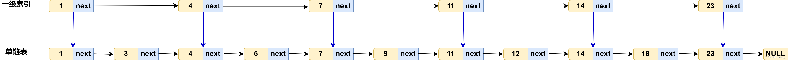

# 跳表

# 基本结构

跳表 `Skip Links` 在有序链表的基础上，增加多级用于搜索的链表，进而实现链表的快速查找
- 基本链表：包含所有元素，并有序排列，以链表的形式存储
- 索引链表：从下层链表中抽取部分元素构成，且抽取出来的元素与下层链表中的元素关联
- 所有链表以负无穷为第一个结点，方便编程

# 检索算法

> 检索元素 $x$：
> - 从顶层索引链表开始
> - 若 $node == x$ 则查询成功
> - 判断 $node.next > x$ 是否成立
>     - 成立：跳转到当前元素对应的下一层索引链表的结点，继续从前向后遍历
>     - 不成立：从前向后遍历所有元素

# 完美跳表

现假设索引链表只有一层，元素长度为 $n_{L_1}$ ，元素总共有 $n$ 个，且索引链表 $L_1$ 中的元素从基本链表中等间隔抽取

那么根据检索算法，最坏的搜索时间为

$$
    T(n) = n_{L_1} +  \frac{n}{n_{L_1}}
$$

根据高中知识可知，当 $n_{L_1} = \frac{n}{n_{L_1}}$ 时， $T(n)$ 最小
$$
    n_{L_1} = \sqrt{n}
$$

因此搜索时间

$$
     T(n) = 2 \sqrt{n}
$$

现在再添加一层索引 $L_2$，同样从 $L_1$ 中等间隔获取，最坏搜索时间为

$$
    T(n) = n_{L_2} + \frac{n_{L_1}}{n_{L_2}} + \frac{n}{n_{L_1}}
$$

最小的最坏搜索时间为

$$
    T(n) = 3 \cdot \sqrt[3]{n}
$$

进一步拓展到 $k$ 层链表，可以得到

$$
\begin{aligned}
   T(n) &= k \cdot \sqrt[k]{n}  \\
        &= k \cdot n^{\frac{1}{k}}
\end{aligned}
$$

当 $k = \lg n$ 时

$$
    \begin{aligned}
        T(n) &= \lg n \cdot n^{\frac{1}{\lg n}} \\
             &= \lg n \cdot 2^\frac{\lg n}{\lg n} \\
             &= 2 \lg n
    \end{aligned}
$$

**$T(n) = 2 \lg n$ 的效果已经十分不错，因此链表层数就是 $k = \lg n$**。现在进一步统一索引层取值规则，上一层与下一层的元素个数比为 $r$，且上一层从下一层等间隔选择元素，即

$$
    \frac{n_{L_k}}{n_{L_{k-1}}} = r
$$

根据该比列关系进一步可得

$$
    n = n_{L_k} = \frac{n_{L_k}}{n_{L_{k-1}}} \frac{n_{L_{k-1}}}{n_{L_{k-2}}} \dotsm \frac{n_1}{1} = r^{k} = r ^{\lg n}
$$

**求解上述式子便可得 $r = 2$**

> [!note]
> 上述推到的结构为**完美跳表**，但是实际在插入、删除元素后，并不能很好的维持这种结构特性
> - 跳表的链表层级数为 $\lg n$
> - 相邻两层链表元素比列为 $2$

# 随机索引表

## 元素操作

- **插入**

插入元素 $x$
1. 根据搜索算法，找到元素 $x$ 在底表中应当插入的位置，并插入
2. **抛硬币，正面表示插入元素 $x$ 要放入上一层链表，直到抛出反面**

- **删除** : 

根据搜索算法找到 $x$ ，然后从所有链表链表中删除

## 高概率

> **高概率(`with high probability`)** 表示 $\forall \alpha \ge 1$，事件 $E$ 发生的概率为 $Pr\{E\}  \ge 1 - O(1/n^\alpha)$，即事件 $E$ 有特别高的概率发生

多个事件的并集概率满足

$$
    Pr\{A_1 \cup A_2 \cup \dotsm \cup A_k \} \le Pr\{A_1\} + Pr\{A_2\} + \dotsm + Pr\{A_k\}
$$

假设 $\bar{A_i}$ 均是高概率事件，则
$$
    Pr\{ \bar{A_i}\} \ge 1 - O(1/n^\alpha)
$$

可推到出事件 $A_i$ 的概率均是

$$
    Pr\{A_i\} \le O(1/n^\alpha)
$$

那么所有事件  $\bar{A_i}$ 都发生的概率便是

$$
    \begin{aligned}
        Pr\{\bar{A_1} \cap \dotsm \cap \bar{A_k}\} &= 1 - Pr\{A_1 \cup A_2 \cup \dotsm \cup A_k \} \\
        &\ge 1 - k \cdot O(1/n^\alpha)
    \end{aligned}
$$

假设 $k = n^c$

$$
    Pr\{\bar{A_1} \cap \dotsm \cap \bar{A_k}\} = 1 - O(1/n^{\alpha - c})
$$

**因此所有高概率事件  $\bar{A_i}$ 都发生的事件也是满足高概率事件**

## 层数

> [!note]
> **定理：** 跳表的层数为 $O(\lg n)$ 是高概率事件

要证明 $ Pr\{Level \le c \lg n\}$ 是高概率事件，就需要先求解出 $Pr\{ Level > c \lg n\}$ 的概率。$Level > c \lg n$ 事件就表明，在插入元素时，某个元素抛硬币，连续抛出了 $ > c \lg n$ 次正面，即被提升了 $ > c \lg n$ 次。事件 $A_i$ 表示第 $i$ 个元素连续抛出了 $ > c \lg n$ 次正面

$$
\begin{aligned}
    Pr\{ Level > c \lg n \} &= Pr\{A_1 \cup A_2 \dotsm \cup A_n\} \\
    & \le Pr\{A_1\} + \dotsm + Pr\{A_n\} \\
    & \approx n \cdot (1/2)^{c \lg n}\\
    &= n \cdot (1/2^{n^c})\\
    &= n /(n^c) \\
    &= \frac{1}{n^{c - 1}}
\end{aligned}
$$

因此跳表的层数为 $O(\lg n)$ 是高概率事件

$$
    Pr\{Level \le c \lg n\} = 1 - \frac{1}{n^{c - 1}}
$$

## 搜索时间

> [!note]
> **定理：**  $n$ 个元素的跳表中，搜索耗时为 $O(\lg n)$ 是高概率事件。

将搜索结果换一种表述方式：
- 从底层链表目标结点倒推
- 回退路径向左或者向上移动
  - 如果抛出硬币为反面，向左移动
  - 如果抛出硬币为正面，向上移动
- 最终到第一层的第一个结点结束

上移的次数不会超高总层数，即有很高的概率，元素搜索需要抛出 $c \lg n$ 次正面。假设总共会抛 $10 \cdot c \lg n$ 次硬币，则正面小于 $c \lg n$ 的概率为

$$
    \begin{aligned}
        Pr\{ \le c \lg n\} &\le C_{10 c \lg n}^{ 9 c \lg n} (\frac{1}{2})^{9 c \lg n} \\
                           &= 1/ n^{(9 - \lg(10 e))c}
    \end{aligned}
$$

**因此 $O(\lg n)$ 次抛硬币后，得到 $c \lg n$ 次正面是高概率事件**