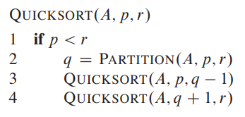
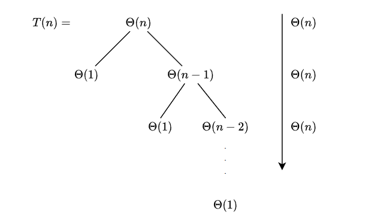
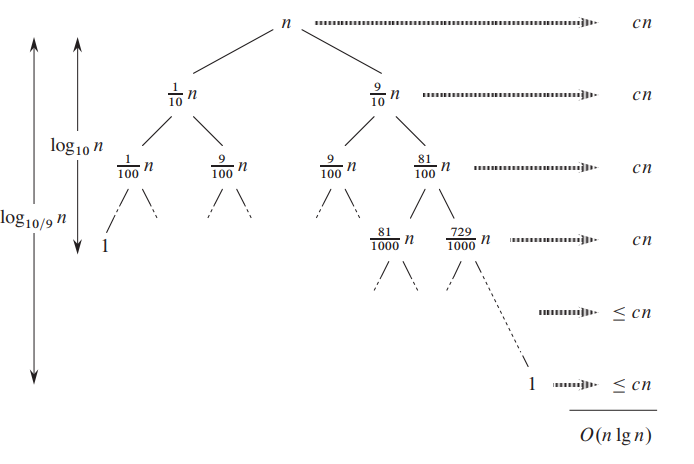
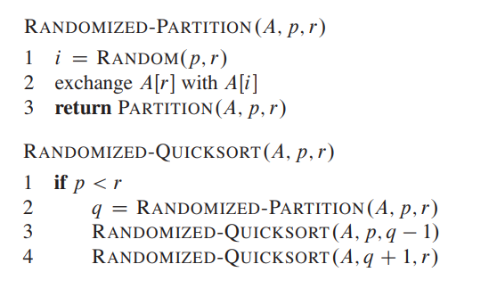
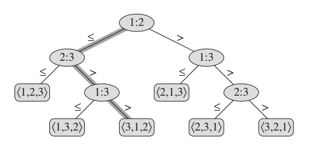
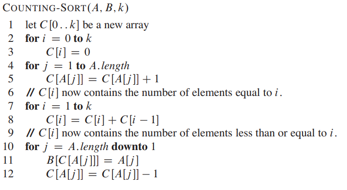
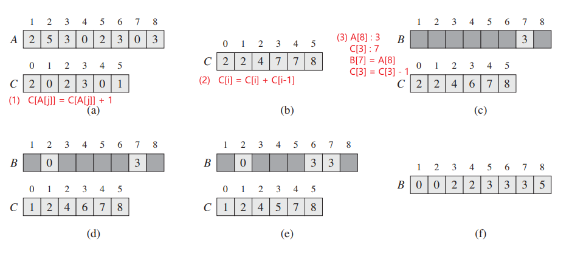
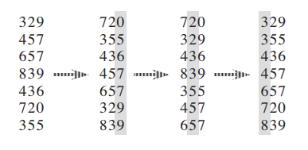

# 排序

# 稳定性

**稳定性：** 假定在待排序的记录序列中，存在多个具有相同的关键字的记录，若经过排序，这些记录的相对次序保持不变，即在原序列中，$a_1 == a_2$ ，且 $a_1$ 在 $a_2$ 之前，而在排序后的序列中，$a_1$ 仍然在 $a_2$ 之前，则称这种排序算法是稳定的；否则称为不稳定的。
- **不稳定算法：** 堆排、快排、希尔排序、选择排序
- **稳定算法：** 冒泡排序、插入排序、归并排序、基数排序

# 并归排序

**问题**： 排序数组 $A[1,\dotsm,n]$
1. Divide : 将数组 $A$ 的排序问题拆分为两个子数组的排序
2. Conquer: 进行子数组排序的函数也是 `MERGE-SORT`，即函数递归
3. Combine: 将两个子数组排序后的结果合并为一个数组

$$
    T(n) = 2 T(n/2) + \Theta(n)
$$

# 快排

## 算法实现

快速排序算法 `quicksort` 算法在本质上也属于 「分治法」。

1. Divide : 找一个主元素 $x$，将待排序数组与主元素进行比较，$\le x$ 的值构成左边的数据，$> x$ 的值构成右边的数组

    

2. Conquer: 对左右两边的数组继续进行排序
3. Combine: 算法本身直接在源数组上进行修改，因此无额外处理

## 算法分析

- **最坏的情况**

快速排序最坏的情况在 Divide 阶段划分的左右数组时，一个数组长度为 $0$ （数据已经被排序好了），其递归表达式为

$$
   T(n) = \Theta(n) + T(0) + T(n - 1)
$$

其结果为 $\Theta(n^2)$

- **最好的情况**

快速排序最理想的情况便是左右数组的长度一样长

$$
  T(n) = 2T(n/2) + \Theta(n)
$$

其结果为 $\Theta(n \lg n)$

- **固定比列**

假设左右数组长度之比为 $1 : 9$

$$
  T(n) + T(\frac{1}{10} n) + T(\frac{9}{10} n) + \Theta(n)
$$

**其结果仍然为 $\Theta(n \lg n)$** 。

> [!tip]
> 树的高度为 $h$  ，当 $ \frac{n}{ 10 ^h } \le 1 $ 或  $ \frac{n}{ (10/9) ^h } \le 1 $ 时，树就停止生长，因此就能估算树的高度

## 随机快排

综上所述，只有当输入序列已经被排好序时，快速排序算法性能最差，为了规避该情况，可以对快速排序算法进行优化。
- **方式一** ： 随机打乱输入的数组，使其不存在有序效果
- **方式二** ： 随机选择主元素

假如随机因素优化后的快排算法，被称之为「随机快速排序算法 (`Randomized Quicksort`)」。**下文算法分析将采用方式二**

随机快排 $T(n)$ 为

$$
    T(n) = \begin{cases}
        T(0) + T(n-1) + \Theta(n) , \text{the len of two divided array 0 : n-1  }\\
        T(1) + T(n-2) + \Theta(n) , \text{the len of two divided array 1 : n-2  }\\
        \qquad \qquad \dotsm \\
        T(n-1) + T(0) + \Theta(n) , \text{the len of two divided array n-1 : 0  }
    \end{cases}
$$

定义随机变量 $X_k$ 描述随机选择主元素

$$
    X_k = \begin{cases}
        1, \text{k element is chosen as pivot} \\
        0, \text{other}
    \end{cases}
$$

该随机变量满足

$$
    E[X_k] = 0 P\{X_k=0\} + 1 P\{X_k=1\} = P\{X_k=1\}
$$

利用利用随机变量 $X_k$ 表示 $T(n)$

$$
    T(n) = \sum_{k=0}^{n-1} X_k (T(k) + T(n-1-k) + \Theta(n))
$$

因此便可以计算随机快排耗时的期望 $E[T(n)]$

$$
    \begin{aligned}
        E[T(n)] &= E\left[\sum_{k=0}^{n-1} X_k (T(k) + T(n-1-k) + \Theta(n))\right] \\
                &= \sum_{k=0}^{n-1} E[X_k (T(k) + T(n-1-k) + \Theta(n))] \\
                &= \sum_{k=0}^{n-1} (E[X_k] \ E[T(k) + T(n-1-k) + \Theta(n)]) \\
                &= \frac{1}{n} \sum_{k=0}^{n-1} E[T(k) + T(n-1-k) + \Theta(n)] \\
                &= \frac{1}{n} \left(  \sum_{k=0}^{n-1} E[T(k)]  + \sum_{k=0}^{n-1} E[T(n-1-k)]  +  \sum_{k=0}^{n-1} E[\Theta(n)] \right) \\
                &= \frac{2}{n} \sum_{k=0}^{n-1} E[T(k)] + \Theta(n) , \quad \text{E[T(0)] and E[T(1)] are constant}\\
                &= \frac{2}{n} \sum_{k=2}^{n-1} E[T(k)] + \Theta(n)
    \end{aligned}
$$

> **假设**: 存在足够大的 $a$ 可以使得不等式 $ a n \lg n \ge E[T(n)], n \ge 2$ 成立

存在已经证明的结论

$$
   \sum_{k=2}^{n-1} k \lg k \leq \frac{1}{2} n^{2} \lg n-\frac{1}{8} n^{2}
$$

将上述假设与结论代入 $E[T(n)]$

$$
    \begin{aligned}
        E[T(n)] &\le \frac{2a}{n} \sum_{k=2}^{n-1} k \lg k   + \Theta(n) \\
                &\le \frac{2a}{n} (\frac{1}{2} n^{2} \lg n-\frac{1}{8} n^{2}) + \Theta(n) \\
                &= an \lg n - \frac{a}{4} n + \Theta(n) \\
                &= an \lg n - (\frac{an}{4} - \Theta(n))
    \end{aligned}
$$

可知存在足够大的 $a$ 使得 $(\frac{an}{4} - \Theta(n)) > 0$ 成立，**因此，$E[T(n)] \le an \lg n$ 成立，假设条件成立。** 

$$
     E[T(n)] \le O(n \lg n)
$$

> [!tip]
> 随机快排是应用最广的排序算法
> - 在源数组的基础上进行排序，不占用额外内存空间
> - 平均耗时为 $O(n \lg n)$
> - 通常情况下，排序速度是归并排序的 `3 ~ 4` 倍

# 比较排序

## 比较排序模型

**比较排序模型 `comparion sorts`**： 给定序列 $a_1,a_2,\dotsm,a_n$，可对其中两个元素 $a_i$ 与 $a_j$，执行以下其中一种比较运算
- $a_i < a_j$
- $a_i \le a_j$
- $a_i > a_j$
- $a_i \ge a_j$

便能得到序列的排序结果。相关算法有
- 快排 `quicksort`
- 堆排 `heapsort`
- 归并排序 `merge sort`
- 插入排序 `insertion sort`

## 决策树模型

**决策树 `decision tree`** : 通过绘制树状图，对 $A=\{a_i\}$ 进行排序
- 内部节点均以 $i:j$ 形式进行展示，表示会执行 $a_i$ 与 $a_j$ 的比较运算
- 内部节点的分支表示 $a_i$ 与 $a_j$ 比较后的两种结果，左分支 $\le$ ，右分支 $>$
- 一个叶子节点表示一种排序结果，某一个叶子节点肯定是正确的排序结果

给定序列 $a_1,a_2,a_3$ 利用排序算法对其排序，其决策树流程为

## 比较排序的极限

比较排序模型相关排序算法的执行过程，都能使用决策树模型进行绘制
- 内部节点：比较排序中的比较操作
- 分支：比较排序的执行过程
- 叶子节点：比较排序的排序结果

将比较排序转换为决策树，便能对其排序性能分析

- **最快的排序流程** ：根节点到叶子节点的最短路径
- **最慢的排序流程** ：根节点到叶子节点的最长路径

> [!note|style:flat]
> 任何决策树排序的最短时间为 $\Omega(n \lg n)$

一个数组序列至少有 $n!$ 中排序结果，而决策树的叶子节点是排序结果，因此，下列不等式一定满足

$$
    \text{Leaves Node Number} \ge n!
$$

一颗高度为 $h$ 的决策树，其叶子数肯定也满足

$$
    \text{Leaves Node Number} \le 2^h
$$

综上所述，在决策树模型中

$$
    \begin{aligned}
        n! &\le 2^h \\
        h &\ge \lg n! \\
          &\ge \lg (\frac{n}{e})^n,\text{Stirling's formula} \\
          &= \Theta(n \lg n)
    \end{aligned}
$$

决策树的最小高度是 $\Omega(n \lg n)$ ，即最短运行时间是 $\Omega(n \lg n)$

# 线性排序

## 计数排序

计数排序 `Counting sort` 突破了比较排序限制，使得排序耗时达到了 $\Theta(n)$，但是该算法存在使用条件限制
- 元素必须为整数
- 元素取值范围为 $[0,k]$
- 需要一个额外长度为 $k$ 的整型数组，当 $k$ 比 $n$ 大的多时，该算法比较浪费内存

> [!note]
> **计数排序的速度为 $O(k + n)$, 只有当 $O(k) == \Theta(1) $ 时，耗时才是 $\Theta(n)$**

**案例**： 对序列 $A = \{2,5,3,0,2,3,0,3\}$ 排序
1. 元素取值范围为 $[0,5]$，创建长度为 $6$ 的数组 $C$ 
2. 遍历数组 $A$，在数组 $C$ 中对每个元素进行计数，下图步骤 $(1)$
3. 计算出每个元素排序后，最后一个元素在输出数组 $B$ 中的索引位置，下图步骤 $(2)$
4. **反向遍历数组 $A$** ，将每个元素放入数组 $B$，下图步骤 $(3)$

> [!tip]
> 只有反向遍历数组 $A$ ，才能保证相同 $A$ 中相同大小的元素，会按照 $A$ 数组的顺序，放入数组 $B$ 中，例如 $A[3]$ 会被放入 $B[5]$，$A[8]$ 会被放入 $B[7]$，即 $A[3]$ 与 $A[5]$ 的先后顺序，在 $B$ 中被保留。**因此，计数排序是稳定排序。**

## 基数排序

### 算法

基数排序不像计数排序需要限制数组元素的类型，并依赖数组元素的取值范围，但是也存在限制
- 元素比较可以拆分为对元素具有排序优先次序的多个部分，从低优先级到高优先级依次比较，例如比较整数 `321` 与 `456`，可以依次比较个位、十位、百位上的数值，进而确定两个元素的大小关系
- 对各个部分进行比较的算法必须具有「稳定性」，一般使用计数排序（其他算法一般最优就 $n \lg n$，不如直接使用）

利用「 **稳定排序算法** （一般用计数算法）」依次对个位、十位、百位进行排序，排序三次后便得到结果。

### 分析

**问题：** 使用基数排序与计数排序对 $n$ 个长度为 $b \ bits$ 的元素进行排序，取值范围 $[0, 2^b - 1]$。

- 将整数的 $r \ bits$ 作为一组进行排序，即会执行 $\frac{b}{r}$ 轮计数排序
- 计数排序的取值范围 $[0,2^{r} - 1]$

因此，其计算耗时为 $O(\frac{b}{r} (n + 2^r))$，当 $r = \lg n$ 时，结果最优 $O(\frac{bn}{\lg n})$。

再进一步假设元素整数的取值范围 $[0,2^{b} - 1]$ 等于  $[0,n^{d} - 1]$ ，即

$$
    \begin{aligned}
        2^b &= n^d \\
        b &= d \lg n
    \end{aligned}
$$

便可得 $O(dn)$ ，只要 $ d < \lg n$ 成立，那么基数排序性能就突破 $\Theta(n \lg n)$

> [!note]
> $O(dn)$ 只是理论上完美，实践有点悬

