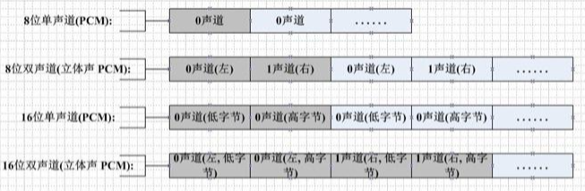

# 音频

# PCM

音频数据在计算机中是经过采样、量化、归一化后保存为 `PCM(Pulse Code Modulation，脉冲编码调制) ` 音频数据。PCM 是未经压缩的音频采样数据裸流，它是由模拟信号经过采样、量化、编码转换成的标准数字音频数据。 通常有3个参数来描述PCM数据：
- **采样率**：是指每秒钟使用多少个样本来表示音频。通常采样率有：8kHz(电话)、16kHz、44.1kHz(CD)、48kHz(DVD)
- **通道数**：常见的音频有立体声(stereo)和单声道(mono)两种类型，立体声包含左声道和右声道。另外还有环绕立体声等其它不太常用的类型。我们常见的mono是只有1个声道；stereo通常是2个声道。
- **样本格式**：每个样本使用什么样的表达数值来进行表达，通常有8位、16位、32位，可以是浮点数，也可以是整型。

```cpp
enum AVCodecID{
    ...
    AV_CODEC_ID_ALAW            // PCM A-law
    AV_CODEC_ID_F32BE           // PCM 32-bit floating-point big-endian
    AV_CODEC_ID_F32LE           // PCM 32-bit floating-point little-endian
    AV_CODEC_ID_F64BE           // PCM 64-bit floating-point big-endian
    AV_CODEC_ID_F64LE           // PCM 64-bit floating-point little-endian
    AV_CODEC_ID_MULAW           // PCM mu-law
    AV_CODEC_ID_S16BE           // PCM signed 16-bit big-endian
    AV_CODEC_ID_S16LE           // PCM signed 16-bit little-endian
    AV_CODEC_ID_S24BE           // PCM signed 24-bit big-endian
    AV_CODEC_ID_S24LE           // PCM signed 24-bit little-endian
    AV_CODEC_ID_S32BE           // PCM signed 32-bit big-endian
    AV_CODEC_ID_S32LE           // PCM signed 32-bit little-endian
    AV_CODEC_ID_S8              // PCM signed 8-bit
    AV_CODEC_ID_U16BE           // PCM unsigned 16-bit big-endian
    AV_CODEC_ID_U16LE           // PCM unsigned 16-bit little-endian
    AV_CODEC_ID_U24BE           // PCM unsigned 24-bit big-endian
    AV_CODEC_ID_U24LE           // PCM unsigned 24-bit little-endian
    AV_CODEC_ID_U32BE           // PCM unsigned 32-bit big-endian
    AV_CODEC_ID_U32LE           // PCM unsigned 32-bit little-endian
    AV_CODEC_ID_U8              // PCM unsigned 8-bit
    ...
};
```

 

PCM 文件大小计算公式为

```txt
    字节数 = 采样率 * 通道数 * （采样位数/8）* 时长(s)
```


