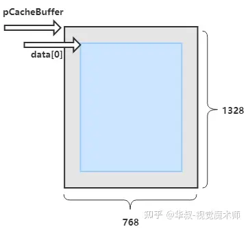
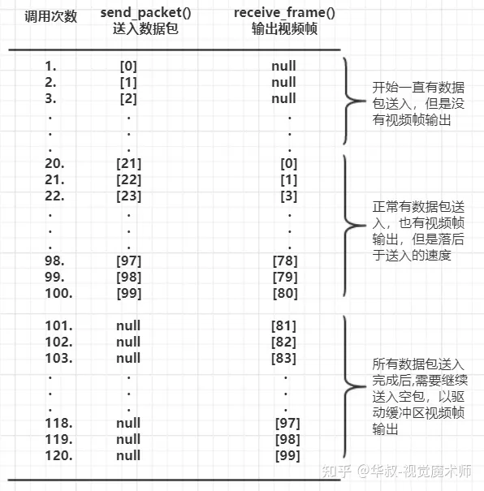

# FFmpeg

# 库

| 库名            | 描述                                                                                 |
| --------------- | ------------------------------------------------------------------------------------ |
| `libavformat`   | 媒体文件容器格式处理库。复用器与解复用器会使用该库                                   |
| `libavcodec`    | 编解码器库                                                                           |
| `libswresample` | 音频格式转换和重采样处理的库                                                         |
| `libswscale`    | 视频格式转换和缩放处理的库                                                           |
| `libavfilter`   | 音视频滤镜、特效处理的库，例如：视频增加滤镜、音频添加音效等可以使用这个库里的函数。 |
| `libavdevice`   | 设备操作库，例如捕获麦克风、摄像头（一般不用，各个平台的设备驱动不同）               |
| `libavutil`     | Utility辅助函数库，提供一些独立的辅助函数功能。                                      |

#  时间

- **时间基** : FFmpeg 中用于计时用的时间单位，`1 s` 被均匀划分 `n` 分，`1/n s` 即是一个时间基
- **时间戳** ：FFmpeg 中的时间，表示有多少个时间单位。例如 `pts、dts` 都是时间戳

一个`.mp4`文件中的时间基 `time_base = 1/200` , 即`1000ms`均分为`200`等分，每个时间单位是`5ms`。当视频帧的 `pts=1173` 时，对应的实际时刻点是 `1173*5 = 5865ms`。

- **解码时间戳 DTS（Decoding Time Stamp）**：播放器该在什么时候解码这一帧的数据
- **显示时间戳 PTS（Presentation Time Stamp）**：播放器该在什么时候显示这一帧的数据

视频帧需要 `dts`和 `pts` 两个时间来标记帧解码与帧显示顺序。当视频流中没有`B帧`时，这两个值总是一致的；但是如果视频流中有B帧时，这两个数据是不一样的，例如：

- 帧展示顺序：I B B P
- 帧存放顺序：I P B B

必须先解析出 `1:I帧`；接着才能解析出 `4:P帧` ；然后才能得到 `2:B帧` 与 `3:B帧`。可以看出帧的解码顺序与实际展示顺序不同。

- 帧解码顺序：1 4 2 3 
- 帧展示顺序：1 2 3 4


# 数据帧

## AVFrame

```cpp
/* 未进行编码压缩的音视频数据 */
struct AVFrame {
    ......
  
    //
    // 视频帧图像数据 或者 音频帧PCM数据, 根据不同的格式有不同的存放方式
    // 对于视频帧：RGB/RGBA 格式时 data[0] 中依次存放每个像素的RGB/RGBA数据
    //            YUV420 格式时 data[0]存放Y数据;  data[1]存放U数据; data[2]存放V数据
    // 对于音频帧: data[0]存放左声道数据;  data[1]存放右声道数据
    //
    uint8_t *data[AV_NUM_DATA_POINTERS];  

    //
    // 行字节跨度, 相当于 stride。为每个通道实际申请的内存大小
    // 对于视频帧: 上下两行同一列像素相差的字节数,例如：对于RGBA通常是(width*4), 但是有时FFMPEG内部会有扩展, 可能会比这个值大
    // 对于音频帧: 单个通道中所有采样占用的字节数
    //
    int linesize[AV_NUM_DATA_POINTERS];

    int format;         // 对于视频帧是图像格式; 对于音频帧是采样格式  
    int64_t pts;        // 当前数据帧的时间戳


    int width, height;  // 仅用于视频帧, 宽度高度
    int key_frame;      // 仅用于视频, 当前是否是I帧

    int sample_rate;          // 仅用于音频, 采样率
    uint64_t channel_layout;  // 仅用于音频, 通道类型
    int nb_samples;           // 仅用于音频, 样本数量
  
    ......
};
```




> [!note]
> 解码器内部存在优化，存放数据的内存大小是 `linesize`，并不是帧的实际宽高计算结果。

操作接口

```cpp
AVFrame *av_frame_alloc(void);  // 分配一个数据帧结构

AVFrame *av_frame_clone(const AVFrame *src); // 完整的克隆数据帧结构, 包括其内部数据

void av_frame_free(AVFrame **frame);  // 释放数据帧结构及其内部数据

int av_frame_ref(AVFrame *dst, const AVFrame *src);  // 增加引用计数

void av_frame_unref(AVFrame *frame);  // 减少引用计数
```

## AVPacket

```cpp
/* 压缩后的音视频数据 */
struct AVPacket {
  ......
  int64_t pts;        // 显示时间戳   
  int64_t dts;        // 解码时间戳 (对于音频来说通常与pts相同)
  uint8_t *data;      // 实际压缩后的视频或者音频数据
  int     size;       // 压缩后的数据大小
  int     stream_index;  // 流索引值, 在媒体文件中,使用0,1来区分音视频流,可以通过这个值区分当前包是音频还是视频
  int   flags;
 
  int64_t duration;     // 渲染显示时长,对于视频帧比较有用,控制一帧视频显示时长，控制 FPS
  int64_t pos;          // 当前包在流文件中的位置, -1表示未知
  ......
};
```

操作接口

```cpp
AVPacket *av_packet_alloc(void);  // 分配一个数据包结构体

AVPacket *av_packet_clone(const AVPacket *src);  // 完整赋值一个数据包

void av_packet_free(AVPacket **pkt);  // 释放数据包结构及其内部的数据

void av_init_packet(AVPacket *pkt);   // 初始化数据包结构,可选字段都设置为默认值

int av_new_packet(AVPacket *pkt, int size); // 根据指定大小创建包结构中的数据
```

# 解包

```cpp
/* 流文件解析器句柄 */
struct AVFormatContext{
};

// 打开媒体文件
int avformat_open_input(AVFormatContext **ps, const char *url,
                        const AVInputFormat *fmt, AVDictionary **options);

// 查找所有媒体流信息
int avformat_find_stream_info(AVFormatContext *ic, AVDictionary **options);

// 将媒体流挪到指定时间戳
int avformat_seek_file(AVFormatContext *s, int stream_index, int64_t min_ts, int64_t ts, int64_t max_ts, int flags);

// 读取一帧流
int av_read_frame(AVFormatContext *s, AVPacket *pkt);

// 暂停和播放网络流
int av_read_play(AVFormatContext *s);
int av_read_pause(AVFormatContext *s);

// 关闭
void avformat_close_input(AVFormatContext **s);
```


- **变量**

```cpp
AVFormatContext* m_pAvFormatCtx    = nullptr; // 流文件解析上下文
AVCodecContext*  m_pVidDecodeCtx   = nullptr; // 视频解码器上下文
uint32_t         m_nVidStreamIndex = -1;      // 视频流索引值
AVCodecContext*  m_pAudDecodeCtx   = nullptr; // 音频解码器上下文
uint32_t         m_nAudStreamIndex = -1;      // 音频流索引值
```

- **初始化**

```cpp
//
// 打开媒体文件,解析码流信息,并且创建和打开对应的解码器
//
int32_t Open(const char* pszFilePath)
{
    AVCodec*  pVidDecoder = nullptr;
    AVCodec*  pAudDecoder = nullptr;
    int       res         = 0;


    // 打开媒体文件
    res = avformat_open_input(&m_pAvFormatCtx, pszFilePath, nullptr, nullptr);
    if (m_pAvFormatCtx == nullptr)
    {
        LOGE("<Open> [ERROR] fail avformat_open_input(), res=%d\n", res);
        return res;
    }

    // 查找所有媒体流信息
    res = avformat_find_stream_info(m_pAvFormatCtx, nullptr);
    if (res == AVERROR_EOF)
    {
        LOGD("<Open> reached to file end\n");
        Close();
        return -1;
    }

    // 遍历所有的媒体流信息
    for (unsigned int i = 0; i < m_pAvFormatCtx->nb_streams; i++)
    {
        AVStream* pAvStream = m_pAvFormatCtx->streams[i];
        if (pAvStream->codecpar->codec_type == AVMEDIA_TYPE_VIDEO)
        {
            if ((pAvStream->codecpar->width <= 0) || (pAvStream->codecpar->height <= 0))
            {
                LOGE("<Open> [ERROR] invalid resolution, streamIndex=%d\n", i);
                continue;
            }

            pVidDecoder = avcodec_find_decoder(pAvStream->codecpar->codec_id);  // 找到视频解码器
            if (pVidDecoder == nullptr)
            {
                LOGE("<Open> [ERROR] can not find video codec\n");
                continue;
            }

            m_nVidStreamIndex = (uint32_t)i;
            LOGD("<Open> pxlFmt=%d, frameSize=%d*%d\n",
                (int)pAvStream->codecpar->format,
                pAvStream->codecpar->width,
                pAvStream->codecpar->height);

        }
        else if (pAvStream->codecpar->codec_type == AVMEDIA_TYPE_AUDIO)
        {
            if ((pAvStream->codecpar->channels <= 0) || (pAvStream->codecpar->sample_rate <= 0))
            {
                LOGE("<Open> [ERROR] invalid resolution, streamIndex=%d\n", i);
                continue;
            }

            pAudDecoder = avcodec_find_decoder(pAvStream->codecpar->codec_id);  // 找到音频解码器
            if (pAudDecoder == nullptr)
            {
                LOGE("<Open> [ERROR] can not find Audio codec\n");
                continue;
            }

            m_nAudStreamIndex = (uint32_t)i;
            LOGD("<Open> sample_fmt=%d, sampleRate=%d, channels=%d, chnl_layout=%d\n",
                (int)pAvStream->codecpar->format,
                pAvStream->codecpar->sample_rate,
                pAvStream->codecpar->channels,
                pAvStream->codecpar->channel_layout     );
        }
    }
    if (pVidDecoder == nullptr && pAudDecoder == nullptr)
    {
        LOGE("<Open> [ERROR] can not find video or audio stream\n");
        Close();
        return -1;
    }
    // seek到第0ms开始读取
    res = avformat_seek_file(m_pAvFormatCtx, -1, INT64_MIN, nSeekTime, INT64_MAX, 0);

    // 创建视频解码器并且打开
    if (pVidDecoder != nullptr)
    {
        m_pVidDecodeCtx = avcodec_alloc_context3(pVidDecoder);
        if (m_pVidDecodeCtx == nullptr)
        {
            LOGE("<Open> [ERROR] fail to video avcodec_alloc_context3()\n");
            Close();
            return -1;
        }
        res = avcodec_parameters_to_context(m_pVidDecodeCtx, m_pAvFormatCtx->streams[m_nVidStreamIndex]->codecpar);

        res = avcodec_open2(m_pVidDecodeCtx, nullptr, nullptr);
        if (res != 0)
        {
            LOGE("<Open> [ERROR] fail to video avcodec_open2(), res=%d\n", res);
            Close();
            return -1;
        }
    }

    // 创建音频解码器并且打开
    if (pAudDecoder != nullptr)
    {
        m_pAudDecodeCtx = avcodec_alloc_context3(pAudDecoder);
        if (m_pAudDecodeCtx == nullptr)
        {
            LOGE("<Open> [ERROR] fail to audio avcodec_alloc_context3()\n");
            Close();
            return -1;
        }
        res = avcodec_parameters_to_context(m_pAudDecodeCtx, m_pAvFormatCtx->streams[m_nAudStreamIndex]->codecpar);

        res = avcodec_open2(m_pAudDecodeCtx, nullptr, nullptr);
        if (res != 0)
        {
            LOGE("<Open> [ERROR] fail to audio avcodec_open2(), res=%d\n", res);
            Close();
            return -1;
        }
    }

    return 0;
}
```

- **读取帧**

```cpp
//
// 循环不断的读取音视频数据包进行解码处理
//
int32_t ReadFrame()
{
    int res = 0;

    for (;;)
    {
        AVPacket* pPacket = av_packet_alloc();
        
        // 依次读取数据包
        res = av_read_frame(m_pAvFormatCtx, pPacket);
        if (res == AVERROR_EOF)  // 正常读取到文件尾部退出
        {
            LOGE("<ReadFrame> reached media file end\n");
            break;
        }
        else if (res < 0) // 其他小于0的返回值是数据包读取错误
        {
            LOGE("<ReadFrame> fail av_read_frame(), res=%d\n", res);
            break;
        }

        if (pPacket->stream_index == m_nVidStreamIndex)       // 读取到视频包
        {
            // 这里进行视频包解码操作,详细下一章节讲解
            AVFrame* pVideoFrame = nullptr;
            res = DecodePktToFrame(m_pVidDecodeCtx, pPacket, &pVideoFrame);
            if (res == 0 && pVideoFrame != nullptr)
            {
                Enqueue(pVideoFrame);  // 解码成功后的视频帧插入队列
            }
        }
        else if (pPacket->stream_index == m_nAudStreamIndex)  // 读取到音频包
        {
            // 这里进行音频包解码操作,详细下一章节讲解
            AVFrame* pAudioFrame = nullptr;
            res = DecodePktToFrame(m_pAudDecodeCtx, pPacket, &pAudioFrame);
            if (res == 0 && pAudioFrame != nullptr)
            {
                Enqueue(pAudioFrame);  // 解码成功后的音频帧插入队列
            }
        }

        av_packet_free(&pPacket);  // 数据包用完了可以释放了 
    }
}
```


- **关闭**

```cpp
//
// 关闭媒体文件，关闭对应的解码器
//
void Close()
{
    // 关闭媒体文件解析
    if (m_pAvFormatCtx != nullptr)
    {
        avformat_close_input(&m_pAvFormatCtx);
        m_pAvFormatCtx = nullptr;
    }

    // 关闭视频解码器
    if (m_pVidDecodeCtx != nullptr)
    {
        avcodec_close(m_pVidDecodeCtx);
        avcodec_free_context(&m_pVidDecodeCtx);
        m_pVidDecodeCtx = nullptr;
    }

    // 关闭音频解码器
    if (m_pAudDecodeCtx != nullptr)
    {
        avcodec_close(m_pAudDecodeCtx);
        avcodec_free_context(&m_pAudDecodeCtx);
        m_pAudDecodeCtx = nullptr;
    }
}
```

# 解码

```cpp
/* 音视频解码器句柄 */
struct AVCodecContext{
};

// 根据 ID 查找解码器
const AVCodec *avcodec_find_decoder(enum AVCodecID id);

// 根据 AVCodec 配置创建解码器
AVCodecContext *avcodec_alloc_context3(const AVCodec *codec);

// 修改解码器设置
int avcodec_parameters_to_context(AVCodecContext *codec,
                                  const struct AVCodecParameters *par);

// 启动解码器
int avcodec_open2(AVCodecContext *avctx, const AVCodec *codec, AVDictionary **options);

// 送入需要解码的帧
int avcodec_send_packet(AVCodecContext *avctx, const AVPacket *avpkt);

// 获取解码后的帧
int avcodec_receive_frame(AVCodecContext *avctx, AVFrame *frame);

// 关闭
int avcodec_close(AVCodecContext *avctx);

// 释放
void avcodec_free_context(AVCodecContext **avctx);
```

由于解码器内部存在缓冲区，因此 `avcodec_send_packet` 与 `avcodec_receive_frame` 在流程上并不是一一对应，即 send 之后并不能马上通过 receive 获取结果，同理 send 完成之后，也并不代表所有的帧都解码完成。




```cpp
//
// 功能: 送入一个数据包进行解码,获取解码后的音视频帧
//       注意: 即使正常解码情况下,不是每次都有解码后的帧输出的
//
// 参数: pDecoderCtx ---- 解码器上下文信息
//       pInPacket   ---- 输入的数据包, 可以为nullptr来刷新解码缓冲区
//       ppOutFrame  ---- 输出解码后的音视频帧, 即使返回0也可能无输出
//
// 返回: 0:           解码正常;
//       AVERROR_EOF: 解码全部完成;
//       other:       解码出错
//
int32_t DecodePktToFrame(
    AVCodecContext *pDecoderCtx, // 解码器上下文信息
    AVPacket *pInPacket,         // 输入的数据包
    AVFrame **ppOutFrame)        // 解码后生成的视频帧或者音频帧
{
    AVFrame *pOutFrame = nullptr;
    int res = 0;

    // 送入要解码的数据包
    res = avcodec_send_packet(pDecoderCtx, pInPacket);
    if (res == AVERROR(EAGAIN)) // 缓冲区已满，要从内部缓冲区读取解码后的音视频帧
    {
        //    LOGD("<DecodePktToFrame> avcodec_send_frame() EAGAIN\n");
    }
    else if (res == AVERROR_EOF) // 数据包送入结束不再送入,但是可以继续可以从内部缓冲区读取解码后的音视频帧
    {
        //    LOGD("<DecodePktToFrame> avcodec_send_frame() AVERROR_EOF\n");
    }
    else if (res < 0) // 送入输入数据包失败
    {
        LOGE("<DecodePktToFrame> [ERROR] fail to avcodec_send_frame(), res=%d\n", res);
        return res;
    }

    // 获取解码后的视频帧或者音频帧
    pOutFrame = av_frame_alloc();
    res = avcodec_receive_frame(pDecoderCtx, pOutFrame);
    if (res == AVERROR(EAGAIN)) // 当前这次没有解码没有音视频帧输出,需要送入更多的数据包
    {
        LOGD("<CAvVideoDecComp::DecodeVideoPkt> no data output\n");
        av_frame_free(&pOutFrame);
        (*ppOutFrame) = nullptr;
        return 0;
    }
    else if (res == AVERROR_EOF) // 解码缓冲区已经刷新完成,后续不再有音视频帧输出
    {
        LOGD("<DecodePktToFrame> avcodec_receive_packet() EOF\n");
        av_frame_free(&pOutFrame);
        (*ppOutFrame) = nullptr;
        return AVERROR_EOF;
    }
    else if (res < 0)
    {
        LOGE("<DecodePktToFrame> [ERROR] fail to avcodec_receive_packet(), res=%d\n", res);
        av_frame_free(&pOutFrame);
        (*ppOutFrame) = nullptr;
        return res;
    }

    (*ppOutFrame) = pOutFrame;
    return 0;
}
```


# 转码

## 视频帧

```cpp
//
// 视频帧格式转换
//
int32_t VideoConvert(
    const AVFrame *pInFrame,  // 输入视频帧
    AVPixelFormat eOutFormat, // 输出视频格式
    int32_t nOutWidth,        // 输出视频宽度
    int32_t nOutHeight,       // 输出视频高度
    AVFrame **ppOutFrame)     // 输出视频帧
{
    // 转码库句柄
    struct SwsContext *pSwsCtx = nullptr;
    AVFrame *pOutFrame = nullptr;

    // 创建格式转换器, 指定缩放算法,转换过程中不增加任何滤镜特效处理
    pSwsCtx = sws_getContext(pInFrame->width, pInFrame->height, (AVPixelFormat)pInFrame->format,
                             nOutWidth, nOutHeight, eOutFormat,
                             SWS_BICUBIC, nullptr, nullptr, nullptr);
    if (pSwsCtx == nullptr)
    {
        LOGE("<VideoConvert> [ERROR] fail to sws_getContext()\n");
        return -1;
    }

    // 创建输出视频帧对象以及分配相应的缓冲区
    uint8_t *data[4] = {nullptr};
    int linesize[4] = {0};
    int res = av_image_alloc(data, linesize, nOutWidth, nOutHeight, eOutFormat, 1);
    if (res < 0)
    {
        LOGE("<VideoConvert> [ERROR] fail to av_image_alloc(), res=%d\n", res);
        sws_freeContext(pSwsCtx);
        return -2;
    }
    pOutFrame = av_frame_alloc();
    pOutFrame->format = eOutFormat;
    pOutFrame->width = nOutWidth;
    pOutFrame->height = nOutHeight;
    pOutFrame->data[0] = data[0];
    pOutFrame->data[1] = data[1];
    pOutFrame->data[2] = data[2];
    pOutFrame->data[3] = data[3];
    pOutFrame->linesize[0] = linesize[0];
    pOutFrame->linesize[1] = linesize[1];
    pOutFrame->linesize[2] = linesize[2];
    pOutFrame->linesize[3] = linesize[3];

    // 进行格式转换处理
    res = sws_scale(pSwsCtx,
                    static_cast<const uint8_t *const *>(pInFrame->data),
                    pInFrame->linesize,
                    0,
                    pOutFrame->height,
                    pOutFrame->data,
                    pOutFrame->linesize);
    if (res < 0)
    {
        LOGE("<VideoConvert> [ERROR] fail to sws_scale(), res=%d\n", res);
        sws_freeContext(pSwsCtx);
        av_frame_free(&pOutFrame);
        return -3;
    }

    (*ppOutFrame) = pOutFrame;
    sws_freeContext(pSwsCtx); // 释放转换器
    return 0;
}
```

## 音频帧

```cpp
//
// 音频帧格式转换
//
int32_t AudioConvert(
    const AVFrame *pInFrame,    // 输入音频帧
    AVSampleFormat eOutSmplFmt, // 输出音频格式
    int32_t nOutChannels,       // 输出音频通道数
    int32_t nOutSmplRate,       // 输出音频采样率
    AVFrame **ppOutFrame)       // 输出视频帧
{
    struct SwrContext *pSwrCtx = nullptr;
    AVFrame *pOutFrame = nullptr;

    // 创建格式转换器,
    int64_t nInChnlLayout = av_get_default_channel_layout(pInFrame->channels);
    int64_t nOutChnlLayout = (nOutChannels == 1) ? AV_CH_LAYOUT_MONO : AV_CH_LAYOUT_STEREO;

    pSwrCtx = swr_alloc();
    if (pSwrCtx == nullptr)
    {
        LOGE("<AudioConvert> [ERROR] fail to swr_alloc()\n");
        return -1;
    }
    swr_alloc_set_opts(pSwrCtx,
                       nOutChnlLayout, eOutSmplFmt, nOutSmplRate, nInChnlLayout,
                       (enum AVSampleFormat)(pInFrame->format), pInFrame->sample_rate,
                       0, nullptr);

    // 计算重采样转换后的样本数量,从而分配缓冲区大小
    int64_t nCvtBufSamples = av_rescale_rnd(pInFrame->nb_samples, nOutSmplRate, pInFrame->sample_rate, AV_ROUND_UP);

    // 创建输出音频帧
    pOutFrame = av_frame_alloc();
    pOutFrame->format = eOutSmplFmt;
    pOutFrame->nb_samples = (int)nCvtBufSamples;
    pOutFrame->channel_layout = (uint64_t)nOutChnlLayout;
    int res = av_frame_get_buffer(pOutFrame, 0); // 分配缓冲区
    if (res < 0)
    {
        LOGE("<AudioConvert> [ERROR] fail to av_frame_get_buffer(), res=%d\n", res);
        swr_free(&pSwrCtx);
        av_frame_free(&pOutFrame);
        return -2;
    }

    // 进行重采样转换处理,返回转换后的样本数量
    int nCvtedSamples = swr_convert(pSwrCtx,
                                    const_cast<uint8_t **>(pOutFrame->data),
                                    (int)nCvtBufSamples,
                                    const_cast<const uint8_t **>(pInFrame->data),
                                    pInFrame->nb_samples);
    if (nCvtedSamples <= 0)
    {
        LOGE("<AudioConvert> [ERROR] no data for swr_convert()\n");
        swr_free(&pSwrCtx);
        av_frame_free(&pOutFrame);
        return -3;
    }
    pOutFrame->nb_samples = nCvtedSamples;
    pOutFrame->pts = pInFrame->pts; // pts等时间戳沿用
    pOutFrame->pkt_pts = pInFrame->pkt_pts;

    (*ppOutFrame) = pOutFrame;
    swr_free(&pSwrCtx); // 释放转换器
    return 0;
}
```

# 编码

## 视频编码

```cpp
AVCodecContext *m_pVideoEncCtx = nullptr; // 视频编码器上下文

/**
 * @brief 根据图像格式和信息来创建编码器
 *
 */
int32_t VidEncoderOpen(
    AVPixelFormat ePxlFormat, // 输入图像像素格式, 通常是 AV_PIX_FMT_YUV420P
    int32_t nFrameWidth,      // 输入图像宽度
    int32_t nFrameHeight,     // 输入图像高度
    int32_t nFrameRate,       // 编码的帧率
    float nBitRateFactor)     // 码率因子,通常可以设置为 0.8~8
{
    AVCodec *pVideoEncoder = nullptr;
    int res = 0;

    pVideoEncoder = avcodec_find_encoder(AV_CODEC_ID_H264);
    if (pVideoEncoder == nullptr)
    {
        LOGE("<VidEncoderOpen> [ERROR] fail to find AV_CODEC_ID_H264\n");
        return -1;
    }

    m_pVideoEncCtx = avcodec_alloc_context3(pVideoEncoder);
    if (m_pVideoEncCtx == nullptr)
    {
        LOGE("<VidEncoderOpen> [ERROR] fail to find FF_avcodec_alloc_context3()\n");
        return -2;
    }

    int64_t nBitRate = (int64_t)((nFrameWidth * nFrameHeight * 3 / 2) * nBitRateFactor); // 计算码率
    m_pVideoEncCtx->codec_id = AV_CODEC_ID_H264;
    m_pVideoEncCtx->pix_fmt = ePxlFormat;
    m_pVideoEncCtx->width = nFrameWidth;
    m_pVideoEncCtx->height = nFrameHeight;
    m_pVideoEncCtx->bit_rate = nBitRate;
    m_pVideoEncCtx->rc_buffer_size = static_cast<int>(nBitRate);
    m_pVideoEncCtx->framerate.num = nFrameRate; // 帧率
    m_pVideoEncCtx->framerate.den = 1;
    m_pVideoEncCtx->gop_size = nFrameRate; // 每秒1个关键帧
    m_pVideoEncCtx->time_base.num = 1;
    m_pVideoEncCtx->time_base.den = nFrameRate * 1000; // 时间基
    m_pVideoEncCtx->has_b_frames = 0;
    m_pVideoEncCtx->max_b_frames = 0;
    m_pVideoEncCtx->flags |= AV_CODEC_FLAG_GLOBAL_HEADER;

    res = avcodec_open2(m_pVideoEncCtx, pVideoEncoder, nullptr);
    if (res < 0)
    {
        LOGE("<VidEncoderOpen> [ERROR] fail to find FF_avcodec_open2(), res=%d\n", res);
        avcodec_free_context(&m_pVideoEncCtx);
        return -3;
    }

    return 0;
}

/**
 * @brief 关闭编码器
 *
 */
void VidEncoderClose()
{
    if (m_pVideoEncCtx != nullptr)
    {
        avcodec_free_context(&m_pVideoEncCtx);
        m_pVideoEncCtx = nullptr;
    }
}

/**
 * @brief 进行视频帧编码, 注意: 不是每次输入视频帧编码都会有输出数据包的
 * @param pInFrame    输入要进行编码的原始视频帧数据, 当为nullptr时表示刷新编码器缓冲区中数据
 *        ppOutPacket 输出编码后的数据包, 即使正常编码无错误,也不是每次都会输出
 * @return 返回错误码， 0 表示有数据包输出;
 *                     EAGAIN 表示当前没有数据输出, 但是编码器正常
 *                     AVERROR_EOF 编码缓冲区刷新完,不再有数据包输出
 *                     other: 出错
 */
int32_t VidEncoderEncPacket(AVFrame *pInFrame, AVPacket **ppOutPacket)
{
    AVPacket *pOutPacket = nullptr;
    int res = 0;

    if (m_pVideoEncCtx == nullptr)
    {
        LOGE("<VidEncoderEncPacket> [ERROR] bad status\n");
        return -1;
    }

    // 送入要编码的视频帧
    res = avcodec_send_frame(m_pVideoEncCtx, pInFrame);
    if (res == AVERROR(EAGAIN)) // 没有数据送入,但是可以继续可以从内部缓冲区读取编码后的视频包
    {
        // LOGD("<CAvVideoEncoder::EncodeFrame> avcodec_send_frame() EAGAIN\n");
    }
    else if (res == AVERROR_EOF) // 编码器缓冲区已经刷新,但是可以继续可以从内部缓冲区读取编码后的视频包
    {
        //    LOGD("<CAvVideoEncoder::EncodeFrame> avcodec_send_frame() AVERROR_EOF\n");
    }
    else if (res < 0)
    {
        LOGE("<VidEncoderEncPacket> [ERROR] fail to avcodec_send_frame(), res=%d\n", res);
        return -2;
    }

    // 读取编码后的数据包
    pOutPacket = av_packet_alloc();
    res = avcodec_receive_packet(m_pVideoEncCtx, pOutPacket);
    if (res == AVERROR(EAGAIN)) // 当前这次没有数据输出,但是后续可以继续读取
    {
        av_packet_free(&pOutPacket);
        return EAGAIN;
    }
    else if (res == AVERROR_EOF) // 编码器缓冲区已经刷新完成,后续不再有数据输出
    {
        LOGD("<VidEncoderEncPacket> avcodec_receive_packet() EOF\n");
        av_packet_free(&pOutPacket);
        return AVERROR_EOF;
    }
    else if (res < 0)
    {
        LOGE("<VidEncoderEncPacket> [ERROR] fail to avcodec_receive_packet(), res=%d\n", res);
        av_packet_free(&pOutPacket);
        return res;
    }

    (*ppOutPacket) = pOutPacket;
    return 0;
}
```

## 音频编码

```cpp
AVCodecContext *m_pAudioEncCtx = nullptr; // 音频编码器上下文

/**
 * @brief 根据音频格式和信息来创建编码器
 *
 */
int32_t AudEncoderOpen(
    AVSampleFormat eSmplFormat, // 音频采样格式
    int32_t nSampleRate,        // 采样率
    int32_t nChannels,          // 通道数
    int64_t nBitRate)           // 码率值, 通常可以是128000
{
    AVCodec *pAudioEncoder = nullptr;
    int res = 0;

    pAudioEncoder = avcodec_find_encoder(AV_CODEC_ID_AAC);
    if (pAudioEncoder == nullptr)
    {
        LOGE("<AudEncoderOpen> [ERROR] fail to find AV_CODEC_ID_AAC\n");
        return -1;
    }

    m_pAudioEncCtx = avcodec_alloc_context3(pAudioEncoder);
    if (m_pAudioEncCtx == nullptr)
    {
        LOGE("<AudEncoderOpen> [ERROR] fail to find FF_avcodec_alloc_context3()\n");
        return -2;
    }

    //
    // 设置参数打开编码器, 注意: 不同的编码器对于采样格式有固定要求
    //   AAC编码器: AV_SAMPLE_FMT_FLTP
    //   MP3编码器: AV_SAMPLE_FMT_S16
    //
    m_pAudioEncCtx->sample_fmt = eSmplFormat; // 对于AAC格式,只能固定 AV_SAMPLE_FMT_FLTP 格式
    m_pAudioEncCtx->sample_rate = nSampleRate;
    m_pAudioEncCtx->channel_layout = (uint64_t)((nChannels == 1) ? AV_CH_LAYOUT_MONO : AV_CH_LAYOUT_STEREO);
    m_pAudioEncCtx->channels = av_get_channel_layout_nb_channels(m_pAudioEncCtx->channel_layout);
    m_pAudioEncCtx->bit_rate = nBitRate;
    m_pAudioEncCtx->time_base.num = 1;
    m_pAudioEncCtx->time_base.den = nSampleRate;
    m_pAudioEncCtx->flags |= AV_CODEC_FLAG_GLOBAL_HEADER;
    res = avcodec_open2(m_pAudioEncCtx, pAudioEncoder, nullptr);
    if (res < 0)
    {
        LOGE("<AudEncoderOpen> [ERROR] fail to find FF_avcodec_open2(), res=%d\n", res);
        avcodec_free_context(&m_pAudioEncCtx);
        return -3;
    }

    return 0;
}

/**
 * @brief 关闭编码器
 *
 */
void AudEncoderClose()
{
    if (m_pAudioEncCtx != nullptr)
    {
        avcodec_free_context(&m_pAudioEncCtx);
        m_pAudioEncCtx = nullptr;
    }
}

/**
 * @brief 进行视频帧编码, 注意: 不是每次输入视频帧编码都会有输出数据包的
 * @param pInFrame    输入要进行编码的原始视频帧数据, 当为nullptr时表示刷新编码器缓冲区中数据
 *        ppOutPacket 输出编码后的数据包, 即使正常编码无错误,也不是每次都会输出
 * @return 返回错误码， 0 表示有数据包输出;
 *                     EAGAIN 表示当前没有数据输出, 但是编码器正常
 *                     AVERROR_EOF 编码缓冲区刷新完,不再有数据包输出
 *                     other: 出错
 */
int32_t AudEncoderEncPacket(AVFrame *pInFrame, AVPacket **ppOutPacket)
{
    AVPacket *pOutPacket = nullptr;
    int res = 0;

    if (m_pAudioEncCtx == nullptr)
    {
        LOGE("<AudEncoderEncPacket> [ERROR] bad status\n");
        return -1;
    }

    //
    // 送入要编码的视频帧, 注意: 对于不同的编码器,每次送入样本数量有固定要求
    //   AAC编码器: pInFrame->nb_samples 必须为1024
    //   MP3编码器: pInFrame->nb_samples 必须为1152
    //
    res = avcodec_send_frame(m_pAudioEncCtx, pInFrame);
    if (res == AVERROR(EAGAIN)) // 没有数据送入,但是可以继续可以从内部缓冲区读取编码后的视频包
    {
        // LOGD("<AudEncoderEncPacket> avcodec_send_frame() EAGAIN\n");
    }
    else if (res == AVERROR_EOF) // 编码器缓冲区已经刷新,但是可以继续可以从内部缓冲区读取编码后的视频包
    {
        //    LOGD("<AudEncoderEncPacket> avcodec_send_frame() AVERROR_EOF\n");
    }
    else if (res < 0)
    {
        LOGE("<AudEncoderEncPacket> [ERROR] fail to avcodec_send_frame(), res=%d\n", res);
        return -2;
    }

    // 读取编码后的数据包
    pOutPacket = av_packet_alloc();
    res = avcodec_receive_packet(m_pAudioEncCtx, pOutPacket);
    if (res == AVERROR(EAGAIN)) // 当前这次没有数据输出,但是后续可以继续读取
    {
        av_packet_free(&pOutPacket);
        return EAGAIN;
    }
    else if (res == AVERROR_EOF) // 编码器缓冲区已经刷新完成,后续不再有数据输出
    {
        LOGD("<AudEncoderEncPacket> avcodec_receive_packet() EOF\n");
        av_packet_free(&pOutPacket);
        return AVERROR_EOF;
    }
    else if (res < 0)
    {
        LOGE("<AudEncoderEncPacket> [ERROR] fail to avcodec_receive_packet(), res=%d\n", res);
        av_packet_free(&pOutPacket);
        return res;
    }

    (*ppOutPacket) = pOutPacket;
    return 0;
}
```

# 打包

```cpp
AVFormatContext *m_pFormatCtx = nullptr; // 媒体格式上下文
bool m_bGlobalHeader = true;             // 音视频编解码器是否需要标记 AV_CODEC_FLAG_GLOBAL_HEADER
AVStream *m_pVideoStream = nullptr;      // 视频流信息
AVStream *m_pAudioStream = nullptr;      // 音频流信息

/**
 * @brief 打开音视频混流器
 * @param
 * @return 返回错误码， 0 表示正常; < 0 表示错误码
 *
 */
int32_t MuxerOpen(
    const char *pszFilePath,            // 要保存的媒体文件,通常是.mp4文件
    AVCodecContext *pVideoEncCtx, // 视频编码器上下文
    AVCodecContext *pAudioEncCtx) // 音频编码器上下文
{
    int res = 0;

    // 创建输出流格式上下文
    res = avformat_alloc_output_context2(&m_pFormatCtx, nullptr, nullptr, pszFilePath);
    if (nullptr == m_pFormatCtx || res < 0)
    {
        LOGE("<MuxerOpen> [ERROR] fail to avformat_alloc_output_context2()\n");
        return -1;
    }

    // 如果输出媒体格式有 AVFMT_GLOBALHEADER 这个标记，
    // 那么音视频编码器创建的时候也需要设置 AV_CODEC_FLAG_GLOBAL_HEADER 标记
    if (m_pFormatCtx->oformat->flags & AVFMT_GLOBALHEADER)
    {
        pVideoEncCtx->flags |= AV_CODEC_FLAG_GLOBAL_HEADER;
        pAudioEncCtx->flags |= AV_CODEC_FLAG_GLOBAL_HEADER;
    }

    // 创建写入的视频流
    m_pVideoStream = avformat_new_stream(m_pFormatCtx, nullptr);
    if (nullptr == m_pVideoStream)
    {
        LOGE("<MuxerOpen> [ERROR] fail to create video stream\n");
        avformat_free_context(m_pFormatCtx);
        return -2;
    }
    res = avcodec_parameters_from_context(m_pVideoStream->codecpar, pVideoEncCtx);
    if (res < 0)
    {
        LOGE("<MuxerOpen> [ERROR] fail to video avcodec_parameters_from_context(), res=%d\n", res);
        avformat_free_context(m_pFormatCtx);
        return -2;
    }
    m_pVideoStream->time_base = pVideoEncCtx->time_base;

    // 创建写入的音频流
    m_pAudioStream = avformat_new_stream(m_pFormatCtx, nullptr);
    if (nullptr == m_pAudioStream)
    {
        LOGE("<MuxerOpen> [ERROR] fail to create video stream\n");
        avformat_free_context(m_pFormatCtx);
        return -2;
    }
    res = avcodec_parameters_from_context(m_pAudioStream->codecpar, pAudioEncCtx);
    if (res < 0)
    {
        LOGE("<MuxerOpen> [ERROR] fail to audio avcodec_parameters_from_context(), res=%d\n", res);
        avformat_free_context(m_pFormatCtx);
        return -2;
    }
    m_pAudioStream->time_base = pVideoEncCtx->time_base;

    // 打开文件IO上下文
    res = avio_open(&m_pFormatCtx->pb, pszFilePath, AVIO_FLAG_WRITE);
    if (res < 0)
    {
        LOGE("<MuxerOpen> [ERROR] fail to avio_open(), res=%d\n", res);
        avformat_free_context(m_pFormatCtx);
        return -2;
    }

    //
    // 写入文件头信息
    //
    res = avformat_write_header(m_pFormatCtx, nullptr);
    if (res < 0)
    {
        LOGE("<MuxerOpen> [ERROR] fail to FF_avformat_write_header(), res=%d\n", res);
        avformat_free_context(m_pFormatCtx);
        return -3;
    }

    return 0;
}


/**
 * @brief  写入编码后的音频或者视频数据包
 * @param  无
 * @return 无
 *
 */
int32_t MuxerWrite(bool bVideoPkt, AVPacket *pInPacket)
{
    // 设置写入数据包的流索引
    if (bVideoPkt)
    {
        pInPacket->stream_index = m_pVideoStream->index;
    }
    else
    {
        pInPacket->stream_index = m_pAudioStream->index;
    }

    // 写入媒体文件
    int res = av_interleaved_write_frame(m_pFormatCtx, pInPacket);
    return res;
}

/**
 * @brief  关闭音视频混流器
 * @param  无
 * @return 无
 *
 */
void MuxerClose()
{
    // 写入尾信息
    if (m_pFormatCtx != nullptr)
    {
        av_write_trailer(m_pFormatCtx);
    }

    // 先关IO上下文
    if (m_pFormatCtx->pb != nullptr)
    {
        avio_closep(&m_pFormatCtx->pb);
        m_pFormatCtx->pb = nullptr;
    }

    // 再释放媒体格式上下文
    if (m_pFormatCtx != nullptr)
    {
        avformat_free_context(m_pFormatCtx);
        m_pFormatCtx = nullptr;
    }

    // 流文件直接在 avformat_free_context()内部已经销毁了
    m_pVideoStream = nullptr;
    m_pAudioStream = nullptr;
}
```