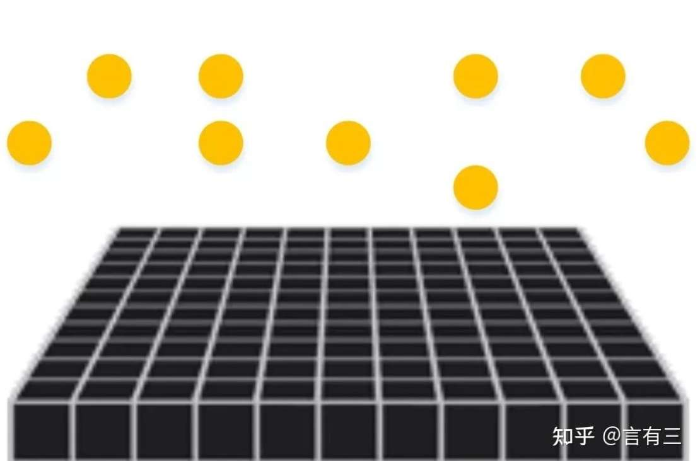
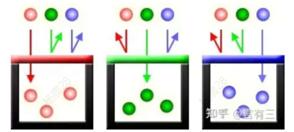
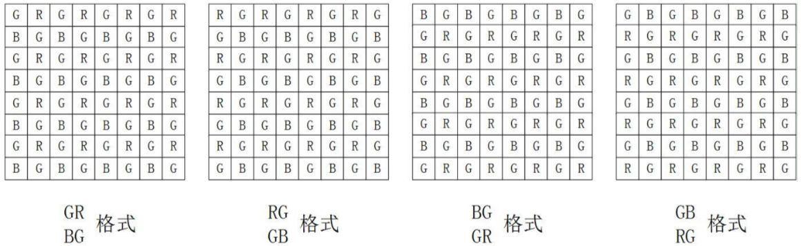
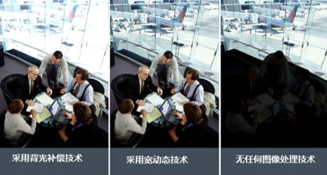
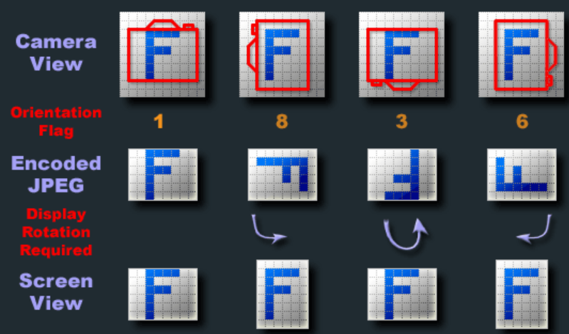
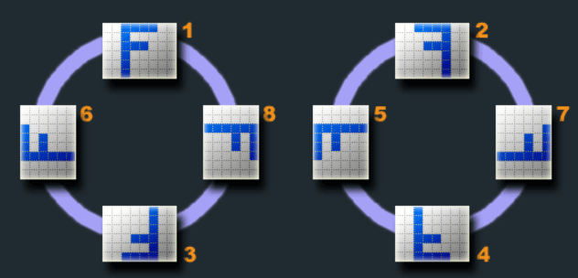

# 图片

# RAW


**RAW图：** 图像传感器 (CMOS、CCD) 捕捉到的光源信号转换为数字信号的最原始数据。当按下拍照快门的那一刻，摄像头的曝光就被锁定，进入传感器的光子量就被锁定，通过统计传感器矩阵各个位置光子数量，就可以确定电信号强度。



光电转换的结果就是一个灰度信号记录器，还需要从这些数据中拆分出颜色通道。为了获取各通道颜色分量，可以考虑给每个像素上面叠放一个颜色过滤器，即每个像素可以让相应的颜色分量通过，而丢弃掉不需要的颜色分量




典型颜滤波器有RGBE filter，CYGM filter，Bayer filter等，其中工业界应用比较多的是 `Bayer filter`。**RAW图的颜色通道分布**



**RAW图的存储方式:**

- **RAW8:** 通道分量采用 `8 bits` 表示
- **RAW10:** 通道分量采用 `10 bits` 表示，但是采用 `16 bits` 进行存储
- **RAW12:** 通道分量采用 `12 bits` 表示，但是采用 `16 bits` 进行存储


# WDR



**WDR (wide dynamic range):** 宽动态范围，用于解决摄像机强光问题。当在强光源（日光、灯具或反光等）照射下的高亮度区域及阴影、逆光等相对亮度较低的区域在图像中同时存在时，摄像机输出的图像会出现明亮区域因曝光过度成为白色，而黑暗区域因曝光不足成为黑色，严重影响图像质量。
- **真实宽动态：** 摄像机具有带宽动态功能的CMOS图像传感器，图像传感器会对图像进行多次曝光（3次或4次，生成多帧），然后通过图像处理器进行宽动态计算并输出明亮均衡的图像。
- **数字宽动态(DWDR)：** 只包含对拍摄图像的后处理，是真实宽动态的一部分。

>[!tip]
> `HDR (High Dynamic Range)` 和 `WDR` 的目的一样：让图片中最亮到最暗之间的亮度差变大。但 HDR 和 DWDR 一样，只是在软件层面对图像进行优化。


# JPEG

## 介绍

JPEG 首字母缩略词代表联合图像专家组，创建 JPEG 交换格式 (JIF) 标准的小组委员会。于 1992 年由国际标准化组织 (ISO) 首次发布。JPEG 是 24 位静止光栅图像，RGB 颜色模型的每个通道中有 8 位。这没有为 Alpha 通道留下空间，这意味着虽然 JPEG 可以支持超过 1600 万种颜色，但它们不能支持透明度。JPEG 压缩基于一种称为离散余弦变换 (DCT) 的有损图像压缩技术，图像占用的存储空间减少了 50-75%（与 BMP 等旧格式相比），但图像质量几乎没有损失
- `JPEG/JFIF` : 存储和传输照片图像最流行的格式
- `JPEG/Exif` : 数码相机和其他图像捕获设备的格式

## JPG

早期版本的 Windows（特别是 MS-DOS 8.3 和 FAT-16 文件系统）在文件扩展名长度方面有最多 3 个字母的限制。JPEG 必须缩短为 JPG，以免超过限制。Mac 和 Linux 计算机从来没有这样的东西，所以用户会继续将图像保存为 JPEG。因此，**JPG 与 JPEG 其实是同一个东西** 。

# Exif

## 介绍

[Exif（Exchangeable Image File）](https://www.media.mit.edu/pia/Research/deepview/exif.html)：是存储在 `JPEG` 格式照片头部的一段信息，会储存相机型号、镜头、曝光、图片尺寸等信息，相机和手机拍摄的照片都会携带这些信息，。PS照片采用低质量保存会丢失这些信息，但在10-12等级的时候不会丢失，美图秀秀保存质量为100%才不会丢失。软件在处理的时候也会将自己的信息写入Exif，因此可以通过Exif判断是否为原图。

## 旋转信息

 在 `Exif` 中会储存一个特殊的信息 `Orientation`，用于表示相机拍摄的照片相对于地面的位置。图片实际存储关系与相机界面保持一致，但是通过软件查看时，就会首先读取图片的旋转信息，然后根据旋转信息展示图片。



`Orientation` 取值 `8`，0行 `左`，0列 `下` 表示：
- 旋转后图片的上方是原图的左方
- 旋转后图片的左方是原图的下方


| 取值 | 0行（未旋转上） | 0列（未旋转左） | 旋转效果           |
| :--- | :-------------- | :-------------- | :----------------- |
| 1    | 上              | 左              | 0°                 |
| 2    | 上              | 右              | 水平翻转           |
| 3    | 下              | 右              | 180°               |
| 4    | 下              | 左              | 垂直翻转           |
| 5    | 左              | 上              | 顺时针90°+水平翻转 |
| 6    | 右              | 上              | 顺时针90°          |
| 7    | 右              | 下              | 顺时针90°+垂直翻转 |
| 8    | 左              | 下              | 逆时针90°          |





## Exiftool

```term
triangle@LEARN:~$ exiftool -Orientation=6  test.jpg // 给一张jpg 图片添加旋转信息
triangle@LEARN:~$ exiftool -Orientation=  test.jpg // 移除旋转信息
triangle@LEARN:~$ exiftool -Orientation  test.jpg // 查看旋转信息

```


