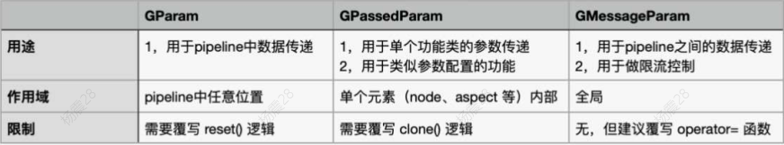

# CGraph

- [CGraph](https://github.com/ChunelFeng/CGraph)

# 介绍

`CGraph` 中文名为【色丶图】，是一套无任何第三方依赖的跨平台图流程执行框架。通过GPipeline(流水线)底层调度，实现了依赖元素依次顺序执行、非依赖元素并发执行的调度功能。

使用者只需继承GNode(节点)类，实现子类的run()方法，并根据需要设定依赖关系，即可实现任务的图化执行或流水线执行。还可以通过设定各种包含多节点信息的GGroup(组)，自行控制图的条件判断、循环和并发执行逻辑。

项目提供了丰富的Param(参数)类型，用于不同应用场景下的数据互通。此外，还可以通过添加GAspect(切面)的方式，实现以上各种元素功能的横向扩展；通过引入GAdapter(适配器)对单个节点功能进行加强；或者通过添加GEvent(信号)，丰富和优化执行逻辑。

# 概念

## 名词


- `element` : 所有可执行结构的父类接口，子类有 `node、group`
    - `node` : 所有具体功能节点的父类接口
        - `functionNode` : 实际业务逻辑的 `node` 实现
    - `group` : 多个 `functionNode` 的组合
      - `cluster`: 线性执行 `functionNode`
      - `region` : 无关联性的 `node` 将被并发处理
      - `condition` : 用于条件切换任务
- `pipeline` : 构建、执行任务图的工具类


>[!note]
> 直接下载 [src](https://github.com/ChunelFeng/CGraph/tree/main/src)，并添加到项目工程中就能直接使用。

```cpp
#include "CGraph.h"

/* 自定义实现 functionNode */
class MyNode1 : public CGraph::GNode {
public:
    CStatus run() override {
        printf("[%s], Sleep for 1 second ...\n", this->getName().c_str());
        CGRAPH_SLEEP_SECOND(1)
        return CStatus();
    }
};

class MyNode2 : public CGraph::GNode {
public:
    CStatus run() override {
        printf("[%s], Sleep for 2 second ...\n", this->getName().c_str());
        CGRAPH_SLEEP_SECOND(2)
        return CStatus();
    }
};

using namespace CGraph;

int main() {
    /* 创建一个流水线，用于设定和执行流图信息 */
    GPipelinePtr pipeline = GPipelineFactory::create();
    GElementPtr a, b, c, d = nullptr;

    /* 注册节点之间的依赖关系 */
    pipeline->registerGElement<MyNode1>(&a, {}, "nodeA"); 
    // nodeA -> nodeB
    pipeline->registerGElement<MyNode2>(&b, {a}, "nodeB");  
    // nodeA -> nodeC
    pipeline->registerGElement<MyNode1>(&c, {a}, "nodeC");
    // nodeB -> nodeD
    // nodeC -> nodeD
    pipeline->registerGElement<MyNode2>(&d, {b, c}, "nodeD");

    /* 执行流图框架 */
    pipeline->process();
    GPipelineFactory::remove(pipeline);
    return 0;
}
```

## CObject

所有类型的基类，`init` 与 `destroy` 一个实例只会执行一次，`run` 则可以执行多次。

```cpp
class CObject {
public:
    /**
     * 默认构造函数
     */
    explicit CObject() = default;

    /**
     * 初始化函数
     */
    virtual CStatus init() {
        CGRAPH_EMPTY_FUNCTION
    }

    /**
     * 流程处理函数
     */
    virtual CStatus run() = 0;

    /**
     * 释放函数
     */
    virtual CStatus destroy() {
        CGRAPH_EMPTY_FUNCTION
    }

    /**
     * 默认析构函数
     */
    virtual ~CObject() = default;
};

```

## GAspect


通过 `GAspect` 可以对 `CObject` 的三类基本操作进行扩充，实现「切面」操作（为一个操作，再追加操作前和操作后两个处理函数）。

```cpp

class GAspect : public GAspectObject {
public:
    /**
     * init()函数切面开始期间动作
     */
    virtual CStatus beginInit();

    /**
     * init()函数切面结束期间动作
     * @param curStatus
     */
    virtual CVoid finishInit(const CStatus& curStatus);

    /**
     * run()函数切面开始期间动作
     */
    virtual CStatus beginRun();

    /**
     * run()函数切面结束期间动作
     * @param curStatus
     */
    virtual CVoid finishRun(const CStatus& curStatus);

    /**
     * destroy()函数切面开始期间动作
     */
    virtual CStatus beginDestroy();

    /**
     * destroy()函数切面结束期间动作
     * @param curStatus
     */
    virtual CVoid finishDestroy(const CStatus& curStatus);

    /**
     * 进入crash的逻辑
     * @return
     */
    virtual CVoid enterCrashed();
};
```

# 功能

## [多次执行](https://github.com/ChunelFeng/CGraph/blob/main/tutorial/T04-Complex.cpp)

```cpp
    GElementPtr a, b_cluster, c, d_region, e = nullptr;

    // 创建一个 Cluster
    b_cluster = pipeline->createGGroup<GCluster>({
        pipeline->createGNode<MyNode1>(GNodeInfo("nodeB1", 1)),    // 创建名为nodeB1的node信息，并将其放入b_cluster中
        // 3 : 表示 nodeB2 会重新执行三次
        pipeline->createGNode<MyNode1>(GNodeInfo("nodeB2", 3)),    // 创建名为nodeB2且自循环3次的node信息，并将其放入b_cluster中
        pipeline->createGNode<MyNode2>(GNodeInfo("nodeB3", 1))
    });

    // 创建 region
    GElementPtr d1, d2, d3, d4, d23_cluster = nullptr;
    d1 = pipeline->createGNode<MyNode1>(GNodeInfo({}, "nodeD1", 1));
    d2 = pipeline->createGNode<MyNode1>(GNodeInfo("nodeD2", 1));    // 创建node，稍后放入cluster中
    d3 = pipeline->createGNode<MyNode1>(GNodeInfo("nodeD3", 1));
    d23_cluster = pipeline->createGGroup<GCluster>({d2, d3}, {d1}, "clusterD23", 1);
    d4 = pipeline->createGNode<MyNode2>(GNodeInfo({d1}, "nodeD4", 1));
    d_region = pipeline->createGGroup<GRegion>({d1, d23_cluster, d4});    // 创建名为d_region的region信息，并将{d1,d23_cluster,d4}放入其中

    ...
    // 1: 表示 b_cluster 只执行一次
    status += pipeline->registerGElement<GCluster>(&b_cluster, {}, "clusterB", 1);
```

## [参数](https://github.com/ChunelFeng/CGraph/blob/main/tutorial/T05-Param.cpp)

>[!note]
> 一个 `CGraph::GParam` 实例只能在一个 `pipeline` 中进行使用，不能跨 `pipeline`

- **参数定义**

```cpp
struct MyParam : public CGraph::GParam {
    /**
     * reset方法，在pipeline执行一次结束的时候被调用。
     * 如果是pipeline多次执行，并且依赖之前pipeline运行的结果（如，通过iCount值，记录pipeline执行了多少次）
     * reset中，不要实现重置参数逻辑即可
     */
    CVoid reset(const CStatus& curStatus) override {
         // pipeline 执行一次结束后，iValue值清0
        iValue = 0;  
        
        // iCount值保留，可带入下一次pipeline执行
    }

    int iValue { 0 };
    int iCount { 0 };
};

```

- **写参数**

调用 `CGRAPH_CREATE_GPARAM` 时，会创建一个参数类实例，并以键值对的形式存放到一个 `map<name, param>` 中。

```cpp

class MyWriteParamNode : public CGraph::GNode {
public:
    CStatus init() override {
        CStatus status;
        /**
         * 推荐在init()中，将可能用到的参数创建好。也支持在run的时候创建
         * 支持在任意节点创建，任意节点读取同类型（MyParam）同名（"param1"）参数
         */
        status = CGRAPH_CREATE_GPARAM(MyParam, "param1")
        return status;
    }

    CStatus run() override {
        /**
         * 为了提高执行效率，
         * 在【创建参数】的时候，【提供】锁保护机制
         * 在【获取参数】的时候，【不提供】锁保护的机制
         * 故无法通过在run()过程中，并发的通过 createGParam 和 getGParam 创建和获取参数
         * 如果需要做此操作，请自行外部加锁
         */

         // 直接读取，没有锁
        auto* myParam = CGRAPH_GET_GPARAM_WITH_NO_EMPTY(MyParam, "param1")
        int val = 0;
        int cnt = 0;
        {
            // 加锁写数据
            CGRAPH_PARAM_WRITE_CODE_BLOCK(myParam)
            val = ++myParam->iValue;
            cnt = ++myParam->iCount;
        }

        return CStatus();
    }
};

```

- **读参数**

```cpp

class MyReadParamNode : public CGraph::GNode {
public:
    CStatus run() override {
        auto myParam = CGRAPH_GET_GPARAM_WITH_NO_EMPTY(MyParam, "param1")    // 获取类型为MyParam且名为"param1"的参数
        int val = 0;
        {
            // 加锁读数据
            CGRAPH_PARAM_READ_CODE_BLOCK(myParam)
            val = myParam->iValue;
        }

        return CStatus();
    }
};

```

## [条件](https://github.com/ChunelFeng/CGraph/blob/main/tutorial/T06-Condition.cpp)

```cpp
class MyCondition : public CGraph::GCondition {
public:
    /**
     * 表示在condition中，需要执行第几个。
     * 0表示第0个；1表示第1个；以此类推
     * -1 表示最后一个
     * 其中，CIndex is for [int]
     * @return
     */
    CIndex choose () override {
        return rand() % 3;
    }
};

int main(){
    ...
    // 根据 MyCondition 条件判断结果，选择需要执行的节点
    b_condition = pipeline->createGGroup<MyCondition>({
        pipeline->createGNode<MyNode1>(GNodeInfo("conditionNodeB0", 1)),
        pipeline->createGNode<MyNode2>(GNodeInfo("conditionNodeB1", 1)),
        pipeline->createGNode<MyNode1>(GNodeInfo("conditionNodeB2", 1))
    }); 
    ...
}
```


## 切面

### [普通切面](https://github.com/ChunelFeng/CGraph/blob/main/tutorial/T09-Aspect.cpp)

```cpp

// 节点
class MyNode1 : public CGraph::GNode {
public:
    CStatus run() override {
        CStatus status;
        return status;
    }
};

// 切面
class MyTraceAspect : public CGraph::GAspect {
public:
    CStatus beginRun() override {
        return CStatus();
    }

    CVoid finishRun(const CStatus& curStatus) override {

    }
};


int main(){
    ...
    pipeline->registerGElement<MyNode1>(&a, {}, "nodeA", 1);

    // 添加切面
    a->addGAspect<MyTraceAspect>();
    ...
}
```

### [带参切面](https://github.com/ChunelFeng/CGraph/blob/main/tutorial/T10-AspectParam.cpp)

```cpp

// 切面参数
struct MyConnParam : public CGraph::GPassedParam {
    /**
     * 必须实现 clone 函数
     * GAspectParam 和 GDaemonParam 均为 GPassedParam的同名内容
     * 继承自GPassedParam的参数，可以用于在 aspect 或 daemon 之间传递
     * 本例中，MyConnParam既用于GAspectParam(T10)传递，有用于GDaemonParam(T13)传递
     * 故写法为 `: public CGraph::GPassedParam`
     * @param param
     */
    CVoid clone(CGraph::GPassedParamPtr param) override {
        if (nullptr == param) {
            return;    // 异常判断，理论不可能出现此情况
        }

        auto* ptr = dynamic_cast<MyConnParam *>(param);    // 将传入的参数进行强转，并且赋值到本地
        ip_ = ptr->ip_;
        port_ = ptr->port_;
    }

    std::string ip_ {"0.0.0.0" };
    short port_ { 0 };
};

class MyConnAspect : public CGraph::GAspect {
public:
    CStatus beginInit() override {
        auto* param = this->getAParam<MyConnParam>();    // 注意，这里是AParam，表示的是切面自己的参数，不是GParam
        if (param) {
            // 如果传入类型不匹配，则返回param值为空
            mockConnect(param->ip_, param->port_);
        }

        return CStatus();
    }

    CVoid finishDestroy(const CStatus& curStatus) override {
        auto* param = this->getAParam<MyConnParam>();
        if (param) {
            mockDisconnect(param->ip_, param->port_);
        }
    }
private:
    bool conn_status_ { false };                    // 表示连接状态
};

int main(){
    ...
    pipeline->registerGElement<MyNode1>(&a, {}, "nodeA", 1);

    MyConnParam paramA;
    paramA.ip_ = "127.0.0.1";
    paramA.port_ = 6666;

    // 切面可以添加多个
    a->addGAspect<MyConnAspect, MyConnParam>(&paramA);
    a->addGAspect<MyTraceAspect>();
    ...
}
```

## [函数节点](https://github.com/ChunelFeng/CGraph/blob/main/tutorial/T12-Function.cpp)

通过创建函数节点 `GFunction` ，就不用再去自定义 `CGraph::GNode` ，使用 Lambda 表达式定义执行体，大大简化编码的流程。

```cpp
int main(){
    ...
    GFunctionPtr d_function = nullptr;

    // 注册 GFunction 节点
    pipeline->registerGElement<GFunction>(&d_function, {c_function}, "functionD", 3);

    d_function->setFunction(CFunctionType::INIT, [d_function] {
        CGRAPH_ECHO("[%s] do init function ...", d_function->getName().c_str());
        return CStatus();
    })->setFunction(CFunctionType::RUN, [d_function, num] {
        auto param = d_function->getGParamWithNoEmpty<MyParam>("param1");
        param->iCount += num;
        CGRAPH_ECHO("[%s] do run function, iCount = [%d], iValue = [%d] ...",
                    d_function->getName().c_str(), param->iCount, ++param->iValue);
        return CStatus();
    });
    ...
}
```

## 消息机制



`pipeline` 内部数据传递使用 `GParam`，外部传递数据给 `node` 可以用 `GPassedParam`，而「消息机制」就是用来弥补数据在不同 `pipeline` 之间传递的空缺。

```cpp
struct MyMessageParam : public CGraph::GMessageParam {
    int num = 0;
    std::string info;

    explicit MyMessageParam() = default;

    /**
     * 注意：
     * 使用 GMessageParam 类型参数的时候，建议实现构造拷贝 和 赋值拷贝函数
     * 否则，针对指针类型变量，可能会出现深浅拷贝的问题
     */
    MyMessageParam(const MyMessageParam& param) : CGraph::GMessageParam(param) {
        /** 针对通过 unique_ptr<value> 获取的方式，推荐实现构造拷贝函数 */
        this->info = param.info;
        this->num = param.num;
    }

    MyMessageParam& operator=(const MyMessageParam& param) {
        /** 针对通过 value 获取的方式，推荐实现赋值拷贝函数 */
        if (this == &param) {
            return *this;
        }

        this->info = param.info;
        this->num = param.num;
        return (*this);
    }
};

int main(){
    /* 发送 */
    std::unique_ptr<MyMessageParam> mp1(new MyMessageParam());
    CStatus status = CGRAPH_SEND_MPARAM(MyMessageParam, "send-recv", mp1, CGraph::GMessagePushStrategy::WAIT)

    /* 接收 */
    std::unique_ptr<MyMessageParam> mp2 = nullptr;    // 接收一个消息
    CStatus status = CGRAPH_RECV_MPARAM(MyMessageParam, "send-recv", mp2);
}
```

## 事件

### [看门狗](https://github.com/ChunelFeng/CGraph/blob/main/tutorial/T13-Daemon.cpp)

`GDaemon` 可以为 `pipeline` 添加守护线程，定时触发，并能获取 pipeline 中的所有 `GParam`。


```cpp
class MyParamDaemon : public CGraph::GDaemon {
public:
    CVoid daemonTask(CGraph::GDaemonParamPtr param) override {
        /**
         * 从注册的pipeline中获取参数信息
         * 注意，这里是GParam类型
         */
        auto* myParam = CGRAPH_GET_GPARAM_WITH_NO_EMPTY(MyParam, "param1")

        /**
         * 获取任务外部传入的参数信息
         * 需要强转成外部传入的类型，方法如下：
         */
        auto connParam = dynamic_cast<MyConnParam *>(param);
    }
};

int main(){
    ...
    pipeline->addGDaemon<MyMonitorDaemon>(4000)   // 间隔4s执行
            ->addGDaemon<MyParamDaemon, MyConnParam>(3500, &connParam)    // 间隔3500ms执行，并且传入参数
            ->addGDaemon<MyTemplateDaemon<int>>(2750, 300);    // 添加模板daemon信息
    ...
}
```

### [GEvent](https://github.com/ChunelFeng/CGraph/blob/main/tutorial/T18-Event.cpp)


```cpp

class MyPrintEvent : public CGraph::GEvent {
public:
    /**
     * 在本事件被触发的时候，会执行到这里
     * @return
     */
    CVoid trigger(CGraph::GEventParamPtr param) override {
        CGRAPH_SLEEP_MILLISECOND(100)    // 留100ms的耗时，便于看出来同步/异步触发机制

        /**
         * 这里是为了表示，event内部也可以获取pipeline 内部的数据
         * 在并发的情况下使用，需要考虑数据同步和互斥的问题
         */
        auto myParam = CGRAPH_GET_GPARAM_WITH_NO_EMPTY(MyParam, "param1")
    }

private:
    int times_ = 0;
};

class MyEventNode : public CGraph::GNode {
public:
    CStatus run () override {
        CStatus status;
        /**
         * 模拟在这里，触发一个 trigger信息，同名的事件被异步执行
         * 从打印结果可以看出，after event send 这条信息，提前执行
         * 执行的时候，和pipeline公用同一个线程池资源
         */
        notify("my-print-event", GEventType::SYNC);

        return status;
    }
};

int main(){
    ...
    // 在pipeline中添加一个事件信息，通过 notify("my-print-event")触发
    pipeline->addGEvent<MyPrintEvent>("my-print-event");
    ...
}
```

## 超时

```cpp

int main(){
    ...
    pipeline->registerGElement<MyNode2>(&c, {b}, "nodeC");
    // 设置 node 运行超时
    c->setTimeout(timeout, GElementTimeoutStrategy::AS_ERROR);
    ...
}
```
