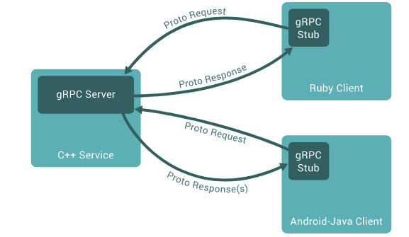

# gRPC

- [gRPC](https://grpc.io/docs/what-is-grpc/introduction/)

# RPC

RPC（Remote Procedure Call Protocol）远程过程调用协议。一个通俗的描述是：客户端在不知道调用细节的情况下，调用存在于远程计算机上的某个对象，就像调用本地应用程序中的对象一样。



- **Server**：在RPC规范中，这个Server并不是提供RPC服务器IP、端口监听的模块。而是远程服务方法的具体实现
- **Client**：RPC协议的调用方
- **Proto**: 服务端与客户端相互交流所使用的通信数据，采用字节流形式
- **Protocol Buffers**：谷歌开源的一套数据结构序列化工具，用来编码、解码字节流


# c++

## 编译框架

1. 前期准备

```term
triangle@LEARN:~$ sudo apt install -y build-essential autoconf libtool pkg-config
```

2. 编译源码

```bash
# grpc 编译后的安装路径
INSTALL_PATH= 

# 下载源码
git clone --recurse-submodules -b v1.50.0 --depth 1 --shallow-submodules https://github.com/grpc/grpc

# 开始编译
cd grpc
mkdir -p cmake/build
mkdir -p cmake/grpc_linux
pushd cmake/build
cmake -DgRPC_INSTALL=ON \
      -DgRPC_BUILD_TESTS=OFF \
      -DCMAKE_INSTALL_PREFIX=$INSTALL_PATH \
      ../..
make -j 8
make install
```

3. 增加 pkg-config 配置文件：**如果 `$INSTALL_PATH/lib/pkgconfig` 下没有生成下面几个配置文件，就手动添加** 

- openssl.pc
 ```conf
  # 上面设置的 INSTALL_PATH 的绝对路径
  prefix= 
  exec_prefix=${prefix}
  includedir=${prefix}/include
  libdir=${exec_prefix}/lib

  Name: Openssl
  Description: openssl # 瞎写
  Version:  # 瞎写
  Requires: libssl libcrypto 
 ```

- libssl.pc

 ```conf
  # 上面设置的 INSTALL_PATH 的绝对路径
  prefix= 
  exec_prefix=${prefix}
  includedir=${prefix}/include
  libdir=${exec_prefix}/lib

  Name: Openssl-libssl
  Description: openssl # 瞎写
  Version:  # 瞎写
  Libs: -L${libdir} -lssl 
 ```
- libcrypto.pc

 ```conf
  # 上面设置的 INSTALL_PATH 的绝对路径
  prefix= 
  exec_prefix=${prefix}
  includedir=${prefix}/include
  libdir=${exec_prefix}/lib

  Name: Openssl-libcrypto
  Description: openssl # 瞎写
  Version:  # 瞎写
  Libs: -L${libdir} -lcrypto
  Libs.private: -ldl -pthread
 ```

## 编译proto

```makefile
# protoc 路径
PROTOC=protoc
# grpc_cpp_plugin 路径
GRPC=grpc_cpp_plugin

.PHONY: compile
compile:
	\$(PROTOC) --grpc_out ./src/   --plugin=protoc-gen-grpc=$(GRPC)  ./proto/testServer.proto
	\$(PROTOC) --cpp_out ./src/ ./proto/testServer.proto
```

## 程序编译

xmake 配置文件

```lua
set_project("GRPC")

set_version("2.7.0")

add_rules("mode.debug", "mode.release")

THIRD_INCS =
{
    "/mnt/e/Download/library/grpc_linux/grpc/cmake/grpc_linux/include/"
}

set_languages("c14","c++14")

-- 通过 pkg-config 解析静态库
add_ldflags("$(shell pkg-config --libs protobuf grpc++)")

-- 其他编译参数设置
add_cxflags("-L/mnt/e/Download/library/grpc_linux/grpc/cmake/grpc_linux/lib", "-pthread", "-Wl,--no-as-needed","-lgrpc++_reflection", "-Wl,--as-needed"," -ldl")

target("demo")
    set_kind("binary")

    -- 添加头文件
    add_includedirs(THIRD_INCS)

    -- proto 生成的程序
    add_includedirs("src/proto","src")
    add_files("src/proto/*.cc")

    -- demo 程序
    add_files("src/client/*.cpp")

    -- 目标输出路径
    set_targetdir("bin/")
```

# python

## 安装框架

```term
triangle@LEARN:~$ sudo pip install grpcio grpcio-tools
```

## 编译proto

```term
triangle@LEARN:~$ python -m grpc_tools.protoc -I<dir> --python_out=<dir> --pyi_out=<dir> --grpc_python_out=<dir>  *.proto
```


