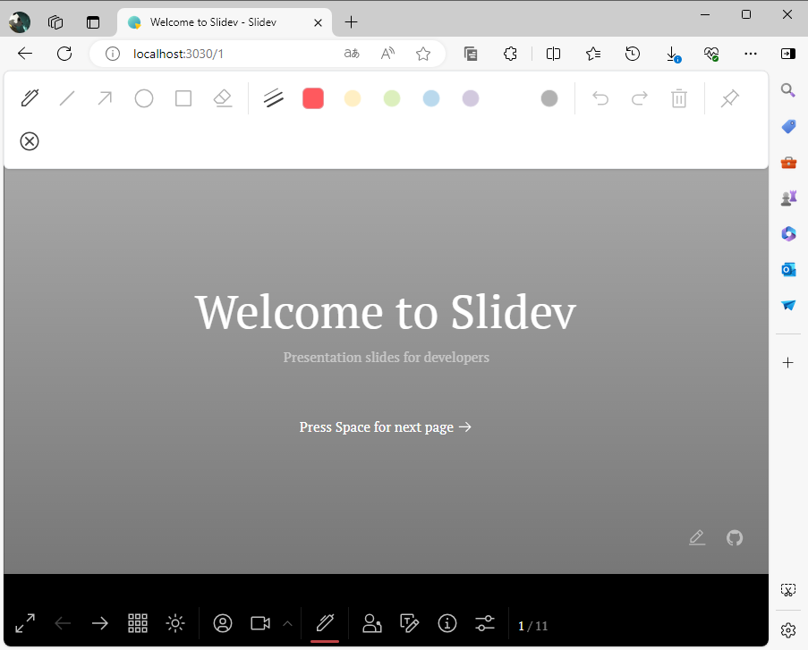

# Slidev

# 介绍

[Slidev](https://cn.sli.dev/guide/) 是基于 Web 的幻灯片制作和演示工具。它旨在让开发者专注在 Markdown 中编写内容，同时拥有支持 HTML 和 Vue 组件的能力，并且能够呈现像素级完美的布局，还在你的演讲稿中内置了互动的演示样例。



# 命令行

```term
triangle@LEARN:~$ npm i -g @slidev/cli // 低版本的 nodejs 需要升级
triangle@LEARN:~$ slidev // 以当前目录当作项目路径，启动 slidev
  ●■▲
  Slidev  v0.49.9 (global)

  theme       @slidev/theme-seriph
  css engine  unocss
  entry       E:\workspace\slidev\slides.md # 编写 slidev 的 markdown 文件
  
  # 预览服务
  public slide show   > http://localhost:3030/              # 展示主页
  presenter mode      > http://localhost:3030/presenter/    # 演讲者模式
  slides overview     > http://localhost:3030/overview/
  remote control      > pass --remote to enable

  shortcuts           > restart | open | edit | quit
```

# Markdown

## 分页

```markdown
# Slidev

Hello, World!

--- <!-- 分页符号 -->

# Page 2

content ....
```

## front matter

扉页块 `front matter` 遵从 `YAML` 语法，可以在 Slidev 幻灯片扉页处（文件顶部）进行 [各项配置](https://cn.sli.dev/custom/)。

```markdown
<!-- 利用一对 `---` 可以设置扉页块 (front matter) 进行分页，通过扉页块可以对当前页进行设置 -->
---
layout: cover 
---


# page 1

This is the cover page.

---

<!-- 直接使用 yaml 代码块来定义扉页 -->
\`\`\`yaml
layout: center
background: './images/background-1.png'
class: 'text-white'
\`\`\`

# page 2

content ...
```

## 代码块

### 基本设置

```markdown
<!-- 
    {2,3|5|all}: 指定高亮行; | 多处行高亮
    lineNumbers: 显示行号
    startLine: 行号的起始
    maxHeight: 设置最大展示区域，实现滚动
-->
\`\`\`ts{2,3|5|all}{lineNumbers: true, startLine:5,maxHeight:'100px'}
function add(
  a: Ref<number> | number,
  b: Ref<number> | number
) {
  return computed(() => unref(a) + unref(b))
}
\`\`\`
```


### 过度动画

为代码块切换，添加过度动画

```markdown
\`\`\`\`md magic-move

\`\`\`js
console.log(`Step ${1}`)
\`\`\`

代码块之间的内容会被当作注释忽略

\`\`\`js
console.log(`Step ${1 + 1}`)
\`\`\`

\`\`\`js
console.log(`Step ${3}` as string)
\`\`\`

\`\`\`\`
```

### Monaco

- **添加**

```markdown
<!-- 为代码块添加编辑器 -->
\`\`\`ts {monaco}
console.log('HelloWorld')
\`\`\`

```

- **diff**

```markdown

\`\`\`ts {monaco-diff}

console.log('Original text')

// 分割需要比对的两个代码块
~~~ 

console.log('Modified text')

\`\`\`
```

- **运行**

slidev 原生支持 `javascript/typescript` 的运行，其他语言需要自定义 [Custom Code Runners](https://cn.sli.dev/guide/syntax)

```markdown
\`\`\`ts {monaco-run} {autorun:false}
function distance(x: number, y: number) {
  return Math.sqrt(x ** 2 + y ** 2)
}
console.log(distance(3, 4))
\`\`\`
```

## 备注

```markdown
---
layout: cover
---

# 第 1 页

This is the cover page.

<!-- 这是一条备注 -->

---

# 第 2 页

<!-- 这不是一条备注，因为它在幻灯片内容前 -->

The second page

<!-- 这是另一条备注 -->
```

## 图表

```markdown

\`\`\`mermaid
sequenceDiagram
  Alice->John: Hello John, how are you?
  Note over Alice,John: A typical interaction
\`\`\`

```

## [布局](https://cn.sli.dev/builtin/layouts)


- **具名插槽**

```markdown
---
layout: two-cols # 划分两列
---

<!-- 左 -->
<template v-slot:default>

# Left

This shows on the left

</template>

<!-- 右 -->
<template v-slot:right>

# Right

This shows on the right

</template>
```

- **slidev语法**

```markdown
---
layout: two-cols
---

::right::

# Right

This shows on the right

::default::

# Left

This shows on the left
```

## 多文件

```markdown
<!-- slides.md 是默认主入口-->

# Page 1

This is a normal page

---
src: ./subpage2.md # 下一页将从 subpage2.md 开始
---

<!-- this page will be loaded from './subpage2.md' -->
Inline content will be ignored
```

# 动画

- [动画](https://cn.sli.dev/guide/animations)