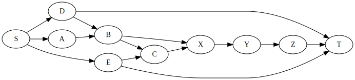
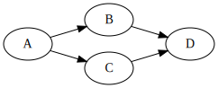
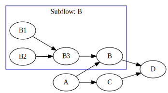
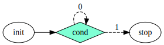
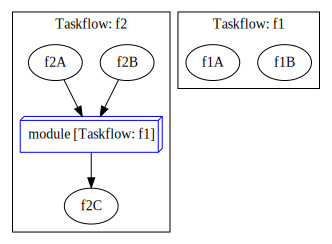

# TaskFlow

# 介绍

[TaskFlow](https://github.com/taskflow/taskflow?tab=readme-ov-file#start-your-first-taskflow-program) 是一个任务组织框架，支持以有向图的形式规划任务流程。



TaskFlow 以 `header-only` 形式提供，只需要下载 [头文件](https://github.com/taskflow/taskflow/tree/master/taskflow) 即可使用。

# 使用

## 基本规则

```cpp
#include <taskflow/taskflow.hpp> // Taskflow is header-only

int main()
{
    tf::Executor executor; // 执行器
    tf::Taskflow taskflow; // 任务流程组织

    // 创建任务
    auto [A, B, C, D] = taskflow.emplace( // create four tasks
        []()
        { std::cout << "TaskA\n"; },
        []()
        { std::cout << "TaskB\n"; },
        []()
        { std::cout << "TaskC\n"; },
        []()
        { std::cout << "TaskD\n"; });

    // 构建任务图
    A.precede(B, C); // A runs before B and C
    D.succeed(B, C); // D runs after  B and C

    // 执行器运行流程
    executor.run(taskflow).wait();

    // 生成 dot 图
    taskflow.dump(std::cout); 
    return 0;
}
```



>[!note]
> `B` 与 `C` 任务的执行是并行的

## 子任务图

```cpp
tf::Task A = taskflow.emplace([](){}).name("A");  
tf::Task C = taskflow.emplace([](){}).name("C");  
tf::Task D = taskflow.emplace([](){}).name("D");  

// 构建子图
tf::Task B = taskflow.emplace([] (tf::Subflow& subflow) { 
  tf::Task B1 = subflow.emplace([](){}).name("B1");  
  tf::Task B2 = subflow.emplace([](){}).name("B2");  
  tf::Task B3 = subflow.emplace([](){}).name("B3");  
  B3.succeed(B1, B2);  // B3 runs after B1 and B2
}).name("B");

A.precede(B, C);  // A runs before B and C
D.succeed(B, C);  // D runs after  B and C
```




## 状态控制

```cpp
tf::Task init = taskflow.emplace([](){}).name("init");
tf::Task stop = taskflow.emplace([](){}).name("stop");

// creates a condition task that returns a random binary
tf::Task cond = taskflow.emplace(
  [](){
    // 返回状态
    return std::rand() % 2;  
  }
).name("cond");

init.precede(cond);

// creates a feedback loop {0: cond, 1: stop}
cond.precede(cond, stop);
```




## 组合

```cpp
tf::Taskflow f1, f2;

// create taskflow f1 of two tasks
tf::Task f1A = f1.emplace([]() { std::cout << "Task f1A\n"; })
                 .name("f1A");
tf::Task f1B = f1.emplace([]() { std::cout << "Task f1B\n"; })
                 .name("f1B");

// create taskflow f2 with one module task composed of f1
tf::Task f2A = f2.emplace([]() { std::cout << "Task f2A\n"; })
                 .name("f2A");
tf::Task f2B = f2.emplace([]() { std::cout << "Task f2B\n"; })
                 .name("f2B");
tf::Task f2C = f2.emplace([]() { std::cout << "Task f2C\n"; })
                 .name("f2C");

// 将 f1 作为 f2 的子模块，嵌入到 f2 中
tf::Task f1_module_task = f2.composed_of(f1)
                            .name("module");

f1_module_task.succeed(f2A, f2B)
              .precede(f2C);
```



## 异步任务

```cpp
tf::Executor executor;

// create asynchronous tasks directly from an executor
std::future<int> future = executor.async([](){ 
  std::cout << "async task returns 1\n";
  return 1;
}); 

// 无返回的异步任务
executor.silent_async([](){ std::cout << "async task does not return\n"; });

// create asynchronous tasks with dynamic dependencies
tf::AsyncTask A = executor.silent_dependent_async([](){ printf("A\n"); });
tf::AsyncTask B = executor.silent_dependent_async([](){ printf("B\n"); }, A);
tf::AsyncTask C = executor.silent_dependent_async([](){ printf("C\n"); }, A);
tf::AsyncTask D = executor.silent_dependent_async([](){ printf("D\n"); }, B, C);

executor.wait_for_all();
```

## 执行器

```cpp
// runs the taskflow once
tf::Future<void> run_once = executor.run(taskflow); 

// wait on this run to finish
run_once.get();

// run the taskflow four times
executor.run_n(taskflow, 4);

// runs the taskflow five times
executor.run_until(taskflow, [counter=5](){ return --counter == 0; });

// block the executor until all submitted taskflows complete
executor.wait_for_all();
```