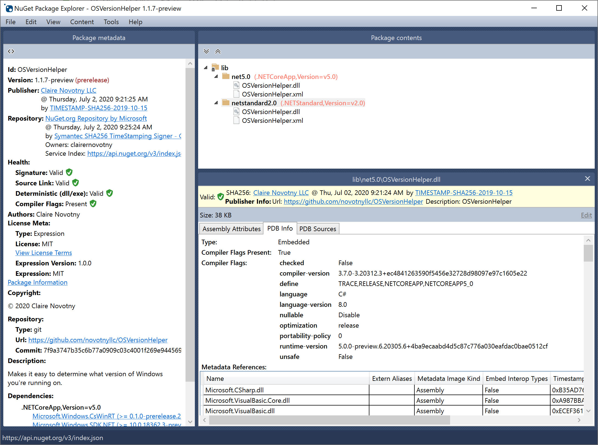

# NuGet

# 介绍

[NuGet](https://learn.microsoft.com/zh-cn/nuget/what-is-nuget) 是 `.NET` 应用程序的包管理器，类似 `pip`、`maven` 、`npm` 等工具。支持对动态库、应用程序、源码、资源数据等文件进行打包，生成 `.nupkg` (本质上就是一个 `.zip` 格式的压缩包)，并将包发布到远程仓库，供其他项目工程下载使用。

# nuget CLI

[nuget.exe CLI](https://learn.microsoft.com/zh-cn/nuget/consume-packages/install-use-packages-nuget-cli) 属于 `NuGet` 的命令行工具，支持 NuGet 的所有功能
- 包搜索
- 包安装
- 包管理
- 打包
- ...

```term
triangle@LEARN:~$ nuget install <packageID | configFilePath> -OutputDirectory <outputDirectory>
options
    - OutputDirectory   安装目录
    - Newtonsoft.Json   根据配置文件下载并安装包
    - packages.config   同上配置文件

```

# Package Explorer

[Package Explorer](https://github.com/NuGetPackageExplorer/NuGetPackageExplorer) 是 `NuGet` 可视化打包工具。

