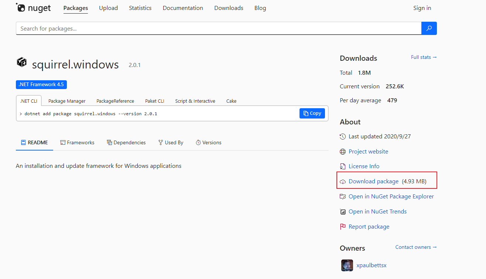
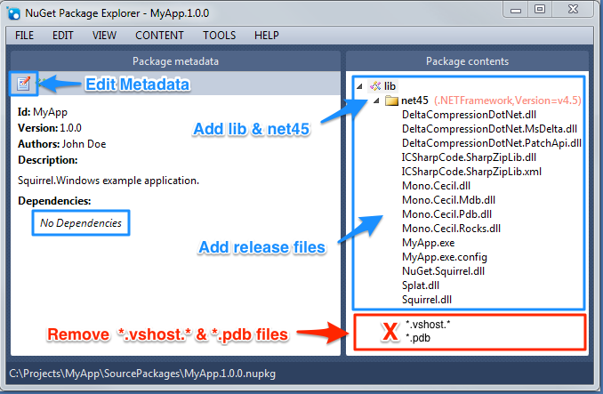

# Squirrel

# 介绍

[Squirrel](https://github.com/Squirrel/Squirrel.Windows) 是比 Omaha 更轻量化的自动更新框架，基于 [NuGet](https://learn.microsoft.com/zh-cn/nuget/what-is-nuget) 包管理器，通过一系列的工具和动态库实现 Windows 应用程序的安装和更新。目前 `Electron` 使用 Squirrel 管理软件更新。

# 下载

Squirrel 的二进制编译版本不在 github ，而需要到 NuGet 仓库进行[下载](https://www.nuget.org/packages/squirrel.windows)。下载的是 `.nupkg` 包文件，直接压缩包解压即可。



# 使用

1. 使用 `nuget` 将应用程序打包成 `.nupkg`，**必须使用 `lib/net45` 文件夹**

    

2. 使用 `Squirrel` 工具将打包好的 `.nupkg` 文件发布项目

    ```term
    triangle@LEARN:~$ Squirrel --releasify MyApp.1.0.0.nupkg
    triangle@LEARN:~$ tree .
    .
    ├── MyPackage.1.0.10.nupkg              # 使用 nuget 打包
    └── Releases                            # 部署文件包
        ├── MyPackage-1.0.10-full.nupkg     # 全量包
        ├── RELEASES                        # 客户端更新时需要下载的文件
        ├── Setup.exe                       # 环境检测，安装程序后，并启动
        └── Setup.msi                       # 软件安装器
    ```

3. 将上述生成的发布项目 `Releases` 文件部署到 http 服务上，并提供访问链接

    ```txt
        http://localhost:8080/releases 
    ```


4. 用户使用 `Setup.exe` 安装程序，程序所在目录 `%LocalAppData%\MyPackage` 

    ```term
    triangle@LEARN:~$ tree .
    .
    ├── app-1.0.10                          # 对应版本的软件
    │   └── demo.exe
    ├── packages                            # 包信息
    │   ├── MyPackage-1.0.10-full.nupkg
    │   ├── RELEASES
    │   └── SquirrelTemp
    └── Update.exe                          # 更新程序，用来管理程序具体安装，更新细节
    ```

5. 由于非 `c#` 程序无法集成官方提供的库，只能通过后台调用 [Update.exe](https://blog.csdn.net/w342916053/article/details/51274214) 实现更新程序管理

    ```term
    triangle@LEARN:~$ Update.exe 
    Manages Squirrel packages

    Commands
        --install=VALUE        Install the app whose package is in the specified
                                directory
        --uninstall            Uninstall the app the same dir as Update.exe
        --download=VALUE       Download the releases specified by the URL and
                                write new results to stdout as JSON
        --checkForUpdate=VALUE Check for one available update and writes new
                                results to stdout as JSON
        --update=VALUE         Update the application to the latest remote
                                version specified by URL
        --releasify=VALUE      Update or generate a releases directory with a
                                given NuGet package
        --createShortcut=VALUE Create a shortcut for the given executable name
        --removeShortcut=VALUE Remove a shortcut for the given executable name
        --updateSelf=VALUE     Copy the currently executing Update.exe into the
                                default location

    Options:
    -h, -?, --help             Display Help and exit
    -r, --releaseDir=VALUE     Path to a release directory to use with releasify
    -p, --packagesDir=VALUE    Path to the NuGet Packages directory for C# apps
        --bootstrapperExe=VALUE
                                Path to the Setup.exe to use as a template
    -g, --loadingGif=VALUE     Path to an animated GIF to be displayed during
                                installation
    -i, --icon=VALUE           Path to an ICO file that will be used for icon
                                shortcuts
        --setupIcon=VALUE      Path to an ICO file that will be used for the
                                Setup executable's icon
    -n, --signWithParams=VALUE Sign the installer via SignTool.exe with the
                                parameters given
    -s, --silent               Silent install
    -l, --shortcut-locations=VALUE
                                Comma-separated string of shortcut locations, e.g.
                                'Desktop,StartMenu'
        --no-msi               Don't generate an MSI package
        --no-delta             Don't generate delta packages to save time
        --framework-version=VALUE
                                Set the required .NET framework version, e.g.
                                net461
        --msi-win64            Mark the MSI as 64-bit, which is useful in
                                Enterprise deployment scenarios
    triangle@LEARN:~$ Update.exe --update http://localhost:8080/releases // 检测更新
    triangle@LEARN:~$ Update.exe --download http://localhost:8080/releases // 下载
    ```


